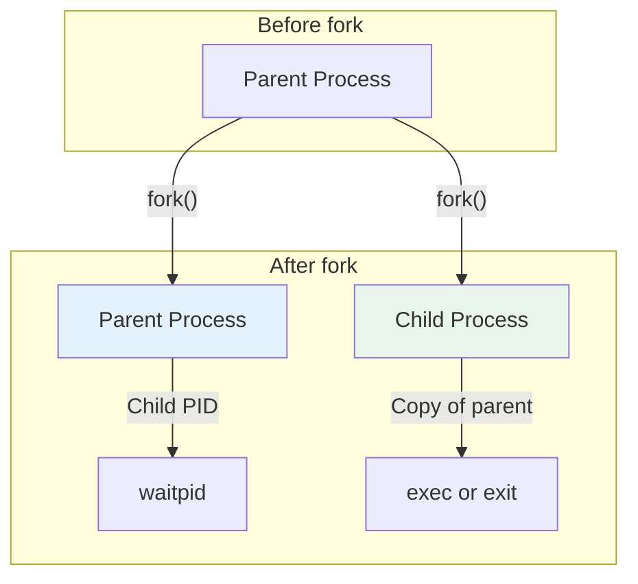
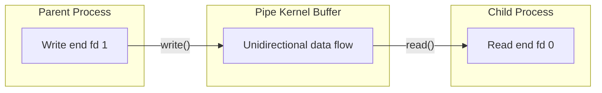

# POSIX and System Programming in C

## Overview

POSIX (Portable Operating System Interface) is a family of standards specified by the IEEE for maintaining compatibility between operating systems. POSIX defines the system-level API for Unix-like operating systems, and C is the primary language for POSIX programming.

Understanding POSIX is essential for:
- Systems programming (OS kernels, device drivers, servers)
- Writing portable Unix/Linux applications
- Understanding how operating systems work at the API level
- Many technical interviews (especially for backend/infrastructure roles)

## POSIX Standards

| Standard | Year | Name | Key Additions |
|----------|------|------|---------------|
| POSIX.1 | 1988 | System Interface | Basic system calls, process control |
| POSIX.1b | 1993 | Realtime Extensions | Realtime signals, timers, shared memory |
| POSIX.1c | 1995 | Threads Extension | pthreads |
| POSIX.1-2001 | 2001 | Single UNIX Spec v3 | Combined standard |
| POSIX.1-2008 | 2008 | Single UNIX Spec v4 | Latest major revision |

## File I/O

POSIX provides unbuffered I/O through file descriptors — small integers that represent open files:

### Opening and Closing Files

```c
#include <fcntl.h>
#include <unistd.h>
#include <stdio.h>
#include <errno.h>
#include <string.h>

int main() {
    // Open file for reading
    int fd = open("data.txt", O_RDONLY);
    if (fd == -1) {
        perror("open failed");  // Prints: open failed: No such file or directory
        return 1;
    }
    
    // Open file for writing (create if not exists, truncate if exists)
    int fd_out = open("output.txt", O_WRONLY | O_CREAT | O_TRUNC, 0644);
    if (fd_out == -1) {
        perror("open output failed");
        close(fd);
        return 1;
    }
    
    // Always close file descriptors
    close(fd);
    close(fd_out);
    
    return 0;
}
```

### File Open Flags

| Flag | Description |
|------|-------------|
| `O_RDONLY` | Read only |
| `O_WRONLY` | Write only |
| `O_RDWR` | Read and write |
| `O_CREAT` | Create file if it doesn't exist |
| `O_TRUNC` | Truncate file to zero length |
| `O_APPEND` | Append to end of file |
| `O_EXCL` | Fail if file exists (with `O_CREAT`) |
| `O_NONBLOCK` | Non-blocking mode |
| `O_SYNC` | Synchronous writes |

### Reading and Writing

```c
#include <fcntl.h>
#include <unistd.h>
#include <stdio.h>
#include <stdlib.h>

#define BUFFER_SIZE 4096

// Read entire file using POSIX I/O
char* read_file(const char *path, size_t *length) {
    int fd = open(path, O_RDONLY);
    if (fd == -1) return NULL;
    
    // Get file size
    off_t size = lseek(fd, 0, SEEK_END);
    lseek(fd, 0, SEEK_SET);
    
    char *buffer = malloc(size + 1);
    if (buffer == NULL) {
        close(fd);
        return NULL;
    }
    
    size_t total_read = 0;
    while (total_read < (size_t)size) {
        ssize_t bytes = read(fd, buffer + total_read, size - total_read);
        if (bytes <= 0) break;  // Error or EOF
        total_read += bytes;
    }
    
    buffer[total_read] = '\0';
    if (length) *length = total_read;
    
    close(fd);
    return buffer;
}

// Copy file using POSIX I/O
int copy_file(const char *src, const char *dst) {
    int fd_in = open(src, O_RDONLY);
    if (fd_in == -1) return -1;
    
    int fd_out = open(dst, O_WRONLY | O_CREAT | O_TRUNC, 0644);
    if (fd_out == -1) {
        close(fd_in);
        return -1;
    }
    
    char buffer[BUFFER_SIZE];
    ssize_t bytes;
    
    while ((bytes = read(fd_in, buffer, BUFFER_SIZE)) > 0) {
        ssize_t written = 0;
        while (written < bytes) {
            ssize_t w = write(fd_out, buffer + written, bytes - written);
            if (w <= 0) {
                close(fd_in);
                close(fd_out);
                return -1;
            }
            written += w;
        }
    }
    
    close(fd_in);
    close(fd_out);
    return 0;
}

int main() {
    size_t len;
    char *content = read_file("data.txt", &len);
    if (content) {
        printf("Read %zu bytes: %s\n", len, content);
        free(content);
    }
    
    copy_file("source.txt", "dest.txt");
    return 0;
}
```

### File Descriptors vs FILE*

| Feature | File Descriptors (POSIX) | FILE* (stdio) |
|---------|-------------------------|---------------|
| Buffering | Unbuffered | Buffered |
| Functions | `open`, `read`, `write`, `close` | `fopen`, `fread`, `fwrite`, `fclose` |
| Performance | Better for large I/O | Better for small, frequent I/O |
| Flexibility | More control (flags, modes) | Easier to use |
| Use case | System programming, pipes, sockets | General file I/O |

## Process Control

### fork — Creating Processes

```c
#include <stdio.h>
#include <unistd.h>
#include <sys/wait.h>

int main() {
    pid_t pid = fork();
    
    if (pid < 0) {
        // Error
        perror("fork failed");
        return 1;
    } else if (pid == 0) {
        // Child process
        printf("Child: PID=%d, PPID=%d\n", getpid(), getppid());
        printf("Child: Doing some work...\n");
        sleep(1);
        printf("Child: Done!\n");
        return 42;  // Exit code
    } else {
        // Parent process
        printf("Parent: Created child with PID=%d\n", pid);
        
        int status;
        pid_t child_pid = waitpid(pid, &status, 0);
        
        if (WIFEXITED(status)) {
            printf("Parent: Child exited with code %d\n", WEXITSTATUS(status));
        }
    }
    
    return 0;
}
```

### fork Memory Layout



### exec — Replacing Process Image

```c
#include <stdio.h>
#include <unistd.h>
#include <sys/wait.h>

int main() {
    pid_t pid = fork();
    
    if (pid == 0) {
        // Child: replace with new program
        printf("Child: About to exec ls\n");
        
        // Various exec forms:
        // execl  — list of args
        // execv  — array of args
        // execle — list of args + environment
        // execve — array of args + environment
        // execlp — list of args, search PATH
        // execvp — array of args, search PATH
        
        char *args[] = {"ls", "-la", "/tmp", NULL};
        execvp("ls", args);
        
        // exec only returns on error
        perror("exec failed");
        return 1;
    } else {
        wait(NULL);
        printf("Parent: Child finished\n");
    }
    
    return 0;
}
```

### Creating a Simple Shell

```c
#include <stdio.h>
#include <stdlib.h>
#include <string.h>
#include <unistd.h>
#include <sys/wait.h>

#define MAX_ARGS 64

int main() {
    char line[1024];
    
    while (1) {
        printf("$ ");
        fflush(stdout);
        
        if (fgets(line, sizeof(line), stdin) == NULL) break;
        
        // Remove newline
        line[strcspn(line, "\n")] = '\0';
        
        if (strcmp(line, "exit") == 0) break;
        
        // Parse arguments
        char *args[MAX_ARGS];
        int argc = 0;
        char *token = strtok(line, " ");
        while (token && argc < MAX_ARGS - 1) {
            args[argc++] = token;
            token = strtok(NULL, " ");
        }
        args[argc] = NULL;
        
        if (argc == 0) continue;
        
        pid_t pid = fork();
        if (pid == 0) {
            execvp(args[0], args);
            perror("command not found");
            exit(1);
        } else if (pid > 0) {
            int status;
            waitpid(pid, &status, 0);
        } else {
            perror("fork failed");
        }
    }
    
    return 0;
}
```

## Signals

Signals are software interrupts sent to a process:

```c
#include <stdio.h>
#include <signal.h>
#include <unistd.h>
#include <stdlib.h>

volatile sig_atomic_t got_signal = 0;

void signal_handler(int signum) {
    // Signal handlers should only use async-signal-safe functions
    got_signal = signum;
    // Write is async-signal-safe
    const char msg[] = "Signal received!\n";
    write(STDOUT_FILENO, msg, sizeof(msg) - 1);
}

int main() {
    // Register signal handler
    signal(SIGINT, signal_handler);   // Ctrl+C
    signal(SIGTERM, signal_handler);  // kill command
    signal(SIGUSR1, signal_handler);  // User-defined signal
    
    printf("PID: %d\n", getpid());
    printf("Send SIGUSR1: kill -USR1 %d\n", getpid());
    
    while (!got_signal) {
        pause();  // Wait for signal
    }
    
    printf("Received signal %d, exiting\n", got_signal);
    return 0;
}
```

### Common Signals

| Signal | Number | Default Action | Description |
|--------|--------|----------------|-------------|
| `SIGHUP` | 1 | Terminate | Hangup (terminal closed) |
| `SIGINT` | 2 | Terminate | Interrupt (Ctrl+C) |
| `SIGQUIT` | 3 | Core dump | Quit (Ctrl+\) |
| `SIGKILL` | 9 | Terminate | Kill (cannot be caught) |
| `SIGSEGV` | 11 | Core dump | Segmentation fault |
| `SIGTERM` | 15 | Terminate | Termination request |
| `SIGUSR1` | 10 | Terminate | User-defined signal 1 |
| `SIGUSR2` | 12 | Terminate | User-defined signal 2 |
| `SIGCHLD` | 17 | Ignore | Child process state change |
| `SIGSTOP` | 19 | Stop | Stop process (cannot be caught) |
| `SIGCONT` | 18 | Continue | Continue stopped process |

### sigaction — Better Signal Handling

```c
#include <stdio.h>
#include <signal.h>
#include <unistd.h>

void handler(int sig, siginfo_t *info, void *context) {
    printf("Signal %d from PID %d\n", sig, info->si_pid);
}

int main() {
    struct sigaction sa;
    sa.sa_sigaction = handler;
    sa.sa_flags = SA_SIGINFO;  // Use sa_sigaction instead of sa_handler
    sigemptyset(&sa.sa_mask);
    
    sigaction(SIGINT, &sa, NULL);
    
    printf("Press Ctrl+C...\n");
    while (1) pause();
    
    return 0;
}
```

## Pipes

Pipes enable inter-process communication:

```c
#include <stdio.h>
#include <unistd.h>
#include <sys/wait.h>
#include <string.h>

int main() {
    int pipefd[2];  // pipefd[0] = read end, pipefd[1] = write end
    
    if (pipe(pipefd) == -1) {
        perror("pipe");
        return 1;
    }
    
    pid_t pid = fork();
    
    if (pid == 0) {
        // Child: writer
        close(pipefd[0]);  // Close read end
        
        const char *msg = "Hello from child!";
        write(pipefd[1], msg, strlen(msg) + 1);
        
        close(pipefd[1]);
        return 0;
    } else {
        // Parent: reader
        close(pipefd[1]);  // Close write end
        
        char buffer[256];
        ssize_t bytes = read(pipefd[0], buffer, sizeof(buffer));
        
        printf("Parent received: %s (%zd bytes)\n", buffer, bytes);
        
        close(pipefd[0]);
        wait(NULL);
    }
    
    return 0;
}
```

### Pipe Diagram



## Environment Variables

```c
#include <stdio.h>
#include <stdlib.h>

int main() {
    // Get environment variable
    char *path = getenv("PATH");
    if (path) {
        printf("PATH = %s\n", path);
    }
    
    // Set environment variable
    setenv("MY_VAR", "hello", 1);  // 1 = overwrite if exists
    printf("MY_VAR = %s\n", getenv("MY_VAR"));
    
    // Unset environment variable
    unsetenv("MY_VAR");
    
    // Alternative: putenv (less safe — takes ownership of string)
    // putenv("MY_VAR=hello");
    
    return 0;
}
```

## Error Handling

POSIX functions typically return -1 on error and set `errno`:

```c
#include <stdio.h>
#include <errno.h>
#include <string.h>
#include <fcntl.h>

int main() {
    int fd = open("/nonexistent", O_RDONLY);
    
    if (fd == -1) {
        // Method 1: perror — prints human-readable error
        perror("open");
        // Output: open: No such file or directory
        
        // Method 2: strerror — get error string
        printf("Error %d: %s\n", errno, strerror(errno));
        // Output: Error 2: No such file or directory
        
        // Method 3: Check specific error
        if (errno == ENOENT) {
            printf("File not found\n");
        } else if (errno == EACCES) {
            printf("Permission denied\n");
        }
    }
    
    return 0;
}
```

### Common Errno Values

| Error | Number | Description |
|-------|--------|-------------|
| `ENOENT` | 2 | No such file or directory |
| `EACCES` | 13 | Permission denied |
| `EEXIST` | 17 | File exists |
| `ENOMEM` | 12 | Out of memory |
| `EINVAL` | 22 | Invalid argument |
| `EMFILE` | 24 | Too many open files |
| `EAGAIN` | 11 | Resource temporarily unavailable |
| `EINTR` | 4 | Interrupted system call |

## Common Mistakes

| Mistake | Consequence | Fix |
|---------|-------------|-----|
| Not checking `fork()` return | Running code in wrong process | Always check `pid < 0`, `== 0`, `> 0` |
| Not checking `open()` return | Using invalid fd | Check for -1 |
| Forgetting to close fds | Resource leak | Always `close()` when done |
| Using `printf` in signal handler | Undefined behavior (not async-signal-safe) | Use `write()` |
| Ignoring `EINTR` from `read()`/`write()` | Premature termination | Retry on `EINTR` |
| Not handling partial `write()` | Incomplete data | Loop until all bytes written |
| Using `perror` without checking errno | Misleading error messages | Only call after error |

## Interview Questions

1. **What is the difference between `fork()` and `exec()`?**
   - `fork()` creates a new process (copy of parent). `exec()` replaces the current process image with a new program.

2. **What are file descriptors?**
   - Small non-negative integers that represent open files. 0=stdin, 1=stdout, 2=stderr.

3. **How do pipes work in Unix?**
   - Unidirectional communication channel. `pipe()` creates two fds: read end and write end.

4. **What signals cannot be caught?**
   - `SIGKILL` (9) and `SIGSTOP` (19) cannot be caught, blocked, or ignored.

5. **What is the difference between `wait()` and `waitpid()`?**
   - `wait()` waits for any child. `waitpid()` waits for a specific child (or any child with pid=-1).

## Related Topics

- [Memory Management](./memory-management.md) — `mmap` for memory-mapped files
- [Pointers](./pointers.md) — System calls use pointer parameters
- [Compilation](./compilation.md) — Linking with POSIX libraries
- [Performance](./performance.md) — Efficient I/O with `sendfile`, `splice`
