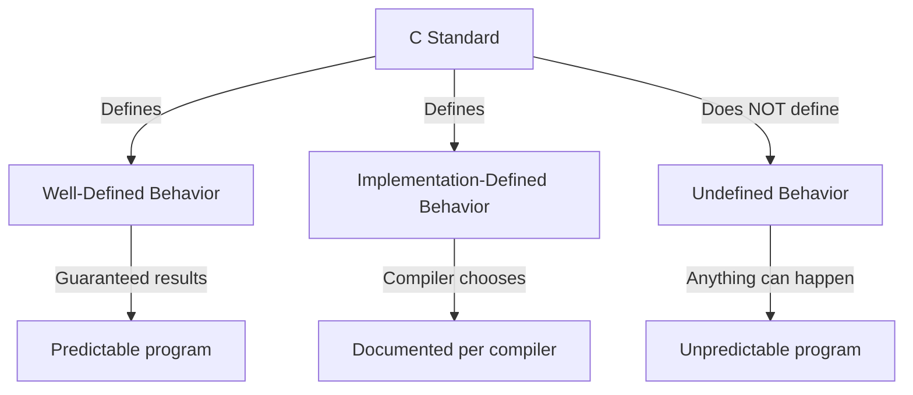

# Undefined Behavior in C

## Overview

Undefined Behavior (UB) is one of the most critical concepts for C programmers to understand. When your program exhibits undefined behavior, the C standard makes **no guarantees** about what will happen — the program might crash, produce wrong results, appear to work correctly, or do something completely unexpected.

UB exists to allow compiler optimizations. By saying "the standard doesn't define what happens here," compilers are free to assume it never happens and optimize accordingly. This can lead to surprising results where code that "looks fine" is silently removed or transformed.

## Why Undefined Behavior Exists



| Behavior Type | Description | Example |
|--------------|-------------|---------|
| **Well-defined** | Standard specifies exact behavior | `2 + 3` always equals 5 |
| **Implementation-defined** | Compiler chooses, must document | `sizeof(int)` is 4 on most systems |
| **Unspecified** | Compiler chooses, no documentation required | Evaluation order of function arguments |
| **Undefined** | No guarantees whatsoever | Signed integer overflow |

## Common Undefined Behavior Cases

### 1. Signed Integer Overflow

```c
#include <stdio.h>
#include <limits.h>

int main() {
    int x = INT_MAX;  // 2147483647 on 32-bit int
    
    // UB: Signed overflow is undefined behavior
    int y = x + 1;
    printf("INT_MAX + 1 = %d\n", y);  // Could be anything!
    
    // The compiler might optimize this away entirely:
    if (x + 1 < x) {
        printf("This might never print!\n");  // Compiler can assume this is false
    }
    if (x + 1 > x) {
        printf("This might always print!\n"); // Compiler can assume this is true
    }
    
    // FIX: Use unsigned or check before operation
    unsigned int ux = UINT_MAX;
    unsigned int uy = ux + 1;  // Well-defined: wraps to 0
    printf("UINT_MAX + 1 = %u\n", uy);  // Always 0
    
    return 0;
}
```

### 2. Null Pointer Dereference

```c
#include <stdio.h>

int main() {
    int *p = NULL;
    
    // UB: Dereferencing null pointer
    // int x = *p;  // Crash (segfault) on most systems, but not guaranteed
    
    // Even writing to null is UB
    // *p = 42;  // Could corrupt memory, crash, or do nothing
    
    // FIX: Always check for NULL
    if (p != NULL) {
        int x = *p;  // Safe
    }
    
    return 0;
}
```

### 3. Use After Free

```c
#include <stdlib.h>
#include <stdio.h>

int main() {
    int *p = malloc(sizeof(int));
    *p = 42;
    free(p);
    
    // UB: Using pointer after memory is freed
    printf("%d\n", *p);  // Might print 42, might crash, might print garbage
    
    // The memory might be reused by another malloc
    int *q = malloc(sizeof(int));
    *q = 100;
    printf("%d\n", *p);  // Might print 100 now!
    
    free(q);
    
    // FIX: Set to NULL after freeing
    p = NULL;
    // Now *p will obviously crash
    
    return 0;
}
```

### 4. Buffer Overflow

```c
#include <stdio.h>

int main() {
    int arr[5] = {1, 2, 3, 4, 5};
    
    // UB: Accessing beyond array bounds
    printf("%d\n", arr[5]);   // Index 5 doesn't exist
    printf("%d\n", arr[-1]);  // Negative index
    printf("%d\n", arr[100]); // Way out of bounds
    
    // What typically happens:
    // - Might read adjacent memory (stack variables, return addresses)
    // - Might crash (segfault)
    // - Might corrupt other data
    // - Might appear to work (reading whatever is at that address)
    
    // FIX: Always check bounds
    int index = 5;
    if (index >= 0 && index < 5) {
        printf("%d\n", arr[index]);  // Safe
    }
    
    return 0;
}
```

### 5. Sequence Point Violations

A sequence point is a point in program execution where all previous side effects are guaranteed to be complete. Violating sequence point rules is UB:

```c
#include <stdio.h>

int main() {
    int i = 5;
    
    // UB: Modifying and reading i without sequence point between
    int a = i++ + i++;     // How many increments happen? When?
    int b = i = i++;       // Modify and read same variable
    int c = ++i + i++;     // Multiple modifications
    
    // What the compiler might do:
    // - Evaluate left side first, then right
    // - Evaluate right side first, then left  
    // - Evaluate both simultaneously
    // - Do something completely different
    
    printf("a = %d, b = %d, c = %d\n", a, b, c);
    // Output is completely unpredictable
    
    // FIX: Separate modifications into different statements
    int x = i;
    int y = i;
    i += 2;
    int d = x + y;
    
    return 0;
}
```

### 6. Strict Aliasing Violation

The strict aliasing rule says you cannot access an object through a pointer of an incompatible type (with some exceptions):

```c
#include <stdio.h>

int main() {
    float f = 3.14f;
    
    // UB: Accessing float through int pointer (strict aliasing violation)
    int *p = (int*)&f;
    printf("Bits of float: %d\n", *p);
    
    // FIX: Use memcpy for type punning
    int bits;
    memcpy(&bits, &f, sizeof(float));
    printf("Bits of float: %d\n", bits);
    
    // Exception: char* can alias anything
    char *bytes = (char*)&f;
    for (size_t i = 0; i < sizeof(float); i++) {
        printf("Byte %zu: %d\n", i, bytes[i]);
    }
    
    return 0;
}
```

### 7. Accessing Freed Memory (Double Free)

```c
#include <stdlib.h>

int main() {
    int *p = malloc(sizeof(int));
    *p = 42;
    free(p);
    
    // UB: Double free
    free(p);  // Memory was already freed!
    
    // UB: Use after free (different from double free)
    *p = 100;
    
    // FIX
    free(p);
    p = NULL;
    // free(NULL) is safe, and *p will obviously crash
    
    return 0;
}
```

### 8. Shift by Too Many Bits

```c
#include <stdio.h>

int main() {
    int x = 1;
    
    // UB: Shifting by >= width of type
    int a = x << 32;   // 32-bit int: shift by 32 is UB
    int b = x << -1;   // Negative shift is UB
    int c = x >> 33;   // More than type width
    
    // UB: Shifting negative values (C89/C99)
    int d = -1 << 2;   // Shifting negative signed int
    
    // FIX: Use unsigned and check bounds
    unsigned int u = 1;
    unsigned int e = u << 4;  // Safe: 4 < 32
    
    return 0;
}
```

### 9. Division by Zero

```c
#include <stdio.h>

int main() {
    int x = 10;
    int y = 0;
    
    // UB: Integer division by zero
    // int z = x / y;  // Crash or garbage
    
    // UB: Integer modulo by zero
    // int w = x % y;  // Crash or garbage
    
    // Floating-point division by zero is NOT UB
    double d = 1.0 / 0.0;  // Results in infinity
    printf("1.0/0.0 = %f\n", d);  // inf
    
    // FIX: Always check divisor
    if (y != 0) {
        int z = x / y;
    }
    
    return 0;
}
```

### 10. Writing to String Literals

```c
#include <stdio.h>

int main() {
    // String literal — stored in read-only memory
    char *str = "Hello";
    
    // UB: Modifying a string literal
    // str[0] = 'h';  // Might crash (segfault), might corrupt data
    
    // FIX: Use character array for modifiable strings
    char modifiable[] = "Hello";
    modifiable[0] = 'h';  // Safe — this is a copy on the stack
    printf("%s\n", modifiable);  // "hello"
    
    return 0;
}
```

## Compiler Optimizations and UB

Compilers exploit UB to optimize code. This can lead to surprising results:

```c
#include <stdio.h>

// Example: Dead code elimination
void optimized_away() {
    int x = 0;
    int *p = &x;
    
    // Compiler: "p can never be NULL because it's &x"
    if (p == NULL) {
        printf("This code is removed entirely!\n");
        // Compiler might delete this entire block
    }
}

// Example: Signed overflow assumption
int is_safe_add(int a, int b) {
    // Compiler assumes signed overflow never happens
    return a + b >= a;  // Always true in compiler's mind
    // But if a+b overflows, the result is UB
}

// Example: Loop optimization
int find_zero(int *arr, int n) {
    for (int i = 0; i <= n; i++) {
        if (arr[i] == 0) return i;
    }
    return -1;
}
// Compiler might assume i never exceeds n (because arr[n] would be UB)
// and optimize the loop to never terminate!
```

## Detecting Undefined Behavior

### Compiler Warnings

```bash
# Enable all warnings
gcc -Wall -Wextra -Wpedantic program.c

# Specific UB-related warnings
gcc -Wstrict-overflow -Wnull-dereference -Wuse-after-free program.c

# Treat warnings as errors
gcc -Wall -Werror program.c
```

### Sanitizers

```bash
# AddressSanitizer — detects memory errors
gcc -fsanitize=address -g program.c
./a.out  # Will report UB with stack traces

# UndefinedBehaviorSanitizer — detects UB
gcc -fsanitize=undefined -g program.c
./a.out

# MemorySanitizer — detects uninitialized reads
gcc -fsanitize=memory -g program.c
./a.out

# All sanitizers combined
gcc -fsanitize=address,undefined -g program.c
```

### Valgrind

```bash
# Detects memory-related UB
valgrind --tool=memcheck --leak-check=full ./a.out
```

## Summary of Common UB Cases

| Category | Examples | Severity |
|----------|----------|----------|
| **Memory** | Use-after-free, double free, buffer overflow | Critical — security holes |
| **Arithmetic** | Signed overflow, division by zero, shift overflow | High — wrong results |
| **Pointers** | NULL deref, dangling pointer, wild pointer | Critical — crashes |
| **Type** | Strict aliasing violation, wrong format specifier | Medium — wrong data |
| **Sequencing** | `i = i++ + ++i` | Medium — unpredictable |
| **Strings** | Modifying string literals | Medium — crashes |
| **Arrays** | Out-of-bounds access | Critical — corruption |

## Best Practices to Avoid UB

1. **Enable compiler warnings** — `-Wall -Wextra -Wpedantic`
2. **Use sanitizers during development** — ASan, UBSan, MSan
3. **Run Valgrind regularly** — Catch memory errors
4. **Initialize all variables** — Uninitialized variables are UB to read
5. **Check all allocations** — `malloc` can return NULL
6. **Use `size_t` for array indices** — Avoids negative index issues
7. **Don't mix signed and unsigned** — Comparison rules are tricky
8. **Use `memcpy` for type punning** — Not pointer casting
9. **Keep expressions simple** — Avoid complex sequence point situations
10. **Use static analysis tools** — Coverity, PVS-Studio, clang-tidy

## Common Mistakes

| Mistake | Why It's UB | Fix |
|---------|-------------|-----|
| `int *p; *p = 5;` | Uninitialized pointer | Initialize: `int *p = NULL;` |
| `free(p); *p = 5;` | Use after free | Set `p = NULL` after free |
| `arr[n+1]` where n is size | Buffer overflow | Check bounds |
| `INT_MAX + 1` | Signed overflow | Use unsigned or check |
| `*NULL` | Null dereference | Check for NULL |
| `str[0] = 'x'` for `"string"` | Writing to read-only memory | Use `char[]` |

## Interview Questions

1. **What is undefined behavior? Give three examples.**
   - UB is when the C standard doesn't define what happens. Examples: signed overflow, null deref, use-after-free.

2. **Why does signed integer overflow cause undefined behavior but unsigned doesn't?**
   - The standard defines unsigned arithmetic as modular (wraps). Signed overflow was left undefined to allow optimizations and support different hardware representations.

3. **What is a sequence point? Why do they matter?**
   - A point where all side effects are complete. They matter because modifying a variable twice between sequence points is UB.

4. **How can you detect undefined behavior in C programs?**
   - Compiler warnings (`-Wall -Wextra`), sanitizers (ASan, UBSan), Valgrind, static analysis tools.

5. **What is strict aliasing and why does it exist?**
   - The rule that objects can only be accessed through compatible types. It enables optimizations by letting the compiler assume different-typed pointers don't alias.

## Related Topics

- [Pointers](./pointers.md) — Many UB cases involve pointers
- [Memory Management](./memory-management.md) — Memory-related UB
- [Compilation](./compilation.md) — How compilers optimize based on UB assumptions
- [Performance](./performance.md) — Why UB enables optimizations
