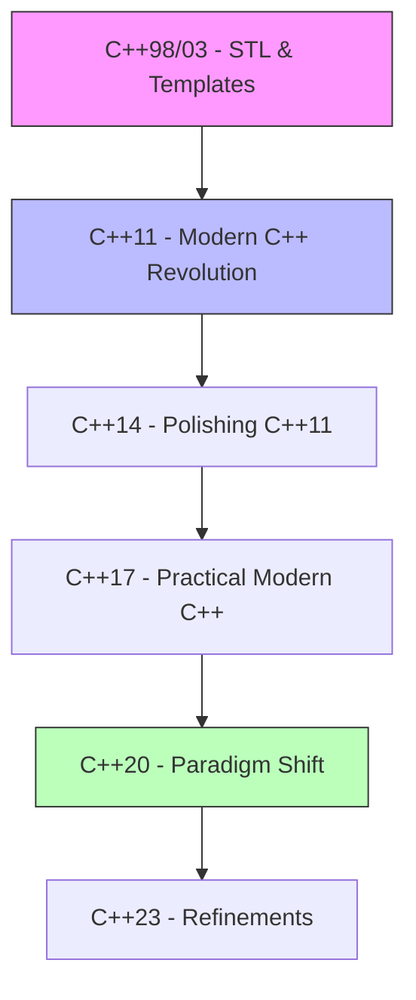
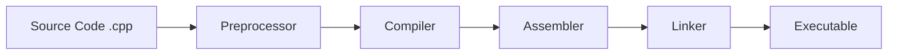
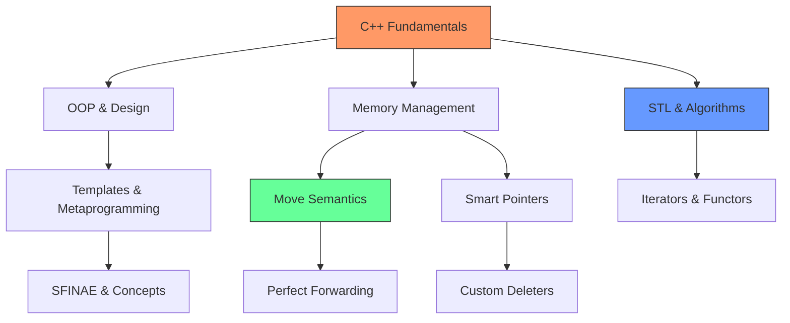

# C++ Overview

## What is C++?

C++ is a general-purpose, statically-typed, compiled programming language created by **Bjarne Stroustrup** at Bell Labs in 1979. Originally called "C with Classes," it was designed as an extension of the C programming language with added object-oriented features. Today, C++ is one of the most widely used languages in systems programming, game development, embedded systems, high-frequency trading, and competitive programming.

C++ is a **multi-paradigm** language supporting procedural, object-oriented, generic, and functional programming styles. Its emphasis on performance, low-level memory manipulation, and zero-cost abstractions makes it indispensable where efficiency matters.

## Why C++ for Placement Interviews?

C++ is the **de facto standard** for coding interviews at top tech companies (Google, Meta, Amazon, Microsoft, etc.) for several reasons:

- **Performance awareness** — Forces you to think about memory and time complexity
- **Rich STL** — Standard Template Library provides battle-tested data structures and algorithms
- **Conceptual depth** — Tests understanding of pointers, references, OOP, and memory management
- **Universality** — Skills transfer to Java, Python, Rust, and other languages
- **Competitive programming** — Most CP platforms default to C++ for speed

## C++ Evolution Timeline

| Standard | Year | Key Features |
|----------|------|-------------|
| C++98/03 | 1998/2003 | STL, templates, exceptions, namespaces |
| C++11 | 2011 | Auto, lambdas, move semantics, smart pointers, `constexpr`, range-for |
| C++14 | 2014 | Generic lambdas, `std::make_unique`, relaxed `constexpr` |
| C++17 | 2017 | Structured bindings, `std::optional`, `std::variant`, `if constexpr`, filesystem |
| C++20 | 2020 | Concepts, ranges, coroutines, modules, `std::format` |
| C++23 | 2023 | `std::expected`, `std::print`, `std::flat_map`, deducing `this` |



## Compilation Model

C++ is a **compiled language** — source code goes through several stages before execution:



1. **Preprocessing** — Expands macros, includes headers (`#include`), processes `#ifdef`
2. **Compilation** — Translates preprocessed code to assembly
3. **Assembly** — Converts assembly to object files (`.o` / `.obj`)
4. **Linking** — Combines object files and libraries into an executable

### Build Systems

```bash
# Direct compilation
g++ -std=c++17 -O2 -Wall -Wextra -o program main.cpp

# With multiple files
g++ -std=c++20 -O2 main.cpp utils.cpp -o program

# Using CMake
cmake -B build -DCMAKE_CXX_STANDARD=20
cmake --build build
```

## Core Language Pillars

### 1. Object-Oriented Programming

C++ supports all four pillars of OOP:

```cpp
// Encapsulation + Abstraction
class Shape {
private:
    double area_;          // encapsulated data
public:
    virtual double area() const = 0;  // pure virtual (abstraction)
    virtual ~Shape() = default;
};

// Inheritance
class Circle : public Shape {
    double radius_;
public:
    explicit Circle(double r) : radius_(r) {}
    double area() const override { return 3.14159 * radius_ * radius_; }
};

// Polymorphism
void printArea(const Shape& s) {
    std::cout << s.area() << "\n";  // calls correct override at runtime
}
```

### 2. Generic Programming (Templates)

Templates enable writing code that works with any type:

```cpp
template <typename T>
T maximum(const T& a, const T& b) {
    return (a > b) ? a : b;
}

// Works with int, double, string, etc.
int x = maximum(3, 7);           // T = int
double y = maximum(3.14, 2.71);  // T = double
```

### 3. RAII (Resource Acquisition Is Initialization)

C++ ties resource lifetime to object scope:

```cpp
void processFile(const std::string& filename) {
    std::ifstream file(filename);  // resource acquired in constructor
    // ... use file ...
}  // file automatically closed in destructor — no leak possible
```

### 4. Zero-Cost Abstractions

High-level constructs compile down to the same machine code as hand-written low-level code:

```cpp
// Both produce identical assembly with optimizations
// Range-for (high-level)
for (const auto& x : vec) { sum += x; }

// Iterator (low-level)
for (auto it = vec.begin(); it != vec.end(); ++it) { sum += *it; }

// Index (lowest-level)
for (size_t i = 0; i < vec.size(); ++i) { sum += vec[i]; }
```

## Hello World — Anatomy

```cpp
#include <iostream>  // header inclusion

// Entry point — every C++ program starts here
int main() {
    std::cout << "Hello, World!\n";  // console output
    return 0;  // return status to OS (optional in main)
}
```

Key points:
- `#include` is a **preprocessor directive**, not a language statement
- `std::` is a **namespace** — prevents name collisions
- `main()` returns `int` — `return 0` signals success (optional since C++11)
- `\n` is preferred over `std::endl` (which flushes the buffer unnecessarily)

## Compilation Flags Every Interview Candidate Should Know

| Flag | Purpose |
|------|---------|
| `-std=c++17` / `-std=c++20` | Set language standard |
| `-O2` / `-O3` | Optimization level |
| `-Wall -Wextra` | Enable all common warnings |
| `-Werror` | Treat warnings as errors |
| `-fsanitize=address` | Detect memory errors (ASan) |
| `-g` | Include debug symbols |
| `-pedantic` | Strict standard compliance |

```bash
# Recommended interview/competitive setup
g++ -std=c++17 -O2 -Wall -Wextra -Wshadow -o sol solution.cpp
```

## C++ vs Other Languages

| Feature | C++ | Java | Python | Rust |
|---------|-----|------|--------|------|
| Memory management | Manual + RAII | GC | GC | Ownership |
| Performance | Near-zero overhead | JIT compiled | Interpreted | Near-zero overhead |
| OOP | Full + multiple inheritance | Single inheritance | Duck typing | Trait-based |
| Templates/Generics | Compile-time (monomorphized) | Type-erased generics | Duck typing | Monomorphized |
| Compilation | AOT compiled | JIT compiled | Interpreted | AOT compiled |
| Standard library | STL (containers + algorithms) | Rich stdlib | Batteries included | std + crates |

## Common Pitfalls for Beginners

1. **Using `endl` everywhere** — Prefer `"\n"` (avoids unnecessary flush)
2. **Not initializing variables** — `int x;` is undefined in many contexts
3. **Comparing signed and unsigned** — `int i < vec.size()` is a warning trap
4. **Forgetting virtual destructors** — Polymorphic base classes need `virtual ~Base()`
5. **Using `NULL` instead of `nullptr`** — `nullptr` is type-safe (C++11)
6. **Ignoring `const` correctness** — Mark methods and parameters `const` when they don't modify state
7. **Copy-pasting C code** — C++ offers safer alternatives (strings, vectors, smart pointers)

## What to Study for Placement



Focus areas by frequency in interviews:
1. **STL containers & algorithms** — Asked in nearly every coding round
2. **OOP concepts** — Design questions, inheritance hierarchies
3. **Memory management** — Smart pointers, RAII, leaks
4. **Move semantics** — Senior/advanced roles
5. **Templates** — Library/framework design roles

## Quick Reference — Standard Headers

| Header | Contents |
|--------|----------|
| `<iostream>` | `cin`, `cout`, `cerr` |
| `<vector>` | `std::vector` |
| `<string>` | `std::string` |
| `<algorithm>` | `sort`, `find`, `transform` |
| `<memory>` | `unique_ptr`, `shared_ptr` |
| `<map>`, `<set>` | Associative containers |
| `<unordered_map>` | Hash-based containers |
| `<functional>` | `std::function`, `std::bind` |
| `<thread>` | `std::thread`, `std::mutex` |
| `<optional>`, `<variant>` | Sum types (C++17) |
| `<concepts>` | C++20 concepts |
| `<ranges>` | C++20 ranges |

## Next Steps

Dive into the following sections for deep coverage of each topic:

- [Templates](./templates.md) — Generic programming mastery
- [STL](./stl.md) — Containers, iterators, algorithms
- [Memory Model](./memory-model.md) — RAII, smart pointers, allocators
- [Move Semantics](./move-semantics.md) — Rvalue references, perfect forwarding
- [Concurrency](./concurrency.md) — Threads, mutexes, atomics, memory ordering
- [Modern C++](./modern-cpp.md) — C++17/20/23 features
- [Interview Questions](./interview-questions.md) — 30+ curated questions with answers
