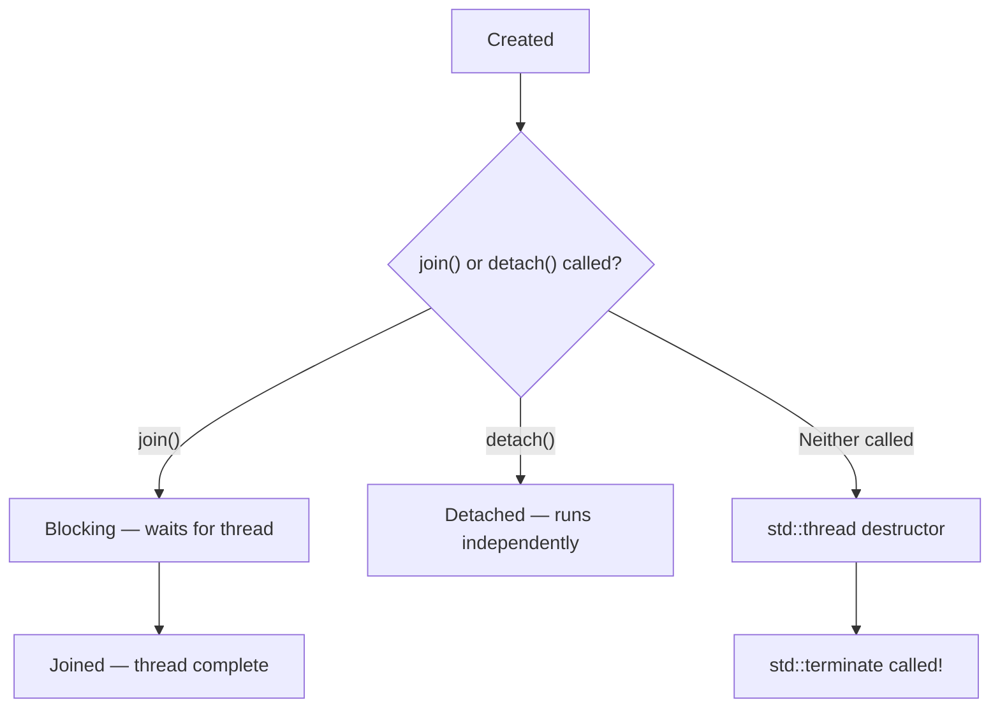
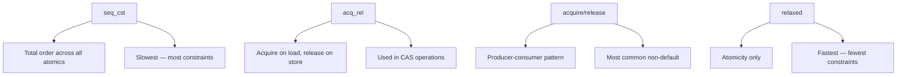

# Concurrency

## Overview

C++11 introduced native threading support, making C++ a first-class concurrent programming language. Before C++11, concurrency was platform-specific (POSIX threads, Windows threads). Now, the standard library provides threads, mutexes, condition variables, atomics, and futures — all portable across platforms.

Understanding concurrency is critical for systems-level interviews at companies building high-performance services, databases, and distributed systems.

## `std::thread` — Basic Threading

```cpp
#include <thread>
#include <iostream>

void worker(int id) {
    std::cout << "Thread " << id << " running\n";
}

int main() {
    // Create and start threads
    std::thread t1(worker, 1);
    std::thread t2(worker, 2);
    
    // MUST join or detach before destruction
    t1.join();     // wait for t1 to finish
    t2.join();     // wait for t2 to finish
    
    // OR detach (fire-and-forget)
    // t1.detach();  // thread runs independently
}
```

### Thread Lifecycle



**⚠️ Critical:** If a `std::thread` object is destroyed while `joinable()` (neither joined nor detached), `std::terminate()` is called and the program crashes.

### Lambda Threads

```cpp
// Thread with lambda
std::thread t([]() {
    std::cout << "Lambda thread\n";
});
t.join();

// Thread with captures
int value = 42;
std::thread t2([value]() {
    std::cout << "Value: " << value << "\n";
});
t2.join();

// Pass by reference — MUST use std::ref
void increment(int& x) { ++x; }
int counter = 0;
std::thread t3(increment, std::ref(counter));  // pass by ref
t3.join();
// counter is now 1
```

### `std::jthread` (C++20) — Auto-Joining Thread

```cpp
#include <thread>

// jthread automatically joins on destruction
{
    std::jthread t([]() {
        std::cout << "jthread auto-joins\n";
    });
}  // t destroyed here — automatically joins, no crash

// Cooperative cancellation via stop_token
void worker(std::stop_token token) {
    while (!token.stop_requested()) {
        // do work...
        std::this_thread::sleep_for(std::chrono::milliseconds(100));
    }
    std::cout << "Worker stopping gracefully\n";
}

std::jthread t(worker);
// Later...
t.request_stop();  // signals the thread to stop
// t's destructor also requests stop + joins
```

## Mutual Exclusion — `std::mutex`

A mutex (mutual exclusion) ensures only one thread accesses a shared resource at a time:

```cpp
#include <mutex>

std::mutex mtx;
int sharedCounter = 0;

void increment() {
    for (int i = 0; i < 100000; ++i) {
        mtx.lock();
        ++sharedCounter;
        mtx.unlock();
    }
}

int main() {
    std::thread t1(increment);
    std::thread t2(increment);
    t1.join();
    t2.join();
    std::cout << sharedCounter << "\n";  // Always 200000
}
```

### `std::lock_guard` — RAII Mutex Locking

```cpp
void increment() {
    for (int i = 0; i < 100000; ++i) {
        std::lock_guard<std::mutex> lock(mtx);  // locks on construction
        ++sharedCounter;
    }  // unlocks on destruction — exception-safe!
}
```

### `std::unique_lock` — Flexible Locking

```cpp
#include <mutex>

std::mutex mtx;

// Deferred locking
std::unique_lock<std::mutex> lock(mtx, std::defer_lock);
// ... do some work without lock ...
lock.lock();    // lock when needed
// ... critical section ...
lock.unlock();  // unlock early
// ... do more work without lock ...

// Can be moved (lock_guard cannot)
std::unique_lock<std::mutex> lock1(mtx);
std::unique_lock<std::mutex> lock2 = std::move(lock1);

// Condition variable requires unique_lock
```

### `std::scoped_lock` (C++17) — Multiple Mutex Locking

```cpp
std::mutex mtx1, mtx2;

// Lock multiple mutexes without deadlock
void transfer() {
    std::scoped_lock lock(mtx1, mtx2);  // locks both atomically
    // ... access both resources ...
}
```

### Lock Comparison

| Lock Type | Move | Multiple Mutexes | Timed | Condition Variable |
|-----------|------|-----------------|-------|-------------------|
| `lock_guard` | No | No | No | No |
| `unique_lock` | Yes | No | Yes | Yes |
| `scoped_lock` | No | Yes (deadlock-free) | No | No |

## `std::lock` — Deadlock-Free Multi-Mutex Locking

```cpp
std::mutex mtx1, mtx2;

// std::lock uses deadlock-avoidance algorithm
void safeTransfer() {
    std::lock(mtx1, mtx2);  // locks both without deadlock
    std::lock_guard<std::mutex> lg1(mtx1, std::adopt_lock);
    std::lock_guard<std::mutex> lg2(mtx2, std::adopt_lock);
    // ... critical section ...
}
```

### Deadlock Prevention Strategies

| Strategy | Description |
|----------|-------------|
| Consistent ordering | Always lock mutexes in the same order |
| `std::lock` | Lock multiple mutexes atomically |
| `std::scoped_lock` | C++17 — like `std::lock` + RAII |
| Timed locks | `try_lock_for` — give up after timeout |
| Lock hierarchy | Assign levels, only lock higher → lower |

## Condition Variables

Condition variables allow threads to wait for a condition to become true:

```cpp
#include <condition_variable>
#include <queue>

std::mutex mtx;
std::condition_variable cv;
std::queue<int> tasks;
bool done = false;

// Producer
void producer() {
    for (int i = 0; i < 10; ++i) {
        {
            std::lock_guard<std::mutex> lock(mtx);
            tasks.push(i);
        }
        cv.notify_one();  // wake up one waiting thread
    }
    {
        std::lock_guard<std::mutex> lock(mtx);
        done = true;
    }
    cv.notify_all();  // wake up all waiting threads
}

// Consumer
void consumer() {
    while (true) {
        std::unique_lock<std::mutex> lock(mtx);
        cv.wait(lock, [] { return !tasks.empty() || done; });
        
        while (!tasks.empty()) {
            int task = tasks.front();
            tasks.pop();
            lock.unlock();
            process(task);
            lock.lock();
        }
        
        if (done) break;
    }
}
```

### Spurious Wakeups

A condition variable may wake up even if no one signaled it. Always use the predicate form:

```cpp
// WRONG — may process when queue is empty due to spurious wakeup
cv.wait(lock);
int task = tasks.front();  // possible empty queue!

// RIGHT — predicate form handles spurious wakeups
cv.wait(lock, [] { return !tasks.empty(); });
int task = tasks.front();  // guaranteed non-empty
```

### `notify_one` vs `notify_all`

| Function | Use When |
|----------|----------|
| `notify_one` | Only one thread should wake (e.g., task queue with multiple consumers) |
| `notify_all` | All waiting threads should check (e.g., shutdown signal, broadcast update) |

## `std::atomic` — Lock-Free Operations

Atomics provide thread-safe operations without mutexes for simple types:

```cpp
#include <atomic>

std::atomic<int> counter{0};

void increment() {
    for (int i = 0; i < 100000; ++i) {
        ++counter;  // atomic increment — no lock needed
    }
}

// Atomic operations
counter.store(42);           // atomic write
int val = counter.load();    // atomic read
counter.exchange(100);       // atomic swap, returns old value

// Compare-and-swap (CAS) — foundation of lock-free programming
int expected = 42;
bool success = counter.compare_exchange_strong(expected, 100);
// If counter == 42: set to 100, return true
// If counter != 42: set expected to current value, return false

// Fetch operations
counter.fetch_add(5);        // returns old value, adds 5
counter.fetch_sub(3);        // returns old value, subtracts 3
counter.fetch_or(0xFF);      // bitwise OR
counter.fetch_and(0x0F);     // bitwise AND
```

### `std::atomic_flag` — The Simplest Lock

```cpp
std::atomic_flag lock = ATOMIC_FLAG_INIT;

void criticalSection() {
    // Spinlock — busy wait until lock is acquired
    while (lock.test_and_set(std::memory_order_acquire)) {
        // spin...
    }
    
    // Critical section
    doWork();
    
    lock.clear(std::memory_order_release);  // release lock
}
```

## Memory Ordering

When multiple threads access shared data, the CPU and compiler can reorder operations for performance. Memory ordering constraints control this reordering.

### Memory Order Options

| Order | Guarantee | Use Case |
|-------|-----------|----------|
| `relaxed` | Atomicity only, no ordering | Counters, statistics |
| `acquire` | No reads/writes before this can be reordered after | Load side of a lock |
| `release` | No reads/writes after this can be reordered before | Store side of a lock |
| `acq_rel` | Both acquire and release | Read-modify-write |
| `seq_cst` | **Total order** across all threads | Default — safest, slowest |

### `seq_cst` (Sequential Consistency) — Default

```cpp
std::atomic<bool> ready{false};
int data = 0;

// Thread 1 (writer)
void writer() {
    data = 42;                    // (1) plain write
    ready.store(true, std::memory_order_seq_cst);  // (2) atomic store
}

// Thread 2 (reader)
void reader() {
    while (!ready.load(std::memory_order_seq_cst)) {}  // (3) spin
    std::cout << data << "\n";   // (4) guaranteed to see 42
}
```

With `seq_cst`, the total order guarantees: (1) happens before (2), and (3) happens before (4), and (2) is seen by (3). So `data` is guaranteed to be 42.

### `acquire`/`release` — Producer-Consumer Pattern


```cpp
std::atomic<int> flag{0};
int sharedData = 0;

// Producer
void producer() {
    sharedData = 42;  // (1) write data
    flag.store(1, std::memory_order_release);  // (2) release: (1) happens-before (2)
}

// Consumer
void consumer() {
    while (flag.load(std::memory_order_acquire) != 1) {}  // (3) acquire
    // (2) synchronizes-with (3), so (1) happens-before (4)
    std::cout << sharedData << "\n";  // (4) guaranteed to see 42
}
```

### `relaxed` — No Ordering Guarantees

```cpp
std::atomic<int> counter{0};

// Multiple threads incrementing — only atomicity needed
void threadFunc() {
    for (int i = 0; i < 100000; ++i) {
        counter.fetch_add(1, std::memory_order_relaxed);
    }
}
// Final value is correct (200000), but we can't observe intermediate states
```

### Memory Ordering Comparison



### When to Use Which

| Scenario | Recommended Ordering |
|----------|---------------------|
| Simple counter (no dependencies) | `relaxed` |
| Flag + data (producer-consumer) | `acquire`/`release` |
| Spinlock implementation | `acquire`/`release` |
| Complex multi-variable coordination | `seq_cst` |
| Unsure / don't need performance | `seq_cst` (default) |

## `std::future` and `std::async`

Futures provide a high-level interface for asynchronous computation:

```cpp
#include <future>

// std::async — launch a task
std::future<int> result = std::async(std::launch::async, []() {
    // Expensive computation
    std::this_thread::sleep_for(std::chrono::seconds(1));
    return 42;
});

// Do other work while task runs...
std::cout << "Working...\n";

// Get result (blocks if not ready)
int value = result.get();  // 42
// Can only call get() once!
```

### Launch Policies

```cpp
// Launch asynchronously — runs in a new thread
auto f1 = std::async(std::launch::async, heavyComputation);

// Launch lazily — runs when get() is called (in calling thread)
auto f2 = std::async(std::launch::deferred, lightComputation);

// Let implementation decide (default)
auto f3 = std::async(heavyComputation);
```

### `std::promise` — Set Future Value from Another Thread

```cpp
#include <future>

std::promise<int> prom;
std::future<int> fut = prom.get_future();

// Thread 1: produce value
std::thread producer([&prom]() {
    std::this_thread::sleep_for(std::chrono::milliseconds(100));
    prom.set_value(42);  // or prom.set_exception(std::make_exception_ptr(...));
});

// Thread 2: consume value
int value = fut.get();  // blocks until value is set
std::cout << value << "\n";  // 42

producer.join();
```

### `std::packaged_task` — Wrap Callable with Future

```cpp
std::packaged_task<int(int, int)> task([](int a, int b) {
    return a + b;
});

std::future<int> result = task.get_future();

// Run in a thread
std::thread t(std::move(task), 3, 4);
t.join();

std::cout << result.get() << "\n";  // 7
```

### Future/Promise/Task Comparison

| Mechanism | Use Case |
|-----------|----------|
| `std::async` | Simple fire-and-forget async task |
| `std::promise` | Set value from outside (manual control) |
| `std::packaged_task` | Wrap existing callable, run later |
| `std::future` | All three return a future for the result |

## Data Races and Undefined Behavior

A **data race** occurs when two threads access the same memory location concurrently, at least one is a write, and there's no synchronization. This is **undefined behavior** in C++.

```cpp
// DATA RACE — undefined behavior!
int counter = 0;
void increment() {
    for (int i = 0; i < 100000; ++i) {
        ++counter;  // not atomic, no lock!
    }
}
// Two threads calling increment() — final value is unpredictable

// Fix 1: Mutex
std::mutex mtx;
void safeIncrement() {
    std::lock_guard<std::mutex> lock(mtx);
    ++counter;
}

// Fix 2: Atomic
std::atomic<int> safeCounter{0};
void atomicIncrement() {
    ++safeCounter;
}
```

### Detecting Data Races

```bash
# Thread Sanitizer — best tool for data race detection
g++ -std=c++17 -fsanitize=thread -g -o prog prog.cpp
./prog
```

## Thread-Safe Singleton (Interview Classic)

```cpp
// C++11 guarantees thread-safe static initialization
class Singleton {
public:
    static Singleton& getInstance() {
        static Singleton instance;  // thread-safe since C++11
        return instance;
    }
    
    Singleton(const Singleton&) = delete;
    Singleton& operator=(const Singleton&) = delete;

private:
    Singleton() = default;
};
```

## Thread Pool Pattern

```cpp
#include <thread>
#include <vector>
#include <queue>
#include <functional>
#include <mutex>
#include <condition_variable>
#include <future>

class ThreadPool {
    std::vector<std::thread> workers_;
    std::queue<std::function<void()>> tasks_;
    std::mutex mtx_;
    std::condition_variable cv_;
    bool stop_ = false;

public:
    explicit ThreadPool(size_t numThreads) {
        for (size_t i = 0; i < numThreads; ++i) {
            workers_.emplace_back([this]() {
                while (true) {
                    std::function<void()> task;
                    {
                        std::unique_lock<std::mutex> lock(mtx_);
                        cv_.wait(lock, [this]() {
                            return stop_ || !tasks_.empty();
                        });
                        if (stop_ && tasks_.empty()) return;
                        task = std::move(tasks_.front());
                        tasks_.pop();
                    }
                    task();
                }
            });
        }
    }
    
    template <typename F, typename... Args>
    auto enqueue(F&& f, Args&&... args)
        -> std::future<std::invoke_result_t<F, Args...>> {
        
        using ReturnType = std::invoke_result_t<F, Args...>;
        auto task = std::make_shared<std::packaged_task<ReturnType()>>(
            std::bind(std::forward<F>(f), std::forward<Args>(args)...)
        );
        std::future<ReturnType> result = task->get_future();
        {
            std::lock_guard<std::mutex> lock(mtx_);
            tasks_.emplace([task]() { (*task)(); });
        }
        cv_.notify_one();
        return result;
    }
    
    ~ThreadPool() {
        {
            std::lock_guard<std::mutex> lock(mtx_);
            stop_ = true;
        }
        cv_.notify_all();
        for (auto& w : workers_) w.join();
    }
};
```

## Common Mistakes

1. **Forgetting to join/detach threads** — `std::terminate` is called on destruction
2. **Passing references to thread without `std::ref`** — Thread copies arguments by default
3. **Data races on shared variables** — Always use mutex or atomic
4. **Using `std::mutex` without RAII** — `lock_guard`/`unique_lock` prevent forgotten unlocks
5. **Condition variable without predicate** — Spurious wakeups cause bugs
6. **Calling `future::get()` twice** — UB; get() can only be called once
7. **Using `seq_cst` everywhere** — Overly restrictive; use `acquire`/`release` when appropriate
8. **Deadlock from inconsistent lock ordering** — Always lock mutexes in the same order
9. **Sharing `std::cout` without synchronization** — Output interleaves
10. **Not handling exceptions in threads** — Unhandled exception in thread calls `std::terminate`

## Cheat Sheet

| Need | Tool | Header |
|------|------|--------|
| Basic thread | `std::thread` | `<thread>` |
| Auto-joining thread | `std::jthread` | `<thread>` |
| Mutual exclusion | `std::mutex` | `<mutex>` |
| RAII lock | `std::lock_guard` | `<mutex>` |
| Flexible lock | `std::unique_lock` | `<mutex>` |
| Multi-mutex lock | `std::scoped_lock` | `<mutex>` |
| Wait for condition | `std::condition_variable` | `<condition_variable>` |
| Lock-free ops | `std::atomic<T>` | `<atomic>` |
| Async task | `std::async` | `<future>` |
| Set value later | `std::promise` | `<future>` |
| Get async result | `std::future` | `<future>` |
| Thread pool | Custom (see above) | — |
