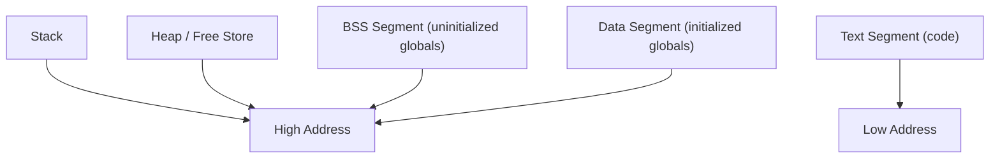
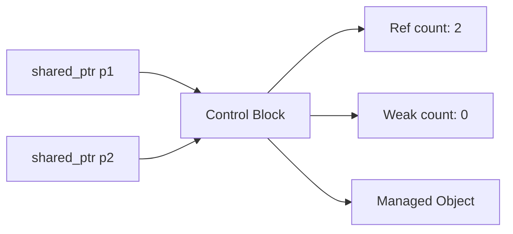
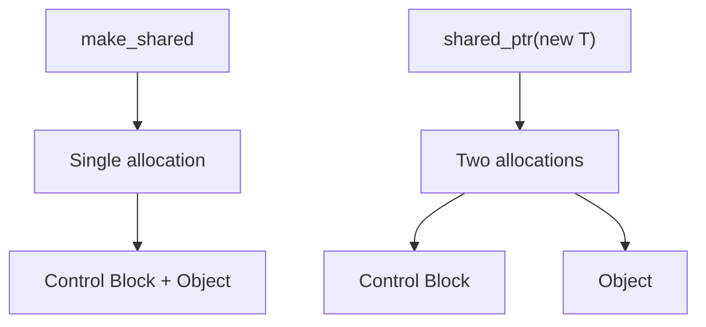
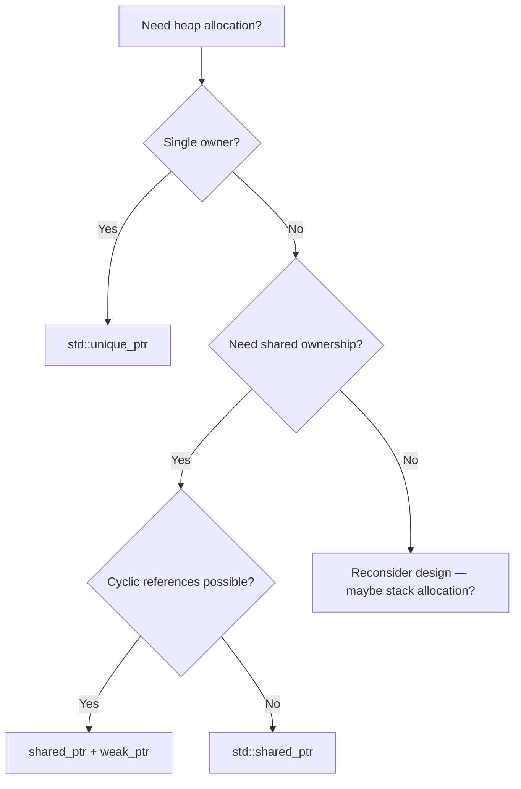

# Memory Model

## Overview

C++ gives programmers direct control over memory management — a double-edged sword that enables high performance but also introduces risks like leaks, dangling pointers, and use-after-free bugs. Modern C++ (C++11 onwards) provides **RAII** and **smart pointers** to make memory management safe without sacrificing performance.

Understanding C++'s memory model is critical for interviews: it demonstrates knowledge of how programs interact with hardware, and it separates competent C++ programmers from those who only know syntax.

## Memory Layout of a C++ Program



| Segment | Contents | Lifetime | Size |
|---------|----------|----------|------|
| **Text** | Executable instructions | Program lifetime | Fixed |
| **Data** | Initialized global/static variables | Program lifetime | Fixed |
| **BSS** | Uninitialized global/static variables | Program lifetime | Fixed |
| **Heap** | Dynamically allocated memory | Manual (or smart pointer) | Grows upward |
| **Stack** | Local variables, function parameters, return addresses | Scope-based | Grows downward |

### Stack vs Heap

```cpp
void example() {
    int x = 42;              // stack — fast, auto-cleanup
    int* p = new int(42);    // heap — slow, manual cleanup
    delete p;
    
    int arr[100];            // stack array — size must be known at compile time
    int* harr = new int[100]; // heap array — size can be runtime
    delete[] harr;
}
```

| Feature | Stack | Heap |
|---------|-------|------|
| Speed | Very fast (register offset) | Slower (system call, fragmentation) |
| Size limit | ~1-8 MB (OS dependent) | GBs (limited by RAM + swap) |
| Lifetime | Scope-based | Manual (`new`/`delete`) |
| Fragmentation | None | Yes |
| Thread safety | Each thread has own stack | Shared, needs synchronization |

## RAII (Resource Acquisition Is Initialization)

RAII is the **single most important idiom** in C++. It ties resource lifetime to object scope: acquire in the constructor, release in the destructor.

```cpp
// Without RAII — error-prone
void processFile(const std::string& filename) {
    FILE* f = fopen(filename.c_str(), "r");
    if (!f) return;
    
    // ... process file ...
    
    if (someError) {
        fclose(f);  // must remember to close on every exit path
        return;
    }
    
    // ... more work ...
    fclose(f);  // easy to forget!
}

// With RAII — safe and clean
void processFile(const std::string& filename) {
    std::ifstream file(filename);  // opened in constructor
    if (!file) return;
    
    // ... process file ...
    
    if (someError) return;  // destructor closes file automatically
    
    // ... more work ...
}  // file closed here, guaranteed, even if exceptions thrown
```

### RAII Principles

1. **Resource acquisition in constructor** — Object is always in a valid state
2. **Resource release in destructor** — Cleanup is automatic and guaranteed
3. **No two objects own the same resource** — Prevents double-free
4. **Objects are non-copyable (if they own a resource)** — Or use move semantics

### Common RAII Types

| RAII Type | Resource | Header |
|-----------|----------|--------|
| `std::unique_ptr` | Heap memory | `<memory>` |
| `std::shared_ptr` | Shared heap memory | `<memory>` |
| `std::lock_guard` | Mutex | `<mutex>` |
| `std::ifstream` / `std::ofstream` | File handles | `<fstream>` |
| `std::string` | Character buffers | `<string>` |
| `std::vector` | Dynamic arrays | `<vector>` |
| `std::jthread` (C++20) | Threads | `<thread>` |

## Raw Pointers (Legacy, but Must Know)

```cpp
// Declaration
int* p = nullptr;          // always initialize to nullptr

// Allocation
int* p = new int(42);       // single object
int* arr = new int[100];    // array

// Access
*p;                          // dereference
p[5];                        // array subscript (same as *(p+5))

// Deallocation
delete p;                    // single object
delete[] arr;                // array — MUST match new[]

// Pointer arithmetic
int arr[5] = {10, 20, 30, 40, 50};
int* p = arr;                // decays to pointer
*(p + 2);                    // 30 (arr[2])
p++;                         // points to arr[1]

// Pointer to pointer
int x = 42;
int* p = &x;
int** pp = &p;               // pointer to pointer
**pp;                         // 42
```

### Common Pointer Pitfalls

```cpp
// 1. Dangling pointer
int* p = new int(42);
delete p;
*p = 10;  // UNDEFINED BEHAVIOR — use after free

// 2. Memory leak
int* p = new int(42);
p = new int(100);  // leaked the first allocation!

// 3. Double delete
int* p = new int(42);
delete p;
delete p;  // UNDEFINED BEHAVIOR — double free

// 4. Null dereference
int* p = nullptr;
*p = 42;  // UNDEFINED BEHAVIOR — segfault

// 5. Wild pointer (uninitialized)
int* p;      // points to random memory
*p = 42;     // UNDEFINED BEHAVIOR
```

## Smart Pointers

Smart pointers are RAII wrappers for raw pointers that automatically manage memory.

### `std::unique_ptr` — Exclusive Ownership

The most common smart pointer. Exactly one `unique_ptr` owns the resource at any time.

```cpp
#include <memory>

// Creation (prefer make_unique — exception-safe)
auto p1 = std::make_unique<int>(42);
auto arr = std::make_unique<int[]>(100);  // array

// Access
*p1;             // 42
p1.get();        // raw pointer (don't delete it!)
p1->method();    // if p1 points to an object with methods

// Cannot copy — only move
// auto p2 = p1;           // COMPILE ERROR
auto p2 = std::move(p1);  // OK — p1 is now nullptr

// Check validity
if (p1) { /* p1 owns something */ }
if (!p1) { /* p1 is empty */ }

// Reset — releases current object, optionally takes new one
p2.reset();                    // deletes managed object
p2.reset(new int(100));        // deletes old, manages new

// Release — gives up ownership (caller must delete!)
int* raw = p2.release();       // p2 is now nullptr
delete raw;                    // caller's responsibility
```

**When to use:**
- Default choice for heap allocation
- Factory functions (return by value)
- Private class members that own heap objects
- Anywhere you'd use `new`/`delete` in old code

### `std::shared_ptr` — Shared Ownership

Multiple `shared_ptr` instances can share ownership. Object is destroyed when the last `shared_ptr` is destroyed.

```cpp
#include <memory>

// Creation
auto p1 = std::make_shared<int>(42);  // preferred — single allocation

// Copy — reference count increases
auto p2 = p1;              // both own the object
p1.use_count();            // 2

// Move — reference count unchanged
auto p3 = std::move(p1);   // p1 is now nullptr
p3.use_count();            // 2 (p3 + p2)

// When p2 goes out of scope: count becomes 1
// When p3 goes out of scope: count becomes 0, object deleted
```

**Internal structure:**



The control block contains:
- **Strong reference count** (number of `shared_ptr`s)
- **Weak reference count** (number of `weak_ptr`s)
- **Deleter** (custom or default `delete`)
- **Allocator** (if provided)

**⚠️ Performance overhead:**
- Control block allocation (extra heap allocation)
- Reference count increment/decrement (atomic operations — not free)
- Larger memory footprint per pointer (two pointers per `shared_ptr`)

### `std::weak_ptr` — Non-Owning Observer

`weak_ptr` observes a `shared_ptr` without preventing destruction. Used to break circular references.

```cpp
#include <memory>

std::weak_ptr<int> wp;

{
    auto sp = std::make_shared<int>(42);
    wp = sp;  // weak reference
    
    // To use the object, must lock()
    if (auto locked = wp.lock()) {
        std::cout << *locked << "\n";  // 42
        locked.use_count();            // 2 (sp + locked)
    }
    
    wp.expired();  // false
}  // sp destroyed, object deleted

wp.expired();     // true
wp.lock();        // returns nullptr
```

### Breaking Circular References

```cpp
struct Node {
    int value;
    std::shared_ptr<Node> next;     // strong reference
    std::weak_ptr<Node> prev;       // WEAK reference to break cycle
    
    ~Node() { std::cout << "Node " << value << " destroyed\n"; }
};

auto n1 = std::make_shared<Node>(Node{1});
auto n2 = std::make_shared<Node>(Node{2});

n1->next = n2;
n2->prev = n1;  // weak — doesn't prevent destruction

// When n1 and n2 go out of scope, both are destroyed correctly
```

Without `weak_ptr` for `prev`, the circular `shared_ptr` references would cause a memory leak — reference counts would never reach zero.

## Custom Deleters

Smart pointers can use custom deleters for non-standard resources:

```cpp
// Custom deleter for unique_ptr
auto fileDeleter = [](FILE* f) {
    if (f) fclose(f);
};
std::unique_ptr<FILE, decltype(fileDeleter)> file(
    fopen("data.txt", "r"), fileDeleter);

// Custom deleter for shared_ptr
std::shared_ptr<int> sp(new int[100], std::default_delete<int[]>());
// Or with lambda:
std::shared_ptr<FILE> sf(fopen("data.txt", "r"), [](FILE* f) {
    if (f) fclose(f);
});

// Type-erased deleter (shared_ptr only — stored in control block)
std::shared_ptr<void> resource(createResource(), destroyResource);
```

**Key difference:** `unique_ptr` includes the deleter in its type (zero overhead), while `shared_ptr` type-erases it (stored in control block).

## Memory Pools and Allocators

### Standard Allocators

Every STL container takes an allocator parameter (default: `std::allocator<T>`):

```cpp
template <typename T, typename Allocator = std::allocator<T>>
class vector { /* ... */ };
```

### Custom Allocator Example

```cpp
template <typename T>
class PoolAllocator {
    // Simple pool: pre-allocated blocks
    struct Block { Block* next; };
    Block* freeList_ = nullptr;
    std::vector<std::unique_ptr<char[]>> chunks_;
    
public:
    using value_type = T;
    
    T* allocate(size_t n) {
        if (n == 1 && freeList_) {
            T* p = reinterpret_cast<T*>(freeList_);
            freeList_ = freeList_->next;
            return p;
        }
        // Fallback to new
        return static_cast<T*>(::operator new(n * sizeof(T)));
    }
    
    void deallocate(T* p, size_t n) {
        if (n == 1) {
            auto* block = reinterpret_cast<Block*>(p);
            block->next = freeList_;
            freeList_ = block;
        } else {
            ::operator delete(p);
        }
    }
};

// Usage
std::vector<int, PoolAllocator<int>> pooledVec;
```

### `std::pmr` (Polymorphic Memory Resources, C++17)

```cpp
#include <memory_resource>

// Stack-based buffer — zero heap allocations for small vectors
char buffer[1024];
std::pmr::monotonic_buffer_resource pool{
    std::data(buffer), std::size(buffer)
};

// Use this pool for all allocations
std::pmr::vector<int> vec{&pool};
vec.push_back(1);  // uses buffer, no heap allocation
vec.push_back(2);  // uses buffer

// Fallback to heap when buffer exhausted
std::pmr::vector<int> heapVec{std::pmr::new_delete_resource()};
```

## Smart Pointer Comparison

| Feature | `unique_ptr` | `shared_ptr` | `weak_ptr` |
|---------|-------------|-------------|-----------|
| Ownership | Exclusive | Shared | Non-owning |
| Copyable | No | Yes | Yes |
| Movable | Yes | Yes | Yes |
| Overhead | Zero (same as raw pointer) | Control block + atomic ref count | Control block access |
| Use count | N/A | Yes | No (only `expired()`) |
| Can be null | Yes | Yes | Yes |
| Array support | `unique_ptr<T[]>` | Manual deleter needed | N/A |
| Default choice | **Yes** | When shared ownership needed | Break cycles |

## `new` vs `make_unique` vs `make_shared`

```cpp
// Raw new — AVOID in modern C++
Widget* p = new Widget(args);
// Problems: exception-unsafe if another new fails, manual delete required

// make_unique — PREFERRED
auto p = std::make_unique<Widget>(args);
// Benefits: exception-safe, no raw new, concise

// make_shared — PREFERRED for shared_ptr
auto p = std::make_shared<Widget>(args);
// Benefits: single allocation (object + control block together)
// Drawback: control block + object freed together (even if weak_ptrs exist)
```

### Why `make_shared` Is One Allocation



With `shared_ptr(new T)`, the control block and object are separately allocated (two heap calls). `make_shared` places them contiguously (one heap call, better cache behavior).

### When NOT to Use `make_shared`

```cpp
// 1. Custom deleter needed
auto p = std::shared_ptr<FILE>(fopen("f.txt", "r"), fclose);

// 2. Very large object + many weak_ptrs
// make_shared: object memory isn't freed until all weak_ptrs die too
// separate allocation: object freed immediately when last shared_ptr dies

// 3. Array allocation (pre-C++20)
auto arr = std::shared_ptr<int>(new int[100], std::default_delete<int[]>());
// C++20: auto arr = std::make_shared<int[]>(100);
```

## Move Semantics (C++11)

Move semantics allow transferring resources from temporary objects without copying.

### Lvalues and Rvalues

| Category | Description | Example |
|----------|-------------|----------|
| **Lvalue** | Has a name, has addressable memory | `int x = 42;` → `x` is lvalue |
| **Rvalue** | Temporary, no persistent address | `42`, `x + 1`, `std::string("temp")` |
| **Lvalue ref** | `T&` — binds to lvalues | `int& ref = x;` |
| **Rvalue ref** | `T&&` — binds to rvalues | `int&& ref = 42;` |

### std::move and Move Constructors

```cpp
#include <iostream>
#include <cstring>

class Buffer {
    char* data_;
    size_t size_;

public:
    // Constructor
    Buffer(size_t size) : size_(size), data_(new char[size]) {
        std::cout << "Constructor: allocated " << size << " bytes\n";
    }

    // Copy constructor — deep copy
    Buffer(const Buffer& other) : size_(other.size_), data_(new char[other.size_]) {
        std::memcpy(data_, other.data_, size_);
        std::cout << "Copy: deep copied " << size_ << " bytes\n";
    }

    // Move constructor — steal resources
    Buffer(Buffer&& other) noexcept : data_(other.data_), size_(other.size_) {
        other.data_ = nullptr;  // Leave source in valid state
        other.size_ = 0;
        std::cout << "Move: stole " << size_ << " bytes\n";
    }

    // Copy assignment
    Buffer& operator=(const Buffer& other) {
        if (this != &other) {
            delete[] data_;
            size_ = other.size_;
            data_ = new char[size_];
            std::memcpy(data_, other.data_, size_);
        }
        return *this;
    }

    // Move assignment
    Buffer& operator=(Buffer&& other) noexcept {
        if (this != &other) {
            delete[] data_;
            data_ = other.data_;
            size_ = other.size_;
            other.data_ = nullptr;
            other.size_ = 0;
        }
        return *this;
    }

    ~Buffer() { delete[] data_; }
};

Buffer createBuffer() {
    Buffer b(1024);
    return b;  // NRVO or move
}

int main() {
    Buffer a(100);            // Constructor
    Buffer b = a;             // Copy constructor
    Buffer c = std::move(a);  // Move constructor — a is now "empty"
    Buffer d = createBuffer(); // Move (or NRVO)
}
```

### When to Use std::move

```cpp
void process(Buffer b) { /* ... */ }

int main() {
    Buffer buf(1024);

    process(buf);            // Copy: buf still valid
    process(std::move(buf)); // Move: buf is now empty (valid but unspecified state)

    // Rule: don't use buf after std::move unless you reassign it
    buf = Buffer(512);       // OK: move-assign new value
}
```

### Perfect Forwarding

```cpp
#include <utility>

// Forward arguments preserving their value category
template<typename T>
void wrapper(T&& arg) {  // Universal reference
    // std::forward preserves lvalue/rvalue nature
    target(std::forward<T>(arg));
}

// Example: factory function
template<typename T, typename... Args>
std::unique_ptr<T> make_unique_custom(Args&&... args) {
    return std::unique_ptr<T>(new T(std::forward<Args>(args)...));
}
```

### Rule of Five

If you define any of these, consider defining all five:

```cpp
class Resource {
    int* data_;
public:
    Resource(int val) : data_(new int(val)) {}      // 1. Constructor
    ~Resource() { delete data_; }                     // 2. Destructor
    Resource(const Resource& o)                       // 3. Copy constructor
        : data_(new int(*o.data_)) {}
    Resource& operator=(const Resource& o) {          // 4. Copy assignment
        if (this != &o) *data_ = *o.data_;
        return *this;
    }
    Resource(Resource&& o) noexcept : data_(o.data_)  // 5. Move constructor
        { o.data_ = nullptr; }
    Resource& operator=(Resource&& o) noexcept {       // Move assignment
        if (this != &o) { delete data_; data_ = o.data_; o.data_ = nullptr; }
        return *this;
    }
};
```

## Common Memory Errors and Detection

### Error Types

| Error | Description | Tool |
|-------|-------------|------|
| Memory leak | Allocated but never freed | Valgrind, ASan |
| Use-after-free | Accessing freed memory | ASan, Valgrind |
| Double-free | Freeing same memory twice | ASan, Valgrind |
| Buffer overflow | Writing past array bounds | ASan, Valgrind |
| Stack overflow | Excessive recursion or large stack arrays | UBSan |
| Dangling pointer | Pointer to freed memory | ASan |
| Wild read | Reading uninitialized memory | MSan, Valgrind |

### Sanitizers

```bash
# Address Sanitizer — detects most memory errors
g++ -std=c++17 -fsanitize=address -g -o prog prog.cpp
./prog

# Memory Sanitizer — detects uninitialized reads
g++ -std=c++17 -fsanitize=memory -g -o prog prog.cpp

# Undefined Behavior Sanitizer
g++ -std=c++17 -fsanitize=undefined -g -o prog prog.cpp

# Thread Sanitizer — detects data races
g++ -std=c++17 -fsanitize=thread -g -o prog prog.cpp

# Valgrind
valgrind --leak-check=full ./prog
```

## Common Mistakes

1. **Using `new`/`delete` directly** — Use `make_unique`/`make_shared` instead
2. **Returning `unique_ptr` by reference** — Return by value (move semantics handles it)
3. **Creating `shared_ptr` from `new` in expression** — `f(shared_ptr<T>(new T), g())` can leak if `g()` throws; use `make_shared`
4. **Circular `shared_ptr` references** — Use `weak_ptr` to break cycles
5. **Using `shared_ptr` when `unique_ptr` suffices** — Adds unnecessary overhead
6. **Storing `this` in `shared_ptr`** — Use `std::enable_shared_from_this` instead
7. **Deleting array with `delete` instead of `delete[]`** — UB
8. **Using `get()` and then managing the raw pointer** — Leads to double-delete
9. **Not checking for `nullptr` before dereferencing** — Segfault
10. **Mixing `malloc`/`free` with `new`/`delete`** — Different allocators, UB

## References

- [Move Semantics and Rvalue References — CppReference](https://en.cppreference.com/w/cpp/language/move_constructor)
- [Smart Pointers — CppReference](https://en.cppreference.com/w/cpp/memory)
- [RAII — CppReference](https://en.cppreference.com/w/cpp/language/raii)
- [Valgrind Documentation](https://valgrind.org/docs/manual/)
- [AddressSanitizer — Google](https://github.com/google/sanitizers/wiki/AddressSanitizer)

## Quick Reference — Smart Pointer Decision Flow


