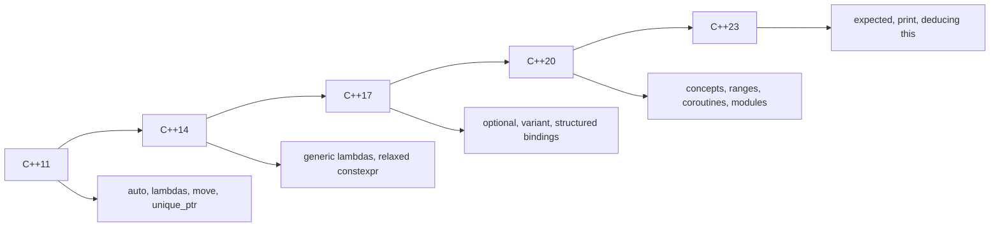

# Modern C++ Features

## Overview

"Modern C++" refers to the language and library features introduced from C++11 onward. These features fundamentally changed how C++ is written — making code safer, more expressive, and often more efficient. This guide covers the most important features that interviewers expect you to know.

## Type Deduction

### auto

`auto` lets the compiler deduce the type from the initializer:

```cpp
#include <iostream>
#include <vector>
#include <map>
#include <string>

int main() {
    // Basic auto
    auto x = 42;              // int
    auto y = 3.14;            // double
    auto s = std::string("hello");  // std::string
    
    // Complex types — auto dramatically improves readability
    std::map<std::string, std::vector<int>> data;
    // Without auto:
    std::map<std::string, std::vector<int>>::iterator it1 = data.begin();
    // With auto:
    auto it2 = data.begin();
    
    // Range-based for
    std::vector<int> vec = {1, 2, 3, 4, 5};
    for (const auto& val : vec) {
        std::cout << val << " ";
    }
    
    // auto with lambdas
    auto add = [](int a, int b) { return a + b; };
    
    return 0;
}
```

### decltype

`decltype` yields the type of an expression without evaluating it:

```cpp
#include <iostream>
#include <vector>

int main() {
    int x = 42;
    decltype(x) y = 100;           // y is int
    
    const int& ref = x;
    decltype(ref) ref2 = x;        // ref2 is const int&
    
    // Useful for return type deduction
    std::vector<int> v = {1, 2, 3};
    decltype(v.begin()) it = v.begin();  // iterator type
    
    // Trailing return type (C++11)
    auto add(int a, int b) -> decltype(a + b) {
        return a + b;
    }
    
    // C++14: return type deduction without trailing type
    auto multiply(int a, int b) {
        return a * b;  // Compiler deduces int
    }
    
    return 0;
}
```

## constexpr

`constexpr` enables compile-time computation:

```cpp
#include <iostream>
#include <array>

// C++11: constexpr functions (limited)
constexpr int factorial(int n) {
    return (n <= 1) ? 1 : n * factorial(n - 1);
}

// C++14: constexpr functions can have loops and local variables
constexpr int fibonacci(int n) {
    if (n <= 1) return n;
    int a = 0, b = 1;
    for (int i = 2; i <= n; i++) {
        int temp = a + b;
        a = b;
        b = temp;
    }
    return b;
}

// C++20: consteval (must be evaluated at compile time)
consteval int compile_time_only(int n) {
    return n * n;
}

// C++20: constinit (guarantees constant initialization)
constinit int global_value = 42;

int main() {
    // Compile-time evaluation
    constexpr int fact5 = factorial(5);       // 120, computed at compile time
    constexpr int fib10 = fibonacci(10);      // 55
    
    // Can be used where compile-time constants are required
    std::array<int, factorial(5)> arr;        // size 120
    int buffer[fibonacci(8)];                  // VLA-like, but legal
    
    // Can also be used at runtime
    int runtime_val = 10;
    int runtime_fact = factorial(runtime_val);  // Evaluated at runtime
    
    std::cout << "5! = " << fact5 << "\n";
    std::cout << "F(10) = " << fib10 << "\n";
    
    return 0;
}
```

### constexpr vs consteval vs constinit

| Keyword | When Evaluated | Can Run at Runtime | Use Case |
|---------|---------------|-------------------|----------|
| `constexpr` | Prefer compile time | Yes | Functions usable at compile time |
| `consteval` | Must be compile time | No | Compile-time-only functions |
| `constinit` | At program start | Yes | Avoiding static initialization order fiasco |

## Structured Bindings (C++17)

Decompose objects into named variables:

```cpp
#include <iostream>
#include <tuple>
#include <map>
#include <string>

struct Point {
    double x, y;
};

int main() {
    // Tuple unpacking
    auto [name, age, score] = std::make_tuple("Alice", 25, 95.5);
    std::cout << name << " is " << age << " years old\n";
    
    // Map iteration
    std::map<std::string, int> scores = {{"Alice", 95}, {"Bob", 87}};
    for (const auto& [name, score] : scores) {
        std::cout << name << ": " << score << "\n";
    }
    
    // Struct members
    Point p = {3.0, 4.0};
    auto [x, y] = p;
    std::cout << "Distance from origin: " << std::sqrt(x*x + y*y) << "\n";
    
    // Pair
    auto [iter, inserted] = scores.insert({"Charlie", 92});
    
    // Array
    int arr[] = {1, 2, 3};
    auto [a, b, c] = arr;
    
    return 0;
}
```

## std::optional (C++17)

Represents a value that may or may not exist — safer than pointers or sentinel values:

```cpp
#include <iostream>
#include <optional>
#include <string>
#include <vector>

std::optional<int> find_index(const std::vector<int>& vec, int value) {
    for (size_t i = 0; i < vec.size(); i++) {
        if (vec[i] == value) return static_cast<int>(i);
    }
    return std::nullopt;  // No value
}

std::optional<std::string> get_env(const char* name) {
    const char* val = std::getenv(name);
    if (val) return std::string(val);
    return std::nullopt;
}

int main() {
    std::vector<int> data = {10, 20, 30, 40, 50};
    
    // Using optional
    auto idx = find_index(data, 30);
    if (idx.has_value()) {
        std::cout << "Found at index: " << idx.value() << "\n";
    }
    
    // Or with value_or (default)
    auto missing = find_index(data, 99);
    std::cout << "Index: " << missing.value_or(-1) << "\n";  // -1
    
    // Monadic operations (C++23)
    // auto result = get_env("HOME")
    //     .and_then([](auto s) { return std::optional(s + "/.config"); });
    
    // Optional with expensive objects
    std::optional<std::vector<int>> maybe_vec;
    if (!maybe_vec.has_value()) {
        maybe_vec = std::vector<int>{1, 2, 3};  // Constructed in-place
    }
    
    return 0;
}
```

## std::variant (C++17)

Type-safe union — holds one of several types:

```cpp
#include <iostream>
#include <variant>
#include <string>
#include <vector>

// Variant replaces tagged unions
using Value = std::variant<int, double, std::string>;

void print_value(const Value& v) {
    // Visit with overloaded lambdas
    std::visit([](const auto& val) {
        std::cout << val << "\n";
    }, v);
}

// Overloaded pattern for different types
struct Visitor {
    void operator()(int i) const { std::cout << "int: " << i << "\n"; }
    void operator()(double d) const { std::cout << "double: " << d << "\n"; }
    void operator()(const std::string& s) const { std::cout << "string: " << s << "\n"; }
};

// C++17: overloaded lambda helper
template<class... Ts> struct overloaded : Ts... { using Ts::operator()...; };
template<class... Ts> overloaded(Ts...) -> overloaded<Ts...>;

int main() {
    Value v1 = 42;
    Value v2 = 3.14;
    Value v3 = "hello";
    
    print_value(v1);  // 42
    print_value(v2);  // 3.14
    print_value(v3);  // hello
    
    // Type-safe access
    if (std::holds_alternative<int>(v1)) {
        int val = std::get<int>(v1);
        std::cout << "Got int: " << val << "\n";
    }
    
    // Visit with overloaded pattern
    std::visit(overloaded{
        [](int i) { std::cout << "int: " << i << "\n"; },
        [](double d) { std::cout << "double: " << d << "\n"; },
        [](const std::string& s) { std::cout << "string: " << s << "\n"; }
    }, v1);
    
    // get_if for nullable access
    if (auto* p = std::get_if<int>(&v1)) {
        std::cout << "Value: " << *p << "\n";
    }
    
    return 0;
}
```

## Range-Based For Loop (C++11)

```cpp
#include <vector>
#include <map>
#include <string>

int main() {
    // Basic range-for
    std::vector<int> vec = {1, 2, 3, 4, 5};
    for (auto val : vec) {           // Copy each element
        std::cout << val << " ";
    }

    for (const auto& val : vec) {    // Const reference — no copy, no modify
        std::cout << val << " ";
    }

    for (auto& val : vec) {          // Mutable reference — can modify
        val *= 2;
    }

    // Map iteration with structured bindings
    std::map<std::string, int> scores = {{"Alice", 95}, {"Bob", 87}};
    for (const auto& [name, score] : scores) {
        std::cout << name << ": " << score << "\n";
    }

    // Initializer (C++20)
    for (auto vec = std::vector{1, 2, 3}; auto& val : vec) {
        std::cout << val << " ";
    }
}
```

### How Range-For Works

The compiler transforms range-for into:

```cpp
// for (auto& val : container) { body; }
// Becomes:
{
    auto&& __range = container;
    auto __begin = __range.begin();  // or begin(__range)
    auto __end = __range.end();      // or end(__range)
    for (; __begin != __end; ++__begin) {
        auto& val = *__begin;
        body;
    }
}
```

This means any type with `begin()` and `end()` methods (or free functions) works with range-for.

## Concepts (C++20)

Concepts are named constraints on template parameters — making templates more readable and error messages clearer:

```cpp
#include <concepts>
#include <iostream>
#include <vector>
#include <string>

// Define a concept
template<typename T>
concept Numeric = std::integral<T> || std::floating_point<T>;

// Use concept as constraint
auto add(Numeric a, Numeric b) {
    return a + b;
}

// Concept with requires clause
template<typename T>
concept Hashable = requires(T t) {
    { std::hash<T>{}(t) } -> std::convertible_to<std::size_t>;
};

// Constrained function template
template<Hashable T>
void process(const T& value) {
    std::cout << "Hashable: " << value << "\n";
}

// Abbreviated function template (auto with concept)
void print(Numeric auto value) {
    std::cout << value << "\n";
}

// Concept for container
template<typename T>
concept Container = requires(T t) {
    { t.begin() } -> std::input_or_output_iterator;
    { t.end() } -> std::input_or_output_iterator;
    { t.size() } -> std::convertible_to<std::size_t>;
};

// Use Container concept
template<Container C>
void printAll(const C& container) {
    for (const auto& item : container) {
        std::cout << item << " ";
    }
    std::cout << "\n";
}

int main() {
    add(1, 2);        // OK: int satisfies Numeric
    add(1.5, 2.5);    // OK: double satisfies Numeric
    // add("a", "b"); // ERROR: const char* doesn't satisfy Numeric

    print(42);         // OK
    print(3.14);       // OK

    printAll(std::vector{1, 2, 3});          // OK
    printAll(std::string{"hello"});           // OK
}
```

### Standard Library Concepts

| Concept | Description |
|---------|-------------|
| `std::same_as<T, U>` | T and U are the same type |
| `std::derived_from<T, U>` | T derives from U |
| `std::convertible_to<T, U>` | T can be converted to U |
| `std::integral<T>` | T is an integer type |
| `std::floating_point<T>` | T is a floating-point type |
| `std::copyable<T>` | T can be copied |
| `std::movable<T>` | T can be moved |
| `std::equality_comparable<T>` | T supports `==` |
| `std::totally_ordered<T>` | T supports `<`, `>`, etc. |
| `std::invocable<F, Args...>` | F can be called with Args |

### Concepts vs SFINAE vs Static Assert

```cpp
// Old: SFINAE (complex, poor error messages)
template<typename T, typename = std::enable_if_t<std::is_integral_v<T>>>
T old_way(T a, T b) { return a + b; }

// New: Concepts (clear, readable, good errors)
auto new_way(std::integral auto a, std::integral auto b) {
    return a + b;
}

// Also valid: requires clause
auto requires_way(auto a, auto b) requires std::integral<decltype(a)> {
    return a + b;
}
```

## Ranges (C++20)

Ranges provide composable, lazy sequence operations:

```cpp
#include <ranges>
#include <vector>
#include <iostream>

int main() {
    std::vector data = {1, 2, 3, 4, 5, 6, 7, 8, 9, 10};

    // Pipeline: filter even, transform to squares, take 3
    auto result = data
        | std::views::filter([](int n) { return n % 2 == 0; })
        | std::views::transform([](int n) { return n * n; })
        | std::views::take(3);

    for (int val : result) {
        std::cout << val << " ";  // 4 16 36
    }

    // Reverse, drop
    auto rev = data | std::views::reverse | std::views::drop(7);
    for (int val : rev) {
        std::cout << val << " ";  // 3 2 1
    }

    // iota — infinite range
    auto naturals = std::views::iota(1);  // 1, 2, 3, ...
    auto first5 = naturals | std::views::take(5);
    for (int val : first5) {
        std::cout << val << " ";  // 1 2 3 4 5
    }
}
```

### Range Adaptors

| Adaptor | Description |
|---------|-------------|
| `views::filter(pred)` | Keep elements matching predicate |
| `views::transform(fn)` | Apply function to each element |
| `views::take(n)` | Take first n elements |
| `views::drop(n)` | Skip first n elements |
| `views::reverse` | Reverse the range |
| `views::join` | Flatten nested ranges |
| `views::split(delim)` | Split by delimiter |
| `views::iota(start)` | Infinite sequence from start |
| `views::zip(r1, r2)` | Combine two ranges (C++23) |

## Coroutines (C++20)

Coroutines are functions that can suspend and resume execution:

```cpp
#include <iostream>
#include <coroutine>
#include <optional>

// Simple generator coroutine
template <typename T>
struct Generator {
    struct promise_type {
        T current_value;
        
        Generator get_return_object() {
            return Generator{
                std::coroutine_handle<promise_type>::from_promise(*this)
            };
        }
        
        std::suspend_always initial_suspend() { return {}; }
        std::suspend_always final_suspend() noexcept { return {}; }
        
        std::suspend_always yield_value(T value) {
            current_value = std::move(value);
            return {};
        }
        
        void return_void() {}
        void unhandled_exception() { std::terminate(); }
    };
    
    std::coroutine_handle<promise_type> handle;
    
    ~Generator() {
        if (handle) handle.destroy();
    }
    
    // Range-based for support
    struct iterator {
        std::coroutine_handle<promise_type> handle;
        
        iterator& operator++() {
            handle.resume();
            return *this;
        }
        
        T operator*() const {
            return handle.promise().current_value;
        }
        
        bool operator==(std::default_sentinel_t) const {
            return !handle || handle.done();
        }
    };
    
    iterator begin() {
        handle.resume();
        return {handle};
    }
    
    std::default_sentinel_t end() { return {}; }
};

Generator<int> fibonacci() {
    int a = 0, b = 1;
    while (true) {
        co_yield a;
        int temp = a + b;
        a = b;
        b = temp;
    }
}

int main() {
    auto fib = fibonacci();
    int count = 0;
    for (int val : fib) {
        std::cout << val << " ";
        if (++count >= 10) break;
    }
    std::cout << "\n";  // 0 1 1 2 3 5 8 13 21 34
    
    return 0;
}
```

### Coroutine Keywords

| Keyword | Meaning |
|---------|---------|
| `co_await` | Suspend execution until resumed |
| `co_yield` | Suspend and yield a value |
| `co_return` | Complete the coroutine |

## Other Important Features

### if constexpr (C++17)

```cpp
template <typename T>
auto get_value(T t) {
    if constexpr (std::is_integral_v<T>) {
        return t * 2;
    } else if constexpr (std::is_floating_point_v<T>) {
        return t * 1.5;
    } else {
        return t;
    }
}
```

### [[nodiscard]] Attribute

```cpp
[[nodiscard]] int important_function() { return 42; }

int main() {
    important_function();  // Warning: return value ignored
    auto x = important_function();  // OK
    return 0;
}
```

### std::format (C++20)

```cpp
#include <format>
#include <iostream>

int main() {
    auto s = std::format("Hello, {}! You are {} years old.", "Alice", 25);
    std::cout << s << "\n";
    
    auto pi = std::format("Pi = {:.4f}", 3.14159265);
    std::cout << pi << "\n";  // Pi = 3.1416
}
```

### Three-way Comparison <=> (C++20)

```cpp
#include <compare>
#include <iostream>

struct Point {
    int x, y;
    auto operator<=>(const Point&) const = default;  // All comparisons generated
};

int main() {
    Point a{1, 2}, b{1, 3};
    if (a < b) std::cout << "a < b\n";
    
    auto result = a <=> b;
    if (result < 0) std::cout << "a < b\n";
}
```

## Feature Timeline



## Common Mistakes

| Mistake | Consequence | Fix |
|---------|-------------|-----|
| Overusing `auto` | Reduced readability | Use when type is obvious |
| `constexpr` function too complex | Compile-time slowdown | Keep simple |
| Forgetting `std::optional` has value | Crashes on `.value()` | Use `.value_or()` or check |
| Not visiting all variant types | Compile error | Use overloaded visitor |
| Coroutine lifetime issues | Dangling references | Ensure coroutine outlives its results |

## Interview Questions

1. **What is the difference between `auto` and `decltype`?**
   - `auto` deduces from initializer, strips references/const. `decltype` yields exact type of expression.

2. **What is `constexpr` and when would you use it?**
   - Enables compile-time computation. Use for constants, lookup tables, template arguments.

3. **Explain structured bindings.**
   - Decompose tuples, pairs, structs, and arrays into named variables: `auto [x, y] = point;`

4. **When would you use `std::optional` vs `std::variant`?**
   - `optional<T>`: value may or may not exist. `variant<Ts...>`: value is one of several types.

5. **What are coroutines used for?**
   - Asynchronous programming, generators, event loops, cooperative multitasking.

## References

- [C++ Reference — Concepts](https://en.cppreference.com/w/cpp/language/constraints)
- [C++ Reference — Ranges](https://en.cppreference.com/w/cpp/ranges)
- [C++ Reference — Coroutines](https://en.cppreference.com/w/cpp/language/coroutines)
- [C++20 Features — cppreference](https://en.cppreference.com/w/cpp/20)
- [Effective Modern C++ — Scott Meyers](https://www.oreilly.com/library/view/effective-modern-c/9781491908419/)

## Related Topics

- [Templates](./templates.md) — `constexpr` with templates, `if constexpr`
- [STL](./stl.md) — Ranges (C++20), algorithms with lambdas
- [Move Semantics](./move-semantics.md) — `auto` with move semantics
- [Concurrency](./concurrency.md) — Coroutines for async
- [Memory Model](./memory-model.md) — Smart pointers, RAII
- [Interview Questions](./interview-questions.md) — Modern C++ problems
