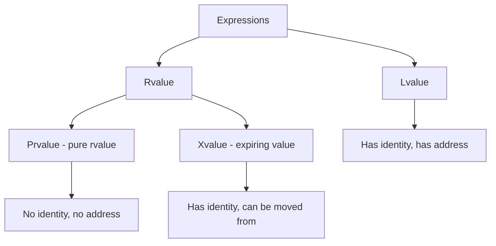
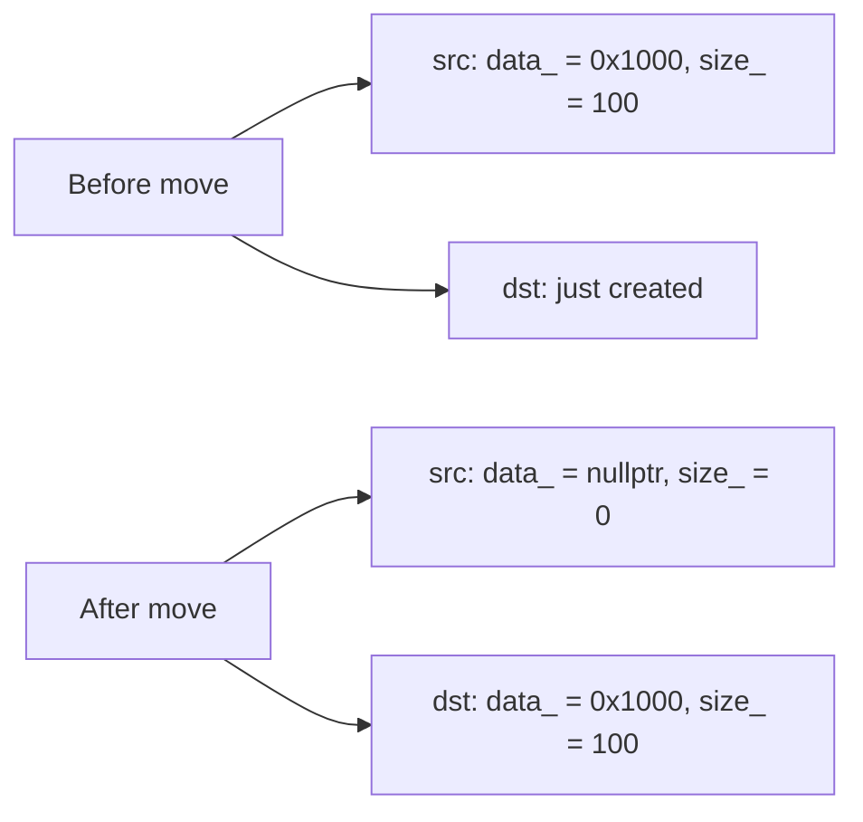

# Move Semantics

## Overview

Move semantics, introduced in C++11, is one of the most important features in modern C++. It allows resources (heap memory, file handles, sockets, etc.) to be **transferred** from one object to another instead of being copied, eliminating unnecessary deep copies and dramatically improving performance.

Before C++11, returning a large object from a function required copying. With move semantics, the internal state is "stolen" from the source — an O(1) pointer swap instead of an O(n) deep copy.

## Lvalues and Rvalues

Before understanding move semantics, you must understand value categories:

| Category | Description | Examples |
|----------|-------------|----------|
| **Lvalue** | Has an address, can appear on left side of `=` | Variables, `*p`, `arr[i]`, function returning reference |
| **Prvalue** (pure rvalue) | Temporary, no persistent address | Literals (`42`, `3.14`), temporaries, function returning by value |
| **Xvalue** (expiring value) | About to be destroyed, can be moved from | Result of `std::move(x)`, function returning rvalue reference |

```cpp
int x = 42;          // x is an lvalue
int& ref = x;        // ref is an lvalue reference to lvalue
// int& ref2 = 42;   // ERROR: can't bind lvalue ref to rvalue
const int& ref3 = 42; // OK: const lvalue ref extends lifetime of temporary

int&& rref = 42;     // rvalue reference binds to rvalue
// int&& rref2 = x;  // ERROR: can't bind rvalue ref to lvalue
int&& rref3 = std::move(x);  // OK: std::move casts lvalue to rvalue
```

### Value Category Diagram



## Rvalue References

Rvalue references (`T&&`) are the foundation of move semantics — they bind to temporaries and objects marked with `std::move`:

```cpp
void process(std::string& s) {
    std::cout << "lvalue: " << s << "\n";
}

void process(std::string&& s) {
    std::cout << "rvalue: " << s << "\n";
}

std::string name = "Alice";
process(name);                  // calls lvalue overload
process(std::move(name));       // calls rvalue overload
process("temporary");           // calls rvalue overload (string literal → temporary)
process(std::string("temp"));   // calls rvalue overload
```

## `std::move` — Casting to Rvalue

`std::move` doesn't actually move anything — it's simply a **cast** that converts its argument to an rvalue reference, enabling move constructors and move assignment operators to be called:

```cpp
template <typename T>
std::remove_reference_t<T>&& move(T&& x) noexcept {
    return static_cast<std::remove_reference_t<T>&&>(x);
}

// Usage
std::string s1 = "Hello";
std::string s2 = std::move(s1);  // s1 is now in a valid but unspecified state
// s1 might be "" or might be "Hello" — don't rely on its value!
```

**⚠️ After `std::move(x)`:** The source object is in a **valid but unspecified state**. You can:
- Destroy it
- Assign to it
- Call methods that have no preconditions

You **cannot** assume any specific value for it.

## Move Constructor

A move constructor transfers resources from a source object to a newly created object:

```cpp
class Buffer {
    size_t size_;
    int* data_;
    
public:
    // Default constructor
    explicit Buffer(size_t size = 0)
        : size_(size), data_(size ? new int[size]{} : nullptr) {}
    
    // Copy constructor — DEEP COPY
    Buffer(const Buffer& other)
        : size_(other.size_), data_(other.size_ ? new int[other.size_] : nullptr) {
        std::copy(other.data_, other.data_ + size_, data_);
    }
    
    // Move constructor — TRANSFER OWNERSHIP (noexcept is important!)
    Buffer(Buffer&& other) noexcept
        : size_(other.size_), data_(other.data_) {
        // Steal resources from other
        other.size_ = 0;
        other.data_ = nullptr;  // leave other in a valid state
    }
    
    // Destructor
    ~Buffer() { delete[] data_; }
    
    // ... assignment operators ...
};
```

### How It Works Internally



Instead of allocating new memory and copying 100 integers, the move constructor simply copies two pointers (8 bytes each) and nullifies the source. This is O(1) vs O(n).

## Move Assignment Operator

```cpp
class Buffer {
    // ... constructors ...
    
    // Copy assignment
    Buffer& operator=(const Buffer& other) {
        if (this != &other) {
            delete[] data_;
            size_ = other.size_;
            data_ = size_ ? new int[size_] : nullptr;
            std::copy(other.data_, other.data_ + size_, data_);
        }
        return *this;
    }
    
    // Move assignment
    Buffer& operator=(Buffer&& other) noexcept {
        if (this != &other) {
            delete[] data_;       // free current resources
            
            // Steal from other
            size_ = other.size_;
            data_ = other.data_;
            
            // Leave other in valid state
            other.size_ = 0;
            other.data_ = nullptr;
        }
        return *this;
    }
};
```

### Copy vs Move Comparison

| Operation | Cost | When Used |
|-----------|------|-----------|
| Copy constructor | O(n) — deep copy | `Buffer b2(b1)` or `Buffer b2 = b1` |
| Move constructor | O(1) — pointer swap | `Buffer b2(std::move(b1))` |
| Copy assignment | O(n) — free old + deep copy | `b2 = b1` |
| Move assignment | O(1) — free old + steal | `b2 = std::move(b1)` |

## The Rule of Five

If a class manages a resource and you need to define **any one** of these five special member functions, you should define **all five**:

1. **Destructor**
2. **Copy constructor**
3. **Copy assignment operator**
4. **Move constructor**
5. **Move assignment operator**

```cpp
class RuleOfFive {
    int* data_;
    
public:
    explicit RuleOfFive(int val = 0) : data_(new int(val)) {}
    
    // 1. Destructor
    ~RuleOfFive() { delete data_; }
    
    // 2. Copy constructor
    RuleOfFive(const RuleOfFive& other) : data_(new int(*other.data_)) {}
    
    // 3. Copy assignment
    RuleOfFive& operator=(const RuleOfFive& other) {
        if (this != &other) {
            *data_ = *other.data_;  // copy the value, don't reallocate
        }
        return *this;
    }
    
    // 4. Move constructor
    RuleOfFive(RuleOfFive&& other) noexcept : data_(other.data_) {
        other.data_ = nullptr;
    }
    
    // 5. Move assignment
    RuleOfFive& operator=(RuleOfFive&& other) noexcept {
        if (this != &other) {
            delete data_;
            data_ = other.data_;
            other.data_ = nullptr;
        }
        return *this;
    }
};
```

## The Rule of Zero

**Preferred over Rule of Five:** If your class doesn't directly manage resources, don't define any special member functions. Use types that manage their own resources:

```cpp
// Rule of Zero — the class manages nothing directly
class Employee {
    std::string name_;          // std::string manages its own memory
    std::vector<std::string> skills_;  // std::vector manages its own memory
    std::unique_ptr<Project> project_;  // unique_ptr manages ownership
    
public:
    Employee(std::string name, std::vector<std::string> skills)
        : name_(std::move(name)), skills_(std::move(skills)) {}
    
    // No destructor, no copy/move operators needed!
    // The compiler generates correct ones automatically.
};
```

**Note:** `Employee` is **not copyable** because `unique_ptr` is not copyable. If you need copyability, use `shared_ptr` instead, or implement the copy operations manually.

## `= default` and `= delete`

```cpp
class Example {
public:
    // Use compiler-generated defaults
    Example() = default;
    Example(const Example&) = default;
    Example(Example&&) = default;
    Example& operator=(const Example&) = default;
    Example& operator=(Example&&) = default;
    ~Example() = default;
    
    // Explicitly disable operations
    Example(const Example&) = delete;  // no copy construction (deleted overload for clarity)
    void operator=(const Example&) = delete;  // no copy assignment
};
```

## Perfect Forwarding

Perfect forwarding solves the problem of **preserving value categories** when passing arguments through wrapper functions:

```cpp
// Problem: wrapper functions lose the "rvalue-ness" of arguments
template <typename T>
void wrapper(T arg) {
    // arg is always an lvalue here, even if caller passed an rvalue
    target(arg);  // always calls lvalue overload of target
}

// Solution: forwarding reference + std::forward
template <typename T>
void wrapper(T&& arg) {  // T&& is a forwarding reference, NOT rvalue reference
    target(std::forward<T>(arg));  // preserves original value category
}
```

### Forwarding References vs Rvalue References

```cpp
// This is an rvalue reference — T is deduced, but the reference is fixed
template <typename T>
void func(T&& arg);  // T&& where T is a parameter of func

// In a function template, T&& is a FORWARDING reference
// It can bind to both lvalues and rvalues

std::string s = "hello";
wrapper(s);              // T = std::string&, arg type = std::string&
wrapper(std::move(s));   // T = std::string,  arg type = std::string&&
wrapper("hello");        // T = const char(&)[6], arg type = const char(&)[6]
```

### `std::forward` — Conditional Cast

```cpp
template <typename T>
T&& forward(std::remove_reference_t<T>& arg) noexcept {
    return static_cast<T&&>(arg);
}

// When T = std::string&:  returns std::string&  (lvalue)
// When T = std::string:   returns std::string&& (rvalue)
```

### Perfect Forwarding in Practice

```cpp
// Generic factory function
template <typename T, typename... Args>
std::unique_ptr<T> make_unique(Args&&... args) {
    return std::unique_ptr<T>(new T(std::forward<Args>(args)...));
}

// Wrapper for logging + forwarding
template <typename Func, typename... Args>
auto logAndCall(Func&& func, Args&&... args) {
    std::cout << "Calling function...\n";
    return std::forward<Func>(func)(std::forward<Args>(args)...);
}
```

### Common Perfect Forwarding Pitfall

```cpp
// Brace initialization doesn't work with perfect forwarding
template <typename T, typename... Args>
std::unique_ptr<T> makeUnique(Args&&... args) {
    // std::unique_ptr<T>(new T{std::forward<Args>(args)...});
    // Won't work with brace-enclosed initializer list
    return std::unique_ptr<T>(new T(std::forward<Args>(args)...));
}
```

## Copy Elision (RVO/NRVO)

The compiler can eliminate copy/move operations entirely:

### Return Value Optimization (RVO)

```cpp
std::string create() {
    return std::string("Hello");  // temporary — copy/move elided
}

auto s = create();  // object constructed directly in s, no copy/move
```

### Named Return Value Optimization (NRVO)

```cpp
std::vector<int> generate(int n) {
    std::vector<int> result(n);  // named local
    std::iota(result.begin(), result.end(), 1);
    return result;  // NRVO: constructed directly at call site
}

auto v = generate(100);  // no copy/move
```

### Mandatory Elision (C++17)

C++17 made certain copy elisions **mandatory** (not just an optimization):

```cpp
// Prvalue materialization — guaranteed no copy/move
Widget w = Widget();  // C++17: guaranteed no copy/move constructor called
// Even if move constructor is deleted, this still works!
```

| Scenario | Pre-C++17 | C++17 |
|----------|-----------|-------|
| `T func() { return T(); }` | Optional RVO | Optional RVO |
| `T x = T(T(T()));` | Optional elision | **Mandatory** elision |
| `T func() { T x; return x; }` | Optional NRVO | Optional NRVO |

## Move Semantics with STL Containers

Move semantics makes returning containers from functions efficient:

```cpp
// Before C++11: expensive copy
std::vector<int> createVector() {
    std::vector<int> v(1000000, 42);
    return v;  // would copy 1M elements (unless RVO applied)
}

// C++11+: efficient move (or NRVO)
std::vector<int> createVector() {
    std::vector<int> v(1000000, 42);
    return v;  // move-constructed or NRVO'd
}

// Moving elements into containers
std::vector<std::string> names;
std::string name = "Alice";
names.push_back(name);              // copy
names.push_back(std::move(name));   // move — name is now empty
names.push_back("Bob");             // move (temporary)
```

### `emplace` vs `insert`/`push_back`

```cpp
struct Widget {
    std::string name;
    int value;
    Widget(std::string n, int v) : name(std::move(n)), value(v) {}
};

std::vector<Widget> widgets;

// push_back — constructs temporary, then moves it in
widgets.push_back(Widget("foo", 42));

// emplace_back — constructs in-place, no temporary needed
widgets.emplace_back("foo", 42);
```

## Performance Impact

### Benchmark: Copy vs Move

```cpp
// Copying a large vector
std::vector<int> v1(1000000, 42);
auto v2 = v1;              // O(n) — allocates + copies 1M ints

// Moving a large vector
auto v3 = std::move(v1);   // O(1) — pointer swap
```

### When Move Doesn't Help

Move semantics doesn't help for types that are **trivially copyable** (int, double, pointers, etc.):

```cpp
int a = 42;
int b = std::move(a);  // still just a copy — ints are cheap to copy
// a is still 42! (moving a trivial type doesn't change the source)
```

Move semantics shines for types with expensive-to-copy resources:
- `std::string` (heap-allocated buffer)
- `std::vector` (heap-allocated array)
- `std::unique_ptr` (exclusive ownership)
- Custom types with large internal buffers

## Common Interview Questions

### Q: What does `std::move` actually do?

**A:** Nothing. It's a cast that converts its argument to an rvalue reference. The actual "moving" happens in the move constructor or move assignment operator that receives the rvalue reference.

### Q: Can you move a `const` object?

**A:** `std::move(constObj)` compiles, but it produces a `const T&&`, which binds to `const T&` (copy constructor), not to `T&&` (move constructor). So the object is **copied**, not moved.

```cpp
const std::string s = "hello";
std::string s2 = std::move(s);  // COPIES, doesn't move
```

### Q: What happens to a moved-from object?

**A:** It's in a **valid but unspecified state**. You can:
- Destroy it
- Assign a new value to it
- Call methods with no preconditions (e.g., `empty()`, `size()`)

You **cannot** assume its value (e.g., don't assume it's empty).

### Q: When should you write `noexcept` on move operations?

**A:** Always (when possible). The STL containers use `noexcept` move constructors to decide between move and copy during reallocation. `std::vector` only uses move if it's `noexcept`; otherwise it copies for exception safety.

```cpp
// vector reallocation strategy:
// If move constructor is noexcept → move elements (fast)
// If move constructor may throw → copy elements (safe)
```

## Common Mistakes

1. **Using `std::move` on return of local variable** — Prevents NRVO! Just `return x;`
   ```cpp
   // BAD — prevents NRVO
   std::vector<int> bad() { std::vector<int> v; return std::move(v); }
   // GOOD — enables NRVO
   std::vector<int> good() { std::vector<int> v; return v; }
   ```

2. **Using moved-from objects** — They're in unspecified state
   ```cpp
   auto s2 = std::move(s1);
   std::cout << s1;  // BUG: s1 is moved-from
   ```

3. **Forgetting `noexcept` on move operations** — STL won't use move during reallocation
4. **Moving `const` objects** — Actually copies, silently
5. **Confusing forwarding references with rvalue references** — `T&&` in templates is a forwarding reference
6. **Not following Rule of Five/Zero** — Manual resource management is error-prone
7. **Using `std::move` on everything** — Overusing move can actually hurt (prevents optimizations like NRVO)

## Quick Reference

| Feature | Introduced | Purpose |
|---------|-----------|---------|
| Rvalue references (`T&&`) | C++11 | Bind to temporaries |
| `std::move` | C++11 | Cast to rvalue reference |
| Move constructor | C++11 | Transfer resources on construction |
| Move assignment | C++11 | Transfer resources on assignment |
| Perfect forwarding | C++11 | Preserve value categories through wrappers |
| `std::forward` | C++11 | Conditional cast for forwarding |
| Copy elision (mandatory) | C++17 | Guaranteed elimination of copies |
| `noexcept` on moves | C++11 | Enable move during reallocation |
