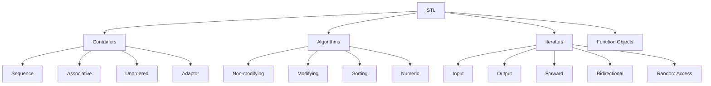
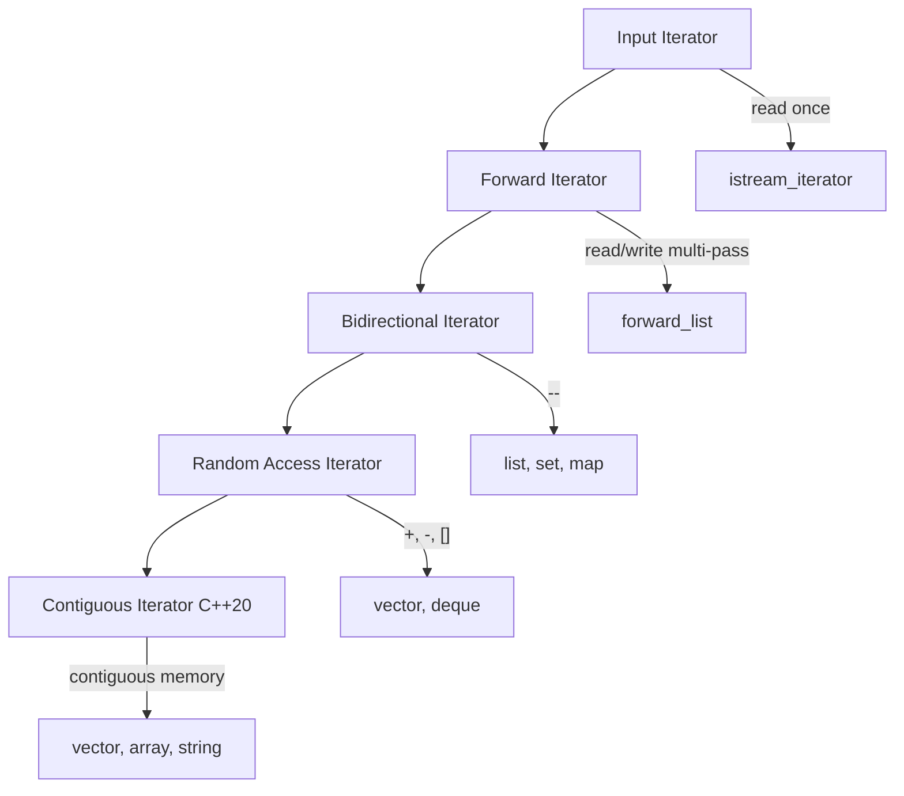
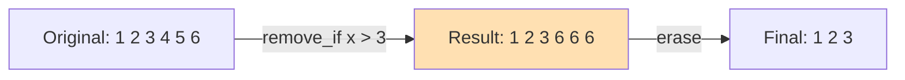

# Standard Template Library (STL)

## Overview

The Standard Template Library (STL) is a powerful library of generic containers, algorithms, and iterators that is part of the C++ Standard Library. The STL is built on templates and provides highly efficient, reusable components.

The STL is based on three core concepts:
- **Containers** — Store data
- **Algorithms** — Process data
- **Iterators** — Bridge containers and algorithms

Understanding STL is essential for C++ interviews — it's tested heavily and using it correctly demonstrates modern C++ proficiency.

## STL Architecture



## Containers

### Sequence Containers

| Container | Underlying Structure | Access | Insert/Delete | Use Case |
|-----------|---------------------|--------|---------------|----------|
| `vector` | Dynamic array | O(1) | End: O(1), Middle: O(n) | Default choice, contiguous data |
| `deque` | Double-ended queue | O(1) | Both ends: O(1) | Queue with random access |
| `list` | Doubly-linked list | O(n) | Any position: O(1) | Frequent insert/delete |
| `forward_list` | Singly-linked list | O(n) | Any position: O(1) | Memory-efficient list |
| `array` | Fixed-size array | O(1) | None | Compile-time known size |

### Associative Containers

| Container | Underlying Structure | Search | Insert | Use Case |
|-----------|---------------------|--------|--------|----------|
| `set` | Red-black tree | O(log n) | O(log n) | Unique sorted elements |
| `multiset` | Red-black tree | O(log n) | O(log n) | Sorted with duplicates |
| `map` | Red-black tree | O(log n) | O(log n) | Key-value pairs, unique keys |
| `multimap` | Red-black tree | O(log n) | O(log n) | Key-value, duplicate keys |

### Unordered Containers

| Container | Underlying Structure | Average | Worst | Use Case |
|-----------|---------------------|---------|-------|----------|
| `unordered_set` | Hash table | O(1) | O(n) | Fast lookup, unique |
| `unordered_multiset` | Hash table | O(1) | O(n) | Fast lookup, duplicates |
| `unordered_map` | Hash table | O(1) | O(n) | Fast key-value lookup |
| `unordered_multimap` | Hash table | O(1) | O(n) | Fast key-value, duplicates |

### Container Adaptors

```cpp
#include <iostream>
#include <stack>
#include <queue>
#include <deque>

int main() {
    // Stack (LIFO) — default: deque
    std::stack<int> stk;
    stk.push(1);
    stk.push(2);
    stk.push(3);
    std::cout << stk.top() << "\n";  // 3
    stk.pop();
    
    // Queue (FIFO) — default: deque
    std::queue<int> que;
    que.push(1);
    que.push(2);
    que.push(3);
    std::cout << que.front() << "\n";  // 1
    que.pop();
    
    // Priority Queue (max-heap by default)
    std::priority_queue<int> pq;
    pq.push(3);
    pq.push(1);
    pq.push(4);
    std::cout << pq.top() << "\n";  // 4 (largest)
    pq.pop();
    
    // Min-heap
    std::priority_queue<int, std::vector<int>, std::greater<int>> min_pq;
    min_pq.push(3);
    min_pq.push(1);
    min_pq.push(4);
    std::cout << min_pq.top() << "\n";  // 1 (smallest)
    
    return 0;
}
```

## Iterators

Iterators provide a uniform interface to traverse containers:

```cpp
#include <iostream>
#include <vector>
#include <list>
#include <set>

int main() {
    std::vector<int> vec = {1, 2, 3, 4, 5};
    
    // Iterator types
    std::vector<int>::iterator it = vec.begin();
    std::vector<int>::const_iterator cit = vec.cbegin();
    std::vector<int>::reverse_iterator rit = vec.rbegin();
    
    // Using iterators
    for (auto it = vec.begin(); it != vec.end(); ++it) {
        std::cout << *it << " ";
    }
    std::cout << "\n";
    
    // Range-based for (preferred)
    for (const auto& val : vec) {
        std::cout << val << " ";
    }
    std::cout << "\n";
    
    // Iterator arithmetic (random access iterators)
    auto mid = vec.begin() + vec.size() / 2;
    std::cout << "Middle: " << *mid << "\n";
    
    // Distance
    auto dist = std::distance(vec.begin(), vec.end());
    std::cout << "Distance: " << dist << "\n";
    
    // Advance
    auto pos = vec.begin();
    std::advance(pos, 3);
    std::cout << "4th element: " << *pos << "\n";
    
    return 0;
}
```

### Iterator Categories



## Algorithms

### Non-Modifying Algorithms

```cpp
#include <algorithm>
#include <vector>
#include <iostream>
#include <numeric>

int main() {
    std::vector<int> v = {3, 1, 4, 1, 5, 9, 2, 6, 5, 3, 5};
    
    // Search
    auto it = std::find(v.begin(), v.end(), 5);
    if (it != v.end()) {
        std::cout << "Found 5 at index " << std::distance(v.begin(), it) << "\n";
    }
    
    // Count
    int cnt = std::count(v.begin(), v.end(), 5);
    std::cout << "Count of 5: " << cnt << "\n";
    
    // Any/All/None
    bool has_even = std::any_of(v.begin(), v.end(), 
        [](int x) { return x % 2 == 0; });
    std::cout << "Has even: " << has_even << "\n";
    
    // Min/Max
    auto [min_it, max_it] = std::minmax_element(v.begin(), v.end());
    std::cout << "Min: " << *min_it << ", Max: " << *max_it << "\n";
    
    // Accumulate
    int sum = std::accumulate(v.begin(), v.end(), 0);
    std::cout << "Sum: " << sum << "\n";
    
    // For each
    std::for_each(v.begin(), v.end(), [](int& x) { x *= 2; });
    
    return 0;
}
```

### Modifying Algorithms

```cpp
#include <algorithm>
#include <vector>
#include <string>
#include <iostream>

int main() {
    std::vector<int> v = {1, 2, 3, 4, 5, 6, 7, 8, 9, 10};
    
    // Transform
    std::vector<int> squared(v.size());
    std::transform(v.begin(), v.end(), squared.begin(),
        [](int x) { return x * x; });
    
    // Copy if
    std::vector<int> evens;
    std::copy_if(v.begin(), v.end(), std::back_inserter(evens),
        [](int x) { return x % 2 == 0; });
    
    // Remove if (erase-remove idiom)
    std::vector<int> data = {1, 2, 3, 4, 5, 6, 7, 8, 9, 10};
    data.erase(
        std::remove_if(data.begin(), data.end(), [](int x) { return x > 5; }),
        data.end()
    );
    // data is now {1, 2, 3, 4, 5}
    
    // Sort
    std::vector<int> unsorted = {5, 2, 8, 1, 9, 3};
    std::sort(unsorted.begin(), unsorted.end());
    
    // Sort with custom comparator
    std::sort(unsorted.begin(), unsorted.end(), std::greater<int>{});
    
    // Unique (remove consecutive duplicates)
    std::vector<int> dupes = {1, 1, 2, 2, 3, 3, 3, 4};
    auto last = std::unique(dupes.begin(), dupes.end());
    dupes.erase(last, dupes.end());
    // dupes is now {1, 2, 3, 4}
    
    // Binary search (requires sorted range)
    std::sort(v.begin(), v.end());
    bool found = std::binary_search(v.begin(), v.end(), 5);
    
    // Lower/Upper bound
    auto lb = std::lower_bound(v.begin(), v.end(), 5);
    auto ub = std::upper_bound(v.begin(), v.end(), 5);
    std::cout << "Range of 5s: [" << std::distance(v.begin(), lb) 
              << ", " << std::distance(v.begin(), ub) << ")\n";
    
    return 0;
}
```

### The Erase-Remove Idiom



## Functors (Function Objects)

```cpp
#include <iostream>
#include <algorithm>
#include <vector>
#include <functional>

// Custom functor
struct Multiplier {
    int factor;
    explicit Multiplier(int f) : factor(f) {}
    int operator()(int x) const { return x * factor; }
};

// Stateful functor
class Counter {
    int count = 0;
public:
    void operator()(int x) {
        if (x > 0) count++;
    }
    int get_count() const { return count; }
};

int main() {
    std::vector<int> v = {1, 2, 3, 4, 5};
    
    // Using custom functor
    std::transform(v.begin(), v.end(), v.begin(), Multiplier(3));
    // v is now {3, 6, 9, 12, 15}
    
    // Using standard functors
    std::sort(v.begin(), v.end(), std::greater<int>{});
    
    // Using bind
    auto is_greater_than_5 = std::bind(std::greater<int>{}, 
                                        std::placeholders::_1, 5);
    int count = std::count_if(v.begin(), v.end(), is_greater_than_5);
    
    // Stateful functor
    Counter counter = std::for_each(v.begin(), v.end(), Counter{});
    std::cout << "Positive count: " << counter.get_count() << "\n";
    
    return 0;
}
```

## Lambda Expressions (C++11)

Lambdas are anonymous function objects — the most common way to pass behavior to algorithms:

```cpp
#include <iostream>
#include <vector>
#include <algorithm>
#include <numeric>

int main() {
    std::vector<int> v = {3, 1, 4, 1, 5, 9, 2, 6, 5, 3, 5};
    
    // Basic lambda
    auto print = [](int x) { std::cout << x << " "; };
    std::for_each(v.begin(), v.end(), print);
    std::cout << "\n";
    
    // Lambda with capture
    int threshold = 4;
    auto above_threshold = [threshold](int x) { return x > threshold; };
    int count = std::count_if(v.begin(), v.end(), above_threshold);
    std::cout << "Above " << threshold << ": " << count << "\n";
    
    // Capture modes
    int x = 10, y = 20;
    auto by_value = [x, y]() { return x + y; };        // Copy x, y
    auto by_ref = [&x, &y]() { x++; y++; };            // Reference x, y
    auto capture_all_val = [=]() { return x + y; };     // Copy everything
    auto capture_all_ref = [&]() { x++; y++; };         // Reference everything
    auto mixed = [=, &y]() { /* x by value, y by ref */ };
    
    // Mutable lambda (can modify captured values)
    int counter = 0;
    auto increment = [counter]() mutable { return ++counter; };
    std::cout << increment() << "\n";  // 1
    std::cout << increment() << "\n";  // 2
    // counter is still 0 outside the lambda
    
    // Generic lambda (C++14)
    auto generic_add = [](auto a, auto b) { return a + b; };
    std::cout << generic_add(3, 4) << "\n";       // 7
    std::cout << generic_add(3.14, 2.71) << "\n"; // 5.85
    
    // Lambda in sort
    std::sort(v.begin(), v.end(), [](int a, int b) {
        return a > b;  // Descending
    });
    
    // Lambda for accumulate
    int sum = std::accumulate(v.begin(), v.end(), 0,
        [](int acc, int x) { return acc + x * x; });  // Sum of squares
    
    return 0;
}
```

### Lambda Capture Details

| Capture | Syntax | Description |
|---------|--------|-------------|
| By value | `[x]` | Copy x into lambda |
| By reference | `[&x]` | Reference x |
| All by value | `[=]` | Copy all used variables |
| All by reference | `[&]` | Reference all used variables |
| Mixed | `[=, &x]` | All by value, x by reference |
| Init capture | `[p = std::move(ptr)]` | Move into lambda (C++14) |

## Ranges (C++20)

Ranges provide a composable, lazy view of data:

```cpp
#include <ranges>
#include <vector>
#include <iostream>

int main() {
    std::vector<int> v = {1, 2, 3, 4, 5, 6, 7, 8, 9, 10};
    
    // Filter and transform (lazy evaluation)
    auto result = v 
        | std::views::filter([](int x) { return x % 2 == 0; })
        | std::views::transform([](int x) { return x * x; });
    
    for (int x : result) {
        std::cout << x << " ";  // 4 16 36 64 100
    }
    std::cout << "\n";
    
    // Take and drop
    auto first_five = v | std::views::take(5);
    auto last_five = v | std::views::drop(5);
    
    // Reverse
    auto reversed = v | std::views::reverse;
    
    // Iota (infinite range)
    auto naturals = std::views::iota(1) | std::views::take(10);
    for (int x : naturals) {
        std::cout << x << " ";  // 1 2 3 4 5 6 7 8 9 10
    }
    
    return 0;
}
```

## Common Mistakes

| Mistake | Consequence | Fix |
|---------|-------------|-----|
| Using `vector<bool>` | Doesn't behave like normal vector | Use `deque<bool>` or bitset |
| Iterator invalidation | Undefined behavior | Be aware of container modification rules |
| Using `std::list` unnecessarily | Cache-unfriendly | Prefer `vector` unless frequent insert/delete |
| Forgetting to sort before binary search | Wrong results | Always sort first |
| Copying containers by accident | Performance hit | Use references or `std::move` |
| Wrong comparator | Incorrect ordering | Ensure strict weak ordering |

## Interview Questions

1. **What is the difference between `map` and `unordered_map`?**
   - `map`: O(log n), ordered by key, uses red-black tree. `unordered_map`: O(1) average, unordered, uses hash table.

2. **What is iterator invalidation?**
   - When a container operation makes existing iterators unusable. Example: `vector::push_back` may invalidate all iterators.

3. **Explain the erase-remove idiom.**
   - `std::remove` moves elements to keep, returns iterator to new end. `erase` actually removes the leftover elements.

4. **When would you use `std::list` over `std::vector`?**
   - When you need O(1) insert/delete in the middle and don't need random access.

5. **What are the advantages of range-based for over iterator-based for?**
   - Cleaner syntax, less error-prone, works with any container.

## Related Topics

- [Templates](./templates.md) — How STL containers and algorithms are implemented
- [Move Semantics](./move-semantics.md) — Efficient container operations
- [Memory Model](./memory-model.md) — How containers manage memory
- [Modern C++](./modern-cpp.md) — Ranges, structured bindings
- [Interview Questions](./interview-questions.md) — STL-related problems
