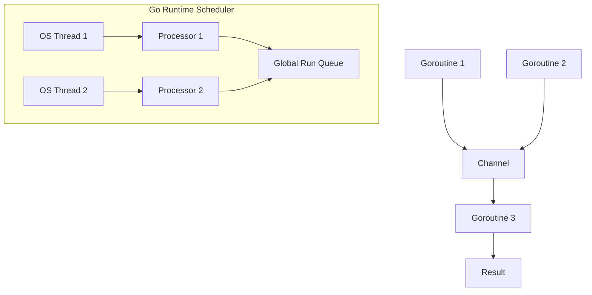

# Go (Golang)

## Overview

Go is a statically typed, compiled programming language designed at Google by Robert Griesemer, Rob Pike, and Ken Thompson. It was announced in 2009 and became open source in 2012. Go combines the performance and safety of compiled languages with the simplicity and readability of interpreted languages.

## Why Go Matters for Interviews

- **Backend dominance**: Docker, Kubernetes, Terraform, etcd, Prometheus — all written in Go
- **Concurrency model**: Goroutines and channels are frequently asked about
- **Growing adoption**: Uber, Twitch, Dropbox, Cloudflare, and many startups use Go
- **Systems programming**: Increasingly used for infrastructure and cloud-native tools

## Key Design Principles

| Principle | Description |
|-----------|-------------|
| **Simplicity** | Explicit over implicit, no magic |
| **Composition** | Interfaces + structs over inheritance |
| **Concurrency** | First-class goroutines and channels |
| **Fast compilation** | Designed for quick builds |
| **Garbage collected** | Automatic memory management |
| **Static linking** | Single binary deployment |

## Go at a Glance

| Feature | Go |
|---------|-----|
| **Type system** | Static, structural typing |
| **Generics** | Yes (Go 1.18+) |
| **Error handling** | Explicit error values |
| **Concurrency** | Goroutines + channels |
| **Memory management** | GC (low-latency) |
| **Compilation** | Fast, static binary |
| **Package management** | Go modules |

## Language Features

### Type System

```go
// Basic types
var i int = 42
var f float64 = 3.14
var b bool = true
var s string = "hello"

// Composite types
arr := [5]int{1, 2, 3, 4, 5}      // Fixed-size array
slice := []int{1, 2, 3}            // Dynamic slice
m := map[string]int{"a": 1, "b": 2} // Hash map

// Struct
type Person struct {
    Name string
    Age  int
}
```

### Interfaces (Structural Typing)

```go
type Writer interface {
    Write([]byte) (int, error)
}

// Any type with a Write method satisfies Writer
// No explicit "implements" declaration needed
type File struct { /* ... */ }
func (f *File) Write(data []byte) (int, error) {
    // implementation
    return len(data), nil
}
```

### Error Handling

```go
func divide(a, b float64) (float64, error) {
    if b == 0 {
        return 0, fmt.Errorf("division by zero")
    }
    return a / b, nil
}

result, err := divide(10, 0)
if err != nil {
    log.Fatal(err)
}
```

## Concurrency Model



### Goroutines

```go
// Lightweight threads (~2KB stack, grows dynamically)
go func() {
    fmt.Println("Running in goroutine")
}()

// WaitGroup for synchronization
var wg sync.WaitGroup
wg.Add(2)
go func() { defer wg.Done(); task1() }()
go func() { defer wg.Done(); task2() }()
wg.Wait()
```

### Channels

```go
// Unbuffered channel (synchronous)
ch := make(chan int)

// Buffered channel (asynchronous up to capacity)
bch := make(chan int, 10)

// Channel operations
ch <- 42    // Send
v := <-ch   // Receive

// Select statement (multiplexing)
select {
case msg := <-ch1:
    fmt.Println("From ch1:", msg)
case msg := <-ch2:
    fmt.Println("From ch2:", msg)
case <-time.After(time.Second):
    fmt.Println("Timeout")
}
```

## Interview Focus Areas

1. **Goroutine scheduling** — GMP model (Goroutine, Machine, Processor)
2. **Channel semantics** — Buffered vs unbuffered, nil channels, closed channels
3. **Interface satisfaction** — Implicit implementation, empty interface, type assertions
4. **Error handling** — Error wrapping, sentinel errors, custom error types
5. **Memory model** — Happens-before, sync package, atomic operations
6. **Generics** — Type parameters, constraints, type inference (Go 1.18+)
7. **Context** — Cancellation, timeouts, value propagation
8. **Race detection** — `go test -race`, race detector原理

## Related Topics

- [Concurrency](../../concurrency/) — General concurrency concepts
- [Operating Systems - Threads](../../os/threads/) — Underlying thread model
- [Backend Engineering](../../backend/) — Go in backend systems
- [System Design](../../interview/system-design/) — Go-based system design
