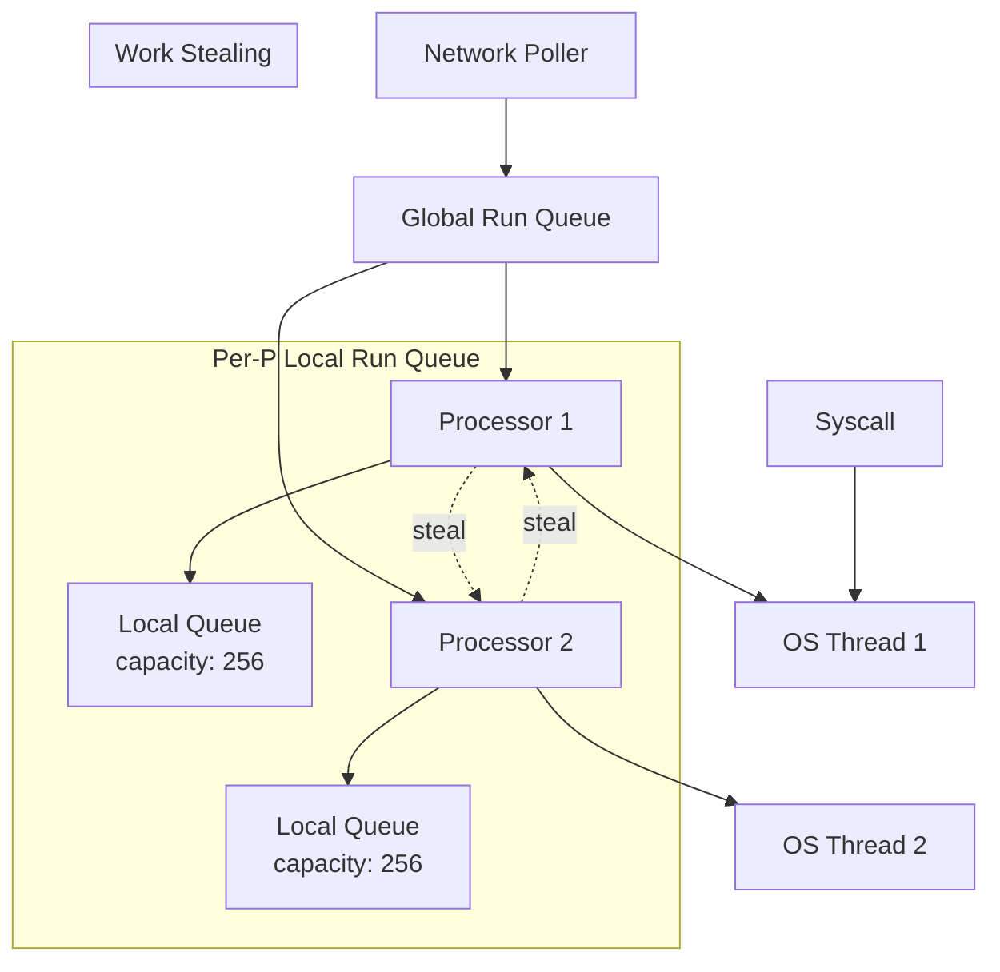
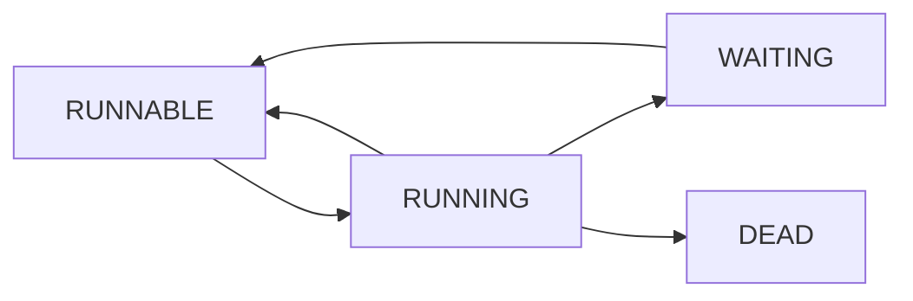
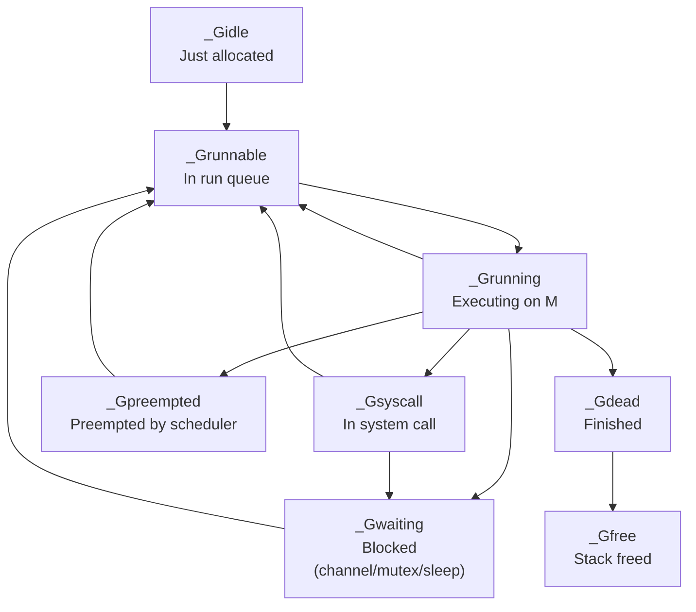
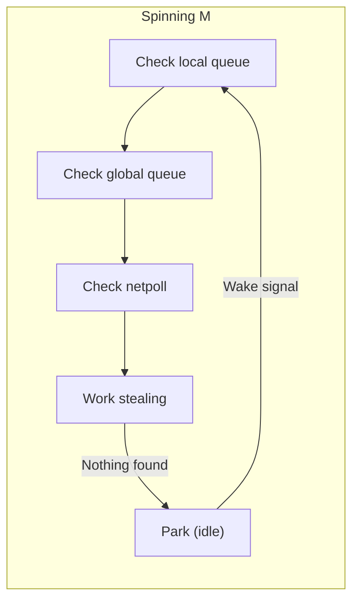
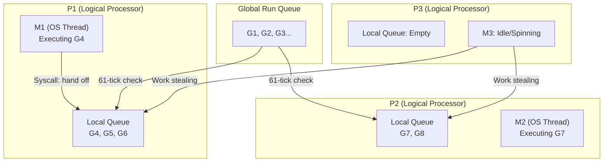

# Go Scheduler (GMP Model)

## Overview

Go's scheduler is the heart of its concurrency model. It multiplexes potentially millions of goroutines onto a small number of OS threads using the **GMP model**: Goroutines, Machines (OS threads), and Processors (logical processors).

## GMP Components

| Component | Description | Default |
|-----------|-------------|---------|
| **G (Goroutine)** | Lightweight thread with ~2KB stack | Millions possible |
| **M (Machine)** | OS thread | 10,000 max (default) |
| **P (Processor)** | Logical processor, holds run queue | `GOMAXPROCS` (default: CPU cores) |

## Scheduler Architecture



## How Scheduling Works

### 1. Goroutine Creation

```go
go func() {
    // New goroutine (G) created
    // Added to current P's local run queue
    // If local queue full, half moved to global queue
}()
```

### 2. Scheduling Loop

Each P runs a scheduling loop:

1. **Check local queue** — Run next G from local queue
2. **Check global queue** — Steal from global queue (every 61 ticks)
3. **Check network poller** — Non-blocking I/O ready goroutines
4. **Work stealing** — Steal from other P's local queues
5. **Hand off** — If G blocks on syscall, hand off M to new P

### 3. Goroutine States



| State | Description |
|-------|-------------|
| `_Gidle` | Just allocated |
| `_Grunnable` | In run queue, ready to execute |
| `_Grunning` | Executing on an M |
| `_Gsyscall` | In system call |
| `_Gwaiting` | Blocked (channel, mutex, etc.) |
| `_Gdead` | Finished |
| `_Gcopystack` | Stack being copied |
| `_Gpreempted` | Preempted |

## Work Stealing

When a P's local queue is empty:

1. Check global queue (50% chance based on schedtick)
2. Check network poller
3. Try to steal from other P's local queues
   - Steal half of the victim's local queue
   - This ensures good load balancing

## System Calls and Scheduling

### Blocking Syscalls

```go
// File I/O, DNS lookup, etc.
data, err := os.ReadFile("large-file.txt")
// During syscall:
// 1. G enters _Gsyscall state
// 2. M is "hand off" — detaches from P
// 3. P attaches to a new or idle M
// 4. Other goroutines continue running
// 5. When syscall returns, G tries to get a P
```

### Non-blocking I/O

Go uses **netpoller** (epoll/kqueue/IOCP) for network I/O:

```go
conn, err := net.Dial("tcp", "example.com:80")
// Network I/O is non-blocking
// G is parked, added to netpoller
// When ready, G is moved back to run queue
```

## Preemption

### Go 1.14+ Asynchronous Preemption

- **Before 1.14**: Cooperative preemption only at function calls
- **Go 1.14+**: Asynchronous preemption via OS signals (SIGURG)
- Prevents goroutines from starving others in tight loops

```go
// This used to starve other goroutines
for {
    // No function calls = no preemption point
    // Go 1.14+ can preempt here asynchronously
}
```

### Stack Growth

- Goroutines start with ~2KB stack
- Stack grows dynamically (doubled when needed)
- Stack copying during growth is transparent

## GOMAXPROCS

```go
// Set number of logical processors
runtime.GOMAXPROCS(4) // Use 4 P's

// Default: number of CPU cores
// Usually don't need to change this
```

## Goroutine Lifecycle in Detail



### Goroutine Creation Flow

1. `go func()` → runtime creates new G struct (~400 bytes)
2. G gets a stack (2KB minimum, dynamically grows)
3. G is added to current P's local run queue
4. If local queue is full (256 capacity), **half** the queue is moved to global run queue
5. The new G is placed in the local queue

```go
// Goroutine creation cost breakdown:
// 1. Allocate G struct: ~0.1μs
// 2. Allocate stack (2KB): ~0.2μs
// 3. Initialize stack: ~0.05μs
// Total: ~0.3μs (vs ~30μs for OS thread)

func main() {
    // Lightweight: creates G, adds to local queue
    go func() {
        fmt.Println("Hello from goroutine")
    }()

    // Compare: OS thread creation
    // runtime.LockOSThread()  // pin to OS thread
}
```

## The Sysmon Thread

Go runtime creates a special **system monitor** goroutine (`sysmon`) that runs independently:

| Function | Description |
|----------|-------------|
| **Preemption** | Detects goroutines running >10ms, sends SIGURG |
| **Netpoll** | Wakes up goroutines with ready network I/O |
| **Scavenging** | Returns unused memory to OS |
| **GC assist** | Triggers garbage collection when needed |
| **Retake** | Preempts Ps in syscall >1ms |

```go
// sysmon runs in a loop:
// for {
//     if retake(now) != 0 { idle = 0 }  // preempt long-running G or syscall
//     if netpollready(&list) { ... }      // wake network-ready Gs
//     if scavengelimit != 0 { ... }       // return memory to OS
//     usleep(delay)                       // sleep 10μs-10ms
// }
```

## Scheduling Algorithm Detail

The scheduler uses a **61-tick** rule for checking the global queue:

```go
// Every 61 scheduling ticks, check global queue first
// This prevents starvation of goroutines in the global queue

func schedule() {
    // 1. Check if current G should be preempted
    // 2. Every 61 ticks: check global run queue
    // 3. Check local run queue
    // 4. Check network poller
    // 5. Try work stealing from other Ps
    // 6. If nothing found: stop M, wait for wake
}
```

### Work Stealing Algorithm

```go
// When P's local queue is empty:
func findRunnable() {
    // 1. Check global queue (50% chance based on schedtick % 61)
    if schedtick%61 == 0 && globalQueue.size() > 0 {
        return globalQueue.pop()
    }

    // 2. Check network poller
    if gp := netpoll(0); gp != nil {
        return gp
    }

    // 3. Work stealing: try to steal from other Ps
    for i := 0; i < 4; i++ {  // Try 4 times
        p := allPs[randomIndex]
        if p != myP && p.localQueue.size() > 0 {
            // Steal half of victim's queue
            stolen := p.localQueue.stealHalf()
            return stolen[0]
        }
    }

    // 4. Nothing found: park M, wait for wake
    stopm()
}
```

## Spinning Threads

The Go scheduler maintains **spinning Ms** (threads actively looking for work) to reduce latency:

| State | Description |
|-------|-------------|
| **Spinning M** | Thread spinning in scheduler loop, looking for G |
| **Idle M** | Thread parked (futex/semaphore), waiting to be woken |

- **Max spinning Ms**: 2 × GOMAXPROCS (or minimum 2)
- When a new G is created, if no spinning M exists, wake an idle M
- When a spinning M finds no work for >1ms, it parks (becomes idle)



## GMP Interaction Diagram



## Common Interview Questions

### Q: How many goroutines can you create?

**A:** Millions. Each goroutine starts with ~2KB stack (vs 1-8MB for OS threads). The limit is memory. A machine with 8GB RAM could theoretically run millions of goroutines.

### Q: What happens when a goroutine blocks?

**A:** The goroutine is parked (`_Gwaiting`). If it's blocking on a syscall, the M is hand off — the P attaches to a new M so other goroutines can continue. If it's blocking on a channel/mutex, only the G is parked.

### Q: Goroutines vs OS threads?

| Aspect | Goroutines | OS Threads |
|--------|-----------|------------|
| **Stack size** | ~2KB (dynamic) | 1-8MB (fixed) |
| **Creation cost** | ~0.3μs | ~30μs |
| **Context switch** | ~0.2μs | ~1-2μs |
| **Scheduling** | User-space (Go runtime) | Kernel |
| **Max count** | Millions | Thousands |

### Q: How does work stealing improve performance?

**A:** When a P runs out of goroutines, it "steals" half from another P's queue. This provides automatic load balancing without a central coordinator. It's more efficient than a single global queue because it reduces contention.

### Q: What is the network poller?

**A:** Go's runtime uses epoll (Linux), kqueue (macOS/BSD), or IOCP (Windows) to handle network I/O asynchronously. When a goroutine does network I/O, it's parked and registered with the netpoller. When the I/O is ready, the goroutine is moved back to a run queue.

## References

- [Scheduling in Go — Ardan Labs](https://www.ardanlabs.com/blog/2018/08/scheduling-in-go-part2.html)
- [Go Scheduler Source Code](https://github.com/golang/go/blob/master/src/runtime/proc.go)
- [Go Blog — Concurrency is not Parallelism](https://go.dev/blog/waza-talk)
- [GMP Model — Kavya Joshi](https://www.youtube.com/watch?v=YHRO5WQGh0k)

## Related Topics

- [Go Channels](./channels.md) — Communication between goroutines
- [Go Memory Model](./memory-model.md) — Happens-before relationships
- [OS Threads](../../os/threads/) — Underlying thread concepts
- [Concurrency](../../concurrency/) — General concurrency patterns
