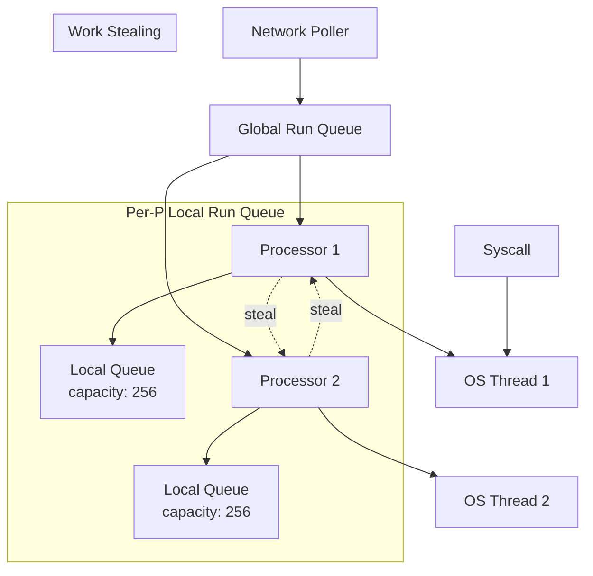
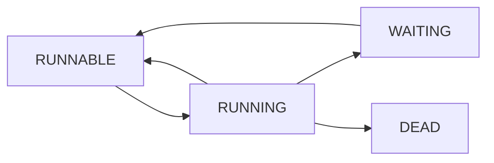

# Go Scheduler (GMP Model)

## Overview

Go's scheduler is the heart of its concurrency model. It multiplexes potentially millions of goroutines onto a small number of OS threads using the **GMP model**: Goroutines, Machines (OS threads), and Processors (logical processors).

## GMP Components

| Component | Description | Default |
|-----------|-------------|---------|
| **G (Goroutine)** | Lightweight thread with ~2KB stack | Millions possible |
| **M (Machine)** | OS thread | 10,000 max (default) |
| **P (Processor)** | Logical processor, holds run queue | `GOMAXPROCS` (default: CPU cores) |

## Scheduler Architecture



## How Scheduling Works

### 1. Goroutine Creation

```go
go func() {
    // New goroutine (G) created
    // Added to current P's local run queue
    // If local queue full, half moved to global queue
}()
```

### 2. Scheduling Loop

Each P runs a scheduling loop:

1. **Check local queue** — Run next G from local queue
2. **Check global queue** — Steal from global queue (every 61 ticks)
3. **Check network poller** — Non-blocking I/O ready goroutines
4. **Work stealing** — Steal from other P's local queues
5. **Hand off** — If G blocks on syscall, hand off M to new P

### 3. Goroutine States



| State | Description |
|-------|-------------|
| `_Gidle` | Just allocated |
| `_Grunnable` | In run queue, ready to execute |
| `_Grunning` | Executing on an M |
| `_Gsyscall` | In system call |
| `_Gwaiting` | Blocked (channel, mutex, etc.) |
| `_Gdead` | Finished |
| `_Gcopystack` | Stack being copied |
| `_Gpreempted` | Preempted |

## Work Stealing

When a P's local queue is empty:

1. Check global queue (50% chance based on schedtick)
2. Check network poller
3. Try to steal from other P's local queues
   - Steal half of the victim's local queue
   - This ensures good load balancing

## System Calls and Scheduling

### Blocking Syscalls

```go
// File I/O, DNS lookup, etc.
data, err := os.ReadFile("large-file.txt")
// During syscall:
// 1. G enters _Gsyscall state
// 2. M is "hand off" — detaches from P
// 3. P attaches to a new or idle M
// 4. Other goroutines continue running
// 5. When syscall returns, G tries to get a P
```

### Non-blocking I/O

Go uses **netpoller** (epoll/kqueue/IOCP) for network I/O:

```go
conn, err := net.Dial("tcp", "example.com:80")
// Network I/O is non-blocking
// G is parked, added to netpoller
// When ready, G is moved back to run queue
```

## Preemption

### Go 1.14+ Asynchronous Preemption

- **Before 1.14**: Cooperative preemption only at function calls
- **Go 1.14+**: Asynchronous preemption via OS signals (SIGURG)
- Prevents goroutines from starving others in tight loops

```go
// This used to starve other goroutines
for {
    // No function calls = no preemption point
    // Go 1.14+ can preempt here asynchronously
}
```

### Stack Growth

- Goroutines start with ~2KB stack
- Stack grows dynamically (doubled when needed)
- Stack copying during growth is transparent

## GOMAXPROCS

```go
// Set number of logical processors
runtime.GOMAXPROCS(4) // Use 4 P's

// Default: number of CPU cores
// Usually don't need to change this
```

## Common Interview Questions

### Q: How many goroutines can you create?

**A:** Millions. Each goroutine starts with ~2KB stack (vs 1-8MB for OS threads). The limit is memory. A machine with 8GB RAM could theoretically run millions of goroutines.

### Q: What happens when a goroutine blocks?

**A:** The goroutine is parked (`_Gwaiting`). If it's blocking on a syscall, the M is hand off — the P attaches to a new M so other goroutines can continue. If it's blocking on a channel/mutex, only the G is parked.

### Q: Goroutines vs OS threads?

| Aspect | Goroutines | OS Threads |
|--------|-----------|------------|
| **Stack size** | ~2KB (dynamic) | 1-8MB (fixed) |
| **Creation cost** | ~0.3μs | ~30μs |
| **Context switch** | ~0.2μs | ~1-2μs |
| **Scheduling** | User-space (Go runtime) | Kernel |
| **Max count** | Millions | Thousands |

### Q: How does work stealing improve performance?

**A:** When a P runs out of goroutines, it "steals" half from another P's queue. This provides automatic load balancing without a central coordinator. It's more efficient than a single global queue because it reduces contention.

### Q: What is the network poller?

**A:** Go's runtime uses epoll (Linux), kqueue (macOS/BSD), or IOCP (Windows) to handle network I/O asynchronously. When a goroutine does network I/O, it's parked and registered with the netpoller. When the I/O is ready, the goroutine is moved back to a run queue.

## Related Topics

- [Go Channels](./channels.md) — Communication between goroutines
- [Go Memory Model](./memory-model.md) — Happens-before relationships
- [OS Threads](../../os/threads/) — Underlying thread concepts
- [Concurrency](../../concurrency/) — General concurrency patterns
