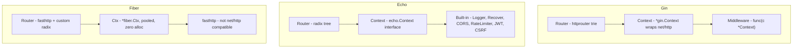
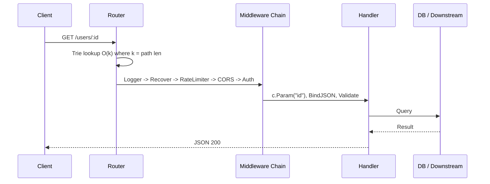
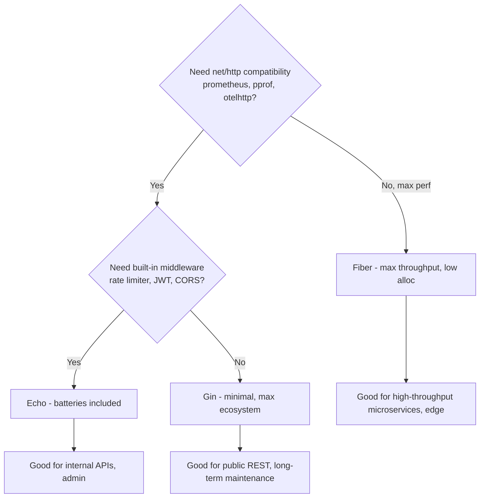

# Go Web Frameworks — Gin, Echo, Fiber

## Overview

Go's `net/http` is production-ready and many teams ship with it alone. However, at scale you repeat routing, middleware, validation, and error handling. Three frameworks dominate production Go:

- **Gin** — most stars, minimalist, `httprouter`-based, extensive middleware ecosystem
- **Echo** — feature-rich, built-in middleware, HTTP/2, data binding/validation
- **Fiber** — Express.js-inspired, `fasthttp` based, aggressive zero-allocation optimizations, fastest raw throughput

Choosing affects **latency P99, allocations, compatibility, and team onboarding**. This page provides a production decision guide, not just synthetic benchmarks.

> Cross-refs: [Go Overview](./README.md), [Scheduler (GMP)](./scheduler.md), [Channels](./channels.md), [Memory Model](./memory-model.md), [REST](../../backend/api/rest.md), [gRPC](../../backend/api/grpc.md), [API Gateway](../../backend/api/api-gateway.md), [Connection Pools](../../backend/api/connection-pools.md)

## Architecture Philosophy



| Aspect | Gin | Echo | Fiber |
|--------|-----|------|-------|
| Since | 2014 | 2015 | 2019 |
| Router | httprouter (radix) | own radix + custom | fasthttp + radix |
| Base HTTP | `net/http` ✅ compatible | `net/http` ✅ | `fasthttp` ❌ not compatible |
| Context | `*gin.Context` (struct) | `echo.Context` (interface) | `*fiber.Ctx` (pooled) |
| Style | Minimal, unopinionated | Batteries included | Express.js API |
| Middleware | Community huge | Built-in + community | Built-in + limited |
| Learning | Low | Low-Medium | Low if JS, Medium if Go |
| Binary size | ~15 MB | ~12 MB | ~11 MB |

**Compatibility is critical**: Gin/Echo use `net/http`, so `http.Handler`, `middleware`, `pprof`, `prometheus` client, `httptrace` work directly. Fiber uses `fasthttp`, which is faster but incompatible with `net/http` middleware — you need Fiber-specific adapters. This is the most common regret in production.

## Request Lifecycle Comparison



Difference in allocation:

- **Gin**: 3-4 allocs/req (Context, Params slice, slice for handlers)
- **Echo**: 2-3 allocs/req (Context pooling optional)
- **Fiber**: 0-1 alloc/req (Ctx and strings pooled via `sync.Pool`)

## Performance — Real Production, Not Hello World

Synthetic `wrk 12 threads 400 conns 30s /hello` often quoted:

| Framework | Req/sec | Avg Lat | P99 | Peak Mem | Baseline |
|-----------|---------|---------|-----|----------|----------|
| Fiber | ~89k | 4.5 ms | 12.3 ms | 45 MB | 12 MB |
| Gin | ~76k | 5.2 ms | 15.7 ms | 67 MB | 18 MB |
| Echo | ~72k | 5.5 ms | 18.2 ms | 72 MB | 22 MB |
| net/http std | ~63k | 6.3 ms | 20 ms | 55 MB | 15 MB |

Source: production benchmarks on 8-core VM, Go 1.22, no DB. [dev.to production comparison]. Once PostgreSQL query added (realistic), differences collapse:

| With PG query | Req/sec | Avg Lat | CPU |
|---------------|---------|---------|-----|
| Fiber | 3247 | 123 ms | 45% |
| Gin | 3156 | 127 ms | 47% |
| Echo | 3089 | 129 ms | 48% |

**Takeaway**: If I/O bound (DB, API calls, JSON), framework choice <5% impact. If CPU bound (JSON marshaling, templating, auth), Fiber's pooling wins ~15%. GC impact: Fiber 40% fewer GC cycles due to pooling, better P95/P99 consistency.

## Code Comparison — Same Endpoint

```go
// Gin
package main
import "github.com/gin-gonic/gin"
func main() {
    r := gin.Default() // Logger + Recover
    r.Use(func(c *gin.Context){ /* rate limit */; c.Next() })
    r.GET("/users/:id", func(c *gin.Context){
        id := c.Param("id")
        var body struct{ Name string `json:"name" binding:"required"` }
        if err := c.ShouldBindJSON(&body); err != nil { c.JSON(400, gin.H{"err": err.Error()}); return }
        c.JSON(200, gin.H{"id": id, "name": body.Name})
    })
    r.Run(":8080")
}

// Echo
package main
import (
  "github.com/labstack/echo/v4"
  "github.com/labstack/echo/v4/middleware"
)
func main() {
    e := echo.New()
    e.Use(middleware.Logger(), middleware.Recover(), middleware.RateLimiter(middleware.NewRateLimiterMemoryStore(20)))
    e.GET("/users/:id", func(c echo.Context) error {
        id := c.Param("id")
        var body struct{ Name string `json:"name" validate:"required"` }
        if err := c.Bind(&body); err != nil { return c.JSON(400, err) }
        if err := c.Validate(&body); err != nil { return c.JSON(400, err) }
        return c.JSON(200, map[string]string{"id": id, "name": body.Name})
    })
    e.Logger.Fatal(e.Start(":8080"))
}

// Fiber
package main
import "github.com/gofiber/fiber/v2"
func main() {
    app := fiber.New(fiber.Config{ Prefork: false }) // pooled
    app.Get("/users/:id", func(c *fiber.Ctx) error {
        id := c.Params("id")
        var body struct{ Name string `json:"name"` }
        if err := c.BodyParser(&body); err != nil { return c.Status(400).JSON(fiber.Map{"err": err.Error()}) }
        if body.Name == "" { return c.Status(400).JSON(fiber.Map{"err": "name required"}) }
        return c.JSON(fiber.Map{"id": id, "name": body.Name})
    })
    app.Listen(":8080")
}
```

## Middleware & Ecosystem

**Gin**: 1000+ community middleware — `gin-contrib/cors`, `gin-contrib/gzip`, `gin-jwt`, `gin-prometheus`. You assemble yourself.

**Echo extra built-in**: Logger, Recover, CORS, CSRF, Secure, RateLimiter (memory+redis), JWT, KeyAuth, Gzip, Decompress, BodyLimit, Timeout, RequestID, BasicAuth, MethodOverride. Centralized error handler:

```go
e.HTTPErrorHandler = func(err error, c echo.Context){
    // log + map to JSON
}
```

**Fiber built-in**: CORS, CSRF, Helmet, Limiter, Logger, Recover, Cache, Compress, ETag, Timeout, Idempotency, KeyAuth, BasicAuth, Session (memory/redis). Idempotency middleware is production-grade — useful for payments.

## Observability

```go
// Gin + prometheus (net/http compatible)
import ginprom "github.com/zsais/go-gin-prometheus"
p := ginprom.NewPrometheus("gin")
p.Use(r)

// Echo + labstack/echo-contrib/prometheus

// Fiber requires fiber-specific: gofiber/contrib/fiberprometheus
// fasthttp incompatible with net/http/pprof — use fiber's pprof adaptation
```

For OpenTelemetry:

- Gin/Echo: `go.opentelemetry.io/contrib/instrumentation/net/http/otelhttp` wraps handler directly
- Fiber: need `gofiber/contrib/otelfiber` which bridges fasthttp -> otel, less mature

## Deployment

```dockerfile
# Multi-stage - same for all, but Fiber binary slightly smaller
FROM golang:1.22-alpine AS builder
WORKDIR /app
COPY go.mod go.sum ./
RUN go mod download
COPY . .
RUN CGO_ENABLED=0 go build -o /app/server

FROM gcr.io/distroless/static
COPY --from=builder /app/server /server
EXPOSE 8080
ENTRYPOINT ["/server"]
```

Kubernetes advice:

- Fast startup: all Go frameworks ~50ms vs JVM 5s — good for HPA
- Memory: Fiber 45 MB peak allows higher pod density (e.g., 100 pods/node vs 70 for Gin)
- Compatibility: If you use Istio/Envoy sidecar, Gin/Echo work with `net/http` `Transport` that respects proxy env; Fiber's fasthttp needs custom dialer

## Decision Framework



**Choose Gin if**: public API, long-lived service, team knows `net/http`, need maximum library compatibility, hiring ease (most common in job descriptions).

**Choose Echo if**: internal platform, need built-in RateLimiter + JWT + HTTP/2 server push, want centralized error handling without assembling community middleware.

**Choose Fiber if**: CPU-bound JSON API, IoT ingestion, ad-tech bidding (microseconds matter), team from Node.js background, and you accept fasthttp trade-offs (no `http2.Server`, no `net/http` middleware).

**Avoid Fiber if**: you need `http.Hijacker`, WebSocket via `gorilla/websocket` (needs net/http), HTTP/2 server push, or streaming `io.Pipe`.

## Production Pitfalls

- **Fiber's fasthttp request smuggling**: fasthttp lazy header parsing historically had edge-case issues — ensure version >= 2024.
- **Gin's `c.JSON` vs `c.ShouldBindJSON`**: default binding uses `json.Decoder.UseNumber` off — large ints may lose precision. Use `json.Number` or custom binder.
- **Echo's `Bind` auto-registers validator**: if you forget `e.Validator = validator.New()`, `c.Validate` nil panics.
- **Context leak**: Gin/Echo `Context` is per-request; don't pass `c` to goroutine after handler returns. Clone data: `id := c.Param("id"); go func(id string){...}(id)`.
- **Rate limiting**: All three built-in limiters are in-memory by default — doesn't work across replicas. Use Redis store: `middleware.NewRateLimiterMemoryStore` vs Redis.

## Interview Questions

**Q: Gin vs Echo vs Fiber — which is fastest?**
Raw hello-world: Fiber (~89k rps) > Gin (~76k) > Echo (~72k). With DB, difference <5% (3.2k vs 3.1k). So for I/O bound APIs, framework overhead is noise; pick for ecosystem, not benchmark.

**Q: Why is Fiber faster but riskier?**
Fiber uses `fasthttp` which pools request/response objects, zero-copy string -> byte conversion, radix tree optimized for 0 alloc. Trade-off: not `net/http` compatible, so `http.Handler`, `prometheus`, `pprof`, OpenTelemetry `net/http` instrumentation need adapters, and some HTTP semantics (trailers, HTTP/2) not supported.

**Q: How does Gin achieve high performance with net/http compatibility?**
Gin uses `httprouter` radix tree with `sync.Pool` for `Context`. Handler signature `func(*gin.Context)` wraps `ResponseWriter` and `Request` without copying. It keeps `net/http` as transport so all standard library features work.

**Q: How would you add distributed rate limiting?**
Use Redis-backed limiter: Echo `middleware.RateLimiter(middleware.NewRateLimiterMemoryStore` replaced with Redis store or use `go-redis/redis_rate`. In Gin, `gin-contrib` + `ulule/limiter`. In Fiber, `fiber/middleware/limiter` with `Storage: redis`. Ensure key = user ID/IP + route, window = sliding, and return 429 with `Retry-After`.

**Q: How to stream large response without buffering?**
Gin/Echo: `c.Stream` or `c.DataFromReader` with `Flusher`. Fiber: `c.SendStream` with `io.Reader`. fasthttp streaming limited vs net/http's `http.Flusher` and `http.Pusher`.

## Cross-References

- [Go Overview](./README.md) — scheduler, memory model
- [REST](../../backend/api/rest.md) — REST principles
- [gRPC](../../backend/api/grpc.md) — alternative for internal APIs
- [API Gateway](../../backend/api/api-gateway.md) — rate limiting at edge
- [Connection Pools](../../backend/api/connection-pools.md) — DB pooling with sql.DB
- [Docker](../../backend/containers/docker.md) / [Kubernetes](../../backend/containers/kubernetes.md) — deployment

## References

- Gin Web Framework — Official Docs: https://gin-gonic.com/docs/ [gin-gonic.com]
- Echo Framework — Official Guide & Middleware: https://echo.labstack.com/docs [labstack.com]
- Fiber Framework — Docs & Benchmarks: https://docs.gofiber.io/ [gofiber.io]
- Go Web Frameworks in Production: Gin vs Echo vs Fiber Performance Comparison (2026) — real production wrk benchmarks, memory, GC impact [dev.to/matthiasbruns][Matthias Bruns Blog]
- Go Web Frameworks Performance (lampesm) — Repo with chi/iris/gin/echo/fiber/net/http benchmarks [GitHub]
- Encore — Go Framework Comparison: When to Choose net/http vs Gin/Echo/Fiber [encore.dev]
