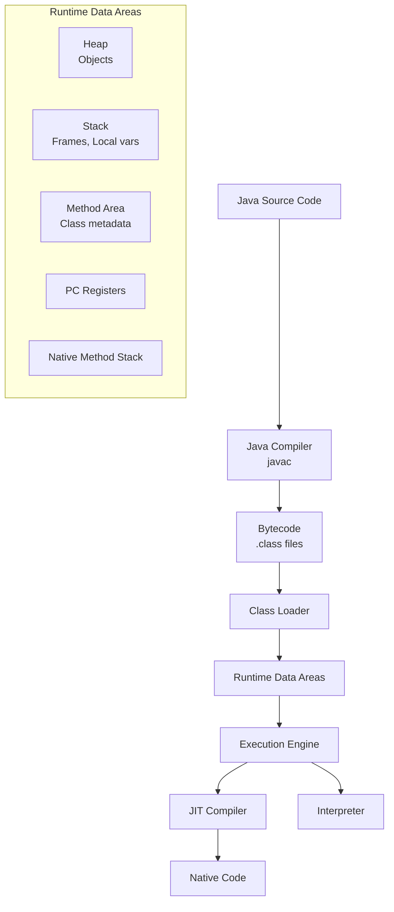
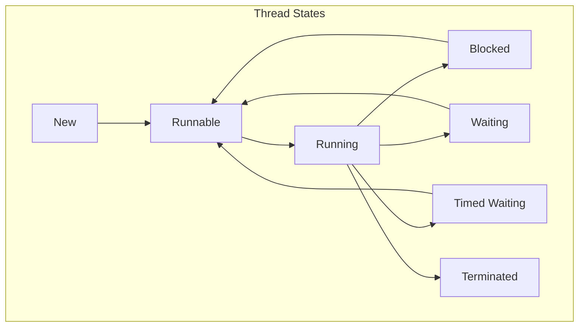
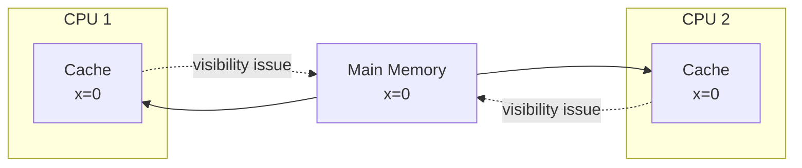
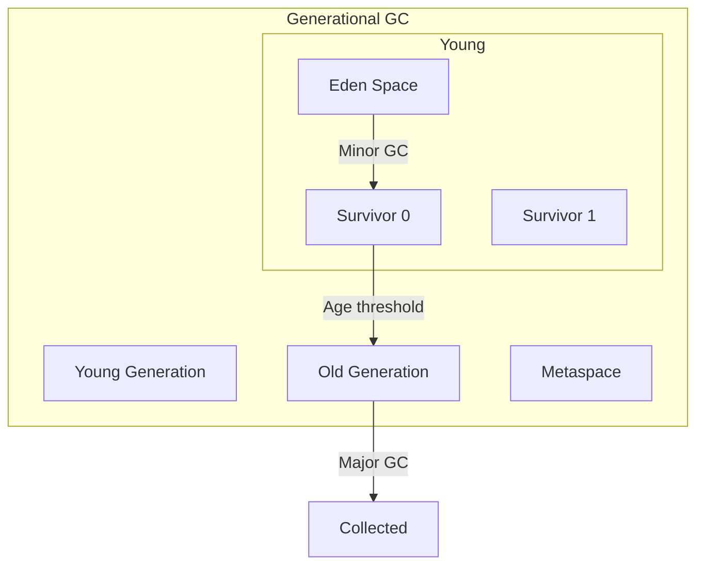

# Java

## Overview

Java is a class-based, object-oriented programming language designed to have few implementation dependencies. Created by James Gosling at Sun Microsystems (now Oracle) and released in 1995, Java's "write once, run anywhere" philosophy has made it one of the most widely used programming languages.

## Why Java Matters for Interviews

- **Enterprise dominance**: Banking, insurance, large-scale systems
- **JVM ecosystem**: Kotlin, Scala, Clojure all run on JVM
- **Spring Framework**: De facto standard for enterprise Java
- **Performance**: JIT compilation, mature GC, optimized runtime
- **Android**: Primary language for Android development (historically)

## Key Features

| Feature | Description |
|---------|-------------|
| **Platform independent** | JVM bytecode runs on any platform |
| **Object-oriented** | Everything is an object (except primitives) |
| **Strongly typed** | Type safety at compile time |
| **Garbage collected** | Automatic memory management |
| **Multi-threaded** | Built-in thread support |
| **Rich ecosystem** | Maven, Gradle, Spring, Hibernate |

## Java at a Glance

| Feature | Java |
|---------|------|
| **Type system** | Static, nominal |
| **Generics** | Yes (type erasure) |
| **Error handling** | Exceptions (checked + unchecked) |
| **Concurrency** | Threads, locks, java.util.concurrent |
| **Memory management** | GC (generational) |
| **Latest LTS** | Java 25 (2025) |

## JVM Architecture



## Language Fundamentals

### Type System

```java
// Primitives (8 types)
int i = 42;
long l = 42L;
float f = 3.14f;
double d = 3.14;
boolean b = true;
char c = 'A';
byte bt = 127;
short s = 32767;

// Wrapper classes (autoboxing)
Integer boxed = 42;        // int → Integer
int unboxed = boxed;       // Integer → int

// Strings (immutable)
String s1 = "hello";
String s2 = new String("hello");
StringBuilder sb = new StringBuilder(); // Mutable
```

### OOP Concepts

```java
// Inheritance
class Animal {
    protected String name;
    public void speak() { System.out.println("..."); }
}

class Dog extends Animal {
    @Override
    public void speak() { System.out.println("Woof!"); }
}

// Interfaces (default methods in Java 8+)
interface Swimmable {
    default void swim() { System.out.println("Swimming"); }
}

// Abstract classes
abstract class Shape {
    abstract double area();
    double perimeter() { return 0; } // Concrete method
}
```

### Generics (Type Erasure)

```java
// Generic class
public class Box<T> {
    private T value;
    public void set(T value) { this.value = value; }
    public T get() { return value; }
}

// Bounded type parameters
public <T extends Comparable<T>> T max(T a, T b) {
    return a.compareTo(b) >= 0 ? a : b;
}

// Wildcards
List<? extends Number> nums; // Upper bounded (read)
List<? super Integer> ints;  // Lower bounded (write)
```

## Concurrency



### Thread Creation

```java
// Method 1: Extend Thread
class MyThread extends Thread {
    public void run() { /* ... */ }
}
new MyThread().start();

// Method 2: Implement Runnable
new Thread(() -> System.out.println("Hello")).start();

// Method 3: ExecutorService
ExecutorService executor = Executors.newFixedThreadPool(4);
Future<String> future = executor.submit(() -> "result");
executor.shutdown();
```

### Synchronization

```java
// synchronized keyword
public class Counter {
    private int count = 0;
    
    public synchronized void increment() { count++; }
    
    public void decrement() {
        synchronized (this) { count--; }
    }
}

// java.util.concurrent
ReentrantLock lock = new ReentrantLock();
lock.lock();
try { /* ... */ } finally { lock.unlock(); }

ReadWriteLock rwLock = new ReentrantReadWriteLock();
Semaphore sem = new Semaphore(5);
CountDownLatch latch = new CountDownLatch(3);
CyclicBarrier barrier = new CyclicBarrier(4);
```

### Java Memory Model



- **volatile**: Guarantees visibility and ordering
- **happens-before**: Defined by JMM for synchronization
- **final**: Safe publication of immutable objects

## Garbage Collection



| Collector | Use Case | Trade-off |
|-----------|----------|-----------|
| **Serial** | Small apps, single core | Stop-the-world |
| **Parallel** | Throughput-focused | Longer pauses |
| **G1** | General purpose (default) | Balanced |
| **ZGC** | Ultra-low latency (<1ms) | More CPU |
| **Shenandoah** | Low latency | More CPU |

## Modern Java (8+)

### Lambda Expressions

```java
// Functional interface
@FunctionalInterface
interface Processor<T, R> {
    R process(T input);
}

// Lambda
Processor<String, Integer> len = s -> s.length();

// Method reference
Processor<String, Integer> len2 = String::length;
```

### Streams API

```java
List<String> names = List.of("Alice", "Bob", "Charlie", "David");

List<String> result = names.stream()
    .filter(n -> n.length() > 3)
    .map(String::toUpperCase)
    .sorted()
    .collect(Collectors.toList());

// Parallel stream
long count = names.parallelStream()
    .filter(n -> n.startsWith("A"))
    .count();
```

### Records (Java 16+)

```java
// Immutable data carrier
public record Point(int x, int y) {}

Point p = new Point(1, 2);
p.x(); // 1
p.y(); // 2
```

### Sealed Classes (Java 17+)

```java
public sealed class Shape permits Circle, Rectangle, Triangle {}
public final class Circle extends Shape { /* ... */ }
public final class Rectangle extends Shape { /* ... */ }
public non-sealed class Triangle extends Shape { /* ... */ }
```

## Interview Focus Areas

1. **JVM internals** — Class loading, bytecode, JIT compilation
2. **GC algorithms** — Generational GC, G1, ZGC, tuning
3. **Concurrency** — java.util.concurrent, JMM, volatile, happens-before
4. **Generics** — Type erasure, wildcards, bounded types
5. **Collections** — HashMap internals, ConcurrentHashMap, ArrayList vs LinkedList
6. **Memory model** — Heap vs stack, escape analysis, string pool
7. **Spring Framework** — DI, AOP, transaction management
8. **Modern Java** — Lambdas, streams, records, sealed classes

## Related Topics

- [JVM Internals](./jvm.md) — Detailed JVM architecture
- [GC Algorithms](./gc.md) — Garbage collection deep dive
- [Concurrency](../../concurrency/) — General concurrency concepts
- [Spring Boot](../../frameworks/spring-boot/) — Enterprise Java framework
- [System Design](../../interview/system-design/) — Java-based system design
