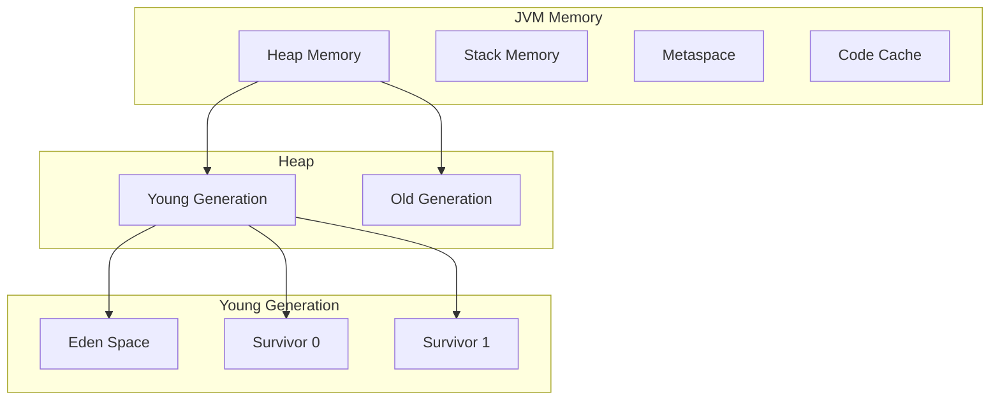
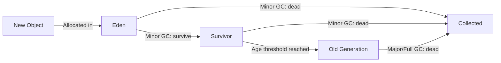
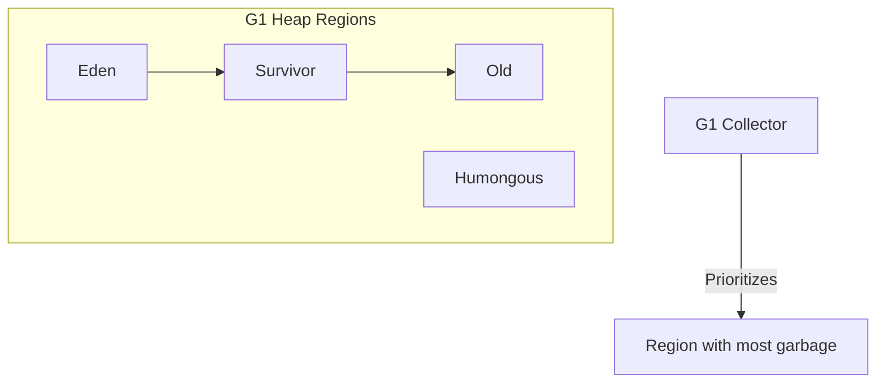
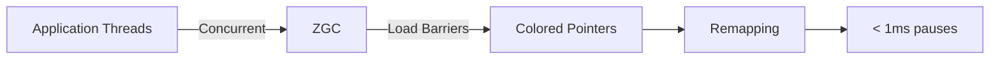
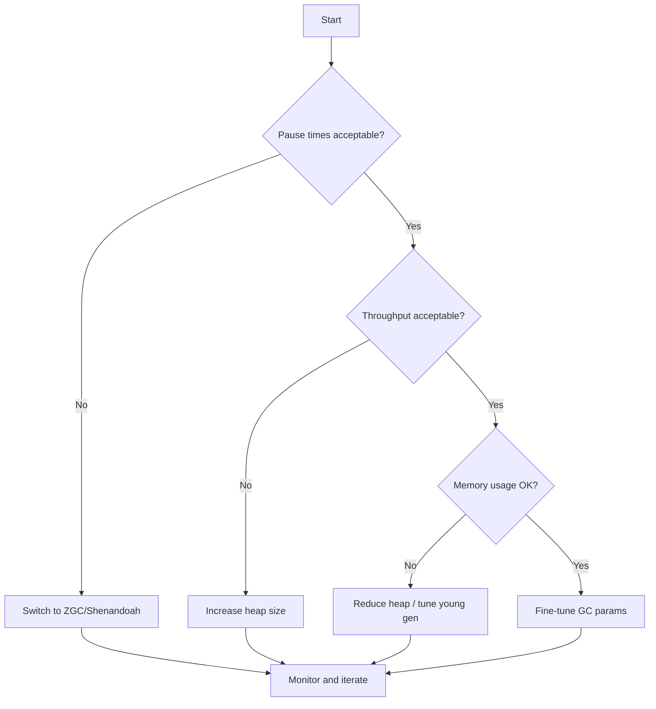

# Java Garbage Collection

## Overview

Garbage Collection (GC) is the automatic memory management process in the JVM that reclaims memory occupied by objects that are no longer reachable by the application. Understanding GC is critical for building high-performance Java applications and is a favorite interview topic.

## Why GC Matters

- **Prevents memory leaks** — unreachable objects are automatically freed
- **Eliminates dangling pointers** — no manual `free()` or `delete`
- **Tuning is essential** — wrong GC settings can cause latency spikes, OOMs, or wasted resources
- **Interview favorite** — every senior Java role asks about GC

## Java Memory Model



| Area | Purpose | GC Behavior |
|------|---------|-------------|
| **Eden** | New objects allocated here | Minor GC (young collection) |
| **Survivor (S0/S1)** | Objects that survived at least one GC | Objects age here before promotion |
| **Old (Tenured)** | Long-lived objects promoted from young gen | Major/Full GC |
| **Metaspace** | Class metadata (replaced PermGen in Java 8+) | Grown dynamically, can OOM |
| **Stack** | Method frames, local variables | Automatic (method return) |

## Generational GC Theory

The **Generational Hypothesis**: most objects die young. Based on this observation:



### Object Lifecycle

1. **Allocation** — object created in Eden
2. **Minor GC** — Eden is scanned; live objects copied to Survivor space
3. **Aging** — each subsequent Minor GC increments the object's age
4. **Promotion** — when age exceeds threshold (default ~15), object moves to Old Gen
5. **Major GC** — Old Gen is collected less frequently but is more expensive

### GC Roots

An object is **reachable** (alive) if it can be traced from a GC root:

- Local variables on the stack
- Active threads
- Static fields
- JNI references
- Monitor-locked objects (synchronized)

## Garbage Collection Algorithms

### 1. Serial GC (`-XX:+UseSerialGC`)

- Single-threaded, stop-the-world
- Best for: small heaps (< 100 MB), single-core machines
- Young: Copying collector | Old: Mark-Sweep-Compact

### 2. Parallel GC (`-XX:+UseParallelGC`)

- Multi-threaded young and old collections
- Default in Java 8
- Best for: throughput-oriented applications (batch processing)
- Young: Parallel Scavenge | Old: Parallel Old

### 3. CMS (Concurrent Mark Sweep) — Deprecated

- Low-pause concurrent collector
- Mark phases concurrent with application
- Problem: fragmentation, concurrent mode failures
- Replaced by G1 in Java 9+

### 4. G1 (Garbage-First) — Default since Java 9



**Key concepts:**

- Heap divided into **equal-sized regions** (1–32 MB each)
- Each region can be Eden, Survivor, Old, or Humongous
- Collects regions with most garbage first (hence "Garbage-First")
- **Young-only collections** + **Mixed collections** (young + some old regions)
- Target pause time: `-XX:MaxGCPauseMillis=200` (default 200ms)
- **Concurrent marking** identifies garbage in old regions

**G1 GC Phases:**

1. **Young GC** — evacuate all Eden + Survivor regions
2. **Concurrent Mark** — mark live objects in old regions concurrently
3. **Mixed GC** — evacuate young + selected old regions with high garbage ratio
4. **Full GC** — fallback when evacuation fails (avoid this!)

### 5. ZGC (Java 15+, production-ready)



**Design goals:**

- Pause times **< 1ms** (regardless of heap size)
- Support heaps from 8 MB to 16 TB
- Throughput penalty < 15% vs Parallel GC

**Key techniques:**

- **Colored pointers** — metadata stored in pointer bits (uses multi-mapping)
- **Load barriers** — intercept object references to ensure they point to correct location
- **Concurrent compaction** — relocates objects without stopping application
- **Generational ZGC** (Java 21+) — separate young/old tracking for better throughput

### 6. Shenandoah (Java 15+, production-ready)

- Similar goals to ZGC: **low pause times**
- Uses **Brooks pointers** (forwarding pointer in each object header)
- Concurrent compaction via **read/write barriers**
- **Generational Shenandoah** (Java 25+) — adds generational support
- More pause time variance than ZGC in some workloads

### Comparison Table

| Collector | Pause Time | Throughput | Heap Size | Best For |
|-----------|-----------|------------|-----------|----------|
| Serial | High | High | Small | Simple apps, embedded |
| Parallel | Medium | Highest | Medium-Large | Batch processing |
| G1 | Low-Medium | High | Medium-Large | General purpose (default) |
| ZGC | Ultra-low (<1ms) | Medium-High | Any | Latency-sensitive |
| Shenandoah | Ultra-low | Medium-High | Any | Latency-sensitive |

## GC Tuning

### Key JVM Flags

```bash
# Heap sizing
-Xms4g              # Initial heap size
-Xmx4g              # Maximum heap size (set equal to Xms to avoid resizing)
-Xmn1g              # Young generation size

# GC selection
-XX:+UseG1GC        # Use G1 (default since Java 9)
-XX:+UseZGC         # Use ZGC
-XX:+UseShenandoahGC # Use Shenandoah

# G1 tuning
-XX:MaxGCPauseMillis=200    # Target pause time
-XX:G1HeapRegionSize=16m    # Region size (1-32 MB, power of 2)
-XX:InitiatingHeapOccupancyPercent=45  # When to start concurrent mark

# Logging (Java 9+)
-Xlog:gc*:file=gc.log:time,uptime,level,tags:filecount=5,filesize=10m
```

### GC Tuning Strategy



### Reading GC Logs

Modern GC log format (Java 9+):

```
[2024-01-15T10:23:45.123+0000] GC(42) Pause Young (Normal) (G1 Evacuation Pause)
[2024-01-15T10:23:45.123+0000] GC(42)   Using 4 workers
[2024-01-15T10:23:45.145+0000] GC(42)   Eden regions: 100->0(100)
[2024-01-15T10:23:45.145+0000] GC(42)   Survivor regions: 5->10(15)
[2024-01-15T10:23:45.145+0000] GC(42)   Old regions: 50->52(200)
[2024-01-15T10:23:45.145+0000] GC(42)   Heap: 625M->310M(1024M)
[2024-01-15T10:23:45.145+0000] GC(42) Pause Young (Normal) 22.154ms
```

**What to look for:**

| Metric | Healthy | Warning | Critical |
|--------|---------|---------|----------|
| Pause time | < 100ms | 100-500ms | > 500ms |
| GC frequency | < 1/sec | 1-10/sec | > 10/sec |
| Promotion rate | Stable | Growing | Full GCs |
| Old Gen usage | < 70% | 70-85% | > 85% |

### Common GC Problems

| Problem | Symptom | Solution |
|---------|---------|----------|
| **Too frequent GC** | High CPU in GC | Increase heap, reduce allocation rate |
| **Long pauses** | App freezes | Switch to ZGC/Shenandoah |
| **Full GC storms** | Old Gen full | Fix memory leak, increase Old Gen |
| **OOM: Metaspace** | Class loader leak | Fix class loading, increase Metaspace |
| **Promotion failures** | Concurrent mode failure | Tune IHOP, increase Old Gen |

## Modern GC Best Practices (Java 21+)

1. **Start with G1** — it's the default and works well for most applications
2. **Consider ZGC** for latency-sensitive services — Generational ZGC (Java 21+) has near-G1 throughput
3. **Always set `-Xms` = `-Xmx`** — prevents heap resizing during runtime
4. **Enable GC logging** — always, even in production (minimal overhead with `-Xlog:gc*`)
5. **Monitor, don't guess** — use GC logs, JMX metrics, or tools like GCViewer
6. **Avoid Full GC** — if you see Full GCs, something is wrong

## Interview Questions

### Fundamentals

**Q: Explain the generational GC model.**

A: The heap is divided into Young Generation (Eden + two Survivor spaces) and Old Generation. New objects are allocated in Eden. During Minor GC, live objects in Eden are copied to Survivor space; dead objects are collected. Objects that survive multiple GCs are promoted to Old Generation. Old Generation is collected less frequently (Major/Full GC). This design exploits the generational hypothesis — most objects die young.

**Q: What are GC roots?**

A: GC roots are the starting points for reachability analysis. They include: local variables on the stack, active thread references, static fields, JNI references, and synchronized objects. The GC traces all references from these roots to determine which objects are reachable. Unreachable objects are candidates for collection.

**Q: What's the difference between Minor, Major, and Full GC?**

A: Minor GC collects only Young Generation — fast, frequent. Major GC collects Old Generation — slower, less frequent. Full GC collects the entire heap (Young + Old + Metaspace) — most expensive, usually a fallback when other collections can't free enough space.

### G1 GC

**Q: How does G1 differ from CMS?**

A: G1 divides the heap into equal-sized regions (not contiguous generations), collects regions with the most garbage first ("Garbage-First"), provides predictable pause times via `-XX:MaxGCPauseMillis`, and handles compaction to avoid fragmentation. CMS had fragmentation issues and unpredictable pauses.

**Q: What is a Humongous object in G1?**

A: An object larger than 50% of a region size is allocated in Humongous regions (contiguous regions). Humongous objects are expensive to collect — they're only reclaimed during concurrent marking or Full GC. Avoid Humongous allocations if possible.

### ZGC / Shenandoah

**Q: How does ZGC achieve sub-millisecond pauses?**

A: ZGC performs almost all work concurrently — marking, reference processing, relocation. It uses colored pointers (metadata in pointer bits) and load barriers to handle concurrent object relocation. The only stop-the-world pauses are for root scanning (< 1ms). The tradeoff is slightly lower throughput due to barrier overhead.

**Q: When would you choose ZGC over G1?**

A: Choose ZGC for latency-sensitive applications where pause times matter more than maximum throughput — trading systems, real-time APIs, low-latency microservices. G1 is better for throughput-oriented workloads where some pause time (100-200ms) is acceptable.

### Practical Scenarios

**Q: Your application has increasing Old Gen usage and occasional Full GCs. How do you diagnose?**

A: 1) Enable GC logging to analyze collection patterns. 2) Check if Full GCs correlate with memory leaks (Old Gen never drops below a baseline). 3) Use `jmap -histo:live` or a heap dump to identify objects consuming memory. 4) Look for growing collections (HashMap, List) that aren't being cleared. 5) Check for class loader leaks if Metaspace is growing.

**Q: What JVM flags would you set for a latency-sensitive microservice?**

A: `-Xms4g -Xmx4g -XX:+UseZGC -Xlog:gc*:file=gc.log`. Equal Xms/Xms avoids resizing. ZGC for ultra-low pauses. GC logging for monitoring. If using Java 21+, Generational ZGC is automatic. Monitor and adjust heap size based on allocation rate.

## References

- [Oracle GC Tuning Guide](https://docs.oracle.com/en/java/javase/21/gctuning/)
- [Netflix: Generational ZGC](https://netflixtechblog.com/bending-pause-times-to-your-will-with-generational-zgc-256629c9386b)
- [JVM GC Reference](https://openjdk.org/groups/hotspot/docs/HotSpotGlossary.html)
- [G1 Garbage Collector Details](https://docs.oracle.com/en/java/javase/21/gctuning/garbage-first-g1-garbage-collector.html)
- [ZGC Overview](https://openjdk.org/projects/zgc/)
- [Shenandoah GC](https://wiki.openjdk.org/display/shenandoah/Main)
