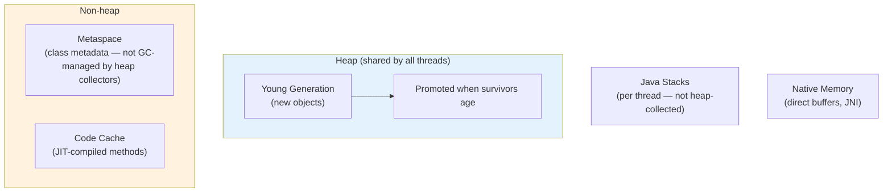
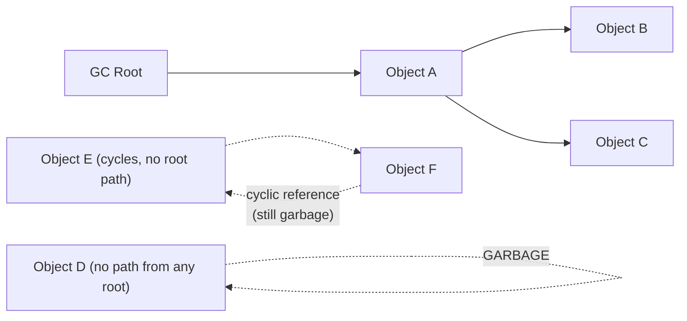
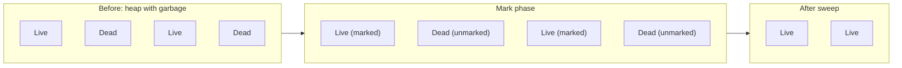
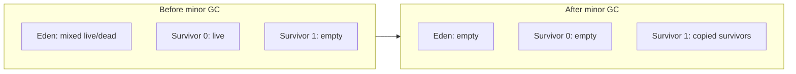
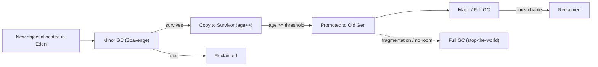
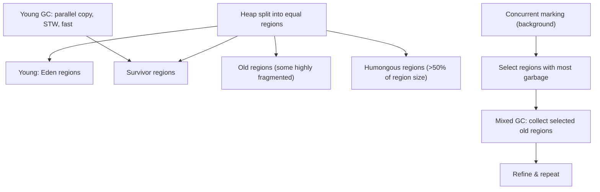
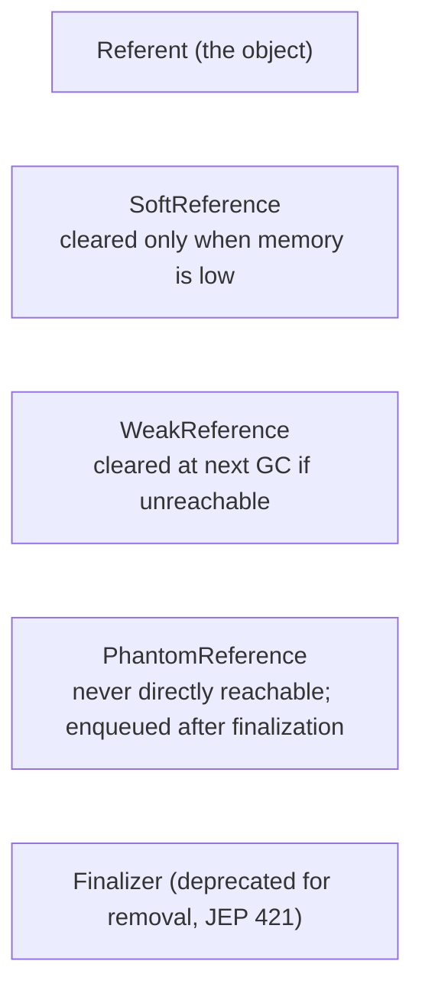

# Java Garbage Collection

## Overview

Garbage collection (GC) is the automatic reclamation of memory occupied by objects that are no longer reachable from the running program. Java delegates this to the JVM so developers never call `free()` or `delete` — at the cost of needing to understand *how* collection works to tune latency, throughput, and memory footprint.

GC is a **core interview topic** because it explains the Java memory model, why certain data structures behave the way they do, why you see `OutOfMemoryError`, and how to reason about pauses.

See [JVM Internals](./jvm.md) for the surrounding architecture (class loading, JIT, runtime data areas).

## Why Automatic Memory Management?

| Manual memory management (C/C++) | Garbage collected (Java) |
|---|---|
| Developer tracks every allocation | JVM tracks object reachability |
| `use-after-free` / `double-free` bugs possible | Impossible by construction |
| Deterministic deallocation | Pauses when collection runs |
| Programmer controls lifetime | Collector decides lifetime |

The fundamental trade-off: **automatic collection buys safety and productivity but introduces unpredictable pauses and higher memory pressure** (objects die later than in a perfectly-managed program).

## JVM Memory Areas Involved in GC



- **Young Generation** — new objects. Subdivided into one **Eden** space and two **Survivor** spaces (S0, S1).
- **Old Generation** — objects that survived several young collections (aging / tenure).
- **Metaspace** (JDK 8+, replacing PermGen) — class metadata; collected separately via class unloading, not by the heap GC.
- The **stack**, **PC registers**, and **native method stacks** are per-thread and reclaimed on thread exit.

## Reachability: What Can Be Collected?

An object is **garbage** if it is unreachable from any **GC root**. GC roots include:

1. Active threads (their stack frames and local variables)
2. Static fields of loaded classes
3. JNI references (global and local)
4. Objects held by the JNI/native runtime
5. Objects locked by monitors
6. The string table (interned strings) — treated as roots
7. Class objects (reachable while the class is loaded)



Cycles are collected: **if no path exists from a root to the objects, the whole island is garbage**, even if the objects reference each other. This is the key property that makes reference counting unsuitable for Java.

## Core Collection Algorithms

### Mark-Sweep

Two phases:

1. **Mark** — traverse the object graph from roots, marking reachable objects.
2. **Sweep** — walk the heap, reclaiming unmarked objects into a free list.



Pros: no copying, no object movement. Cons: **fragmentation** (free space in scattered chunks), sweep cost proportional to heap size.

### Mark-Compact

Like mark-sweep, then a **compaction** phase slides live objects together, eliminating fragmentation. Used by serial/parallel **old** collectors, and G1's full GC. Cost: objects move, references must be updated, pauses are longer.

### Copying Collection (used for young generation)

Divide the space into two halves; copy all live objects to the other half, then the original half is entirely free.



Pros: allocation is a simple pointer bump; no fragmentation; dead objects cost nothing. Cons: wastes one survivor space; copying large old objects is expensive (hence only young gen).

## Generational Hypothesis

Empirical observation: **most objects die young** (short-lived temporaries). This motivates splitting the heap into generations and collecting the young generation frequently (cheap, fast) and the old generation rarely (expensive).

Objects that survive a young GC are aged; when age ≥ tenure threshold they are **promoted** to old gen. Objects that would overflow a survivor space are promoted early ("premature promotion").



## HotSpot Collectors

| Collector | Generations | Parallelism | Pause target | Status |
|---|---|---|---|---|
| **Serial** | Young + Old | Single thread | Long pauses | Small heaps, single-core, embedded |
| **Parallel** (default until JDK 8) | Young + Old | Parallel young + old | Throughput-focused | Throughput apps |
| **G1** (default since JDK 9) | Region-based, logical generations | Parallel + concurrent | Configurable ~ms | **Default general purpose** |
| **ZGC** | Region-based (multi-mapped heap) | Concurrent almost everything | Sub-ms to few ms | Low-latency |
| **Shenandoah** | Region-based | Concurrent | ~ms | Low-latency |
| **Epsilon** | None — no-op | — | No collection | Testing, short-lived JVMs |

### Serial GC

Single-threaded mark-compact. Freezes the application for the entire collection. Best for small heaps (≤ a few hundred MB) or single-core environments.

### Parallel GC ("Throughput Collector")

Uses multiple GC threads for both young and old collections. Maximizes application throughput (work done per second) at the cost of longer STW pauses. Tunable via `-XX:ParallelGCThreads`.

### G1 (Garbage-First)

Since **JDK 9, G1 is the default**. It partitions the heap into ~2048 equally sized **regions** (1–32 MB) and logically groups them into young/old. G1 can collect a subset of regions (mostly garbage first), enabling a soft pause-time goal (`-XX:MaxGCPauseMillis`, default 200 ms).



G1 phases (simplified): young-only cycles (mostly STW, parallel), concurrent marking, and mixed collections. Full GC (STW, single-threaded historically; parallel since JDK 10, JEP 307) runs when concurrent cycles can't keep up.

### ZGC (JDK 15+, generational JDK 21)

Pause times in the **sub-millisecond to low-millisecond** range regardless of heap size. Achieved via:

- **Concurrent** marking, relocation, and remapping — almost nothing stops the world.
- **Colored pointers** (load barriers): pointer bits encode state (marked0/marked1/remapped/finalizable), so the GC can lazily remap references as the mutator touches them.
- **Multi-mapped heap** so old/new views of a page map to the same physical memory.
- JDK 21 (JEP 439) added a **generational mode** (`-XX:+ZGenerational`) reclaiming young objects more efficiently.

### Shenandoah (JDK 15+)

Concurrent evacuation with **read barriers** — the mutator can be redirected from an evacuated object on the fly, so relocation happens concurrently with application threads. JDK 21 added generational mode (JEP 404).

## Tuning and Flags

```text
-Xms512m                    # initial heap
-Xmx4g                      # maximum heap
-XX:+UseG1GC                # select G1 (default on modern JDKs)
-XX:MaxGCPauseMillis=100    # G1 pause goal
-XX:G1HeapRegionSize=4m     # region size (1-32MB)
-XX:NewRatio=2              # old:young = 2:1
-XX:SurvivorRatio=8         # Eden:Survivor = 8:1:1
-XX:+UseZGC                 # ZGC
-XX:+UseShenandoahGC        # Shenandoah
-XX:ParallelGCThreads=4     # parallel collector threads
```

**GC logging** (JDK 9+ unified logging):

```text
-Xlog:gc*                   # all GC logs
-Xlog:gc:file=gc.log        # to file
-Xlog:gc+heap=debug         # heap details
```

**Common pitfalls when tuning:**

- Setting `-Xms` == `-Xmx` avoids resize churn but removes GC's ability to return memory to the OS.
- Chasing tiny pause goals with a large heap may force G1 into frequent mixed cycles or, worse, full GCs.
- `OutOfMemoryError: Java heap space` ≠ leak — it can be too-small a heap, too many live objects, or a real leak. `OutOfMemoryError: Metaspace` points at class-loader leaks.
- Use `-XX:+HeapDumpOnOutOfMemoryError` and analyze the dump with Eclipse MAT / JProfiler before changing flags.

## Reference Types (Soft, Weak, Phantom)



- **Soft** — cache-friendly; kept until the collector needs memory.
- **Weak** — cleared eagerly; used by `WeakHashMap`, thread-local cleanup.
- **Phantom** — for cleanup after an object is truly unreachable (replaces fragile finalizers).
- **Finalizers** (`Object.finalize`) are deprecated for removal since JDK 18 (JEP 421) — they run on a dedicated thread, delay reclamation, and their execution order is unspecified.

## The Object Header and Compressed References

- Every object starts with a **mark word** (GC state, identity hash, lock info) and a **klass pointer** (type metadata). Arrays add a length field.
- **Compressed oops** (JDK 6+) and **compressed class pointers** use 32-bit references inside a 4 GB-aligned heap to halve reference overhead — the reason the default max heap on 64-bit JVMs is 32 GB.

## Interview Questions

### Q: What is the difference between minor, major, and full GC?

- **Minor (young) GC** — collects Eden + survivors; copying collector, usually fast and frequent.
- **Major GC** — collects the old generation (term often used interchangeably with full GC, but strictly refers to old-gen collection).
- **Full GC** — collects the entire heap (young + old + metaspace/class unloading); longest pause.

### Q: When does an object get promoted to old generation?

When its **age** (number of survived minor GCs) reaches the tenure threshold (`-XX:MaxTenuringThreshold`, default 15), or when a survivor space would overflow (premature promotion). Promotion is also influenced by `-XX:TargetSurvivorRatio`.

### Q: Why does the JVM use generational GC instead of collecting the whole heap every time?

Because of the **weak generational hypothesis** (most objects die young). Collecting only the young generation with a copying collector is cheap (proportional to survivors, not the whole heap) and runs frequently; the old generation, which contains long-lived objects, is collected rarely. Whole-heap collection every time would pause the app for every allocation spike.

### Q: How can you reduce GC pauses?

- Right-size the heap; avoid huge unnecessary survivors.
- Reduce allocation rate (avoid boxing, string concat in loops, large temporary collections).
- Use appropriate collectors (G1 vs ZGC vs Shenandoah for latency; Parallel for throughput).
- Tune pause goal, region size, and survivor sizing.
- For serverless/short tasks, Epsilon GC or no-heap designs are an option.

### Q: How does G1 differ from CMS?

G1 is the default since JDK 9; **CMS was deprecated in JDK 9 and removed in JDK 14**. Unlike CMS (which was concurrent mark-sweep with fragmentation problems), G1 is **region-based and compacts incrementally**, supports a soft pause-time goal, and handles humongous allocations explicitly.

## References

- Oracle, *Java HotSpot Garbage Collection Tuning Guide* — https://docs.oracle.com/en/java/javase/21/gctuning/
- Oracle, *HotSpot Virtual Machine Garbage Collection Tuning Guide* (older editions for G1/ZGC) — https://docs.oracle.com/en/java/javase/21/gctuning/garbage-first-garbage-collector-tuning.html
- JEP 248: Make G1 the Default Garbage Collector — https://openjdk.org/jeps/248
- JEP 333: ZGC: A Scalable Low-Latency Garbage Collector — https://openjdk.org/jeps/333
- JEP 377: ZGC: A Scalable Low-Latency Garbage Collector (Production) — https://openjdk.org/jeps/377
- JEP 439: Generational ZGC — https://openjdk.org/jeps/439
- JEP 379: Shenandoah: A Low-Pause-Time Garbage Collector (Production) — https://openjdk.org/jeps/379
- JEP 404: Generational Shenandoah — https://openjdk.org/jeps/404
- JEP 421: Deprecate Finalization for Removal — https://openjdk.org/jeps/421
- JEP 307: Parallel Full GC for G1 — https://openjdk.org/jeps/307

## Related Topics

- [JVM Internals](./jvm.md) — class loading, runtime data areas, JIT
- [Java Overview](./README.md) — memory model and concurrency basics
- [OS: Paging and Virtual Memory](../os/virtual-memory/README.md) — why heap address space and TLB pressure matter to collectors
