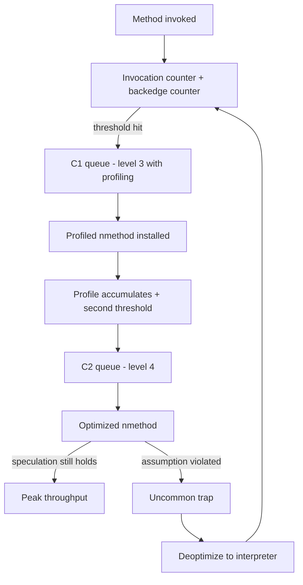
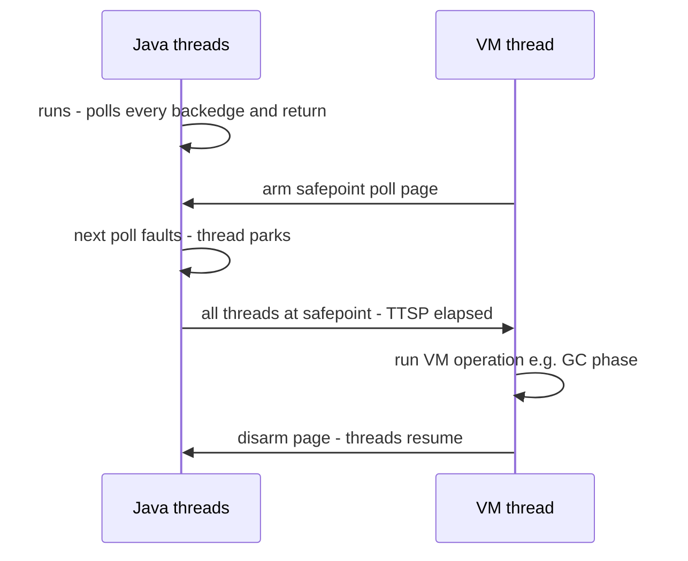

# HotSpot Internals: The JVM Engine Room

## Overview

HotSpot is the JVM implementation inside every OpenJDK/Oracle JDK build: roughly 2,500 C++ source files under `src/hotspot/`, descended from the Animorphic/Strongtalk VM Sun acquired in 1997 and made default in J2SE 1.3. This page looks at HotSpot as a *codebase and runtime* — how the C++ tree is organized, how runtime data areas are actually implemented, how the interpreter, compiler broker, safepoint machinery, and object model work together. It deliberately complements the sibling pages: GC algorithms and collectors live in [Garbage Collection](./gc.md), C1/C2 compiler strategy and tier levels in [JIT Compilation in HotSpot](./jvm-jit.md), bytecode semantics in [The JVM Bytecode](./jvm-bytecode.md), class loading architecture in [JVM Class Loading](./jvm-classloader.md), and the Java Memory Model in [JVM Memory Model](./jvm-memory-model.md). Interviewers ask HotSpot-runtime questions to separate candidates who have tuned flags from candidates who understand what the flags touch.

## The Source Tree: `src/hotspot`

The OpenJDK repo (see [github.com/openjdk/jdk](https://github.com/openjdk/jdk)) splits HotSpot into three overlay layers: a platform-independent core (`share`), CPU-specific code (`cpu`), and OS-specific code (`os`), combined at build time as `share` + `cpu/<arch>` + `os/<os>` + `os_cpu/<os>_<arch>`. Porting HotSpot to a new chip means writing one `cpu` layer, not forking the VM. The key `share` subdirectories:

| Directory | What lives there | Interview relevance |
|-----------|------------------|---------------------|
| `oops/` | `oopDesc`, mark word, klass pointer, compressed oops logic | Object header questions |
| `interpreter/` + `cpu/*/templateTable*` | Template interpreter and per-bytecode assembly generators | "How is bytecode executed?" |
| `c1/`, `opto/` | The client compiler and the C2 Sea-of-Nodes compiler | JIT tiering (cross-ref [jvm-jit.md](./jvm-jit.md)) |
| `runtime/` | Threads, safepoints, handshakes, locks (`objectMonitor.cpp`), deoptimization | Concurrency and stall debugging |
| `gc/` | Shared GC interfaces + one subdir per collector (`g1/`, `z/`, `shenandoah/`, `parallel/`, `serial/`) | Cross-ref [gc.md](./gc.md) |
| `memory/` | Metaspace, heap regions, `virtualspace` | Metaspace tuning questions |
| `classfile/` | Class file parser, verifier, symbol/constant-pool tables | Verification pipeline |
| `prims/` | JNI, JVMTI, `Unsafe`, the `jvm.cpp` native entry points | Agents and FFI |
| `services/` | Attach API, NMT, management interface backing `jcmd` | Serviceability tooling |
| `jfr/` | JDK Flight Recorder event plumbing | Production profiling |

Two build details are worth name-dropping. First, the **ADLC** (`share/adlc`): C2's instruction selection is driven by architecture-description files (`x86_64.ad`, `aarch64.ad`) that declare matching rules from ideal IR nodes to machine instructions — this is why supporting a new ISA is mostly writing one `.ad` file plus runtime assembly. Second, `cpu/zero` is a portable interpreter-only port that runs on architectures with no JIT, a nice illustration that the interpreter is a self-sufficient execution engine.

## Runtime Data Areas, Implemented

The JVMS describes five logical areas (heap, method area, PC registers, JVM stacks, native stacks). HotSpot implements them as follows.

### Heap

One contiguous (or, with ZGC/Shenandoah, multi-regioned) reserve of process memory handed to the collector subsystem. The heap holds *oops* — ordinary object pointers — and everything about generational layout, TLABs, and card tables belongs to the GC engine room: see [Garbage Collection](./gc.md) and [ZGC](../../compilers/advanced/zgc.md). What matters here is that `new` in bytecode is a runtime call into `share/oops` + the active collector, usually allocating bump-pointer style inside a thread-local allocation buffer with no lock.

### Metaspace (JDK 8+)

JDK 8 removed PermGen (JEP 122); class metadata now lives in native memory managed by Metaspace. It is allocated in a chunk hierarchy — a reserved `VirtualSpaceNode` hands out root chunks, which are subdivided into medium, small, and in-chunk allocations — so metadata can be freed and returned to the OS when class loaders die (something PermGen never did well). JEP 387 (JDK 16, "Elastic Metaspace") reworked this allocator with buddy-style chunk splitting, sharply reducing the "metaspace won't give memory back" complaints. With compressed class pointers enabled (`-XX:+UseCompressedClassPointers`, on by default), *klass* structures additionally live in a bounded 64-bit→32-bit-indexed "class space" sized by `-XX:CompressedClassSpaceSize`. The practical knobs: `-XX:MetaspaceSize` (initial high-water mark that triggers the first metadata GC), `-XX:MaxMetaspaceSize` (hard cap — exceeding it throws `OutOfMemoryError: Metaspace`), and the fact that a class-loader leak shows up as Metaspace growth, not heap growth. Interviewers love this trap: a `jcmd GC.class_histogram` showing few live instances but monotonically growing loaded-class counts.

### Code Cache

Compiled methods (nmethods), interpreter stubs, and intrinsic stubs live in executable memory called the code cache. Since JDK 9 (JEP 197) it is **segmented**:

| Segment | Contents | Default share |
|---------|----------|---------------|
| Non-method | Stubs, adapters, interpreter glue (never flushed) | ~5 MB fixed-ish |
| Profiled nmethods | Level-2/3 C1 code carrying counters | bulk of a warm-up-heavy app |
| Non-profiled nmethods | Level-1 C1 and level-4 C2 code | bulk at steady state |

`-XX:ReservedCodeCacheSize` (default 240 MB on 64-bit server VMs) bounds the total; a full code cache means no more compiles and severe performance decay, so long-running apps with huge hot method counts watch `jcmd Compiler.codecache`. Cold nmethods are flushed by a sweeper that walks the code heap and marks zombie entries for unloading — code cache is a *cache*, not a log.

### Thread Stacks and PC

Each `JavaThread` owns a reserved, partially committed stack (`-Xss`, default 1 MB on Linux x64) with guard pages that a `StackOverflowError` handler turns into a Java exception. The "PC register" of the spec is the frame pointer plus the current bytecode offset stored in each interpreter frame — a compiled frame instead records a return address into the nmethod, which is how stack traces can translate native PCs back to source lines via nmethod metadata. Virtual threads change this picture: their stacks are heap-allocated objects copied in and out of carrier-thread stacks (see [Virtual Threads](./virtual-threads.md)), which is why thousands of them cost heap, not native stack.

### Native Memory and NMT

Beyond heap + metaspace + code cache + stacks, a real JVM process holds GC side structures (card tables, remembered sets, forwarding pointers, ZGC colored-pointer multi-mapping), JIT bookkeeping, symbol/constant-pool arenas, and direct `ByteBuffer` memory. **Native Memory Tracking** (`-XX:NativeMemoryTracking=summary`) attributes all of it to categories, and `jcmd <pid> VM.native_memory summary` prints the ledger — the tool of record for the classic "RSS grew but the heap did not" incident, where the usual suspects are direct buffers, metaspace, and code cache. Committing to NMT costs a few percent overhead, so enable it deliberately on canary instances or during investigations rather than fleet-wide by default.

## The Template Interpreter

HotSpot does not interpret bytecode with a giant C++ `switch`. At JVM startup, `TemplateTable` **generates native assembly for every bytecode** — each `templateTable_x86.cpp` entry emits machine code for, say, `iadd` (pop two ints, add, push) or `invokevirtual` (resolve, inline-cache check, load method pointer, jump). The generated handlers are stored in a dispatch table indexed by opcode; the interpreter loop is a single indirect jump from one handler to the next ("polymorphic dispatch"), typically a few machine instructions per bytecode with no C++ call overhead. This design buys:

- **Speed** — hot-path bytecodes execute as straight-line hand-written assembly; dispatch is one `jmp *` per instruction.
- **Flexibility** — new bytecodes or platform tweaks are small C++-as-asembler generator functions, not a rearchitected loop.
- **Instrumentability** — profiling variants of handlers (e.g., counting method invocations and branch back-edges) are generated alongside, which is exactly what tiered compilation's counters consume.

When someone asks "is bytecode interpreted or compiled?", the precise answer is: *first* by generated assembly (the template interpreter), *then* adaptively recompiled by C1/C2 — see [JIT Compilation in HotSpot](./jvm-jit.md) for the compilers themselves and [JVM Bytecode](./jvm-bytecode.md) for what the bytecode means.

Sketching what a generated handler does (x86-flavored pseudocode for `iadd` and dispatch):

```asm
; Template for iadd (conceptual shape of the generated code)
  mov  rax, [rsp]        ; load top-of-stack slot 1
  add  rax, [rsp+8]      ; add slot 2
  add  rsp, 8            ; pop one slot
  mov  [rsp], rax        ; store result
  ; dispatch to the next bytecode:
  movzbl ecx, [rbp+bcp]  ; fetch next opcode
  jmp  [dispatch_table + rcx*8]   ; indirect jump = the interpreter "loop"
```

The `invokevirtual` template is the deep one: it consults the inline cache in the constant-pool cache entry, performs the receiver vtable/itable resolution path, and loads the target `Method*` for the interpreter's frame-building stubs — the exact speculation sites C2 later optimizes.

## Tiered Compilation Machinery (Runtime Side)

The *policy* side — why C1-then-C2, what each tier optimizes for — is covered in [jvm-jit.md](./jvm-jit.md). The runtime machinery underneath it is this page's territory:

- **Counters.** Every interpreted method carries an invocation counter and a back-edge counter (loop iterations), profiled via the instrumented interpreter handlers. Representative server-VM defaults: C1-with-full-profiling (level 3) compiles at roughly 2,000 invocations, C2 (level 4) at roughly 15,000 invocations, with back-edge thresholds in the same ratio; trivial methods skip straight to level 1. Counters decay so that bursts don't cause pathological compiles.
- **Compiler broker and queues.** HotSpot spawns dedicated compiler threads (`-XX:CICompilerCount`), with separate queues for C1 and C2 so a flood of small C1 jobs never starves a big C2 compilation. Compiles happen on these threads in the background by default (`-XX:-BackgroundCompilation` turns them synchronous, useful for debugging only).
- **On-stack replacement (OSR).** A long-running loop would finish before its method ever *returns*, so invocation counters alone would never trigger compilation. Back-edge counter overflow instead requests an **OSR compile**: C1/C2 compile starting *at the loop's bytecode index* rather than method entry, and at the next back-edge the interpreter frame is swapped for the compiled OSR frame in place. This is why tight loops suddenly speed up mid-execution, and why the compile log shows entries with `@ bci` markers. OSR nmethods live outside the normal method-entry path and are discarded once the method exits the loop.
- **Bookkeeping.** Every compiled unit is an `nmethod` with entry points (verified, osr, exception handler), a dependency list (e.g., "no class Foo was ever loaded"), and state transitions: alive → not-entrant (invalidated) → zombie (no frames) → unloaded.

Reading `-XX:+PrintCompilation` (or JFR compiler events) makes the machinery concrete — the log lines are the runtime's own narration:

```text
  123  188       3       java.util.ArrayList::get (12 bytes)
  124  195       4       java.util.ArrayList::get (12 bytes)   2 inlining
  125  201 %     4       com.app.Looper::spin @ 8 (64 bytes)   <- OSR at bci 8
  126  188       3       java.util.ArrayList::get (12 bytes)   made not entrant
```

Line 1 installs a level-3 profiled nmethod; line 2 the level-4 upgrade; line 3 is an **on-stack replacement** compile (`%`) entered at bytecode 8; line 4 is the invalidation of the old tier when the new one replaces it. Interviewers who ask "what does the JIT log tell you?" expect roughly this decode.



## Deoptimization and Uncommon Traps

Optimized code is *speculative*: C2 inlines `Foo.m()` because the profile says the call site is monomorphic, eliminates a null check because 100,000 executions were non-null, hoists a range check out of a loop. Each speculation compiles in a bailout path — an **uncommon trap** — a stub that, when the slow-path check fails, transfers execution out of the nmethod: the deoptimization machinery (`runtime/deoptimization.cpp`) reconstructs an interpreter frame from the compiled frame's debug metadata (bytecode index, all live locals/expressions), patches the inline cache so the call site stops being treated as monomorphic, and marks the nmethod *not-entrant* (or re-profiles and recompiles with a wider guard). Traps are classified by reason (`null_check`, `class_check`, `range_check`, `predicate`, `runtime`, …) and action (`make_not_entrant`, `reinterpret`, `none`).

Two interview-grade consequences:

1. **Branches that are "impossible" per the profile are free.** Code like `if (obj instanceof SpecificType)` inside a hot loop costs nothing when the profile says it never fires — until the first time it does, costing one trap plus a recompile. Code whose behavior *oscillates* between types (megamorphic call sites, alternating data shapes) can trap-loop and run slower than interpreted code; `-XX:+PrintDeoptimizationDetails` and JFR's deoptimization events expose this.
2. **Class loading invalidates code.** Loading a subclass that breaks a "no subclasses" dependency invalidates dependent nmethods eagerly — this is the mechanism behind "don't load classes after warm-up" performance folklore.

## Safepoints and Time-to-Safepoint

A **safepoint** is a program state where every running Java thread is at a point where the VM can inspect and modify its frames — object references are mapped, the PC is a known bytecode or a deoptimizable compiled PC. Global-VM operations (most GC phases, class redefinition, heap dumps, some deoptimizations) require a *stop-the-world at a safepoint*: the VM thread initiates it, each thread reaches its next poll and blocks.

Where the polls are:

- Compiled code: at method returns and (normally) loop back-edges — a cheap load of a polling page word that faults only when a safepoint is requested.
- Interpreted code: poll checks woven into the dispatch loop and on method calls.
- Native/JNI code: the thread counts as "in safepoint" while running native code but must transition back through a poll when returning.

The headline operational metric is **time-to-safepoint (TTSP)** — how long the *initiation* takes, i.e., how long the slowest thread needs to reach a poll. Total GC pause = TTSP + the GC work itself, and a pathological TTSP can dwarf the collection: the classic culprits are large counted `int` loops without safepoint polls (older JVMs omitted polls from counted loops), tight JNI return loops, and spun-out `volatile` loops. `-Xlog:safepoint` reports both phases ("Reaching safepoint" vs "At safepoint"), and production dashboards should alert on TTSP spikes *separately* from GC time — a "GC pause" alert that ignores TTSP will misdiagnose the runaway thread. Since JDK 10 (JEP 312), many per-thread operations (biased-lock revocation in its day, stack watermark updates, async thread dumps) run as **thread-local handshakes**, stopping one thread instead of the world.

The distinction between the **VM thread** and application threads matters for reading thread dumps: long-running VM operations show up as `VM Thread` in the dump, and the operation name (e.g., `RevokeBias` or `G1 Operate GC`) names what the world stopped for. When the operation itself is fast but the wall-clock pause is long, the time went to TTSP — back to the poll-free loop hunt.



## Object Layout: oops, Mark Word, Compressed References

A Java object in memory is an `oopDesc`: a **mark word**, a **klass pointer**, (arrays: a 32-bit length), then fields. Understanding the mark word is understanding locking and identity hashing:

| 64-bit mark word (JDK 15+, biased locking removed) | State |
|---|---|
| `unused:25 \| identity_hash:31 \| unused:1 \| age:4 \| biased_lock/lock:3` | Unlocked (01) |
| `ptr:62 \| lock:2 = 00` | Lightweight-locked, displaced header in stack lock record |
| `ptr:62 \| lock:2 = 10` | Inflated monitor (heavyweight) |
| `lock:2 = 11` | Marked for GC |

Key mechanics:

- **Identity hash** is computed lazily on first `System.identityHashCode` and *stored in the mark word* — which is why the header must be able to hold it, and why moving the object during GC is safe (mark word travels with it).
- **GC age** lives in 4 bits — hence ten survivable minor GCs before unconditional promotion.
- **Klass pointer** points at the `Klass` metadata (vtable, itable, layout helper, static fields) in Metaspace; compressed to 32 bits via the class space described above.
- **Compressed oops** (`-XX:+UseCompressedClassPointers`/`UseCompressedOops`, default on) represent references as 32-bit offsets from a heap base, with 8-byte alignment giving a 32 GB addressable range — the origin of the famous "heap >32 GB loses capacity" cliff, because 64-bit raw pointers then double reference size and shrink effective cache locality. Below ~4 GB the JVM can use a zero-based encoding that removes one base-register add on every dereference.
- **Field packing.** HotSpot groups fields by type — longs/doubles, ints, shorts/chars, bytes/booleans/refs, in that style — to minimize alignment padding; `-XX:FieldsAllocationStyle` tunes the ordering. `@Contended` (JEP 142) pads annotated fields onto separate cache lines to kill false sharing (see [False Sharing](../../os/advanced/false-sharing.md)). Compact strings (JDK 9) store `String` payload as `byte[]` plus a one-byte coder, halving Latin-1 memory.

Tools: JOL (Java Object Layout) prints actual layouts — an excellent interview exercise ("what does `new Object()` occupy?"). Typical 64-bit, compressed-oops output:

```text
java.lang.Object object internals:
 OFFSET  SIZE   TYPE DESCRIPTION               VALUE
      0     8        (object header: mark)     0x0000000000000001   # unlocked, lock=01
      8     4        (object header: class)    0x0000f800           # compressed klass ptr
     12     4        (object alignment gap)                         # pad to 16
Instance size: 16 bytes
```

and for `new int[0]` the header additionally carries the 4-byte array length field (16 bytes total); for a plain `Object`, 8 bytes of header plus 8 bytes of padding round the allocation to the 16-byte minimum. The padding is why a class with one `byte` field does not fit in 12 bytes — layout questions at interview depth always end in "show me with JOL".

## Locking: from CAS to Inflated Monitor

With biased locking deprecated and disabled by default since JDK 15 (JEP 374) — removed because its revocation cost and C++ attack surface outweighed uncontended throughput on modern hardware — the path is:

1. **Unlocked** CAS into a stack lock record (displaced mark word) on first acquisition: one CAS, zero kernel involvement.
2. **Recursive acquisitions** increment a record count.
3. **On contention** (`Inflate`), the object's mark word is CAS-swapped to point at an `ObjectMonitor` in the VM's native heap: owner/ recursions, an entry list of blocked threads, a wait set for `Object.wait()`. Blocked threads park via the OS (futex/pthread primitives) — this is the only stage where a Java `synchronized` touches the kernel.

Inflation is one-way in practice (deflation happens only via GC-era cleanup heuristics), so long-tailed monitors on hot objects are worth profiling (`jcmd Thread.print` shows `BLOCKED (on object monitor)` vs `PARKED` on `java.util.concurrent` primitives). `volatile` reads/writes compile to plain loads/stores with memory barriers per the JMM — see [JVM Memory Model](./jvm-memory-model.md) for the ordering rules and [Java Concurrency Deep Dive](./java-concurrent-deep.md) for the library layer built on them.

The inflated `ObjectMonitor` (`runtime/objectMonitor.cpp`) is worth naming field-by-field, because each one maps to observable behavior:

| Field | Meaning | Observable symptom when contended |
|-------|---------|------------------------------------|
| `owner` | Current holder (thread id / lock record ptr) | `BLOCKED` waiters name the owner in dumps |
| `recursions` | Reentrant count | Deep recursion under lock inflates stacks |
| `cxq` / `EntryList` | Lock-free insertion queue → wake list of blocked threads | Monitor contention histograms |
| `WaitSet` | Threads in `Object.wait()` | `WAITING (on object monitor)` state |
| `_succ`/`Spinner` | Heir + spinning threads during handoff | Micro-contention optimization |

Knowing that `cxq → EntryList` handoff is the wakeup path explains why biased/fair-ish ordering under monitors is *not* FIFO and why `synchronized` throughput degrades non-linearly under high thread counts — the historical motivation for `java.util.concurrent` locks built on AQS.

## Class Loading, Linking, Verification — the Runtime Half

The delegation model and loader isolation are covered in [JVM Class Loading](./jvm-classloader.md). At the HotSpot level, what actually happens: the class file parser (`classfile/classFileParser.cpp`) validates magic/versions and builds a symbol table and constant pool; the **split verifier** performs static checks plus type-checking against pre-computed `StackMapTable` frames (so verification is linear in code size, not a dataflow fixpoint); **preparation** allocates static fields with zero defaults; **resolution** converts symbolic references lazily; **initialization** runs `<clinit>` under a per-class init lock with the "first access" semantics that enable the lazy-holder idiom. Redefinition and hidden classes (JEP 371) round-trip through the same pipeline with extra constraints — a reason hot-reload tooling has sharp edges.

## Serviceability: JVMTI, the Attach API, and `jcmd` as a Window

HotSpot exposes three serviceability layers. **JVMTI** is the C agent interface powering debuggers (jdwp), profilers (async-profiler, JFR competitors), coverage tools, and heap walkers — agents load via `-agentlib:`/`-agentpath:` and subscribe to events (class load, method entry, GC start) with well-defined safepoint semantics. The **attach API** lets `jcmd`, `jstack`, `jmap`, `jstat` connect to a running JVM on demand (the `attachListener` thread is spun up lazily); since JDK 9 the `jhsdb`/Serviceability Agent can even read a *dead* process or core dump without the VM's cooperation. The `jcmd` family maps directly onto internals you now know:

| Command | Internal machinery it exposes |
|---------|-------------------------------|
| `jcmd <pid> Thread.print` | Full thread dump incl. monitor vs j.u.c block state |
| `jcmd <pid> GC.class_histogram` | Live oop counts per class (walks the heap) |
| `jcmd <pid> GC.heap_dump` | HPROF-format snapshot via a safepoint |
| `jcmd <pid> Compiler.codelist` / `Compiler.codecache` | nmethods, tiers, code cache occupancy |
| `jcmd <pid> VM.flags` / `VM.native_memory` | Live flag values; NMT native allocation tracking |
| `jcmd <pid> VM.class_hierarchy`, `VM.classloader_stats` | Metaspace/loader leak diagnosis |

JDK Flight Recorder (JFR) is the always-on cousin: ring-buffered events (allocation, safepoint latency, deoptimizations, compiler activity) with near-zero steady-state cost, and the first thing a senior engineer reaches for before any heap dump. A crisp interview answer: "the jstack/jmap/jstat binaries are legacy shims — jcmd is the actual interface, and JFR is the continuous version."

## Key Takeaways

- HotSpot = `share` + `cpu/<arch>` + `os/<os>` overlay; the JIT's ISA rules live in `.ad` files processed by ADLC, not in the compiler core.
- Metaspace (JDK 8+) is chunked native memory for class metadata; elastic since JDK 16; class-loader leaks surface here, not in the heap.
- The code cache is segmented (non-method / profiled / non-profiled) since JDK 9 and swept like a cache; exhausting it silently degrades performance.
- The interpreter is generated assembly per bytecode (template interpreter); its instrumented handlers feed tiered compilation's counters.
- OSR compiles a loop *in place* using back-edge counters; deoptimization turns profile-driven speculation into uncommon traps that bail out to the interpreter.
- Safepoints are the VM's global stop mechanism; time-to-safepoint is a first-class ops metric distinct from GC work — count loops and spinners are the usual suspects.
- Object header = mark word (hash, GC age, lock state) + compressed klass pointer; compressed oops are why the 32 GB heap cliff exists.
- Locking is CAS → stack lock record → inflated `ObjectMonitor`; biased locking is gone since JDK 15.
- jcmd/JFR/JVMTI are the sanctioned windows into all of the above — knowing *which* command maps to *which* subsystem is a genuine senior signal.

## Cross-References

- [JVM Internals](./jvm.md) — the high-level architecture overview this page grounds in implementation.
- [JIT Compilation in HotSpot](./jvm-jit.md) — C1 vs C2 strategy, IR, and inlining decisions behind the machinery here.
- [JVM Bytecode](./jvm-bytecode.md) — the instruction set the template interpreter executes.
- [JVM Class Loading](./jvm-classloader.md) — delegation model and isolation; this page covers the runtime half of the pipeline.
- [Garbage Collection](./gc.md) — collectors that consume safepoints and rearrange the oops described here.
- [JVM Memory Model](./jvm-memory-model.md) — the ordering guarantees that barriers and monitors implement.
- [Virtual Threads](./virtual-threads.md) — how heap-backed stacks change the thread-stack picture.
- [False Sharing](../../os/advanced/false-sharing.md) — the cache-line mechanics `@Contended` exists to fix.

## References

- OpenJDK project home: <https://openjdk.org/>
- OpenJDK JDK source repository — `src/hotspot` tree: <https://github.com/openjdk/jdk>
- HotSpot Virtual Machine wiki (internals notes, GC/safepoint pages): <https://wiki.openjdk.org/>
- JEPs referenced by number and discussed in text: JEP 122 (Remove the Permanent Generation), JEP 197 (Segmented Code Cache), JEP 312 (Thread-Local Handshakes), JEP 374 (Deprecate and Disable Biased Locking), JEP 387 (Elastic Metaspace) — all indexed from <https://openjdk.org/jeps/0> (JEP index).

## Interview Questions

1. **Why did JDK 8 remove PermGen, and what replaced it?** PermGen mixed class metadata with interned strings and had a fixed, poorly-tuned size; its collections were stop-everything and it rarely returned memory. Metaspace moves class metadata to native memory allocated in a chunk hierarchy that can be freed per-class-loader and returned to the OS (made truly elastic by JEP 387 in JDK 16). Interned strings moved to the heap, so they collect normally. Operational consequence: metadata leaks (loader leaks, dynamic proxy/class generation) now show as Metaspace growth and eventually `OutOfMemoryError: Metaspace`, diagnosed via `jcmd VM.classloader_stats` and class histograms, not by heap dumps.
2. **Explain on-stack replacement. Why does it exist?** Invocation counters only tick when a method is *entered*, but a hot loop running inside an interpreted frame may never return. OSR triggers on back-edge counter overflow: the compiler emits a special entry point at the loop's bytecode index, and at the next back-edge the interpreter frame is swapped for the compiled frame mid-execution. The OSR nmethod is separate from the method's normal compiled form and is discarded after the loop. Without OSR, warm-up of compute-bound code would be delayed until arbitrary method boundaries.
3. **What exactly is a safepoint, and why should an SRE chart time-to-safepoint separately from GC pause time?** A safepoint is a state where all Java threads are blocked at a poll with inspectable frames — required by most GC phases, heap dumps, and class redefinition. Total STW duration = TTSP (slowest thread reaching its poll) + the VM operation itself. A single thread spinning in a poll-free counted loop or returning from JNI in a tight loop can push TTSP into seconds while GC logs show a "fast" collection — misattributing this to the collector leads to pointless GC tuning instead of fixing the runaway code. `-Xlog:safepoint` separates the two phases, and JFR records per-operation safepoint latency.
4. **Walk through what happens when C2's monomorphic inline guess is wrong.** The compiled code contains an uncommon trap on the failing class check. At runtime the check fires: the trap calls into `Deoptimization`, which uses the nmethod's debug metadata to rebuild an interpreter frame at the exact bytecode index with all live values materialized, the nmethod is marked not-entrant so no new frames enter it, and the call site's inline cache is widened. The method re-runs interpreted, re-profiles (now bimorphic/megamorphic), and is recompiled with different guards — or C2 declines and the site stays virtual. Oscillating call sites can thrash between compiles; deopt reason histograms expose this.
5. **Why is a 31–32 GB heap often faster than a 40 GB heap?** With compressed oops on, references are 4-byte offsets from the heap base and 8-byte object alignment stretches addressing to exactly 32 GB. Beyond that the JVM falls back to 64-bit references: every reference doubles, every object grows, and pointer-chasing workloads lose cache and TLB locality — often costing more throughput than the extra capacity gains. Also, zero-based compressed-oop encoding (available below ~4 GB) removes an address add per dereference, which is why small heaps get a further micro-win.
6. **Describe the journey of `synchronized` under no contention, then heavy contention.** Uncontended: a CAS swaps the mark word for a pointer to a stack lock record (displaced header) — a few instructions, no syscalls; recursion bumps a count. Contention triggers inflation: the mark word is CAS'd to point at a native `ObjectMonitor` with owner, recursion count, entry list, and wait set; blocked threads park via the OS futex/pthread layer, and `Object.wait()` moves threads to the wait set. Since JDK 15 there is no biased-locking fast path (JEP 374 removed it) — the JVM authors judged its revocation machinery and security burden worse than the CAS cost on modern CPUs.
7. **What is the template interpreter, and why is it faster than a C++ switch interpreter?** At startup HotSpot generates a small assembly routine per bytecode (from `TemplateTable` descriptions) into a dispatch table; the interpreter loop is a single indirect jump to the next handler. There is no C++ frame per dispatch, no switch branch prediction, and hot bytecodes are straight-line machine code. Profiling variants of the same templates also collect invocation/back-edge counts for tiering. A portable C++ interpreter exists (`zero` port) for platforms without JIT support, which conveniently proves the interpreter is a complete execution engine on its own.
8. **You're paged for periodic multi-second latency spikes; GC logs show 20 ms collections. Where do you look?** Safepoint logs first: `-Xlog:safepoint*` shows "Reaching safepoint" time per operation — a large TTSP with small GC work means a thread is delaying the world, not the collector. Then JFR (safepoint latency events, thread dumps at spike time, deoptimization and allocation events), `jcmd Thread.print` during a spike (look for spinners and JNI), and NMT (`VM.native_memory`) if native allocation churn is suspected. The general lesson: stop-the-world duration decomposes into TTSP + operation, and most "GC mystery pauses" in tuned systems are TTSP artifacts — counted loops, `volatile` spinners, or blocking JNI transitions.
