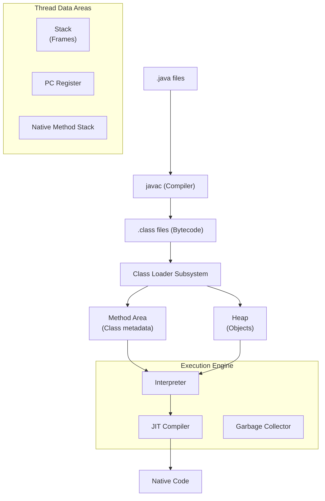
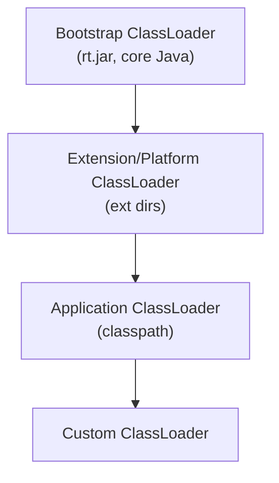
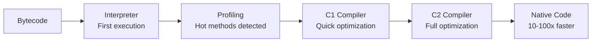
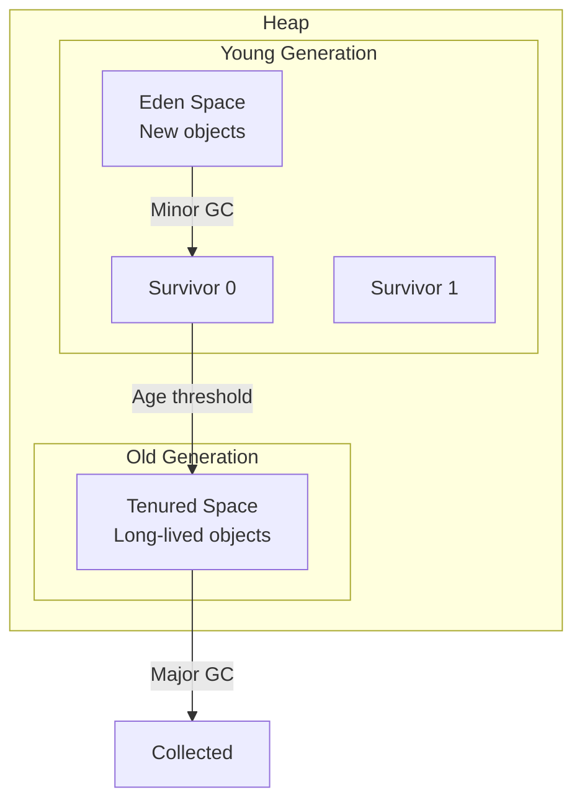
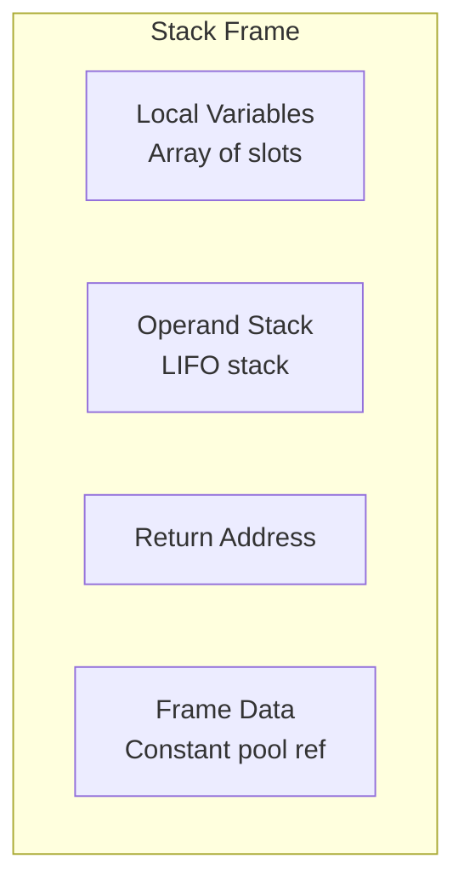
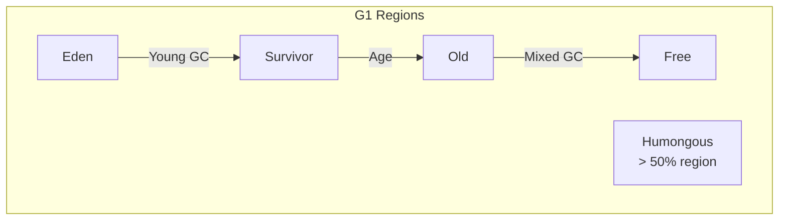

# JVM Internals

## Overview

The Java Virtual Machine (JVM) is the runtime engine that executes Java bytecode. Understanding JVM internals is crucial for performance tuning, debugging, and senior-level interviews.

## JVM Architecture



## Class Loading

### Class Loader Hierarchy



### Class Loading Phases

1. **Loading** — Find and read `.class` file
2. **Linking**
   - **Verify** — Bytecode verification (security, type safety)
   - **Prepare** — Allocate memory for static fields, set defaults
   - **Resolve** — Convert symbolic references to direct references
3. **Initialization** — Execute static initializers and static blocks

### Delegation Model

```java
// Parent-first delegation
// 1. Check if already loaded
// 2. Delegate to parent
// 3. Try to load yourself
// This prevents loading duplicate classes
```

## Bytecode

### What is Bytecode?

```java
// Java source
public int add(int a, int b) {
    return a + b;
}
```

```
// Bytecode (javap -c)
iload_1    // Push local var 1 (a)
iload_2    // Push local var 2 (b)
iadd       // Pop two ints, push sum
ireturn    // Return int
```

### Common Bytecode Instructions

| Category | Instructions | Description |
|----------|-------------|-------------|
| **Load/Store** | iload, lload, fload, aload, istore, lstore, fstore, astore | Local variable ↔ operand stack |
| **Arithmetic** | iadd, isub, imul, idiv, irem | Integer arithmetic |
| **Comparison** | if_icmpeq, if_icmpne, if_icmplt | Integer comparison |
| **Stack** | dup, swap, pop, pop2 | Operand stack manipulation |
| **Objects** | new, getfield, putfield, invokevirtual, invokeinterface | Object operations |
| **Arrays** | newarray, aload, astore, arraylength | Array operations |
| **Control** | goto, tableswitch, lookupswitch | Branching |

## JIT Compilation

### How JIT Works



### JIT Optimizations

| Optimization | Description |
|--------------|-------------|
| **Method inlining** | Replace call with method body |
| **Loop unrolling** | Replicate loop body to reduce overhead |
| **Escape analysis** | Allocate on stack if object doesn't escape |
| **Null check elimination** | Remove redundant null checks |
| **Bounds check elimination** | Remove redundant array bounds checks |
| **Dead code elimination** | Remove unreachable code |
| **Constant folding** | Compute constants at compile time |
| **Scalar replacement** | Break objects into primitives |

### Tiered Compilation

```
Level 0: Interpreter (no compilation)
Level 1: C1, no profiling (simple methods)
Level 2: C1, limited profiling
Level 3: C1, full profiling
Level 4: C2, full optimization (hot methods)
```

## Runtime Data Areas

### Heap Structure



### Stack Frames

Each method call creates a stack frame:



| Component | Description |
|-----------|-------------|
| **Local variables** | Array of slots (this, parameters, local vars) |
| **Operand stack** | LIFO stack for computation |
| **Frame data** | Return address, exception table, constant pool reference |

## String Pool

```java
// String literals are interned
String s1 = "hello";  // Stored in string pool
String s2 = "hello";  // Same reference from pool
s1 == s2;             // true (same reference)

String s3 = new String("hello"); // New object on heap
s1 == s3;                        // false (different reference)
s1.equals(s3);                   // true (same content)

// Explicit interning
String s4 = s3.intern(); // Returns pooled reference
s1 == s4;                // true
```

## Memory Management

### Object Header

```
| Mark Word (8 bytes) | Class Pointer (4 bytes) | Array Length (4 bytes, if array) |
```

Mark Word contains:
- Identity hashCode
- GC age (4 bits)
- Lock state (biased, lightweight, heavyweight)

### Escape Analysis

```java
public int calculate() {
    Point p = new Point(1, 2); // Does p escape?
    return p.x + p.y;         // No → allocate on stack
}

public Point create() {
    Point p = new Point(1, 2);
    return p; // Escapes → allocate on heap
}
```

## Garbage Collection Algorithms

### Generational GC

| Generation | Collection | Frequency |
|------------|-----------|-----------|
| **Young** | Minor GC | Frequent, fast |
| **Old** | Major/Full GC | Rare, slower |

### G1 Garbage Collector



- Divides heap into equal-sized regions (1-32MB)
- Tracks live objects per region
- Collects regions with most garbage first (Garbage First)
- Target: configurable pause time (default 200ms)

### ZGC (Java 15+)

- Sub-millisecond pauses
- Concurrent marking and relocation
- Colored pointers (load barriers)
- No generational (until JDK 21)
- Good for large heaps (terabytes)

## Interview Questions

### Q: What happens when you run `java Main`?

1. JVM starts, Bootstrap ClassLoader loads core classes
2. Application ClassLoader loads `Main.class`
3. Static initializer runs
4. `main()` method invoked
5. JIT compiles hot methods
6. GC manages memory
7. JVM exits when main thread finishes

### Q: How does HashMap handle hash collisions?

```java
// Java 8+: linked list → tree (when bucket > 8 entries)
// Hash: (h = key.hashCode()) ^ (h >>> 16)
// Index: (n - 1) & hash
// Tree threshold: TREEIFY_THRESHOLD = 8
// Untreeify threshold: UNTREEIFY_THRESHOLD = 6
```

### Q: What is the difference between == and equals()?

| `==` | `.equals()` |
|------|------------|
| Reference comparison | Content comparison |
| Compares memory addresses | Compares object content |
| For primitives: value comparison | Can be overridden |

### Q: How does ConcurrentHashMap work?

- **Java 7**: Segment-based locking (16 segments)
- **Java 8**: CAS + synchronized on bins (finer granularity)
- Thread-safe without full synchronization
- `size()` is approximate (not locked)

### Q: What are the different GC roots?

1. Local variables in active stack frames
2. Static variables
3. Active Java threads
4. JNI references

## Related Topics

- [Java GC Algorithms](./gc.md) — Detailed GC comparison
- [Java Concurrency](./concurrency.md) — Threading deep dive
- [OS Memory Management](../../os/memory/) — OS-level memory concepts
- [Computer Architecture](../../arch/) — Hardware memory model
