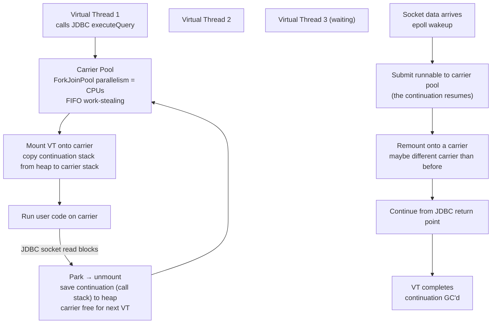

# Java Virtual Threads — Project Loom

## Overview

**Project Loom** introduces **virtual threads** — JVM-managed lightweight threads that make high-throughput concurrency as simple to write as synchronous blocking code, without the cognitive cost of reactive or callback-based frameworks. After several preview rounds, virtual threads themselves were finalized in **JDK 21 (September 2023, JEP 444)**; the companion APIs — structured concurrency and scoped values — are still in preview as of **JDK 25 (JEP 505 and JEP 506, 5th preview)** and remain subject to API churn.

The thesis is that the Java platform has historically paid two costs for high-concurrency workloads: (1) platform threads are expensive because they map 1:1 to OS threads and inherit the OS thread stack cost (~1 MB), so a service that wants to handle 100k concurrent requests needs 100 GB of stack alone; and (2) the workaround — reactive frameworks like Project Reactor or RxJava — pushes the burden onto the developer, who must now reason about asynchronous dataflows, backpressure, and operator fusion instead of plain sequential code. Virtual threads collapse both costs by making blocking cheap again.

Three innovations together form Loom:

- **Virtual Threads** — many:1 mapping to a small pool of carrier platform threads, automatic yielding on blocking I/O.
- **Structured Concurrency** — `StructuredTaskScope` hierarchical scoping with automatic cleanup, cancellation, and error propagation, treating concurrent subtasks like structured code blocks.
- **Scoped Values** — immutable, lexically-scoped context propagation intended to replace `ThreadLocal` for virtual threads (where one million `ThreadLocal` maps would be a memory disaster).

> Related: [Java Overview](./README.md), [JVM Internals](./jvm.md), [Garbage Collection](./gc.md), [Java Concurrency](../../concurrency/java.md), [Thread Pools](../../concurrency/thread-pools.md), [Go Channels](../../concurrency/go-channels.md)

## JEP Timeline

| JDK | JEP | Status | What landed |
|-----|-----|--------|-------------|
| 19 | 425 | Preview (1st) | Virtual threads initial preview |
| 20 | 437 | Preview (2nd) | Refined API; scoped values preview (JEP 429) |
| 21 | 444 | **Final** | Virtual threads production-ready |
| 21 | 453 | Preview | Structured concurrency initial preview |
| 22 | 462 | Preview (2nd) | Structured concurrency refined |
| 23 | 480 | Preview (3rd) | Structured concurrency refined |
| 23 | 481 | Preview (2nd) | Scoped values refined |
| 24 | 499 | Preview (4th) | Structured concurrency — API redesigned around `StructuredTaskScope.Open` + `Joiner` |
| 24 | 487 | Preview (3rd) | Scoped values refined |
| 25 | 505 | Preview (5th) | Structured concurrency — still not finalized |
| 25 | 506 | Preview (4th) | Scoped values — still not finalized |

The split matters: virtual threads themselves are stable and ship in production today; structured concurrency and scoped values are previews, gated behind `--enable-preview --release N` and subject to breaking API changes between JDK releases.

## Platform Threads vs Virtual Threads

| Aspect | Platform Thread (classic) | Virtual Thread (Loom) |
|--------|---------------------------|----------------------|
| Mapping | 1:1 OS thread | Many:1 carrier (platform) thread |
| Stack | ~1 MB fixed (OS-allocated) | Few KB dynamic, stored on heap as continuation, grows on demand |
| Creation cost | 100–300 µs (syscall + thread setup) | ~1 µs (heap allocation; benchmark measured around 200 ns on modern JDKs) |
| Max count | 1K–10K before OS degradation | 1M–10M limited by heap, not by OS |
| Blocking behavior | Blocks OS thread — costly | Unmounts from carrier, carrier free for other virtual threads |
| Scheduling | OS preemptive scheduler | JVM work-stealing `ForkJoinPool` (carrier pool parallelism = CPU count) |
| Stack capture | Not supported | Continuation captures/restores call stack on park/unpark |
| Debugging | Standard thread dump | Same, plus virtual-thread-aware `jcmd Thread.dump_to_file --format=json` |
| Memory overhead per task | ~1 MB stack + thread metadata | ~few KB continuation + small thread object |
| CPU cache impact | High context-switch cost | Lower — carriers stay hot, virtual threads are heap data |

The 1000× scaling claim deserves scrutiny. The hard limit on virtual threads is heap size: each virtual thread's continuation plus thread object occupies roughly 4–10 KB. A 4 GB heap therefore admits roughly 400K–1M virtual threads before GC pressure dominates. Production reports of 1M concurrent virtual threads on a single JVM exist but require careful GC tuning (usually ZGC or Shenandoah, see [GC](./gc.md)) and the workload must be I/O-bound — a million virtual threads all doing CPU work would just thrash the carrier pool, which has only `Runtime.availableProcessors()` carriers.

## How Virtual Threads Work Internally



Key implementation details:

- **Carrier pool**: a single `ForkJoinPool` whose parallelism equals `Runtime.getRuntime().availableProcessors()`. The system property `jdk.virtualThreadScheduler.parallelism` overrides it, but is rarely tuned — you do not size carriers for the number of concurrent tasks; you size them for the number of CPU cores you want to dedicate to virtual-thread execution. Tuning this like a classic thread pool (e.g., setting it to 200 because "we have 200 concurrent requests") defeats the design and typically hurts throughput.
- **Stack representation**: the call stack of a virtual thread is not stored on the OS stack. Instead it lives on the Java heap as a `Continuation` object — a chain of stack chunk objects. While running, the active portion is copied onto the carrier's native stack so the JIT and ABI work as usual; when the virtual thread parks, the active frames are copied back to the heap. This copy-in/copy-out is what makes pinning costly: if the virtual thread cannot be unmounted, the carrier is stuck.
- **Yielding triggers**: a virtual thread yields (parks) when it executes any of:
  - `Thread.sleep`
  - `Object.wait` / `LockSupport.park` (the foundation of all `java.util.concurrent` blocking)
  - Most `BlockingQueue` operations (`take`, `poll`)
  - Socket I/O via `java.nio.channels` (and, by extension, classic `java.net.Socket` since JDK 19)
  - `Process.waitFor`
  - JDBC operations, provided the underlying driver uses NIO under the hood (true for modern drivers like the PostgreSQL JDBC driver ≥ 42.5)
- **Pinning triggers**: a virtual thread cannot unmount when it is inside a `synchronized` block, a native frame (JNI), or while holding the JVM's class-initialization lock. In those cases the carrier itself blocks. The JVM emits a `jdk.VirtualThreadPinned` JFR event with a stack trace whenever this happens; high pinning rates are the most common Loom performance bug.

## Creating Virtual Threads

Three official ways, in increasing order of structure:

```java
// 1. Direct construction — one-off virtual thread, started immediately
Thread vt = Thread.ofVirtual().start(() -> {
    System.out.println("Running on " + Thread.currentThread());
});
vt.join();

// 2. Unstarted, then started explicitly (useful for builders / factories)
Thread vt2 = Thread.ofVirtual().name("worker-", 0).unstarted(() -> { /* ... */ });
vt2.start();

// 3. Per-task executor — the recommended drop-in replacement for
//    Executors.newFixedThreadPool in HTTP handlers
try (ExecutorService exec = Executors.newVirtualThreadPerTaskExecutor()) {
    List<Future<String>> futures = IntStream.range(0, 10_000)
        .mapToObj(i -> exec.submit(() -> fetchRemote(i)))
        .toList();
    for (Future<String> f : futures) {
        System.out.println(f.get());  // blocks the *caller*; carrier free
    }
}  // try-with-resources: close() waits for all submitted tasks to finish
```

Pattern 3 is the most common in production: it mirrors the classic `ExecutorService` API, so existing code that submits tasks to a fixed pool can be migrated by changing one line — `Executors.newFixedThreadPool(N)` → `Executors.newVirtualThreadPerTaskExecutor()`. Spring Boot 3.2's `spring.threads.virtual.enabled=true` does exactly this for Tomcat request threads.

## Structured Concurrency — The Paradigm Shift

Traditional fire-and-forget leaks tasks, scatters errors, and makes cancellation a manual chore. Structured concurrency brings the discipline of structured programming (every block has one entry, one exit) to concurrent subtasks:

```java
// OLD — fire-and-forget, hard to manage, leaks on failure
for (int i = 0; i < 5; i++) {
    new Thread(() -> processTruck(i)).start();
}
// No guarantee, no cancellation, errors lost, no join point

// NEW (JDK 21 API — ShutdownOnFailure, the most commonly shown preview API)
try (var scope = new StructuredTaskScope.ShutdownOnFailure()) {
    Future<User> user   = scope.fork(() -> fetchUser(id));
    Future<Orders> orders = scope.fork(() -> fetchOrders(id));
    scope.join();              // wait for all subtasks
    scope.throwIfFailed();     // propagate first failure, cancel others
    return buildView(user.resultNow(), orders.resultNow());
}  // auto cleanup, no leaks even on exception
```

Policies (preview API, JDK 21–23):

- **ShutdownOnFailure**: first failure cancels all other subtasks — fail-fast for transactional workflows (fetch user + orders + inventory; if any fails, cancel the rest).
- **ShutdownOnSuccess**: first success wins and cancels the rest — race pattern (lookup across cache, DB, remote service; return the first non-null result).

**API churn warning**: as of JDK 24 (JEP 499) the `ShutdownOnFailure` / `ShutdownOnSuccess` concrete subclasses were removed in favor of a single `StructuredTaskScope.Open` class plus a `Joiner` strategy object — for example `Joiner.allSuccessfulOrThrow()` or `Joiner.awaitAnySuccessfulOrThrow()`. This is the fifth preview; the API is still being tuned. Until JEP 505 is finalized, production code should either pin to a specific JDK and `--enable-preview`, or stick to plain `ExecutorService`-style usage of virtual threads (which is stable since JDK 21).

## Scoped Values — Replacing ThreadLocal

`ThreadLocal` is problematic for virtual threads because each of a million virtual threads gets its own `ThreadLocal` map, and inherited `InheritableThreadLocal` values are copied eagerly to children — both memory-heavy and semantically wrong for short-lived tasks. `ScopedValue` is immutable, bound to a lexical scope, and shared by reference rather than copied:

```java
private static final ScopedValue<String> REQUEST_ID = ScopedValue.newInstance();

// Bound for the lifetime of the run() lambda, then unbound automatically
ScopedValue.where(REQUEST_ID, "req-123").run(() -> {
    // Inside here, REQUEST_ID.get() returns "req-123".
    // If handleRequest() spawns virtual threads via StructuredTaskScope,
    // those children also see "req-123" — automatically and cheaply.
    handleRequest();
});
// Outside, REQUEST_ID.get() throws — not silently null.
```

Advantages over `ThreadLocal`:

- **Immutable**: a `ScopedValue` cannot be reassigned inside its scope, eliminating the "did some downstream code mutate my request id?" class of bugs.
- **No per-thread map**: bound values are stored in a small stack on the thread, not in a `ThreadLocalMap` that must be GC'd when the thread dies. With 1M virtual threads this is the difference between a few MB and gigabytes.
- **Structured**: the binding is scoped to the `run()` lambda, so it cannot leak past the call site.
- **Inherited by structured children**: subtasks forked inside a `StructuredTaskScope` inherit the calling thread's scoped values for free.

Scoped values are still in preview (JEP 506, JDK 25, 4th preview). The conservative migration path today is: keep `ThreadLocal` for compatibility, but ensure values are `remove()`d in a `finally` block to avoid leakage across pooled-virtual-thread reuse (the per-task `ThreadLocal` is otherwise inherited by the next task scheduled on the same `Thread` object).

## Performance Characteristics

Concrete measurements from benchmark workloads (numbers approximate; vary by hardware and JDK version):

- **Creation latency**: virtual thread `Thread.ofVirtual().start(...)` ~ 1 µs, dominated by heap allocation; platform thread `new Thread().start()` ~ 100 µs, dominated by the `clone` syscall and stack allocation.
- **Throughput on I/O-bound workload**: a microservice doing 1 ms of CPU + 50 ms of blocking DB query per request. With a 50-thread Hikari pool and a 200-thread Tomcat pool, classic throughput ceilings at ~1000 req/s (limited by the pool sizes). The same code on virtual threads handles ~50 000 req/s on the same 4-core machine, because the 50 ms DB wait no longer consumes a thread. The CPU bottleneck becomes the actual 1 ms of compute per request — 4 cores × 1000 req/s/core = 4000 req/s ceiling from CPU, far above the pool limit.
- **Memory per idle virtual thread**: ~2–4 KB on the heap (continuation object + thread object). 1M idle virtual threads therefore costs roughly 2–4 GB of heap — feasible but noticeable. 1M platform threads is not feasible at all (~1 TB of stack).
- **Carrier utilization**: when all virtual threads are blocked on I/O, carrier pool utilization drops to near zero — exactly what you want. If carrier utilization stays high while virtual threads are mostly blocked, it usually means pinning is forcing carriers to block too; check the JFR `jdk.VirtualThreadPinned` events.

A representative case study: a REST service that previously used a HikariCP pool of 50 connections and a Tomcat thread pool of 200. Under a 10× traffic spike, the Tomcat queue would saturate and requests would time out. After migrating to virtual threads (`spring.threads.virtual.enabled=true` and HikariCP `maximumPoolSize` raised to match the database's actual capacity — often 100+), the service now absorbs the same spike by simply spawning more virtual threads; the bottleneck shifts cleanly to the database, which is where it should be. No reactive rewrite, no `CompletableFuture` chains, no async/await coloring.

## Pitfalls & Production Advice

- **Avoid `synchronized` pinning**: anywhere a virtual thread might block while inside a `synchronized` block, replace `synchronized` with `java.util.concurrent.locks.ReentrantLock`. The JVM's pinning on `synchronized` was the single most common migration bug in JDK 21. JDK 24 (JEP 491) removes this pinning for the common case by allowing virtual threads to unmount from `synchronized` blocks, but migration to `ReentrantLock` is still the safer pattern for libraries that must support older JDKs.
- **`ThreadLocal` cleanup**: if you must use `ThreadLocal`, always `remove()` it in a `finally` block. Virtual threads created via `newVirtualThreadPerTaskExecutor()` are short-lived and discarded, so the leak is bounded, but `ThreadLocal` values that hold large buffers can cause transient heap spikes.
- **Do not pool virtual threads**: virtual threads are cheap to create and discard; pooling them defeats the entire design. Use `newVirtualThreadPerTaskExecutor()` (one virtual thread per task, thrown away when done).
- **Carrier pool tuning**: leave `jdk.virtualThreadScheduler.parallelism` at the default (CPU count). It is the number of carriers actually running code, not the number of concurrent tasks. Setting it higher does not increase parallelism for I/O-bound work and risks contention.
- **CPU-bound work**: virtual threads offer no benefit for CPU-bound tasks; they will compete for the same carrier pool and add scheduling overhead. Use `ForkJoinPool` for parallel streams or a dedicated fixed pool for CPU-bound work, and keep virtual threads for I/O.
- **Observability**: JFR has dedicated events — `jdk.VirtualThreadPinned`, `jdk.VirtualThreadStart`, `jdk.VirtualThreadEnd`, `jdk.VirtualThreadSubmitFailed`. `jcmd <pid> Thread.dump_to_file --format=json` produces a structured dump that includes virtual threads. Async-profiler and honest profiler both work because virtual threads run on real carrier stacks.
- **Framework support**: Spring Boot 3.2+ (`spring.threads.virtual.enabled=true`), Quarkus 3.x (`quarkus.virtual-threads.enabled=true`), Helidon Nima (a web server built from the ground up on virtual threads, no servlet container), and Tomcat/Jetty 11+ virtual-thread executors all support virtual threads out of the box. Most blocking JDBC drivers work because blocking now yields the carrier rather than consuming it.
- **JNI and native frames**: native calls still pin the carrier. If you have a library that does long-running native work, offload it to a dedicated platform-thread executor and have the virtual thread `Future.get()` the result.
- **`Object.wait`**: works on virtual threads but is rare in modern code — `ReentrantLock` `Condition` is preferred and behaves the same.

## Comparison With Other Lightweight Concurrency Models

| Aspect | Java Virtual Threads | Go Goroutines | Kotlin Coroutines | Project Reactor |
|--------|---------------------|----------------|-------------------|----------------|
| Scheduler | JVM `ForkJoinPool` carrier (work-stealing, FIFO) | Go runtime P-bound G-M-P model (work-stealing, async netpoll) | Library-chosen `Dispatcher` (Default, IO, Main) | Library-chosen `Scheduler` (parallel, elastic, single) |
| Stack | Heap continuation, ~KB, grows | Segmented 8 KB initial, grows | Per-continuation, ~few hundred bytes | No stack — state machine |
| Syntax | Plain blocking code; no keywords | Plain blocking code; no keywords | `suspend` keyword colors functions | Mono/Flux types color functions |
| Cancellation | `Thread.interrupt()` or `StructuredTaskScope` | `context.Done()` channel | Coroutine cancellation propagates via `Job` | `Disposable.dispose()` |
| Footprint per task | Few KB | ~2 KB initial | Few hundred bytes | Tens of bytes |
| Maturity | JDK 21 final; structured concurrency still preview | Production since Go 1.0 | Stable since Kotlin 1.3 | Stable since 2015 |
| Best for | Existing Java blocking codebases | New systems code | Android + Kotlin backends | Streaming pipelines, complex async |

Java virtual threads deliberately match the goroutine model — both let you write blocking code that scales. The main difference is that goroutines were there from the start, while Loom must interoperate with 25 years of Java libraries that assume platform threads.

## Migration Patterns

A common, low-risk migration sequence for an existing servlet-style service:

1. **Upgrade JDK to 21 LTS or 25 LTS.** Verify the application builds and tests pass before changing any threading.
2. **Replace the HTTP request thread pool.** In Spring Boot set `spring.threads.virtual.enabled=true`. In raw Tomcat call `executor = Executors.newVirtualThreadPerTaskExecutor()` and pass it to the connector. Existing request-handling code is unchanged.
3. **Audit `synchronized` blocks in hot paths.** Use `jfr print --events jdk.VirtualThreadPinned` after a load test. Replace high-pin-rate `synchronized` blocks with `ReentrantLock`.
4. **Audit `ThreadLocal` usage.** Convert per-request context (request id, tenant id, principal) to `ScopedValue` once it is stable; in the meantime ensure all `ThreadLocal.set()` calls are paired with `try/finally { remove(); }`.
5. **Reconsider connection pool sizes.** With virtual threads, the limit is no longer "how many threads can wait on a connection" but "how many concurrent queries the database can handle". HikariCP `maximumPoolSize` should match the database's `max_connections`, not the application's thread count.
6. **Leave CPU-bound work on platform threads.** If you have video transcoding, compression, or other CPU-heavy work, keep it on a dedicated `ForkJoinPool` or `ExecutorService` backed by platform threads; have the virtual thread submit and await the result.
7. **Load test under realistic concurrency.** Look for pinning events, GC pauses, and carrier pool saturation. Tuning GC (ZGC for low pause, G1 for throughput) often matters more than tuning virtual threads.

## Interview Questions

**Q: How do virtual threads differ from platform threads?**
Platform: 1:1 OS thread, ~1 MB fixed stack, 100–300 µs creation, max a few thousand, blocks the OS thread on I/O, scheduled by the OS. Virtual: many:1 carrier, few KB dynamic heap stack stored as a continuation, ~1 µs creation, millions feasible, unmounts on blocking I/O so the carrier is free for other work, scheduled by a JVM `ForkJoinPool` whose parallelism equals the CPU count.

**Q: What is structured concurrency?**
Hierarchical task scoping where subtasks are confined to a lexical block (typically `try-with-resources` on a `StructuredTaskScope`). Guarantees that all subtasks complete or are cancelled before the scope exits, no leaks, automatic cancellation on failure (`ShutdownOnFailure`) or first success (`ShutdownOnSuccess`). Compared by the Loom team to garbage collection: automatic task lifecycle instead of automatic memory lifecycle.

**Q: What is pinning and how do I avoid it?**
When a virtual thread blocks while inside a `synchronized` block, a native (JNI) frame, or the JVM class-initialization lock, it cannot unmount from its carrier; the carrier itself blocks. Avoid by using `ReentrantLock` instead of `synchronized` wherever blocking may occur, and by offloading long-running native work to a dedicated platform-thread executor. Detect via the JFR event `jdk.VirtualThreadPinned`. JDK 24's JEP 491 lifts the `synchronized` pinning for most cases, but migration to `ReentrantLock` is still safer for cross-version libraries.

**Q: How does virtual thread scheduling work?**
The JVM owns a single `ForkJoinPool` whose parallelism equals `Runtime.availableProcessors()`. Virtual threads are submitted to this pool as continuations. When a virtual thread is mounted on a carrier, it runs on the carrier's native stack. When it parks (on I/O, sleep, lock, etc.), the JVM copies its live stack frames back into a heap-allocated continuation object and the carrier is free to mount another virtual thread. When the parking condition clears (socket data ready, lock released), the continuation is resubmitted to the pool and remounted, possibly on a different carrier.

**Q: When should I migrate to virtual threads?**
I/O-heavy services (REST, RPC, DB, HTTP clients) are the sweet spot — you can replace reactive or callback code with plain blocking code and improve throughput. CPU-bound services benefit little; virtual threads there just add scheduling overhead. Native-heavy libraries that block in JNI are poor candidates because they pin carriers. Greenfield code on JDK 21+ should default to virtual threads for I/O work; brownfield code can usually migrate incrementally starting from the HTTP layer.

**Q: Why are scoped values preferred over `ThreadLocal` for virtual threads?**
`ThreadLocal` allocates a per-thread `ThreadLocalMap` with linear cost per thread; with a million virtual threads that is prohibitive. `ScopedValue` is bound to a lexical scope (a `run()` lambda), shared by reference rather than copied, immutable, and automatically unbound when the scope exits — so children forked via `StructuredTaskScope` inherit it for free, and there is no leak across tasks.

**Q: How does a virtual thread's stack actually work?**
It is not on the native stack. The call stack is stored on the Java heap as a `Continuation` object — a chain of stack-chunk objects. When the virtual thread runs, the active frames are copied onto the carrier's native stack so the JIT, ABI, and debuggers see a normal stack. When it parks, the active frames are copied back to the heap. This copy-in/copy-out is cheap for shallow stacks and grows linearly with stack depth.

**Q: Should I size the carrier pool larger for higher load?**
No. The carrier pool's parallelism should equal the number of CPU cores you want to dedicate to running virtual-thread code; it does not scale with the number of virtual threads. The whole point of virtual threads is that you can have millions of them parked while a handful of carriers run the ones that are actually ready.

## Cross-References

- [Java Overview](./README.md)
- [JVM Internals](./jvm.md) — JIT, classloading, memory areas that host the continuation heap objects
- [Garbage Collection](./gc.md) — ZGC and Shenandoah low-pause collectors complement virtual-thread-heavy workloads
- [Java Concurrency](../../concurrency/java.md)
- [Thread Pools](../../concurrency/thread-pools.md) — classic fixed pools vs `newVirtualThreadPerTaskExecutor`
- [Work-Stealing Schedulers](../../concurrency/work-stealing.md) — the carrier pool's underlying algorithm
- [Go Channels](../../concurrency/go-channels.md) — goroutines are the spiritual sibling of virtual threads
- [Async/Await](../../concurrency/async-await.md) — async/await vs virtual threads: colored vs uncolored functions
- [Memory Model](../../concurrency/memory-model.md) — happens-before still applies; virtual threads do not weaken the JMM

## References

- JEP 444: Virtual Threads ( finalized in JDK 21, September 2023 ) — https://openjdk.org/jeps/444
- JEP 491: Synchronize Virtual Threads without Pinning (JDK 24, March 2025) — https://openjdk.org/jeps/491
- JEP 505: Structured Concurrency (5th Preview, JDK 25) — https://openjdk.org/jeps/505
- JEP 506: Scoped Values (4th Preview, JDK 25) — https://openjdk.org/jeps/506
- Inside Java — Project Loom: Modern Scalable Concurrency for the Java Platform (official Oracle technical article) — https://inside.java/2024/02/04/sip108/
- Spring Framework reference — Virtual Threads (`spring.threads.virtual.enabled`) — https://docs.spring.io/spring-framework/reference/integration/scheduling.html#scheduling-choose-virtual-threads
- Helidon Nima — a web server built from the ground up on virtual threads — https://helidon.io/docs/v4/about/nima
- JVM Technology Deep Dive: Patterns for Scaling — Ron Pressler's Loom talks (Devoxx, QCon) for the original design rationale
