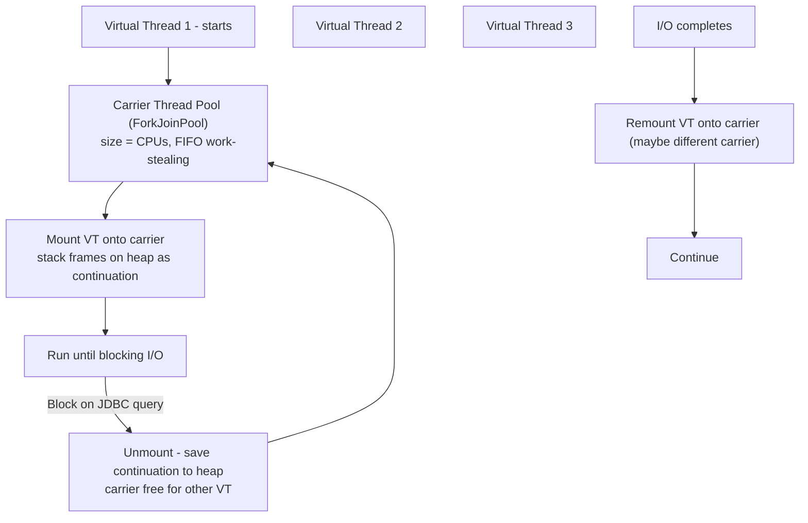

# Java Virtual Threads — Project Loom

## Overview

**Project Loom** (JDK 19 preview, JDK 21 production, JDK 25 structured concurrency in 5th preview — JEP 505, not yet finalized) introduces **virtual threads** — JVM-managed lightweight threads that make high-throughput concurrency as simple as synchronous code, without reactive complexity. It flips concurrency from OS-managed to JVM-managed.

Three innovations:

- **Virtual Threads** — many:1 mapping to carrier platform threads, automatic yielding on blocking I/O
- **Structured Concurrency** — `StructuredTaskScope` hierarchical scoping, automatic cleanup, no leaked tasks
- **Scoped Values** — immutable context propagation replacing `ThreadLocal` for virtual threads

> Related: [Java Overview](./README.md), [JVM Internals](./jvm.md), [Garbage Collection](./gc.md), [Java Concurrency](../../concurrency/java.md), [Thread Pools](../../concurrency/thread-pools.md)

## Platform Threads vs Virtual Threads

| Aspect | Platform Thread (old) | Virtual Thread (Loom) |
|--------|----------------------|----------------------|
| Mapping | 1:1 OS thread | Many:1 carrier (platform) thread |
| Stack | ~1 MB fixed (OS) | Few KB dynamic, grows, stored on heap as continuation |
| Creation cost | 100-300 µs (syscall) | 1-10 µs (allocation) |
| Max count | 1K-10K before degradation | 1M-10M limited by heap |
| Blocking | Blocks OS thread | Unmounts from carrier, carrier free for other virtual threads |
| Scheduling | OS scheduler | JVM work-stealing ForkJoinPool (carrier pool size = CPUs) |
| Debugging | Thread dump | Same, plus virtual thread aware (`jcmd Thread.dump_to_file`) |

## How Virtual Threads Work Internally



- **Carrier pool**: `jdk.virtualThreadScheduler.parallelism` = `Runtime.getRuntime().availableProcessors()`. FIFO work-stealing.
- **Stack**: not on native stack, but on heap as continuation objects, grows on demand (few KB start).
- **Yielding**: when virtual thread blocks on `LockSupport.park`, `sleep`, `BlockingQueue.take`, `Socket.read`, JDBC, etc., JVM unmounts it.
- **Pinned**: if virtual thread parks while holding monitor (`synchronized`) or in native frame, it **pins** carrier (cannot unmount) — carrier blocked. Avoid `synchronized`, use `ReentrantLock` instead. JFR event `jdk.VirtualThreadPinned` detects.

## Structured Concurrency — The Paradigm Shift

Traditional fire-and-forget leaks tasks, errors scattered.

```java
// OLD - fire-and-forget, hard to manage
for(int i=0;i<5;i++){
    new Thread(() -> processTruck(i)).start();
}
// No guarantee, no cancellation, errors lost

// NEW - structured, ownership model
try (var scope = new StructuredTaskScope.ShutdownOnFailure()) {
    Future<User> user = scope.fork(() -> fetchUser(id));
    Future<Orders> orders = scope.fork(() -> fetchOrders(id));
    scope.join(); // wait for all
    scope.throwIfFailed(); // propagates first failure, cancels others
    return buildView(user.resultNow(), orders.resultNow());
} // auto cleanup, no leaks
```

Policies:

- **ShutdownOnFailure**: first failure cancels all other subtasks — fail-fast for transactional workflows (e.g., fetch user + orders + inventory, if any fails, cancel others).
- **ShutdownOnSuccess**: first success wins, cancels others — race pattern (e.g., lookup cache, DB, remote service — return first).

Note: As of JDK 25 (Sept 2025), structured concurrency is still in **5th Preview** (JEP 505). The `ShutdownOnFailure`/`ShutdownOnSuccess` API shown above was removed in JEP 505 (JDK 24+) in favor of a new `StructuredTaskScope.Open` + `Joiner` API (e.g., `Joiner.allSuccessfulOrThrow()`). Until finalized, expect API churn.

## Scoped Values — Replacing ThreadLocal

`ThreadLocal` problematic for virtual threads (1M virtual threads each with ThreadLocal map = memory leak risk, inheritance confusing). `ScopedValue` immutable, structured:

```java
private static final ScopedValue<String> REQUEST_ID = ScopedValue.newInstance();

ScopedValue.where(REQUEST_ID, "req-123").run(() -> {
    // inside, REQUEST_ID.get() returns "req-123"
    handleRequest();
});
// outside, not bound
```

Advantages: immutable, no leak, cheaper, works with structured concurrency.

## Performance Characteristics

- Virtual thread creation ~1-10 µs vs platform 100-300 µs → 100× faster to spawn.
- 1M virtual threads feasible — each few KB stack vs 1MB platform → 1000× more concurrent tasks.
- Throughput: for I/O-bound microservice handling 1M DB queries/hour, traditional needs complex Hikari pool tuning (max pool 50, min idle, timeout) and pool exhaustion under spikes. Loom: **connection-per-request** — `try (var conn = dataSource.getConnection()) { jdbc.query() }` — virtual thread blocks, carrier serves others, no pool exhaustion.

Case study: database connection pooling — Loom allows connection-per-request without pool, simplifying architecture.

## Pitfalls & Production Advice

- **Avoid synchronized pinning**: use `ReentrantLock` instead of `synchronized` where virtual thread may block, to avoid pinning carrier.
- **ThreadLocal migration**: replace with ScopedValue.
- **Pool sizing**: carrier pool size = CPUs, not 100s. Don't tune like old thread pools.
- **Observability**: thread dumps now show virtual threads; JFR has virtual thread events. Debuggers identical.
- **Framework support**: Spring Boot 3.2+ has `spring.threads.virtual.enabled=true`, Tomcat/Jetty virtual thread executor. Most blocking JDBC drivers work because blocking now yields carrier.

## Interview Questions

**Q: How do virtual threads differ from platform threads?**
Platform 1:1 OS thread, 1MB fixed stack, 100-300µs creation, max few thousand, blocks OS thread on I/O, scheduled by OS. Virtual many:1 carrier, few KB dynamic heap stack, 1-10µs creation, millions feasible, unmounts on blocking I/O so carrier free, scheduled by JVM ForkJoinPool.

**Q: What is structured concurrency?**
Hierarchical task scoping where subtasks confined to lexical scope (try-with-resources). Guarantees all subtasks complete or cancelled before scope exits, no leaks, automatic cancellation on failure (ShutdownOnFailure) or success (ShutdownOnSuccess). Compares to garbage collection — automatic task lifecycle.

**Q: What is pinning and how to avoid?**
When virtual thread blocks while holding monitor (synchronized) or in native call, it pins carrier thread (cannot unmount), blocking carrier. Avoid by using ReentrantLock instead of synchronized where blocking may occur. Detect via JFR jdk.VirtualThreadPinned.

**Q: How does virtual thread scheduling work?**
JVM maintains carrier thread pool (ForkJoinPool size CPUs). Virtual threads mounted onto carrier, run until blocking, then unmounted saving continuation to heap, carrier serves other virtual thread. On I/O completion, remounted onto (maybe different) carrier. FIFO work-stealing.

**Q: When to migrate to virtual threads?**
I/O-heavy services (REST, DB, HTTP clients) — simplify code from reactive to synchronous style, no need for reactive complexity, improve throughput. CPU-bound still needs platform threads or parallelism limits.

## Cross-References

- [Java Overview](./README.md) — overview
- [JVM Internals](./jvm.md) — carrier pool, continuation
- [Garbage Collection](./gc.md) — ZGC/Shenandoah low pause complements virtual threads
- [Thread Pools](../../concurrency/thread-pools.md) — traditional vs virtual
- [Go Channels](../../concurrency/go-channels.md) — Go's goroutines similar but JVM-managed vs Go runtime
- [Async/Await](../../concurrency/async-await.md) — Tokio vs Loom

## References

- Project Loom & Virtual Threads How Java 21+ Revolutionizing Concurrency: 1-10µs vs 100-300µs, 1K-10K vs 1M-10M, structured concurrency ownership model, database connection pool case study connection-per-request [Medium Project Loom]
- Project Loom Virtual Threads From Nightmares to Bliss: 1:1 OS vs many:1 carrier, stack few KB dynamic vs 1MB fixed, creation cheap, blocking behavior, debugging same, structured concurrency fire-and-forget vs try-with-resources [dev.to Loom]
- Java Virtual Threads Deep Dive Production 2026: carrier pool = CPUs, stack frames on heap as continuation, scheduler FIFO work-stealing, StructuredTaskScope ShutdownOnFailure/ShutdownOnSuccess [TechOral]
- Project Loom Structured Concurrency Java: try-with-resources StructuredTaskScope, fork, join, ShutdownOnSuccess first success cancels others, ShutdownOnFailure first failure cancels others [Foojay]
- Virtual Threads Structured Concurrency Scoped Values Putting Together: loan-controller example fork() subtasks, join(), auto cleanup, scoped values as ThreadLocal replacement [JavaPro]
