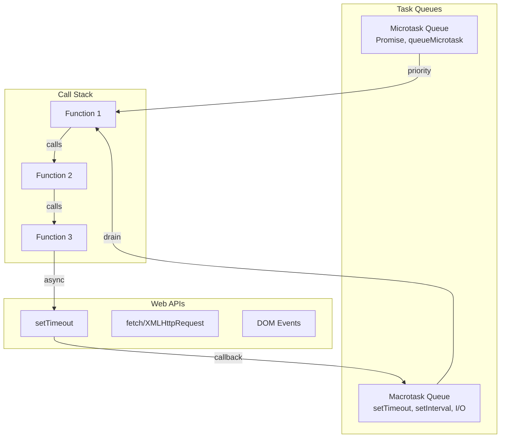
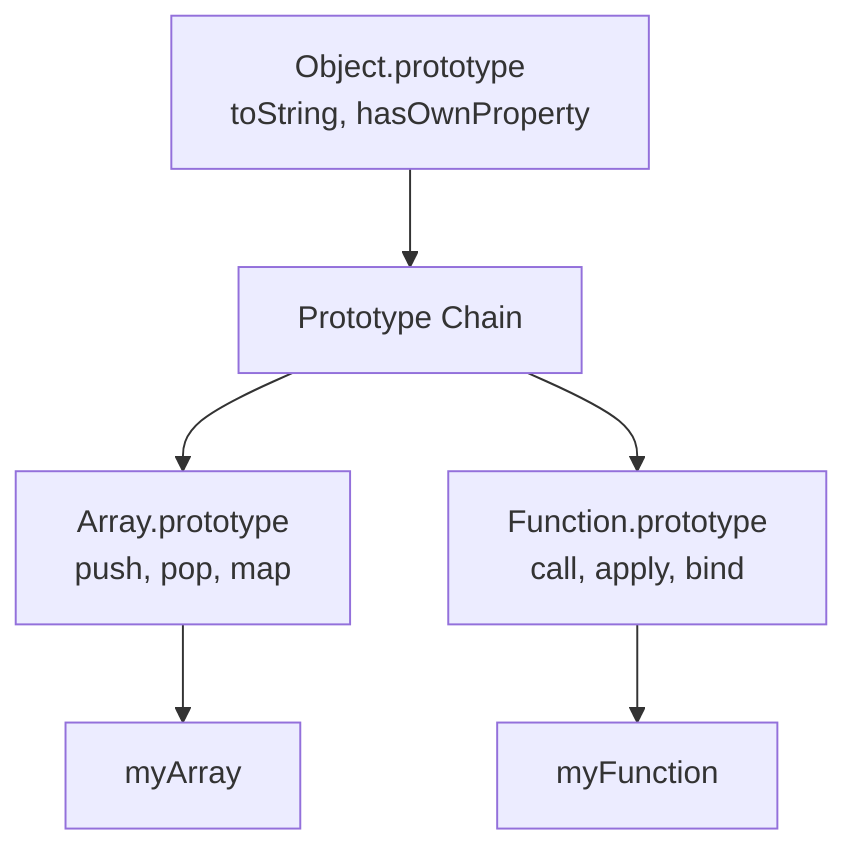

# JavaScript

## Overview

JavaScript is a high-level, dynamic, interpreted programming language. Originally created by Brendan Eich at Netscape in 1995, it has become the most widely used programming language in the world, powering both client-side and server-side development.

## Why JavaScript Matters for Interviews

- **Full-stack capability**: Frontend (React, Vue) + Backend (Node.js)
- **Event-driven model**: Event loop, async/await are frequently asked
- **V8 engine knowledge**: Understanding runtime internals
- **TypeScript**: Type system layered on JavaScript

## JavaScript at a Glance

| Feature | JavaScript |
|---------|-----------|
| **Type system** | Dynamic, weak |
| **Execution** | Interpreted + JIT |
| **Concurrency** | Event loop, single-threaded |
| **Paradigm** | Multi-paradigm (OOP, functional, procedural) |
| **Prototypes** | Prototype-based inheritance |

## Event Loop



### Execution Order

```javascript
console.log('1');              // Synchronous

setTimeout(() => {
    console.log('2');          // Macrotask
}, 0);

Promise.resolve().then(() => {
    console.log('3');          // Microtask
});

console.log('4');              // Synchronous

// Output: 1, 4, 3, 2
// Microtasks run before macrotasks
```

## Closures

```javascript
function createCounter() {
    let count = 0; // Enclosed variable
    return {
        increment: () => ++count,
        getCount: () => count
    };
}

const counter = createCounter();
counter.increment(); // 1
counter.increment(); // 2
counter.getCount();  // 2
// count is private — closure preserves scope
```

## Prototypal Inheritance



```javascript
// ES6 Classes (syntactic sugar over prototypes)
class Animal {
    constructor(name) {
        this.name = name;
    }
    speak() {
        return `${this.name} makes a sound`;
    }
}

class Dog extends Animal {
    speak() {
        return `${this.name} barks`;
    }
}

// Prototype chain: dog → Dog.prototype → Animal.prototype → Object.prototype
```

## Async Patterns

### Promises

```javascript
const fetchUser = (id) => {
    return new Promise((resolve, reject) => {
        setTimeout(() => {
            if (id > 0) resolve({ id, name: 'User' });
            else reject(new Error('Invalid ID'));
        }, 100);
    });
};

// Chaining
fetchUser(1)
    .then(user => fetchOrders(user.id))
    .then(orders => process(orders))
    .catch(err => console.error(err));
```

### Async/Await

```javascript
async function processData() {
    try {
        const user = await fetchUser(1);
        const orders = await fetchOrders(user.id);
        return process(orders);
    } catch (err) {
        console.error(err);
    }
}

// Parallel execution
async function loadDashboard() {
    const [user, orders, notifications] = await Promise.all([
        fetchUser(1),
        fetchOrders(1),
        fetchNotifications(1)
    ]);
    return { user, orders, notifications };
}
```

## TypeScript

```typescript
// Type annotations
function greet(name: string): string {
    return `Hello, ${name}!`;
}

// Generics
function identity<T>(arg: T): T {
    return arg;
}

// Interfaces
interface User {
    id: number;
    name: string;
    email?: string; // Optional
    readonly createdAt: Date; // Read-only
}

// Utility types
type Partial<T> = { [P in keyof T]?: T[P] };
type Pick<T, K extends keyof T> = { [P in K]: T[P] };
type Omit<T, K extends keyof T> = Pick<T, Exclude<keyof T, K>>;
```

## Interview Focus Areas

1. **Event loop** — Microtasks vs macrotasks, rendering pipeline
2. **Closures** — Scope chain, practical uses, memory implications
3. **this keyword** — Binding rules (default, implicit, explicit, new)
4. **Prototypes** — Prototype chain, `__proto__` vs `prototype`
5. **Promises** — States, chaining, error handling, Promise.all/race/allSettled
6. **TypeScript** — Generics, utility types, type narrowing
7. **V8 engine** — Hidden classes, inline caching, JIT compilation
8. **Module systems** — CommonJS, ESM, dynamic imports

## Related Topics

- [Node.js](./nodejs.md) — Server-side JavaScript
- [V8 Engine](./v8.md) — JavaScript runtime internals
- [React]() — Frontend framework
- [Express](../../frameworks/express/) — Node.js web framework
