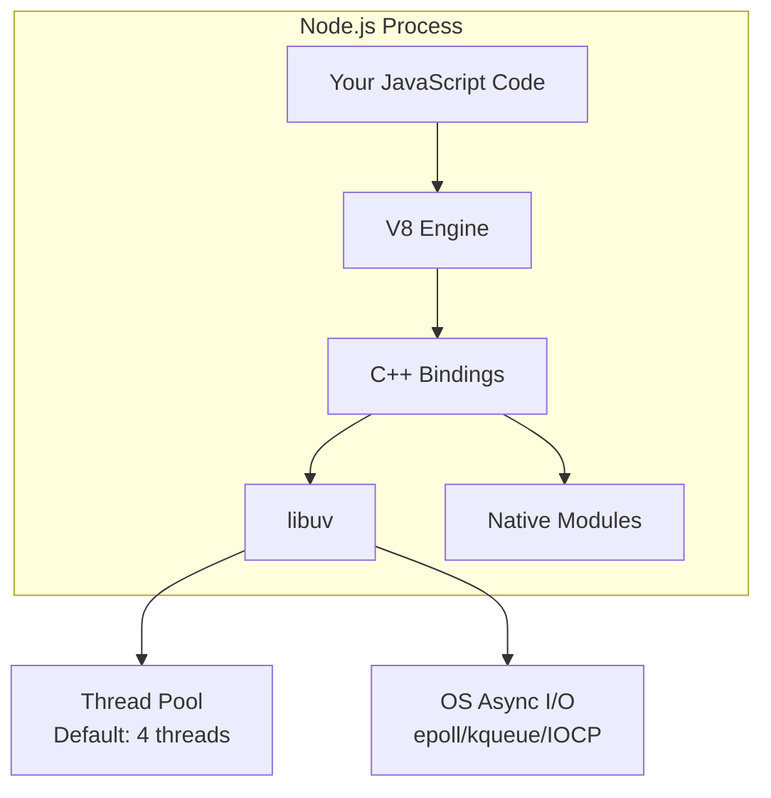
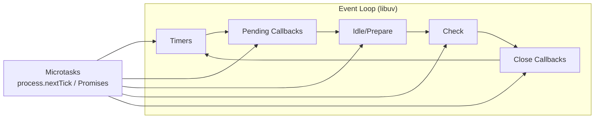
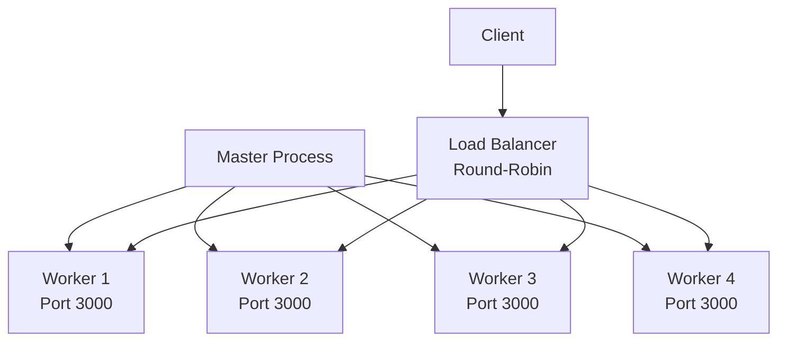
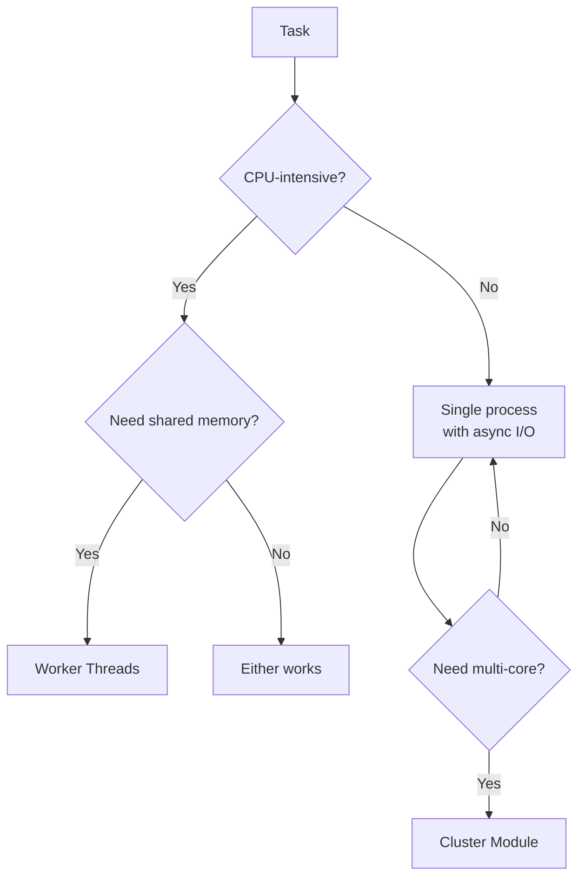
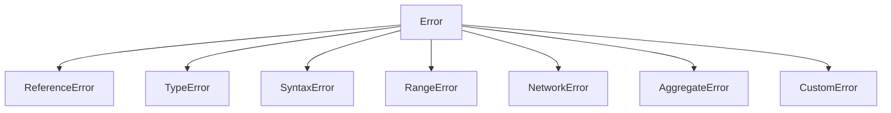

# Node.js

## Overview

Node.js is a JavaScript runtime built on Chrome's V8 engine. It uses an event-driven, non-blocking I/O model that makes it lightweight and efficient for building scalable network applications. Understanding Node.js internals is essential for backend interviews.

## Architecture



| Component | Role |
|-----------|------|
| **V8** | JavaScript execution, JIT compilation |
| **libuv** | Event loop, async I/O, thread pool |
| **C++ Bindings** | Bridge between JS and native code |
| **Native Modules** | File system, crypto, network (C/C++) |

## Event Loop

The event loop is the heart of Node.js. It's a single-threaded loop that processes callbacks and I/O events.

### Event Loop Phases



```text
   ┌───────────────────────────┐
┌─>│           timers          │  setTimeout, setInterval
│  └─────────────┬─────────────┘
│  ┌─────────────┴─────────────┐
│  │     pending callbacks     │  system callbacks (TCP errors)
│  └─────────────┬─────────────┘
│  ┌─────────────┴─────────────┐
│  │       idle, prepare       │  internal use only
│  └─────────────┬─────────────┘
│  ┌─────────────┴─────────────┐
│  │           poll            │  I/O callbacks (fs, net)
│  └─────────────┬─────────────┘
│  ┌─────────────┴─────────────┐
│  │           check           │  setImmediate callbacks
│  └─────────────┬─────────────┘
│  ┌─────────────┴─────────────┐
│  │      close callbacks      │  socket.on('close')
│  └─────────────┬─────────────┘
│                │
└────────────────┘
```

### Phase Details

| Phase | What Runs | Example |
|-------|-----------|---------|
| **Timers** | Expired timer callbacks | `setTimeout()`, `setInterval()` |
| **Pending Callbacks** | Deferred system-level callbacks | TCP errors, some I/O |
| **Idle/Prepare** | Internal (libuv bookkeeping) | — |
| **Poll** | I/O events, incoming connections | `fs.readFile()`, `http` requests |
| **Check** | `setImmediate()` callbacks | `setImmediate()` |
| **Close** | Cleanup callbacks | `socket.on('close')` |

### Microtasks vs Macrotasks

```javascript
// Microtasks run BETWEEN phases, not in a specific phase
setImmediate(() => console.log('setImmediate'));    // check phase
setTimeout(() => console.log('setTimeout'), 0);     // timers phase
Promise.resolve().then(() => console.log('Promise')); // microtask
process.nextTick(() => console.log('nextTick'));     // microtask (priority)

// Execution order:
// 1. nextTick (highest priority microtask)
// 2. Promise (microtask)
// 3. setTimeout (timers phase) OR setImmediate (check phase) — depends on timing
```

| Type | API | Priority | When |
|------|-----|----------|------|
| **Microtask** | `process.nextTick()` | Highest | After current operation, before event loop continues |
| **Microtask** | `Promise.then()` | High | After current operation, before event loop continues |
| **Macrotask** | `setTimeout()` | Normal | Timers phase |
| **Macrotask** | `setImmediate()` | Normal | Check phase |
| **Macrotask** | I/O callbacks | Normal | Poll phase |

## Streams

Streams are Node.js's way of handling reading/writing data piece by piece, rather than loading everything into memory.

### Stream Types


| Type | Description | Examples |
|------|-------------|----------|
| **Readable** | Source of data | `fs.createReadStream()`, `http.IncomingMessage` |
| **Writable** | Destination for data | `fs.createWriteStream()`, `http.ServerResponse` |
| **Duplex** | Both readable and writable | `net.Socket`, `zlib` streams |
| **Transform** | Modify data as it passes through | `zlib.createGzip()`, `crypto.createCipheriv()` |

### Backpressure

```javascript
// ✅ Proper backpressure handling
const readable = fs.createReadStream('huge-file.txt');
const writable = fs.createWriteStream('output.txt');

readable.pipe(writable);  // Node handles backpressure automatically

// ❌ Without backpressure — memory explosion
readable.on('data', (chunk) => {
  writable.write(chunk);  // writable.write() returns false but we ignore it
});
```

### Stream Modes

| Mode | Behavior | Use Case |
|------|----------|----------|
| **Flowing** | Data flows automatically | `pipe()`, `on('data')` |
| **Paused** | Must manually `read()` | Fine-grained control |

### Practical Example: File Processing Pipeline

```javascript
const { createReadStream, createWriteStream } = require('fs');
const { createGzip } = require('zlib');
const { Transform } = require('stream');

const upperCase = new Transform({
  transform(chunk, encoding, callback) {
    callback(null, chunk.toString().toUpperCase());
  }
});

createReadStream('input.txt')
  .pipe(upperCase)
  .pipe(createGzip())
  .pipe(createWriteStream('output.txt.gz'))
  .on('finish', () => console.log('Done'));
```

## Clusters

The `cluster` module allows creating child processes that share the same server port, enabling multi-core utilization.

### How Clusters Work



### Cluster Example

```javascript
const cluster = require('cluster');
const http = require('http');
const numCPUs = require('os').cpus().length;

if (cluster.isPrimary) {
  console.log(`Primary ${process.pid} is running`);

  for (let i = 0; i < numCPUs; i++) {
    cluster.fork();
  }

  cluster.on('exit', (worker) => {
    console.log(`Worker ${worker.process.pid} died, restarting...`);
    cluster.fork();  // Respawn
  });
} else {
  http.createServer((req, res) => {
    res.writeHead(200);
    res.end('Hello from worker ' + process.pid);
  }).listen(3000);

  console.log(`Worker ${process.pid} started`);
}
```

### Cluster vs Worker Threads

| Feature | Cluster | Worker Threads |
|---------|---------|----------------|
| **Memory** | Separate V8 instances | Shared memory (SharedArrayBuffer) |
| **Communication** | IPC (serialization) | `postMessage` + `SharedArrayBuffer` |
| **Use Case** | I/O-bound (HTTP servers) | CPU-bound (data processing) |
| **Overhead** | Higher (full process) | Lower (lightweight thread) |
| **Fault isolation** | Process-level | Thread-level |

## Worker Threads

```javascript
const { Worker, isMainThread, parentPort, workerData } = require('worker_threads');

if (isMainThread) {
  // Main thread
  const worker = new Worker(__filename, {
    workerData: { numbers: [1, 2, 3, 4, 5] }
  });

  worker.on('message', (result) => {
    console.log('Sum:', result);  // Sum: 15
  });
} else {
  // Worker thread
  const sum = workerData.numbers.reduce((a, b) => a + b, 0);
  parentPort.postMessage(sum);
}
```

### When to Use What



## Module System

### CommonJS (CJS)

```javascript
// math.js
const PI = 3.14159;
function add(a, b) { return a + b; }
module.exports = { PI, add };

// app.js
const { PI, add } = require('./math');
```

### ES Modules (ESM)

```javascript
// math.mjs
export const PI = 3.14159;
export function add(a, b) { return a + b; }

// app.mjs
import { PI, add } from './math.mjs';
```

### CJS vs ESM

| Feature | CommonJS | ES Modules |
|---------|----------|------------|
| **Syntax** | `require()` / `module.exports` | `import` / `export` |
| **Loading** | Synchronous | Asynchronous |
| **Analysis** | Runtime | Static (compile-time) |
| **Tree-shaking** | ❌ Not possible | ✅ Possible |
| **Circular deps** | Partial object | Live bindings |
| **Top-level await** | ❌ | ✅ |

## Error Handling

### The Error Hierarchy



### Error Handling Patterns

```javascript
// 1. try/catch with async/await
async function fetchData() {
  try {
    const data = await fetch('https://api.example.com');
    return await data.json();
  } catch (error) {
    console.error('Fetch failed:', error.message);
    throw error;  // Re-throw or handle
  }
}

// 2. Callback error-first pattern (legacy)
fs.readFile('file.txt', (err, data) => {
  if (err) {
    console.error('Read failed:', err);
    return;
  }
  console.log(data);
});

// 3. Express error middleware
app.use((err, req, res, next) => {
  console.error(err.stack);
  res.status(500).json({ error: 'Internal Server Error' });
});

// 4. Unhandled rejection handler
process.on('unhandledRejection', (reason, promise) => {
  console.error('Unhandled Rejection:', reason);
  // In production: log and exit gracefully
  process.exit(1);
});
```

## npm and Package Management

### package.json Essentials

```json
{
  "name": "my-app",
  "version": "1.0.0",
  "type": "module",
  "main": "index.js",
  "scripts": {
    "start": "node index.js",
    "test": "jest",
    "dev": "nodemon index.js"
  },
  "dependencies": {
    "express": "^4.18.0"
  },
  "devDependencies": {
    "jest": "^29.0.0"
  }
}
```

### Semantic Versioning

| Symbol | Meaning | Example |
|--------|---------|---------|
| `^4.18.0` | Compatible with 4.x.x | `>=4.18.0 <5.0.0` |
| `~4.18.0` | Compatible with 4.18.x | `>=4.18.0 <4.19.0` |
| `4.18.0` | Exact version | `4.18.0` |
| `*` | Any version | latest |

## Interview Questions

**Q: Explain the Node.js event loop phases.**

A: The event loop has 6 phases executed in order: 1) Timers — runs setTimeout/setInterval callbacks, 2) Pending callbacks — deferred system callbacks, 3) Idle/prepare — internal, 4) Poll — I/O callbacks, 5) Check — setImmediate callbacks, 6) Close — cleanup. Microtasks (process.nextTick, Promises) run between every phase, not in a specific phase. nextTick has higher priority than Promises.

**Q: When would you use clusters vs worker threads?**

A: Clusters create separate processes with independent V8 instances, best for I/O-bound work like HTTP servers. Worker threads are lightweight threads that can share memory via SharedArrayBuffer, best for CPU-intensive tasks. Clusters have higher overhead but better fault isolation. Worker threads have lower overhead and can share memory but share the same process.

**Q: How do Node.js streams handle backpressure?**

A: When a writable stream can't keep up with a readable stream, `write()` returns `false`. The readable stream should pause until the writable stream emits 'drain'. `pipe()` handles this automatically. Without backpressure handling, data buffers in memory, potentially causing out-of-memory errors.

**Q: Explain the difference between `process.nextTick()` and `setImmediate()`.**

A: `process.nextTick()` runs after the current operation completes, before the event loop continues to the next phase — it's a microtask with highest priority. `setImmediate()` runs in the check phase, after poll phase I/O callbacks. `nextTick` can starve I/O if called recursively; `setImmediate` is safer for yielding to the event loop.

**Q: How does Node.js handle the "single-threaded" misconception?**

A: Node.js's JavaScript execution is single-threaded (one V8 instance, one event loop). However, libuv uses a thread pool (default 4 threads) for blocking operations like file system access, DNS lookup, and crypto. Network I/O uses OS async mechanisms (epoll/kqueue) without threads. So Node.js is single-threaded for JS execution but multi-threaded under the hood.

## References

- [Node.js Official Documentation](https://nodejs.org/docs/)
- [libuv Design Overview](https://docs.libuv.org/en/v1.x/design.html)
- [Node.js Event Loop Timers and Phases](https://nodejs.org/en/learn/asynchronous-work/event-loop-timers-and-nexttick)
- [Streams Handbook](https://nodejs.org/en/learn/modules/backpressuring-in-streams)
- [Node.js Best Practices](https://github.com/goldbergyoni/nodebestpractices)
