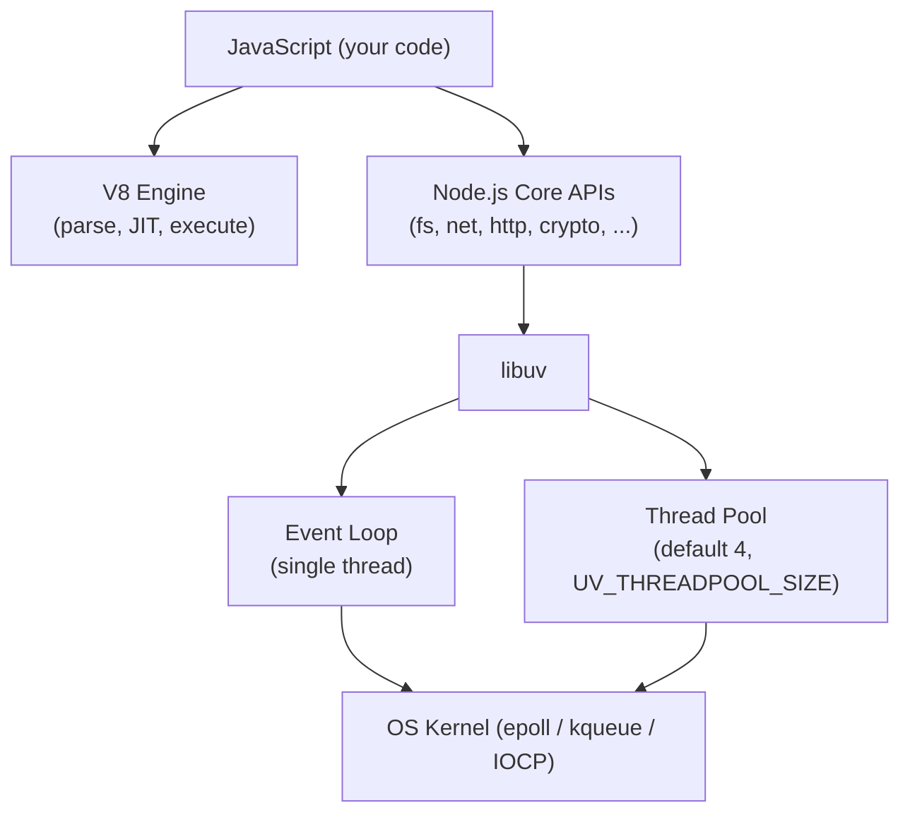
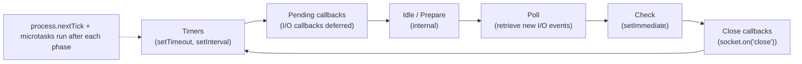
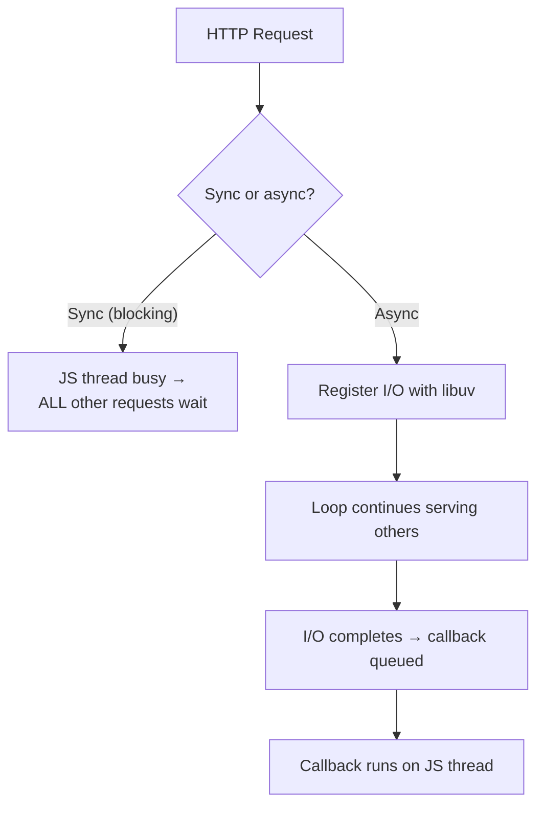

# Node.js

## Overview

Node.js is a JavaScript runtime built on **V8** (the same engine as Chrome) and **libuv**, a C library that provides the event loop and a thread pool for asynchronous I/O. It made **event-driven, non-blocking I/O** the default programming model for servers: one process, one thread of JavaScript, and a kernel-level poll for thousands of concurrent connections.

Node was created by Ryan Dahl in 2009 and is maintained by the OpenJS Foundation. It ships its own package manager (npm) and module system (CommonJS, with ESM support growing).

See [V8 Engine](./v8.md) for how the engine executes JavaScript, and [JavaScript Overview](./README.md) for the language itself.

## Architecture



- **V8** executes JavaScript.
- **libuv** implements the event loop and abstracts platform differences (`epoll` on Linux, `kqueue` on BSD/macOS, IOCP on Windows).
- **Thread pool** handles operations V8/libuv cannot do asynchronously at the kernel level: DNS lookups, `fs` operations (except a few), `crypto` (some), `zlib`.

## The Event Loop

The event loop runs in phases, in order, each with its own queue:



1. **Timers** — run expired `setTimeout` / `setInterval` callbacks.
2. **Pending callbacks** — I/O callbacks deferred from the previous loop iteration.
3. **Idle / Prepare** — internal use.
4. **Poll** — the most important phase: blocks waiting for new I/O events, then runs their callbacks. If the check phase has queued `setImmediate`s, poll does not block.
5. **Check** — `setImmediate` callbacks.
6. **Close callbacks** — e.g., `socket.on('close')`.

**Microtasks and `process.nextTick`** run *after the current operation completes* — including between each phase and even inside callback execution. `process.nextTick` runs before promise microtasks (in practice before the next microtask checkpoint), which is why `process.nextTick` can starve the loop if used recursively.

### Execution-order examples (classic interview traps)

```js
setTimeout(() => console.log('timeout'), 0);
setImmediate(() => console.log('immediate'));
// Order depends on machine load — in poll phase vs timers phase timing.
// Inside an I/O callback, setImmediate ALWAYS wins over setTimeout(0).

process.nextTick(() => console.log('nextTick'));
Promise.resolve().then(() => console.log('promise'));
console.log('sync');
// sync → nextTick → promise
```

## Blocking vs Non-Blocking

- **Blocking** methods (`fs.readFileSync`, `child_process.execSync`, `crypto.pbkdf2Sync`) tie up the single JS thread — one long sync call stalls *all* requests.
- **Non-blocking** methods return immediately and deliver results via callbacks/promises, letting the loop serve other work.



Rule of thumb: **never block the event loop** in server code. Offload CPU-heavy work to `worker_threads` or child processes.

## Concurrency Models in Node

| Mechanism | Runs | Use case |
|---|---|---|
| Event loop | Single thread | Default; high-concurrency I/O servers |
| `worker_threads` | True parallel threads (V8 isolates) | CPU-bound work sharing memory via `SharedArrayBuffer` |
| `cluster` | Multiple processes, same port, shared OS load balancing | Multi-core HTTP servers |
| `child_process` | Separate processes | Heavy isolation, exec of external tools |

## Streams

Streams process data **chunk by chunk** instead of all at once — essential for large files, HTTP bodies, and backpressure.

- **Readable** — source (`fs.createReadStream`, HTTP request).
- **Writable** — sink (`fs.createWriteStream`, HTTP response).
- **Duplex** — both (TCP sockets).
- **Transform** — duplex that modifies data (`zlib`, `crypto`).

**Backpressure**: when a consumer is slower than the producer, `readable.pipe()` and `stream.pipeline()` handle flow control by pausing the source. `stream.pipeline()` propagates errors and cleans up properly — prefer it over manual `.pipe()`:

```js
const { pipeline } = require('node:stream/promises');
const { createReadStream, createWriteStream } = require('node:fs');

await pipeline(
  createReadStream('big.csv'),
  createWriteStream('copy.csv')
);
```

## Buffer and TypedArrays

Node added `Buffer` (a `Uint8Array` subclass) for binary data — required wherever text meets bytes: sockets, file I/O, crypto, compression. Convert deliberately: `Buffer.from(str, 'utf8')`, `buf.toString('base64')`, `new TextEncoder()/TextDecoder()`. Sloppy encodings are a common source of subtle bugs (e.g., emojis/multibyte characters split across chunks).

## Modules: CommonJS and ESM

- **CommonJS**: `require()` / `module.exports` — synchronous, historically default.
- **ES Modules**: `import` / `export` — static, tree-shakeable, the standard going forward; `.mjs` extension or `"type": "module"` in `package.json`.
- Node 22+ supports `require(esm)` for many ESM graphs; Node 24 ships it stable.

## Package Management

npm is bundled. Alternatives: **yarn** (classic and berry), **pnpm** (hard-linked, content-addressable store, saves disk), **bun** (fast runtime + package manager + bundler + test runner in one). Key concepts: `package.json` (dependencies, scripts, `engines`), `package-lock.json` (reproducible installs), semver ranges (`^`, `~`), and `node_modules` layout.

## Error Handling

```js
process.on('uncaughtException', (err) => { /* last resort — log and exit */ });
process.on('unhandledRejection', (err) => { /* promise rejected with no handler */ });
```

Best practice: let errors propagate to an error-handling middleware / top-level handler; **never swallow** `unhandledRejection` silently in production — since Node 15, unhandled rejections crash the process by default (which is safer than leaking corrupt state).

## Security Basics

- Keep the runtime and dependencies patched; audit with `npm audit` / `pnpm audit`.
- Set `engines` and use lockfiles; beware **supply-chain attacks** (typosquatting, compromised packages).
- Validate and sanitize input; use `helmet` for HTTP headers.
- Use `Buffer`/`crypto.timingSafeEqual` for secret comparisons; avoid `eval` and `Function` with untrusted input.
- Node's experimental **permission model** (`--permission`) and V8 sandbox limit what code can do.

## Release Cadence (as of mid-2026)

| Line | Codename | Status | EOL |
|---|---|---|---|
| v24 | Krypton | **Active LTS** (recommended) | Apr 2028 |
| v22 | Jod | LTS (maintenance) | Apr 2027 |
| v26 | — | Current (non-LTS until Oct 2026) | — |

From **Node 27 (Oct 2026)** the release cycle becomes annual, and every major version will enter LTS — the odd/even distinction disappears. (Sources: nodejs.org releases page, OpenJS Foundation.)

## Interview Questions

### Q: Is Node.js single-threaded?

The **JavaScript execution** is single-threaded, but the process is not: libuv maintains a **thread pool** (default 4 threads) for filesystem, DNS, crypto, and zlib work, and `worker_threads` allow true multi-threading. I/O concurrency comes from the event loop + kernel polling, not threads.

### Q: What is the difference between `process.nextTick` and `setImmediate`?

`process.nextTick` schedules a callback to run **before** the next phase (even before promise microtasks in practice); `setImmediate` schedules it for the **check phase** (later in the same loop iteration). Because nextTick can interleave inside callbacks, deep nextTick recursion starves the event loop — it is for small, high-priority work only.

### Q: Why does `setTimeout(fn, 0)` sometimes run after `setImmediate(fn)`?

If the loop enters the **timers phase** first, `setTimeout` wins; if it enters **poll/check** first, `setImmediate` wins. Inside an I/O callback, the poll phase has already run, so `setImmediate` (check phase) always beats `setTimeout(0)` (next timers phase).

### Q: How do you handle CPU-heavy tasks without blocking the server?

Use `worker_threads` (parallel JS with memory sharing), `cluster` (multi-process), or move work out-of-process/off-box (job queues — see [RabbitMQ](../../distributed/messaging/rabbitmq.md) and [Kafka](../../distributed/messaging/kafka.md)).

### Q: What is backpressure and why does it matter?

When a data consumer (e.g., a slow HTTP client) can't keep up with the producer (e.g., a file being read), unbounded buffering exhausts memory. Streams implement flow control — the producer pauses until the consumer catches up — so memory usage stays bounded regardless of data size.

## References

- Node.js Official Documentation — https://nodejs.org/docs/latest/api/
- The Node.js Event Loop, Timers, and `process.nextTick()` — https://nodejs.org/en/learn/asynchronous-work/event-loop-timers-and-nexttick
- Node.js Releases (LTS schedule) — https://nodejs.org/en/about/previous-releases
- libuv design overview — https://docs.libuv.org/en/v1.x/design.html
- V8 Blog (engine that powers Node) — https://v8.dev/blog

## Related Topics

- [V8 Engine](./v8.md) — how Node executes JavaScript
- [JavaScript Overview](./README.md) — language fundamentals, promises, async/await
- [Express.js](../../frameworks/express/README.md) — the most common Node web framework
- [OS: Processes and Threads](../../os/processes/README.md) — what `worker_threads` and `cluster` map to at the OS level
- [Concurrency](../../concurrency/overview.md) — async/await, coroutines, and thread pools
- [Backend Engineering](../../backend/README.md) — HTTP APIs, REST, GraphQL, gRPC built on Node
