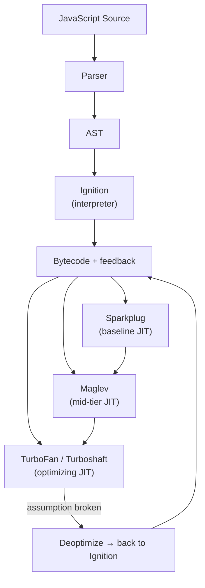
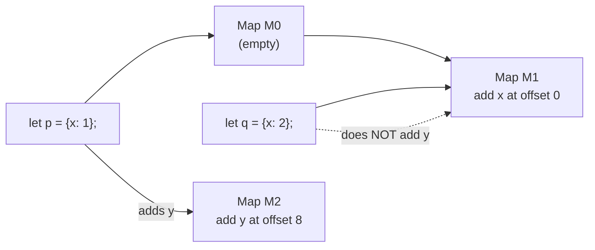
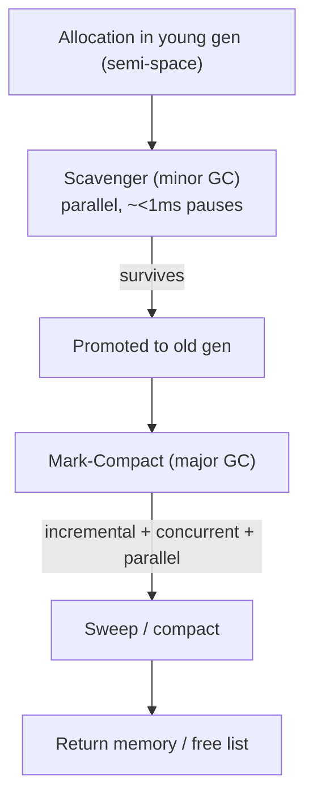

# V8 Engine

## Overview

V8 is Google's open-source JavaScript and WebAssembly engine, written in C++. It powers Chrome, Chromium-based browsers, **Node.js**, Deno, Electron, and many edge/serverless runtimes. V8 compiles JavaScript to machine code at runtime (JIT), which is why the same source can run dramatically faster in V8 than in a pure interpreter — and why "hot code" behaves differently from cold code.

See [Node.js](./nodejs.md) for the runtime built on top of V8, and [JavaScript Overview](./README.md) for the language.

## Compilation Pipeline (four tiers)

Modern V8 (12.x / Chrome 120+) executes JavaScript through four tiers:

| Tier | What it does | Compile cost | Execution speed | Trigger (approx.) |
|---|---|---|---|---|
| **Ignition** | Bytecode interpreter | Instant | Slow | Always (first execution) |
| **Sparkplug** | Baseline JIT (non-optimizing) | ~10 µs/function | Moderate | ~8 calls |
| **Maglev** | Mid-tier optimizing JIT | ~100 µs/function | Fast | ~500 calls |
| **TurboFan** | Top-tier optimizing JIT | ~1 ms/function | Near-native | ~6000 calls |



- **Ignition** turns the AST into compact **bytecode** and executes it. It also records **type feedback** (feedback vectors) used later.
- **Sparkplug** (2021) compiles bytecode to machine code with no analysis — "a switch statement inside a for loop" — giving a fast baseline for moderately hot functions.
- **Maglev** (2023) is a lightweight optimizing compiler using SSA/CFG; much faster to compile than TurboFan.
- **TurboFan** is the full optimizing compiler. Since V8 11.x it uses the **Turboshaft** IR as its new optimizing pipeline backend.

The tier-up thresholds (8 / 500 / 6000 calls) are why benchmarks need warm-up, and why one-off functions stay in the interpreter.

## Hidden Classes (Maps) and Inline Caches

JavaScript objects are dynamic: properties can be added/removed at any time. V8 gives objects with the same **shape** a shared **hidden class (Map)** that describes the layout (offsets of properties), enabling O(1) property access instead of dictionary lookups.



**Inline Caches (ICs)** attach the observed Map at each property access site. When a site sees the same shape repeatedly, V8 emits a fast path ("check Map, then load at fixed offset"). When it sees too many different shapes (typically >4), the site becomes **megamorphic** and falls back to a generic lookup — a common reason "dynamic" JavaScript can't be optimized.

Best practices that keep shapes stable: initialize all properties in the constructor, don't add/delete properties after the fact, keep object shapes consistent across call sites.

## Speculative Optimization and Deoptimization

TurboFan makes **speculative assumptions** from type feedback — e.g., "this `+` always receives numbers", "this property always has Map M". The compiled code checks these assumptions inline; if one fails, V8 **deoptimizes**: it throws away the optimized code and resumes in the interpreter with the new feedback, then may re-optimize later.

```js
function add(a, b) { return a + b; }
for (let i = 0; i < 100000; i++) add(1, 2);   // optimized for numbers
add('hello', 'world');                        // assumption broken → deopt
```

This is why type-stable hot functions (same input types) perform best, and why `undefined`/`NaN`/polymorphic inputs can tank performance.

## Memory Management: Heap and Orinoco GC

V8 manages its own heap:

- **Young generation** (semi-spaces, scavenger) — fast, parallel, generational.
- **Old generation** — mark-compact; **concurrent, parallel, and incremental** marking to keep pauses short.
- **Large object space**, **code space**, and **pointer compression cage** (32-bit compressed pointers within a 4 GB region — default in 8.0+, halves reference cost).
- **Orinoco** is the collective name for V8's GC design: incremental marking, concurrent sweeping, parallel compaction, and (young gen) parallel scavenging.



**The V8 Sandbox** (enabled by default in V8 13 / Chrome 123+) isolates the heap behind pointer tables so memory-corruption bugs in one component can't reach the rest of the process.

## WebAssembly and JIT-less Mode

- **WebAssembly (Wasm)** is compiled ahead-of-time (Liftoff baseline, TurboFan optimizing) — no interpretation tier. Wasm and JS share the same heap but have separate sandboxes.
- **JIT-less mode** (`--jitless`) disables all JIT compilers for security-critical environments (e.g., JavaScriptCore comparisons aside, V8's `--jitless` supports only the interpreter).

## Interview Questions

### Q: What is a hidden class (Map) in V8?

A hidden class describes the **shape** of an object — the set and offsets of its properties. Objects with the same shape share one Map, so property access compiles to a Map check plus a fixed offset load instead of a hash lookup. Adding or deleting a property transitions to a new Map, which is why stable shapes are faster.

### Q: What is an inline cache and why does monomorphism matter?

An IC records which Map(s) were observed at a property access site. Monomorphic sites (one shape) get a fast path; polymorphic sites (2–4 shapes) get a small dispatch; **megamorphic** sites (>4 shapes) fall back to slow generic lookup and often prevent optimization.

### Q: Why does V8 have multiple compiler tiers instead of one good compiler?

There's a trade-off between **compile time** and **execution time**. Optimizing compilation is expensive (~1 ms/function for TurboFan), so it's only worth it for very hot code. The tiers let V8 start fast (Ignition), get a decent baseline quickly (Sparkplug), optimize moderately hot code cheaply (Maglev), and reserve full optimization for the hottest functions (TurboFan). Deoptimization provides a safe fallback when speculation fails.

### Q: How does V8's garbage collector differ from a JVM's?

Both are generational, but V8's Orinoco focuses on **low pauses** via concurrent/incremental marking and parallel scavenging, tuned for interactive browser workloads, while JVM collectors span a wider range (throughput-oriented Parallel, latency-oriented ZGC/Shenandoah) with more tuning knobs. V8 also uses **pointer compression** by default and, since V8 13, a memory **sandbox** for security isolation. (See [Java GC](../java/gc.md) for the JVM side.)

### Q: Why does code run slowly on the first call and speed up later?

Cold functions run in the interpreter (Ignition) while gathering type feedback. Once a function passes tier-up thresholds, V8 compiles it with Sparkplug, then Maglev, then TurboFan, each faster than the last. Benchmarks and server workloads "warm up" until hot functions reach optimized machine code — and any deoptimization resets that progress.

## References

- V8 Official Blog — https://v8.dev/blog
- V8 Docs: Ignition (interpreter) — https://v8.dev/docs/ignition
- *Launching Ignition and TurboFan* (2017 architecture rewrite) — https://v8.dev/blog/launching-ignition-and-turbofan
- *Sparkplug — a non-optimizing JavaScript compiler* — https://v8.dev/blog/sparkplug
- *Maglev — V8's fastest optimizing JIT* — https://v8.dev/blog/maglev
- V8 Docs: Memory / pointer compression — https://v8.dev/blog/pointer-compression
- V8 Sandbox design — https://v8.dev/blog/sandbox

## Related Topics

- [Node.js](./nodejs.md) — the runtime that embeds V8
- [JavaScript Overview](./README.md) — closures, prototypes, promises
- [Java GC](../java/gc.md) — a comparison of GC designs across runtimes
- [Computer Architecture](../../arch/overview.md) — what JIT compilers exploit (caches, pipelining)
