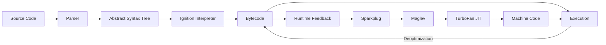
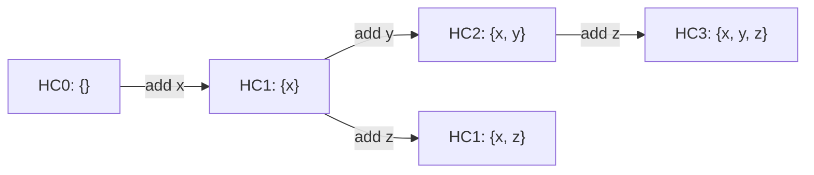
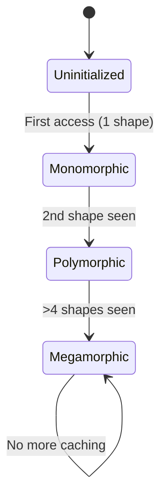
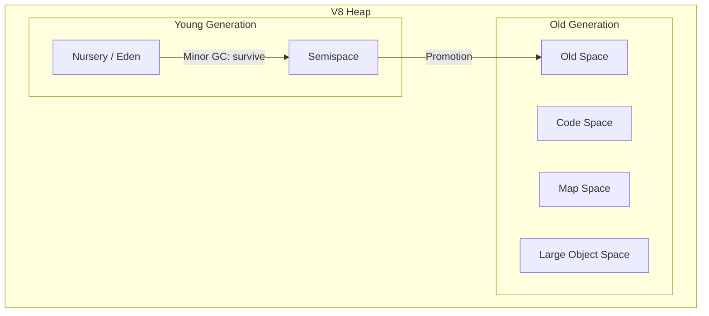

# V8 Engine

## Overview

V8 is Google's open-source JavaScript and WebAssembly engine, written in C++. It powers Chrome, Node.js, Deno, and Electron. Understanding V8's internals is essential for writing high-performance JavaScript and answering systems-level interview questions.

## V8 Execution Pipeline



### Pipeline Stages

| Stage | Type | Purpose |
|-------|------|---------|
| **Parser** | Frontend | Tokenizes source → builds AST |
| **Ignition** | Interpreter | AST → bytecode; collects type feedback |
| **Sparkplug** | Baseline compiler | Bytecode → naive machine code (fast compile) |
| **Maglev** | Mid-tier compiler | Uses feedback for better optimizations |
| **TurboFan** | Optimizing compiler | Hot code → highly optimized machine code |

### Why Multiple Tiers?

Compiling all code with TurboFan would waste time and memory. Instead:

- **Ignition** starts quickly with bytecode (low startup cost)
- **Sparkplug** produces baseline machine code without much optimization
- **Maglev** uses collected feedback for mid-tier optimizations
- **TurboFan** only compiles the hottest functions with heavy optimization
- If assumptions break → **deoptimization** falls back to Ignition

## Hidden Classes (Maps / Shapes)

JavaScript objects have no fixed schema. V8 creates **hidden classes** (internally called "Maps" or "Shapes") to give objects a predictable internal layout.

### How Hidden Classes Work

```javascript
// Both objects share the same hidden class
const obj1 = { x: 1, y: 2 };  // Hidden Class A: {x: offset 0, y: offset 1}
const obj2 = { x: 3, y: 4 };  // Hidden Class A (same!)

// Different property order = different hidden class
const obj3 = { y: 1, x: 2 };  // Hidden Class B: {y: offset 0, x: offset 1}
```

### Hidden Class Transitions



V8 creates a **transition chain** — adding properties in the same order reuses existing hidden classes. Adding them in different order creates new chains.

### Why This Matters

```javascript
// ✅ Good: consistent structure → shared hidden class → fast access
function createUser(name, age) {
  return { name, age };  // Always same order
}

// ❌ Bad: inconsistent structure → different hidden classes → slower
function createUser(bad, data) {
  const obj = {};
  if (bad) obj.name = data;  // Conditional property addition
  else obj.age = data;        // Different transition chain
  return obj;
}
```

### Destructive Operations

These operations **break hidden class stability**:

```javascript
delete obj.x;           // ❌ Triggers hidden class change
obj[newKey] = value;    // ❌ Dynamic key addition
```

**Interview tip**: Always prefer `Object.freeze()` or consistent property ordering.

## Inline Caching (IC)

Inline caching remembers where properties were found, so V8 doesn't search the prototype chain every time.

### IC States



| State | Shapes Seen | Performance |
|-------|------------|-------------|
| **Uninitialized** | 0 | Full lookup |
| **Monomorphic** | 1 | Fastest — direct memory access |
| **Polymorphic** | 2–4 | Linear search through cache |
| **Megamorphic** | >4 | No caching, full prototype walk |

### Practical Impact

```javascript
// ✅ Monomorphic IC — all calls see the same shape
function getX(obj) { return obj.x; }
getX({ x: 1, y: 2 });  // shape A
getX({ x: 3, y: 4 });  // shape A — cache hit!

// ❌ Megamorphic IC — too many shapes
function getX(obj) { return obj.x; }
getX({ x: 1 });          // shape 1
getX({ x: 1, y: 2 });   // shape 2
getX({ x: 1, z: 3 });   // shape 3
getX({ x: 1, a: 4 });   // shape 4
getX({ x: 1, b: 5 });   // shape 5 — megamorphic!
```

## JIT Compilation

### Ignition (Interpreter)

- Executes bytecode directly
- Records **type feedback** in feedback vectors
- Fast startup, slower execution
- Feedback includes: property access patterns, call targets, arithmetic types

### Sparkplug (Baseline Compiler)

- Compiles bytecode to machine code **without optimization**
- Near-zero compile time
- Mirrors bytecode 1:1 but in native code
- Fills the gap between Ignition and Maglev

### Maglev (Mid-Tier Compiler)

- Uses feedback from Ignition to generate better code
- Faster compile than TurboFan, better code than Sparkplug
- Handles common patterns efficiently
- Introduced in V8 v11.7 (2023)

### TurboFan (Optimizing Compiler)

- The heavyweight optimizer
- Builds a **sea-of-nodes** IR (intermediate representation)
- Applies optimizations: inlining, escape analysis, loop-invariant code motion, dead code elimination
- Produces highly specialized machine code

### Optimization & Deoptimization

```javascript
function add(a, b) {
  return a + b;
}

// Phase 1: Ignition executes bytecode, records feedback
add(1, 2);      // feedback: a=int, b=int
add(3, 4);      // feedback confirmed: integers

// Phase 2: TurboFan compiles optimized integer-addition
add(5, 6);      // runs fast compiled code

// Phase 3: Assumption breaks!
add("hello", " world");  // strings, not ints!
// → Deoptimization: discard compiled code, fall back to Ignition
// → Re-collect feedback, may recompile with type checks
```

**Deoptimization** is expensive:
- Discards optimized machine code
- Restarts execution from bytecode
- Must rebuild type feedback
- A hot loop that repeatedly deoptimizes can be 10–100x slower

## Memory Management

### Heap Structure



| Space | Purpose |
|-------|---------|
| **Nursery** | New allocations (small, short-lived) |
| **Semispace** | Survivor space for young gen GC |
| **Old Space** | Long-lived objects promoted from young gen |
| **Code Space** | Compiled JIT code |
| **Map Space** | Hidden classes (Maps) |
| **Large Object Space** | Objects > size threshold (not moved by GC) |

### Garbage Collection

**Young Generation (Minor GC / Scavenger):**
- Uses **Semi-Space copying** algorithm
- Fast, frequent (~ms pauses)
- Copies live objects from one semispace to the other
- Dead objects are simply abandoned

**Old Generation (Major GC / Mark-Sweep-Compact):**
- Uses **Mark-Sweep-Compact**
- Slower, less frequent
- **Mark**: trace from roots, mark reachable objects
- **Sweep**: reclaim unmarked objects
- **Compact**: defragment memory to reduce fragmentation

**Orinoco (Concurrent GC):**
- Concurrent marking — done in background threads
- Incremental marking — small chunks per GC cycle
- Parallel scavenging — multiple threads for young gen
- Idle-time GC — uses idle periods for collection

### SMI (Small Integer Optimization)

V8 represents values using **tagged pointers**:

- **SMI (Small Integer)**: 31-bit integer stored directly in the pointer (no heap allocation)
- **HeapObject**: larger values stored on the heap, pointer tagged

```javascript
let x = 42;        // SMI — stored inline, fast
let y = 3.14;      // HeapObject — allocated on heap, slower
let z = 4294967296; // HeapObject — too large for SMI
```

## Optimization Best Practices

### Do's

```javascript
// ✅ Consistent object shapes
const point = { x: 10, y: 20 };

// ✅ Monomorphic functions
function process(item) { return item.value * 2; }

// ✅ Use arrays with consistent element types
const nums = [1, 2, 3, 4];  // PACKED_SMI_ELEMENTS

// ✅ Prefer for-loops over for-in
for (let i = 0; i < arr.length; i++) { /* ... */ }
```

### Don'ts

```javascript
// ❌ Changing object shape
const obj = { x: 1 };
delete obj.x;         // shape change
obj[newKey] = value;  // dynamic key

// ❌ Mixed array types
const arr = [1, "two", 3, null];  // PACKED_ELEMENTS (slow)

// ❌ Polymorphic function
function add(a, b) { return a + b; }
add(1, 2);          // int path compiled
add("a", "b");      // deoptimization!

// ❌ Closures capturing too much
function outer() {
  const huge = new Array(1000000);
  return function inner() { /* doesn't use huge, but it's captured */ };
}
```

## How V8 Handles Common Operations

### Property Access

```javascript
obj.x
// 1. Check hidden class
// 2. Look up offset from inline cache
// 3. Read memory at (object_base + offset)
// Monomorphic IC: steps 1-3 are a single pointer dereference
```

### Function Calls

```javascript
obj.method()
// 1. Look up method on object (hidden class → prototype chain)
// 2. Inline cache stores the function reference
// 3. If hot, V8 may inline the function body
// 4. Polymorphic calls → branch on cached function types
```

### Array Operations

```javascript
const arr = [1, 2, 3];
// V8 tracks "elements kind":
// PACKED_SMI_ELEMENTS → all small ints (fastest)
// PACKED_DOUBLE_ELEMENTS → has floats
// PACKED_ELEMENTS → has objects/strings
// HOLEY_* → has holes (arr[5] without filling 3,4)
```

## Interview Questions

**Q: What are hidden classes and why does V8 use them?**

A: Hidden classes (Maps) are internal structures V8 creates to give JavaScript objects a predictable memory layout. Since JS objects are dynamic, V8 tracks property addition order to create transition chains. Objects with the same hidden class can be accessed via fixed offsets, turning dynamic property lookups into simple pointer arithmetic.

**Q: Explain inline caching and its states.**

A: Inline caching (IC) remembers where a property was found during access. Monomorphic IC (1 shape) is fastest — direct memory access. Polymorphic IC (2–4 shapes) does a linear search. Megamorphic IC (>4 shapes) disables caching entirely, requiring full prototype chain traversal.

**Q: What causes deoptimization and why is it expensive?**

A: Deoptimization occurs when optimized code's assumptions are violated — type changes, shape changes, or overflow from int to float. V8 discards the optimized machine code and falls back to bytecode execution. It's expensive because: 1) optimized code is lost, 2) execution restarts from bytecode, 3) feedback must be rebuilt, 4) recompilation may not happen again.

**Q: How does V8's garbage collector work?**

A: V8 uses a generational GC. Young generation uses semi-space copying (fast, frequent). Old generation uses mark-sweep-compact (slower, less frequent). Orinoco improvements add concurrent marking, incremental marking, parallel scavenging, and idle-time GC to minimize pause times.

**Q: What is the SMI optimization?**

A: Small Integers (SMIs) are 31-bit integers stored directly in the pointer using tagged pointers — no heap allocation needed. This makes integer arithmetic extremely fast. Larger numbers (floats, big ints) are allocated on the heap as HeapObjects, which is slower.

## References

- [V8 Official Blog](https://v8.dev/blog)
- [V8: Ignition and TurboFan](https://v8.dev/blog/launching-ignition-and-turbofan)
- [Hidden Classes and Inline Caching](https://mrale.ph/blog/2012/06/03/explaining-js-vms-in-js-inline-caches.html)
- [V8 Orinoco GC](https://v8.dev/blog/orinoco-gc)
- [Deep JavaScript Internals](https://dev.to/pratik_12b3f8bf3b50e48bae/deep-javascript-internals-how-v8-really-makes-your-code-fast-128k)
- [V8 in Node.js Architecture](https://www.thenodebook.com/node-arch/v8-engine-intro)
