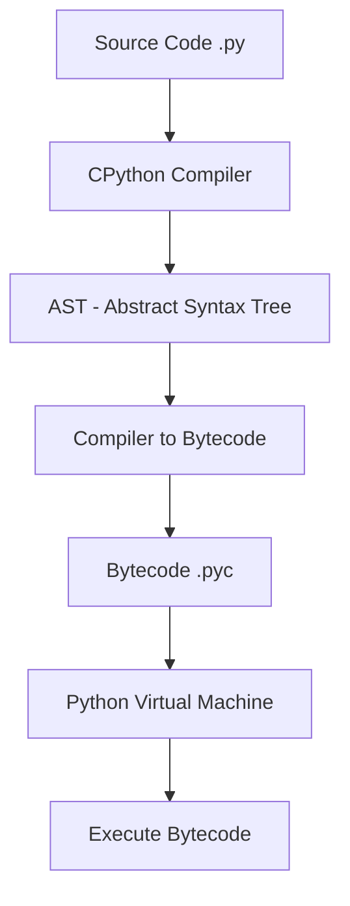

# Python for Placement Preparation

## Overview

Python is a high-level, interpreted, general-purpose programming language created by **Guido van Rossum** and first released in 1991. Its design philosophy emphasizes code readability with the use of significant indentation. Python is dynamically typed and garbage-collected, and supports multiple programming paradigms including structured, object-oriented, and functional programming.

Python consistently ranks among the top programming languages worldwide (TIOBE Index, Stack Overflow surveys). It is the language of choice for **data science, machine learning, web development, automation, scripting, and systems programming**.

---

## Python 2 vs Python 3

| Feature | Python 2 | Python 3 |
|---|---|---|
| Release | 2000 | 2008 |
| End of Life | January 1, 2020 | Active (3.13+) |
| Print | `print "hello"` | `print("hello")` |
| Integer Division | `5 / 2 = 2` | `5 / 2 = 2.5` |
| Unicode | Default ASCII strings | Default Unicode strings |
| `range()` | Returns list | Returns iterator |
| `input()` | `raw_input()` reads str | `input()` reads str |
| Exceptions | `except ValueError, e:` | `except ValueError as e:` |
| Iterators | `.next()` | `next()` builtin |
| Type Hints | Not supported | PEP 484+ |

> **Interview Tip:** Python 2 is completely dead. All modern interviews expect Python 3.8+ knowledge. Know the key differences for historical questions.

---

## Why Python for Interviews?

### Advantages
- **Concise syntax** — Solve problems in fewer lines than Java/C++
- **Rich standard library** — `collections`, `itertools`, `functools`, `heapq`, `bisect`
- **Built-in data structures** — `list`, `dict`, `set`, `tuple` are first-class
- **Dynamic typing** — Faster prototyping during timed interviews
- **Readability** — Easier for interviewers to follow your logic

### Disadvantages
- **Slower execution** — Interpreted, ~100x slower than C for CPU-bound tasks
- **GIL** — Limits true parallelism in threads (covered in [gil.md](gil.md))
- **Dynamic typing bugs** — Type errors caught only at runtime (mitigated by [typing.md](typing.md))

---

## Key Language Features

### 1. Everything Is an Object

```python
# Even functions, classes, and modules are objects
x = 42
print(type(x))        # <class 'int'>
print(id(x))          # Memory address
print(isinstance(x, int))  # True

# Functions are first-class objects
def greet(name):
    return f"Hello, {name}"

fn = greet  # Assign function to variable
print(fn("World"))  # "Hello, World"
```

### 2. Dynamic Typing

```python
x = 10       # x is an int
x = "hello"  # now x is a str — no error
x = [1, 2]   # now x is a list
```

### 3. Indentation-Based Blocks

```python
# No curly braces — indentation defines scope
if True:
    print("indented block")
    if True:
        print("nested block")
```

### 4. List Comprehensions

```python
# Concise way to create lists
squares = [x**2 for x in range(10)]
evens = [x for x in range(20) if x % 2 == 0]
matrix = [[i * j for j in range(3)] for i in range(3)]
```

### 5. Multiple Assignment and Unpacking

```python
a, b, c = 1, 2, 3
a, b = b, a  # Swap without temp variable

first, *rest = [1, 2, 3, 4, 5]
# first = 1, rest = [2, 3, 4, 5]

*init, last = [1, 2, 3, 4, 5]
# init = [1, 2, 3, 4], last = 5
```

### 6. Slicing

```python
lst = [0, 1, 2, 3, 4, 5]
lst[1:4]     # [1, 2, 3]
lst[::-1]    # [5, 4, 3, 2, 1, 0] — reverse
lst[::2]     # [0, 2, 4] — every other element
lst[-3:]     # [3, 4, 5] — last three
```

### 7. Dictionary Operations

```python
d = {"a": 1, "b": 2, "c": 3}

# Dictionary comprehension
squared = {k: v**2 for k, v in d.items()}

# Merge (Python 3.9+)
d1 = {"a": 1}
d2 = {"b": 2}
merged = d1 | d2  # {"a": 1, "b": 2}

# Default values
value = d.get("missing", "default")
```

### 8. Walrus Operator (Python 3.8+)

```python
# Assignment expression — assign and use in same expression
data = [1, 2, 3, 4, 5, 6, 7, 8]
if (n := len(data)) > 5:
    print(f"List has {n} elements, which is too many")

# Useful in while loops
while (line := input()) != "quit":
    print(f"You said: {line}")
```

---

## Python Execution Model



1. **Source code** (`.py`) is read by the CPython interpreter
2. Parsed into an **Abstract Syntax Tree (AST)
3. Compiled to **bytecode** (`.pyc` files in `__pycache__/`)
4. The **Python Virtual Machine (PVM)** executes bytecode instructions

---

## Python Standard Library Highlights

| Module | Use Case |
|---|---|
| `collections` | `defaultdict`, `Counter`, `deque`, `namedtuple`, `OrderedDict` |
| `itertools` | `chain`, `product`, `permutations`, `combinations`, `groupby` |
| `functools` | `lru_cache`, `partial`, `reduce`, `total_ordering` |
| `heapq` | Min-heap, `nlargest`, `nsmallest` |
| `bisect` | Binary search on sorted lists |
| `copy` | `deepcopy` for nested mutable objects |
| `re` | Regular expressions |
| `json` | JSON serialization/deserialization |
| `datetime` | Date and time manipulation |
| `typing` | Type hints (see [typing.md](typing.md)) |

```python
from collections import defaultdict, Counter
from itertools import chain, combinations
from functools import lru_cache
import heapq

# Counter — count occurrences
words = ["apple", "banana", "apple", "cherry", "banana", "apple"]
count = Counter(words)
print(count.most_common(2))  # [('apple', 3), ('banana', 2)]

# defaultdict — auto-create missing keys
graph = defaultdict(list)
graph["A"].append("B")
graph["A"].append("C")
# No KeyError even if "A" didn't exist before

# lru_cache — memoization
@lru_cache(maxsize=128)
def fib(n):
    if n < 2:
        return n
    return fib(n - 1) + fib(n - 2)
```

---

## Common Mistakes

1. **Mutable default arguments** — `def f(x=[])` shares the list across calls
2. **Shallow vs deep copy** — `list.copy()` doesn't copy nested objects
3. **Late binding closures** — Loop variable captured by reference, not value
4. **Integer caching** — Small integers (-5 to 256) are cached, so `a = 256; b = 256; a is b` is `True`
5. **Dict ordering** — Dicts are insertion-ordered since Python 3.7 (officially)
6. **Modifying list while iterating** — Use list comprehension or iterate over a copy

```python
# Mutable default argument trap
def append_to(item, lst=None):
    if lst is None:
        lst = []  # Create new list each call
    lst.append(item)
    return lst

# Late binding closure trap
funcs = [lambda: i for i in range(5)]
print([f() for f in funcs])  # [4, 4, 4, 4, 4] — NOT [0, 1, 2, 3, 4]

# Fix: capture with default argument
funcs = [lambda i=i: i for i in range(5)]
print([f() for f in funcs])  # [0, 1, 2, 3, 4]
```

---

## What to Study Next

- [CPython Internals](cpython-internals.md) — How Python works under the hood
- [GIL](gil.md) — The Global Interpreter Lock explained
- [Asyncio](asyncio.md) — Asynchronous programming
- [Typing](typing.md) — Type hints and static analysis
- [Data Model](data-model.md) — Dunder methods and Python's object model
- [Packaging](packaging.md) — Managing dependencies and environments
- [Performance](performance.md) — Profiling and optimization
- [Interview Questions](interview-questions.md) — 30+ curated questions with answers
