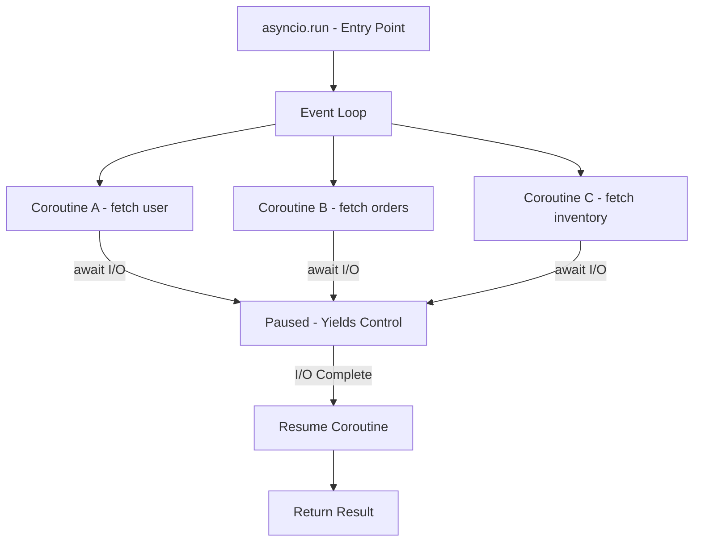

# Async Programming with asyncio

## Overview

`asyncio` is Python's built-in library for writing **concurrent code using the async/await syntax**. It's ideal for I/O-bound tasks that involve waiting (network requests, database queries, file I/O) — you can handle thousands of concurrent operations in a single thread.



---

## Coroutines — The Building Block

A **coroutine** is a function defined with `async def`. Calling it returns a coroutine object, not the result:

```python
import asyncio

async def greet(name):
    """This is a coroutine function."""
    await asyncio.sleep(1)  # Simulate async work
    return f"Hello, {name}"

# Calling returns a coroutine object — doesn't execute yet!
coro = greet("World")
print(type(coro))  # <class 'coroutine'>

# To execute: await it inside another coroutine, or use asyncio.run()
result = asyncio.run(greet("World"))
print(result)  # "Hello, World"
```

### `await` — Suspension Point

The `await` keyword **suspends** the coroutine and yields control back to the event loop:

```python
async def fetch_data(url):
    print(f"Fetching {url}...")
    await asyncio.sleep(1)  # Suspends here — other coroutines can run
    print(f"Done fetching {url}")
    return {"url": url, "data": "..."}
```

---

## The Event Loop

The event loop is the **heart of asyncio** — it schedules and runs coroutines, callbacks, and I/O operations:

```python
import asyncio

async def main():
    # Get the running event loop
    loop = asyncio.get_running_loop()
    print(f"Event loop: {loop}")
    print(f"Is running: {loop.is_running()}")

asyncio.run(main())
```

### Event Loop Lifecycle

```python
# asyncio.run() creates, runs, and closes the event loop
asyncio.run(main())

# Manual control (rarely needed)
loop = asyncio.new_event_loop()
asyncio.set_event_loop(loop)
try:
    loop.run_until_complete(main())
finally:
    loop.close()
```

---

## Tasks — Concurrent Execution

**Tasks** wrap coroutines and schedule them concurrently on the event loop:

### Creating Tasks

```python
import asyncio

async def compute(x):
    await asyncio.sleep(1)
    return x * x

async def main():
    # Method 1: asyncio.create_task() (preferred inside async code)
    task1 = asyncio.create_task(compute(10))
    task2 = asyncio.create_task(compute(20))
    
    # Both tasks run concurrently!
    result1 = await task1
    result2 = await task2
    print(result1, result2)  # 100 400

asyncio.run(main())
```

### `asyncio.gather()` — Run Multiple Coroutines

```python
import asyncio

async def fetch_user(user_id):
    await asyncio.sleep(1)
    return {"id": user_id, "name": f"User_{user_id}"}

async def main():
    # Run all concurrently and collect results
    results = await asyncio.gather(
        fetch_user(1),
        fetch_user(2),
        fetch_user(3),
    )
    print(results)
    # [{'id': 1, 'name': 'User_1'}, {'id': 2, 'name': 'User_2'}, ...]

asyncio.run(main())
```

### `asyncio.gather()` with Error Handling

```python
import asyncio

async def risky_task():
    raise ValueError("Something went wrong!")

async def safe_task():
    await asyncio.sleep(1)
    return "ok"

async def main():
    # return_exceptions=True — don't raise, return exception objects
    results = await asyncio.gather(
        risky_task(),
        safe_task(),
        return_exceptions=True,
    )
    print(results)
    # [ValueError('Something went wrong!'), 'ok']

asyncio.run(main())
```

---

## Structured Concurrency — `TaskGroup` (Python 3.11+)

`TaskGroup` provides structured concurrency — tasks are scoped to the group:

```python
import asyncio

async def fetch(url, delay):
    await asyncio.sleep(delay)
    return f"{url} done"

async def main():
    # TaskGroup ensures all tasks complete (or cancel all on failure)
    async with asyncio.TaskGroup() as tg:
        task1 = tg.create_task(fetch("url1", 1))
        task2 = tg.create_task(fetch("url2", 2))
        task3 = tg.create_task(fetch("url3", 3))
    
    # All tasks are done when we exit the context manager
    print(task1.result())
    print(task2.result())
    print(task3.result())

asyncio.run(main())
```

### TaskGroup vs gather

| Feature | `gather()` | `TaskGroup` |
|---|---|---|
| Python version | 3.4+ | 3.11+ |
| Error handling | `return_exceptions` or first error | Cancels all on first error |
| Task lifecycle | Manual management | Scoped to `async with` |
| Exception grouping | Returns list | `ExceptionGroup` |
| Recommended | Legacy code | New code |

```python
import asyncio

async def fail_fast():
    raise RuntimeError("boom")

async def slow():
    await asyncio.sleep(10)
    return "done"

async def main():
    try:
        async with asyncio.TaskGroup() as tg:
            tg.create_task(fail_fast())
            tg.create_task(slow())
    except* RuntimeError as eg:
        # ExceptionGroup — catches grouped exceptions
        for exc in eg.exceptions:
            print(f"Caught: {exc}")

asyncio.run(main())
```

---

## Async Generators

```python
import asyncio

async def async_range(n):
    """Async generator — yields values with async delays."""
    for i in range(n):
        await asyncio.sleep(0.1)
        yield i

async def main():
    # Iterate with async for
    async for num in async_range(5):
        print(num)  # 0, 1, 2, 3, 4 (with 0.1s between each)

    # Collect to list
    values = [num async for num in async_range(5)]
    print(values)  # [0, 1, 2, 3, 4]

    # Async generator expression
    doubled = [x * 2 async for x in async_range(5)]
    print(doubled)  # [0, 2, 4, 6, 8]

asyncio.run(main())
```

---

## Async Context Managers

```python
import asyncio

class AsyncDatabaseConnection:
    """Async context manager for database connections."""
    
    def __init__(self, db_url):
        self.db_url = db_url
        self.connection = None
    
    async def __aenter__(self):
        print(f"Connecting to {self.db_url}...")
        await asyncio.sleep(0.5)  # Simulate connection time
        self.connection = {"url": self.db_url, "connected": True}
        return self.connection
    
    async def __aexit__(self, exc_type, exc_val, exc_tb):
        print("Closing connection...")
        await asyncio.sleep(0.1)  # Simulate cleanup
        self.connection = None
        return False  # Don't suppress exceptions

async def main():
    async with AsyncDatabaseConnection("postgres://localhost/mydb") as conn:
        print(f"Connected: {conn}")
        await asyncio.sleep(1)  # Do work
    # Connection automatically closed

asyncio.run(main())
```

---

## aiohttp — Async HTTP Client

```python
import asyncio
import aiohttp

async def fetch_url(session, url):
    """Fetch a single URL."""
    async with session.get(url) as response:
        status = response.status
        text = await response.text()
        return {"url": url, "status": status, "length": len(text)}

async def fetch_all(urls):
    """Fetch multiple URLs concurrently."""
    async with aiohttp.ClientSession() as session:
        tasks = [fetch_url(session, url) for url in urls]
        return await asyncio.gather(*tasks)

async def main():
    urls = [
        "https://httpbin.org/get",
        "https://httpbin.org/ip",
        "https://httpbin.org/user-agent",
    ]
    results = await fetch_all(urls)
    for r in results:
        print(f"{r['url']}: {r['status']} ({r['length']} bytes)")

asyncio.run(main())
```

### aiohttp with Semaphore — Rate Limiting

```python
import asyncio
import aiohttp

async def fetch(session, url, semaphore):
    async with semaphore:  # Limit concurrent requests
        async with session.get(url) as resp:
            return await resp.text()

async def main():
    semaphore = asyncio.Semaphore(10)  # Max 10 concurrent requests
    urls = [f"https://httpbin.org/get?id={i}" for i in range(100)]
    
    async with aiohttp.ClientSession() as session:
        tasks = [fetch(session, url, semaphore) for url in urls]
        results = await asyncio.gather(*tasks)
    print(f"Fetched {len(results)} URLs")

asyncio.run(main())
```

---

## asyncio.Semaphore and asyncio.Lock

```python
import asyncio

# Semaphore — limit concurrency
sem = asyncio.Semaphore(3)  # Allow 3 concurrent operations

async def limited_task(n):
    async with sem:
        print(f"Task {n} started")
        await asyncio.sleep(1)
        print(f"Task {n} done")

async def main():
    tasks = [limited_task(i) for i in range(10)]
    await asyncio.gather(*tasks)

asyncio.run(main())
```

```python
import asyncio

# Lock — mutual exclusion
lock = asyncio.Lock()
shared_resource = 0

async def safe_increment(n):
    global shared_resource
    async with lock:
        temp = shared_resource
        await asyncio.sleep(0)  # Yield control — another task could run
        shared_resource = temp + 1

async def main():
    global shared_resource
    tasks = [safe_increment(i) for i in range(100)]
    await asyncio.gather(*tasks)
    print(f"Final value: {shared_resource}")  # Should be 100

asyncio.run(main())
```

---

## `asyncio.Queue` — Producer/Consumer Pattern

```python
import asyncio
import random

async def producer(queue, n):
    for i in range(n):
        item = f"item_{i}"
        await asyncio.sleep(random.uniform(0.1, 0.5))
        await queue.put(item)
        print(f"Produced: {item}")
    await queue.put(None)  # Sentinel — stop signal

async def consumer(queue, name):
    while True:
        item = await queue.get()
        if item is None:
            await queue.put(None)  # Pass sentinel to other consumers
            break
        print(f"{name} consumed: {item}")
        await asyncio.sleep(random.uniform(0.1, 0.3))
        queue.task_done()

async def main():
    queue = asyncio.Queue(maxsize=5)
    
    prod = asyncio.create_task(producer(queue, 10))
    cons1 = asyncio.create_task(consumer(queue, "Consumer-1"))
    cons2 = asyncio.create_task(consumer(queue, "Consumer-2"))
    
    await prod
    await asyncio.gather(cons1, cons2)

asyncio.run(main())
```

---

## Running Blocking Code in asyncio

```python
import asyncio
import time

def blocking_io():
    """Simulates a blocking I/O operation."""
    time.sleep(2)
    return "result from blocking code"

async def main():
    loop = asyncio.get_running_loop()
    
    # Run blocking code in a thread pool
    result = await loop.run_in_executor(None, blocking_io)
    print(result)

asyncio.run(main())
```

---

## Common Mistakes

1. **Calling `await` without `async`** — `await` only works inside `async def` functions.
2. **Forgetting to `await` a coroutine** — `coroutine_func()` returns a coroutine; `await coroutine_func()` runs it.
3. **Using blocking calls in async code** — `time.sleep()`, `requests.get()`, etc. block the event loop. Use `asyncio.sleep()`, `aiohttp`.
4. **Creating tasks outside the event loop** — `asyncio.create_task()` must be called inside a running event loop.
5. **Not closing the event loop** — Use `asyncio.run()` which handles cleanup.
6. **Mixing `asyncio.run()` calls** — Only one event loop per thread. Don't call `asyncio.run()` inside an already-running loop.

```python
# WRONG — blocking the event loop
async def bad():
    import time
    time.sleep(5)  # Blocks the entire event loop!
    import requests
    resp = requests.get("https://example.com")  # Also blocks!

# RIGHT — use async equivalents
async def good():
    await asyncio.sleep(5)
    import aiohttp
    async with aiohttp.ClientSession() as session:
        async with session.get("https://example.com") as resp:
            text = await resp.text()
```

---

## Summary Table

| Concept | Purpose |
|---|---|
| `async def` | Define a coroutine function |
| `await` | Suspend coroutine, wait for result |
| `asyncio.run()` | Entry point — create and run event loop |
| `asyncio.create_task()` | Schedule coroutine as concurrent task |
| `asyncio.gather()` | Run multiple coroutines concurrently |
| `TaskGroup` | Structured concurrency (3.11+) |
| `asyncio.Semaphore` | Limit concurrent operations |
| `asyncio.Lock` | Mutual exclusion for async code |
| `asyncio.Queue` | Async producer/consumer |
| `async for` | Iterate over async generators |
| `async with` | Async context managers |
| `run_in_executor()` | Run blocking code in thread pool |
