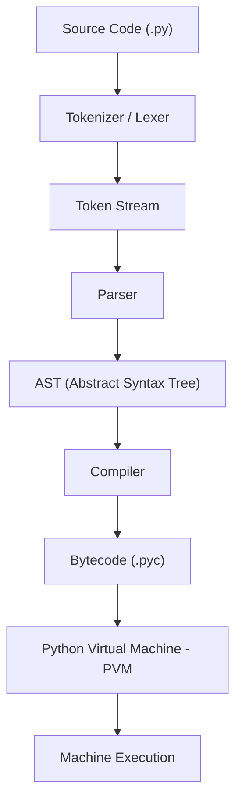
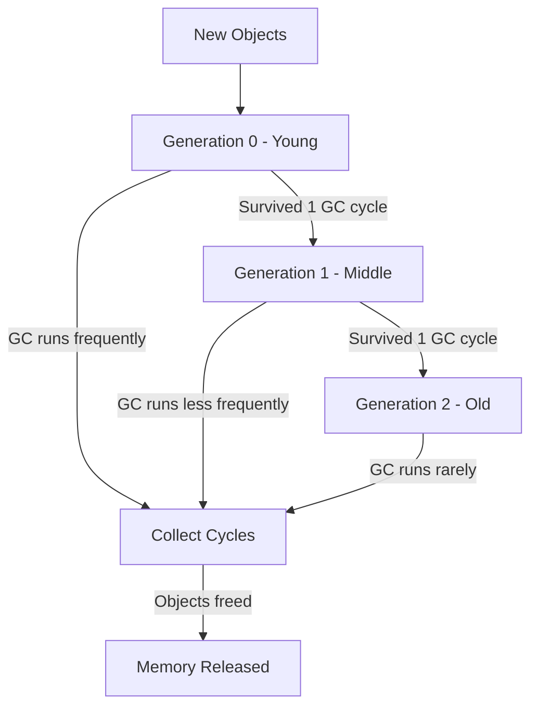

# CPython Internals

## Overview

CPython is the **reference implementation** of Python — the one you download from python.org. Understanding its internals is crucial for writing performant code, debugging subtle bugs, and acing advanced interview questions. This document covers the compilation pipeline, object model, memory management, and garbage collection.

---

## The Compilation Pipeline

When you run `python script.py`, the following happens:



### Step 1: Tokenization

The lexer breaks source code into tokens:

```python
# Source: x = 10 + 20
# Tokens: NAME('x') OP('=') NUMBER(10) OP('+') NUMBER(20) NEWLINE
import token
import tokenize
import io

code = "x = 10 + 20\n"
tokens = tokenize.generate_tokens(io.StringIO(code).readline)
for tok in tokens:
    print(tok)
```

### Step 2: Parsing to AST

The parser builds an Abstract Syntax Tree:

```python
import ast

tree = ast.parse("x = 10 + 20")
print(ast.dump(tree, indent=2))
# Module(body=[
#   Assign(
#     targets=[Name(id='x')],
#     value=BinOp(
#       left=Constant(value=10),
#       op=Add(),
#       right=Constant(value=20)
#     )
#   )
# ])
```

### Step 3: Compilation to Bytecode

The compiler transforms AST into bytecode — a low-level, platform-independent instruction set:

```python
import dis

def add(a, b):
    return a + b

dis.dis(add)
#   2           0 LOAD_FAST                0 (a)
#               2 LOAD_FAST                1 (b)
#               4 BINARY_ADD
#               6 RETURN_VALUE
```

### Step 4: Bytecode Execution

The PVM is a **stack-based virtual machine**. It executes bytecode instructions using an evaluation loop (the `ceval.c` loop in CPython source).

```python
import dis

# More complex example
def example(n):
    result = 0
    for i in range(n):
        if i % 2 == 0:
            result += i
    return result

dis.dis(example)
```

---

## PyObject — The Universal Object Model

**Every Python object is a `PyObject` in C.** This is the most fundamental concept in CPython.

```c
// Simplified from CPython source (Include/object.h)
typedef struct _object {
    Py_ssize_t ob_refcnt;    // Reference count
    PyTypeObject *ob_type;    // Pointer to type object
} PyObject;
```

### Object Layout

Every Python object has at minimum:
1. **Reference count** (`ob_refcnt`) — for memory management
2. **Type pointer** (`ob_type`) — points to the type object (e.g., `int`, `str`, `list`)

For variable-size objects (like `list`, `str`), there's an extended header:

```c
typedef struct {
    PyObject ob_base;
    Py_ssize_t ob_size;  // Number of items (for var-size objects)
} PyVarObject;
```

### Inspecting Objects

```python
import sys

x = 42
print(sys.getsizeof(x))    # 28 bytes (on 64-bit) — PyObject header + value
print(sys.getsizeof(""))    # 49 bytes — empty string
print(sys.getsizeof([]))    # 56 bytes — empty list
print(sys.getsizeof({}))    # 64 bytes — empty dict

# Reference count
import sys
a = [1, 2, 3]
print(sys.getrefcount(a))   # 2 (a + temporary ref from getrefcount arg)
b = a
print(sys.getrefcount(a))   # 3 (a + b + temporary ref)
```

---

## Integer Internals

Small integers are **pre-allocated and cached**:

```python
# CPython caches integers from -5 to 256
a = 256
b = 256
print(a is b)   # True — same object in memory

a = 257
b = 257
print(a is b)   # False (usually) — different objects
# Note: in interactive mode, this may differ due to compilation unit

# Integers are arbitrary precision in Python
x = 2 ** 1000  # Works fine — no overflow
print(len(str(x)))  # 302 digits
```

### How Large Integers Work

```python
import sys

# Small int — fits in one "digit"
x = 42
print(sys.getsizeof(x))  # 28 bytes

# Large int — uses array of "digits" (base 2^30 on 64-bit)
x = 2 ** 1000
print(sys.getsizeof(x))  # 136 bytes — much larger
```

---

## String Interning

CPython **interns** (caches) certain strings for efficiency:

```python
# Interned strings — same object
a = "hello"
b = "hello"
print(a is b)  # True — interned

# String interning rules:
# - String literals that look like identifiers are interned
# - Strings containing only [a-zA-Z0-9_] are candidates
# - Single character strings are always interned

a = "hello world"  # Contains space — NOT interned
b = "hello world"
print(a is b)  # False (usually)

import sys
a = sys.intern("hello world")
b = sys.intern("hello world")
print(a is b)  # True — manually interned
```

---

## Reference Counting and Generational GC

### Reference Counting (Primary Mechanism)

Every object has a reference count. When it drops to zero, the memory is freed immediately.

```python
import sys

a = [1, 2, 3]       # refcount = 1
b = a               # refcount = 2
print(sys.getrefcount(a))  # 3 (a + b + getrefcount's arg)

del b               # refcount = 1
c = a               # refcount = 2
c = None            # refcount = 1
a = None            # refcount = 0 → memory freed!
```

### Circular References — The Problem

Reference counting **cannot handle cycles**:

```python
class Node:
    def __init__(self):
        self.parent = None
        self.children = []

a = Node()
b = Node()
a.children.append(b)  # a → b
b.parent = a           # b → a (cycle!)

del a
del b
# Reference counts never reach 0!
# Memory would leak without generational GC
```

### Generational Garbage Collection

CPython uses a **generational GC** to handle cycles:



| Generation | Threshold | Description |
|---|---|---|
| Gen 0 | ~700 new objects | Collected most frequently |
| Gen 1 | ~10 survivors from Gen 0 | Collected less frequently |
| Gen 2 | ~10 survivors from Gen 1 | Collected rarely |

```python
import gc

# Check GC thresholds
print(gc.get_threshold())  # (700, 10, 10)

# Manual GC control
gc.disable()   # Disable automatic GC
gc.enable()    # Re-enable
gc.collect()   # Force full collection

# Debug GC
gc.set_debug(gc.DEBUG_STATS)

# Check objects tracked by GC
print(len(gc.get_objects()))  # Number of tracked objects

# Get generation stats
print(gc.get_stats())
# [{'collections': 100, 'collected': 500, 'uncollectable': 0}, ...]
```

---

## `__slots__` — Memory Optimization

By default, Python objects use a `__dict__` for attribute storage, which is memory-heavy. `__slots__` pre-allocates fixed attribute slots:

```python
class PointWithDict:
    def __init__(self, x, y):
        self.x = x
        self.y = y

class PointWithSlots:
    __slots__ = ('x', 'y')
    def __init__(self, x, y):
        self.x = x
        self.y = y

import sys
p1 = PointWithDict(1, 2)
p2 = PointWithSlots(1, 2)

print(sys.getsizeof(p1))        # ~48 bytes + __dict__
print(sys.getsizeof(p1.__dict__))  # ~104 bytes for dict
print(sys.getsizeof(p2))        # ~40 bytes, NO __dict__

# __slots__ benefits:
# 1. Significant memory savings with many instances
# 2. Slightly faster attribute access
# 3. Prevents accidental attribute creation

# __slots__ limitations:
# 1. Cannot add new attributes not in __slots__
# 2. Inheritance is tricky — child must also define __slots__
# 3. No __dict__ means no dynamic attribute assignment
# 4. Multiple inheritance with __slots__ is complex

# Error with __slots__
try:
    p2.z = 3
except AttributeError as e:
    print(e)  # 'PointWithSlots' object has no attribute 'z'
```

### `__slots__` with Inheritance

```python
class Base:
    __slots__ = ('x',)

class Child(Base):
    __slots__ = ('y',)  # Adds to parent's slots
    def __init__(self, x, y):
        self.x = x
        self.y = y

c = Child(1, 2)
print(c.x, c.y)  # 1 2
# Child has both 'x' from Base and 'y' from Child

# Caveat: if Child doesn't define __slots__, it gets __dict__
class LooseChild(Base):
    pass

lc = LooseChild()
lc.z = 100  # Works! Because LooseChild has __dict__
```

---

## Code Objects and Function Objects

```python
def my_func(x, y=10):
    z = x + y
    return z * 2

# Code object — compiled bytecode + metadata
print(my_func.__code__.co_varnames)   # ('x', 'y', 'z')
print(my_func.__code__.co_consts)     # (None, 10, 2)
print(my_func.__code__.co_argcount)   # 2
print(my_func.__code__.co_stacksize)  # 2

# Function object wraps code object + closure + defaults
print(my_func.__defaults__)           # (10,)
print(my_func.__globals__)            # Global namespace
print(my_func.__closure__)            # None (no closure)
```

---

## Common Mistakes

1. **Using `is` for value comparison** — `is` checks identity, not equality. Use `==` for values.
2. **Assuming `del` frees memory** — `del` removes the name binding; GC handles freeing.
3. **Not understanding `__slots__` inheritance** — Child classes must define their own `__slots__`.
4. **Circular references causing memory leaks** — Use `weakref` for back-references.
5. **Modifying `__dict__` with `__slots__`** — Classes with `__slots__` have no `__dict__` (unless you add `"__dict__"` to slots).

```python
import weakref

class Node:
    __slots__ = ('parent', 'children', 'value')
    def __init__(self, value):
        self.value = value
        self.parent = None  # Use weakref
        self.children = []

# Use weakref to break cycles
a = Node(1)
b = Node(2)
a.children.append(b)
b.parent = weakref.ref(a)  # Weak reference — doesn't increase refcount
print(b.parent())  # Access via __call__ — returns None if collected
```

---

## Summary Table

| Concept | Key Point |
|---|---|
| PyObject | Every object has `ob_refcnt` + `ob_type` |
| Bytecode | Platform-independent, stack-based instructions |
| Refcounting | Primary GC; frees on zero references |
| Generational GC | Handles cycles; 3 generations with thresholds |
| `__slots__` | Pre-allocated attributes, saves memory |
| String Interning | Cached strings for identity comparison |
| Integer Caching | -5 to 256 pre-allocated |
| Code Objects | Compiled bytecode + metadata for functions |
