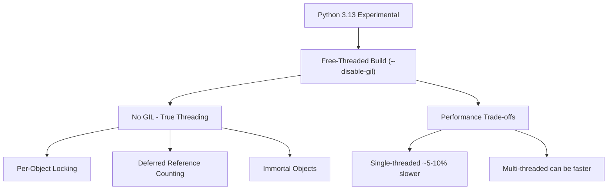
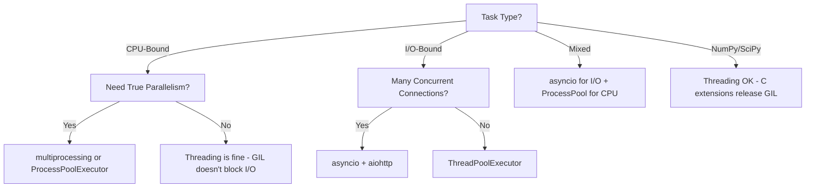

# The Global Interpreter Lock (GIL)

## What Is the GIL?

The **Global Interpreter Lock (GIL)** is a mutex in CPython that allows **only one thread to execute Python bytecode at a time**, even on multi-core systems. It exists to protect CPython's memory management (reference counting) from race conditions.

```python
import threading

counter = 0

def increment(n):
    global counter
    for _ in range(n):
        counter += 1  # NOT atomic — GIL doesn't make this safe!

threads = [threading.Thread(target=increment, args=(100_000,)) for _ in range(10)]
for t in threads:
    t.start()
for t in threads:
    t.join()

print(counter)  # Likely < 1,000,000 — race condition!
```

> **Key misconception:** The GIL prevents true parallelism for CPU-bound Python code, but it does NOT make thread-safe code automatically safe. Operations like `counter += 1` are not atomic (they involve LOAD, ADD, STORE bytecodes).

---

## Why Does the GIL Exist?

### Historical Reason

When CPython was designed in the late 1980s/early 1990s, **multi-core CPUs were rare**. The GIL was introduced to:

1. **Simplify CPython's implementation** — No fine-grained locking on every object
2. **Protect reference counting** — `ob_refcnt` is not thread-safe without locks
3. **Speed up single-threaded code** — No lock overhead for single-threaded programs
4. **Make C extensions easier** — C extension authors don't need to worry about thread safety

### The Reference Counting Problem

```python
# Without GIL, this could happen:
# Thread 1: reads obj.refcnt (value: 2)
# Thread 2: reads obj.refcnt (value: 2)
# Thread 1: decrements → writes 1
# Thread 2: decrements → writes 1  (WRONG! Should be 0)
# Object is leaked — never freed

# The GIL ensures only one thread executes at a time,
# so refcount operations are naturally safe.
```

---

## Impact on Threading

### CPU-Bound Tasks: GIL Hurts

```python
import threading
import time

def cpu_bound(n):
    """Compute sum of squares — pure CPU work."""
    total = 0
    for i in range(n):
        total += i * i
    return total

# Single-threaded
start = time.time()
cpu_bound(10_000_000)
cpu_bound(10_000_000)
print(f"Single-threaded: {time.time() - start:.2f}s")

# Multi-threaded (GIL limits this!)
start = time.time()
t1 = threading.Thread(target=cpu_bound, args=(10_000_000,))
t2 = threading.Thread(target=cpu_bound, args=(10_000_000,))
t1.start(); t2.start()
t1.join(); t2.join()
print(f"Multi-threaded: {time.time() - start:.2f}s")
# Often SLOWER due to GIL contention and thread switching overhead!
```

### I/O-Bound Tasks: GIL Doesn't Matter

```python
import threading
import time
import urllib.request

def fetch_url(url):
    """I/O-bound — releases GIL during network wait."""
    urllib.request.urlopen(url).read()

urls = ["https://example.com"] * 10

# Single-threaded
start = time.time()
for url in urls:
    fetch_url(url)
print(f"Single-threaded: {time.time() - start:.2f}s")

# Multi-threaded (GIL released during I/O — real parallelism!)
start = time.time()
threads = [threading.Thread(target=fetch_url, args=(url,)) for url in urls]
for t in threads:
    t.start()
for t in threads:
    t.join()
print(f"Multi-threaded: {time.time() - start:.2f}s")
# Much faster — GIL is released during I/O operations
```

---

## When Does the GIL Release?

The GIL is **released** during:

| Operation | Why |
|---|---|
| I/O operations (file, network, socket) | Waiting for external resources |
| `time.sleep()` | Explicitly yielding |
| C extension operations (NumPy, etc.) | C code can release GIL explicitly |
| `ctypes` calls into C libraries | GIL released before C call |
| `select.select()`, `poll()` | Waiting for I/O readiness |

The GIL is **held** during:

| Operation | Why |
|---|---|
| Pure Python bytecode execution | One thread at a time |
| Object creation/destruction | Reference counting |
| Attribute access | Object model operations |
| Arithmetic operations | Pure Python math |

---

## Workarounds for CPU-Bound Parallelism

### 1. Multiprocessing

Each process has its **own GIL** — true parallelism:

```python
from multiprocessing import Process, Pool
import time

def cpu_bound(n):
    total = 0
    for i in range(n):
        total += i * i
    return total

# Using Pool — easiest approach
if __name__ == "__main__":
    start = time.time()
    with Pool(processes=4) as pool:
        results = pool.map(cpu_bound, [10_000_000] * 4)
    print(f"Multiprocessing: {time.time() - start:.2f}s")

    # Compare single-threaded
    start = time.time()
    for _ in range(4):
        cpu_bound(10_000_000)
    print(f"Sequential: {time.time() - start:.2f}s")
```

**Trade-offs:**
- ✅ True parallelism
- ❌ Higher memory usage (separate processes)
- ❌ IPC overhead (pickle serialization for data transfer)
- ❌ No shared memory by default (use `multiprocessing.shared_memory` or `Manager`)

### 2. asyncio — Cooperative Concurrency

Best for **I/O-bound** tasks with many concurrent connections:

```python
import asyncio
import aiohttp

async def fetch(session, url):
    async with session.get(url) as response:
        return await response.text()

async def main():
    urls = ["https://example.com"] * 100
    async with aiohttp.ClientSession() as session:
        tasks = [fetch(session, url) for url in urls]
        results = await asyncio.gather(*tasks)
    print(f"Fetched {len(results)} URLs")

asyncio.run(main())
```

### 3. C Extensions That Release GIL

NumPy, SciPy, and other C extensions release the GIL for heavy computation:

```python
import numpy as np
import threading
import time

def numpy_work():
    """NumPy releases GIL during C-level operations."""
    a = np.random.rand(1000, 1000)
    b = np.random.rand(1000, 1000)
    return np.dot(a, b)  # GIL released here!

# Multi-threaded NumPy CAN use multiple cores!
start = time.time()
threads = [threading.Thread(target=numpy_work) for _ in range(4)]
for t in threads:
    t.start()
for t in threads:
    t.join()
print(f"Threaded NumPy: {time.time() - start:.2f}s")
```

### 4. Cython with `nogil`

```cython
# cython code — release GIL for C-level computation
cdef double compute(int n) nogil:
    cdef double total = 0
    cdef int i
    for i in range(n):
        total += i * i
    return total
```

### 5. concurrent.futures

High-level API for both threads and processes:

```python
from concurrent.futures import ThreadPoolExecutor, ProcessPoolExecutor
import time

def cpu_bound(n):
    return sum(i * i for i in range(n))

# ThreadPoolExecutor — good for I/O-bound
with ThreadPoolExecutor(max_workers=4) as executor:
    futures = [executor.submit(cpu_bound, 1_000_000) for _ in range(4)]
    results = [f.result() for f in futures]

# ProcessPoolExecutor — good for CPU-bound
with ProcessPoolExecutor(max_workers=4) as executor:
    futures = [executor.submit(cpu_bound, 1_000_000) for _ in range(4)]
    results = [f.result() for f in futures]
```

---

## Free-Threaded Python (PEP 703 — Python 3.13+)

Python 3.13 introduced **experimental free-threaded builds** (also called "nogil" or "no-GIL"):



### Key Changes in Free-Threaded Python

| Feature | Traditional CPython | Free-Threaded CPython |
|---|---|---|
| GIL | Yes — single thread | Removed |
| Reference Counting | Global lock | Per-object locks + deferred refcount |
| Thread Safety | GIL provides coarse safety | Fine-grained locking |
| Single-thread Perf | Baseline | ~5-10% slower |
| Multi-thread Perf | Limited by GIL | Scales with cores |

### Using Free-Threaded Python

```bash
# Check if your Python has free-threading support
python -c "import sys; print(sys._is_gil_enabled())"

# Install free-threaded Python 3.13+
# Build from source with --disable-gil or use experimental builds
```

```python
# Code that works with or without GIL
import sys

if hasattr(sys, '_is_gil_enabled') and not sys._is_gil_enabled():
    print("Running without GIL — use proper synchronization!")
else:
    print("Running with GIL — coarser thread safety")

# Even without GIL, use locks for shared mutable state
import threading

lock = threading.Lock()
counter = 0

def safe_increment(n):
    global counter
    for _ in range(n):
        with lock:
            counter += 1
```

### Migration Considerations

```python
# Code that may break without GIL:

# 1. Unsynchronized dict/list access from multiple threads
shared_list = []
def worker():
    for i in range(1000):
        shared_list.append(i)  # NOT safe without GIL!

# Fix: use lock or thread-safe data structures
import queue
safe_queue = queue.Queue()

# 2. C extensions that assume GIL
# Must use Py_GIL_DISABLED and update locking

# 3. Check C extension compatibility
# Use pythoncapi_compat or check extension docs
```

---

## GIL Implementation Mechanics

### How the GIL Works Internally

```python
# CPython's GIL implementation (simplified)
# In CPython 3.2+, the GIL is released after a configurable number of bytecode instructions

import sys
# Python 3.12+: sys.getswitchinterval() controls thread switch interval
print(sys.getswitchinterval())  # Default: 5ms (0.005 seconds)

# The GIL is released and reacquired:
# 1. Every sys.getswitchinterval() seconds (default 5ms)
# 2. Before every blocking I/O operation
# 3. After certain C extension calls
```

### GIL Contention Measurement

```python
import threading
import time

def cpu_work(n):
    """Pure CPU work — GIL is held the entire time."""
    total = 0
    for i in range(n):
        total += i * i
    return total

def measure_gil_contention():
    """Show how GIL contention hurts multi-threaded CPU work."""
    n = 5_000_000
    
    # Single-threaded
    start = time.perf_counter()
    cpu_work(n)
    cpu_work(n)
    single_time = time.perf_counter() - start
    
    # Multi-threaded (GIL contention)
    start = time.perf_counter()
    t1 = threading.Thread(target=cpu_work, args=(n,))
    t2 = threading.Thread(target=cpu_work, args=(n,))
    t1.start()
    t2.start()
    t1.join()
    t2.join()
    multi_time = time.perf_counter() - start
    
    print(f"Single-threaded: {single_time:.2f}s")
    print(f"Multi-threaded:  {multi_time:.2f}s")
    print(f"Overhead:        {multi_time/single_time:.2f}x")
    # Typically multi_time > single_time due to GIL switching overhead!
```

## GIL Decision Flowchart



---

## Common Mistakes

1. **Assuming GIL makes code thread-safe** — It doesn't. `list.append()` is atomic, but `counter += 1` is not.
2. **Using threads for CPU-bound work** — Use `multiprocessing` or `ProcessPoolExecutor`.
3. **Not releasing GIL in C extensions** — Use `Py_BEGIN_ALLOW_THREADS` / `Py_END_ALLOW_THREADS`.
4. **Overusing multiprocessing** — Process creation and IPC are expensive. Don't use for fine-grained tasks.
5. **Ignoring GIL in benchmarks** — Single-threaded benchmarks are fine; multi-threaded benchmarks need context.

```python
# Atomic operations in CPython (GIL guarantees these)
my_list = []           # list.append() is atomic
my_dict = {}           # dict.__setitem__() is atomic

# NOT atomic — needs lock
counter = 0
# counter += 1  →  LOAD + ADD + STORE (3 bytecodes, not atomic)

# Use threading.Lock for non-atomic operations
lock = threading.Lock()
with lock:
    counter += 1
```

---

## References

- [PEP 703 — Making the Global Interpreter Lock Optional](https://peps.python.org/pep-0703/)
- [Python Wiki — GIL](https://wiki.python.org/moin/GlobalInterpreterLock)
- [David Beazley — Understanding the Python GIL](https://www.dabeaz.com/python/UnderstandingGIL.pdf)
- [Python docs — threading](https://docs.python.org/3/library/threading.html)
- [Python docs — multiprocessing](https://docs.python.org/3/library/multiprocessing.html)

## Summary

| Scenario | Solution |
|---|---|
| CPU-bound, single core | Normal Python — GIL doesn't matter |
| CPU-bound, multi-core | `multiprocessing`, `ProcessPoolExecutor`, Cython `nogil` |
| I/O-bound, few connections | `threading`, `ThreadPoolExecutor` |
| I/O-bound, many connections | `asyncio` |
| Mixed workload | `asyncio` + `ProcessPoolExecutor` |
| Need true threading | Python 3.13+ free-threaded build (experimental) |
