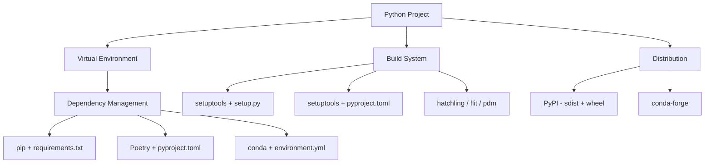

# Python Packaging and Dependency Management

## Overview

Python packaging has evolved significantly. Understanding how to manage dependencies, virtual environments, and build systems is essential for professional Python development and is increasingly asked about in interviews.



---

## Virtual Environments

Virtual environments **isolate** project dependencies, preventing version conflicts between projects:

```bash
# Create a virtual environment
python -m venv .venv

# Activate it
# Linux/macOS:
source .venv/bin/activate
# Windows:
.venv\Scripts\activate

# Deactivate
deactivate

# Verify which Python you're using
which python  # Should point to .venv/bin/python
python --version
```

### Why Virtual Environments?

```bash
# Without venv — global mess
pip install requests==2.28    # Project A needs 2.28
pip install requests==2.31    # Project B needs 2.31 — CONFLICT!

# With venv — isolated
cd project_a && python -m venv .venv && pip install requests==2.28
cd project_b && python -m venv .venv && pip install requests==2.31
# Both work independently
```

### venv vs virtualenv vs conda

| Tool | Speed | Features | Best For |
|---|---|---|---|
| `venv` | Fast | Built-in, lightweight | Standard Python projects |
| `virtualenv` | Faster | Extra features, Python 2 support | Legacy projects |
| `conda` | Slower | Manages non-Python deps (C libs) | Data science, ML |

---

## pip — The Package Installer

```bash
# Install a package
pip install requests

# Install specific version
pip install requests==2.31.0

# Install version range
pip install "requests>=2.28,<3.0"

# Install from requirements file
pip install -r requirements.txt

# Install in development/editable mode
pip install -e .

# Upgrade a package
pip install --upgrade requests

# Uninstall
pip uninstall requests

# List installed packages
pip list

# Show package info
pip show requests

# Freeze current environment
pip freeze > requirements.txt
```

### requirements.txt Format

```text
# requirements.txt
requests==2.31.0
flask>=2.3,<3.0
numpy~=1.24.0       # Compatible release (>=1.24.0, <1.25.0)
pandas              # Latest version
redis!=4.0.0        # Exclude specific version
pytest>=7.0         # Development dependency

# From git
git+https://github.com/user/repo.git@main

# From local path
-e ./my-local-package
```

### Version Specifiers

| Specifier | Meaning |
|---|---|
| `==2.31.0` | Exact version |
| `>=2.28` | Minimum version |
| `<3.0` | Maximum (exclusive) |
| `~=2.28` | Compatible release (>=2.28, <2.29) |
| `!=2.29.0` | Exclude version |
| `>=2.28,<3.0` | Range |

---

## pyproject.toml — The Modern Standard

`pyproject.toml` (PEP 518, PEP 621) replaces `setup.py`, `setup.cfg`, and `requirements.txt` as the single configuration file:

```toml
# pyproject.toml

[build-system]
requires = ["setuptools>=68.0", "wheel"]
build-backend = "setuptools.build_meta"

[project]
name = "my-package"
version = "1.0.0"
description = "A sample Python package"
readme = "README.md"
license = {text = "MIT"}
requires-python = ">=3.9"
authors = [
    {name = "Alice", email = "alice@example.com"},
]

dependencies = [
    "requests>=2.28",
    "flask>=2.3",
    "pydantic>=2.0",
]

[project.optional-dependencies]
dev = [
    "pytest>=7.0",
    "mypy>=1.0",
    "ruff>=0.1.0",
]
docs = [
    "sphinx>=6.0",
    "sphinx-rtd-theme>=1.0",
]

[project.urls]
Homepage = "https://github.com/user/my-package"
Documentation = "https://my-package.readthedocs.io"
Repository = "https://github.com/user/my-package"

[tool.setuptools.packages.find]
where = ["src"]

[tool.mypy]
strict = true

[tool.pytest.ini_options]
testpaths = ["tests"]
```

### Installing from pyproject.toml

```bash
# Install the package itself
pip install .

# Install with dev dependencies
pip install -e ".[dev]"

# Install with multiple extras
pip install -e ".[dev,docs]"
```

---

## Build Systems

### setuptools (Most Common)

```python
# setup.py (legacy — prefer pyproject.toml)
from setuptools import setup, find_packages

setup(
    name="my-package",
    version="1.0.0",
    packages=find_packages(where="src"),
    package_dir={"": "src"},
    install_requires=[
        "requests>=2.28",
        "flask>=2.3",
    ],
    extras_require={
        "dev": ["pytest>=7.0", "mypy>=1.0"],
    },
    python_requires=">=3.9",
)
```

### Build Tools Comparison

| Tool | Backend | Speed | Lock Files | Best For |
|---|---|---|---|---|
| `setuptools` | setuptools | Medium | No | Traditional packages |
| `flit` | flit-core | Fast | No | Simple pure-Python packages |
| `hatch` | hatchling | Fast | Yes | Modern projects |
| `poetry` | poetry-core | Medium | Yes | Full dependency management |
| `pdm` | pdm-backend | Fast | Yes | PEP-compliant, lock files |

---

## Poetry — Full-Featured Package Manager

Poetry handles dependency resolution, virtual environments, building, and publishing:

```bash
# Install Poetry
curl -sSL https://install.python-poetry.org | python3 -

# Create new project
poetry new my-project

# Initialize in existing project
poetry init

# Add dependencies
poetry add requests
poetry add --group dev pytest mypy

# Install all dependencies
poetry install

# Update dependencies
poetry update

# Run commands in the virtual environment
poetry run python script.py
poetry run pytest

# Build and publish
poetry build
poetry publish
```

### Poetry's pyproject.toml

```toml
[tool.poetry]
name = "my-project"
version = "0.1.0"
description = ""
authors = ["Alice <alice@example.com>"]
readme = "README.md"

[tool.poetry.dependencies]
python = "^3.9"
requests = "^2.28"
flask = ">=2.3,<3.0"

[tool.poetry.group.dev.dependencies]
pytest = "^7.0"
mypy = "^1.0"
ruff = "^0.1.0"

[build-system]
requires = ["poetry-core"]
build-backend = "poetry.core.masonry.api"
```

### Poetry Lock File

```bash
# poetry.lock — exact resolved versions (commit to git!)
# Ensures reproducible installs across environments

# Install from lock file (default behavior)
poetry install

# Update lock file without installing
poetry lock

# Export to requirements.txt
poetry export -f requirements.txt --output requirements.txt
```

---

## Wheels and Source Distributions

### sdist vs Wheel

| Format | Extension | Contents | Install Speed |
|---|---|---|---|
| Source (sdist) | `.tar.gz` | Source code + setup files | Slower (needs build) |
| Wheel | `.whl` | Pre-built, ready to install | Fast (just extract) |

```bash
# Build both
python -m build

# Outputs in dist/
# dist/my_package-1.0.0.tar.gz    (sdist)
# dist/my_package-1.0.0-py3-none-any.whl  (wheel)

# Upload to PyPI
python -m twine upload dist/*

# Or use Poetry
poetry build
poetry publish
```

### Platform Wheels

```bash
# Pure Python wheel (works everywhere)
my_package-1.0.0-py3-none-any.whl

# Platform-specific wheel (C extensions)
my_package-1.0.0-cp311-cp311-linux_x86_64.whl
#                    ↑      ↑      ↑
#              Python 3.11  ABI  Platform
```

---

## conda — For Data Science

```bash
# Create environment
conda create -n myenv python=3.11

# Activate
conda activate myenv

# Install packages
conda install numpy pandas scikit-learn

# Install from conda-forge (community channel)
conda install -c conda-forge jupyter

# Export environment
conda env export > environment.yml

# Recreate environment
conda env create -f environment.yml

# List environments
conda env list
```

### environment.yml

```yaml
name: myenv
channels:
  - conda-forge
  - defaults
dependencies:
  - python=3.11
  - numpy>=1.24
  - pandas>=2.0
  - scikit-learn>=1.3
  - pip:
    - some-pip-only-package>=1.0
```

---

## Package Structure

### Standard Layout

```
my-project/
├── pyproject.toml
├── README.md
├── LICENSE
├── src/
│   └── my_package/
│       ├── __init__.py
│       ├── core.py
│       ├── utils.py
│       └── subpackage/
│           ├── __init__.py
│           └── helpers.py
├── tests/
│   ├── __init__.py
│   ├── test_core.py
│   └── test_utils.py
└── docs/
    └── index.md
```

### `__init__.py` Best Practices

```python
# src/my_package/__init__.py

# Public API — what users import
from my_package.core import process, analyze
from my_package.utils import helper

# Version
__version__ = "1.0.0"

# __all__ — controls "from my_package import *"
__all__ = ["process", "analyze", "helper"]
```

---

## Common Mistakes

1. **Not using virtual environments** — Installing globally leads to dependency conflicts.
2. **Committing `.venv/` to git** — Add it to `.gitignore`. Commit `requirements.txt` or `poetry.lock` instead.
3. **Using `pip freeze` without filtering** — It dumps ALL packages, including transitive deps. Use `pip-compile` (pip-tools) for clean requirements.
4. **Not pinning versions in production** — `"requests"` without version means "latest" — can break unexpectedly.
5. **Using `setup.py` for new projects** — Use `pyproject.toml` (PEP 621).
6. **Not using `pip install -e .` for development** — Editable installs let you modify code without reinstalling.

```bash
# WRONG — global install
pip install flask

# RIGHT — virtual environment
python -m venv .venv
source .venv/bin/activate
pip install flask

# WRONG — unpinned requirements
# requirements.txt:
# requests

# RIGHT — pinned requirements
# requirements.txt:
# requests==2.31.0
```

---

## Summary Table

| Tool | Purpose | Lock File | Speed |
|---|---|---|---|
| `pip` | Install packages | No (use pip-tools) | Fast |
| `venv` | Virtual environments | N/A | Fast |
| `poetry` | Full package management | `poetry.lock` | Medium |
| `conda` | Data science environments | `environment.yml` | Slower |
| `pip-tools` | Compile requirements | `requirements.lock` | Fast |
| `hatch` | Modern build + env | `hatch.lock` | Fast |
| `pdm` | PEP-compliant management | `pdm.lock` | Fast |
| `build` | Build sdist + wheel | N/A | Fast |
| `twine` | Upload to PyPI | N/A | Fast |
