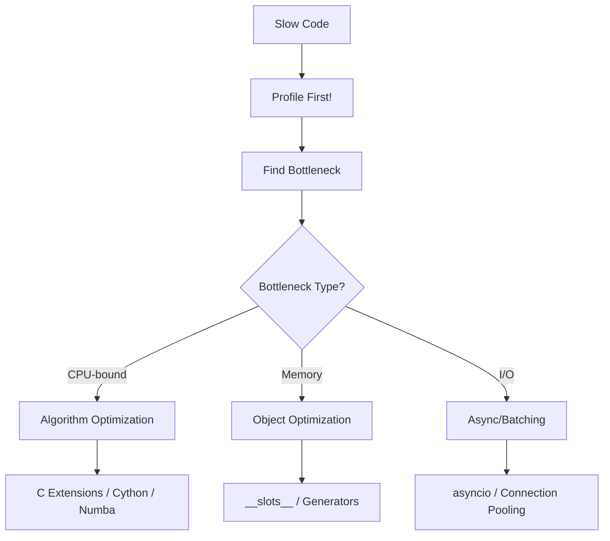
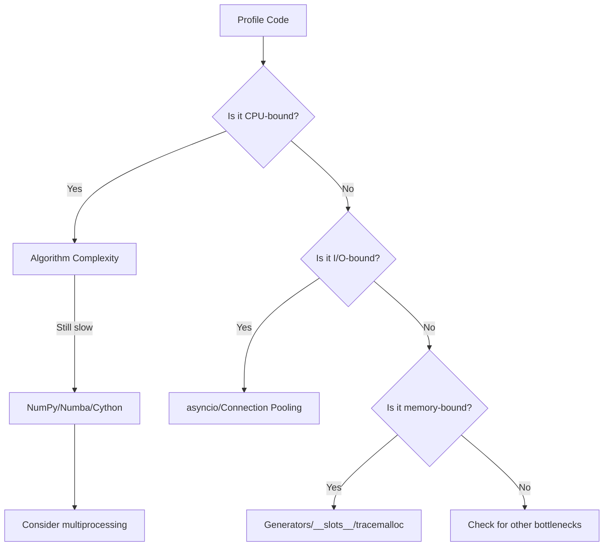

# Python Performance — Profiling and Optimization

## Overview

Python is not the fastest language, but it's fast enough for most tasks — and when it's not, there are powerful optimization techniques. This document covers profiling (finding bottlenecks), optimization strategies, and C-level acceleration.



> **Golden Rule:** Never optimize without profiling first. "Premature optimization is the root of all evil." — Donald Knuth

---

## Profiling — Finding Bottlenecks

### cProfile — Function-Level Profiling

```python
import cProfile
import pstats

def slow_function():
    total = 0
    for i in range(1_000_000):
        total += i * i
    return total

def fast_function():
    return sum(i * i for i in range(1_000_000))

def main():
    slow_function()
    fast_function()

# Profile the code
cProfile.run('main()', 'profile_output')

# Analyze results
stats = pstats.Stats('profile_output')
stats.sort_stats('cumulative')  # Sort by cumulative time
stats.print_stats(20)           # Show top 20 functions
```

### cProfile Output Explained

```
   ncalls  tottime  percall  cumtime  percall filename:lineno(function)
        1    0.150    0.150    0.150    0.150 script.py:3(slow_function)
        1    0.080    0.080    0.080    0.080 script.py:9(fast_function)
        1    0.000    0.000    0.230    0.230 script.py:12(main)
```

| Column | Meaning |
|---|---|
| `ncalls` | Number of calls |
| `tottime` | Time in function (excluding sub-calls) |
| `percall` | `tottime / ncalls` |
| `cumtime` | Time including sub-calls |
| `percall` | `cumtime / ncalls` |

### Profiling with Decorator

```python
import cProfile
import pstats
from functools import wraps

def profile(func):
    """Decorator to profile a function."""
    @wraps(func)
    def wrapper(*args, **kwargs):
        profiler = cProfile.Profile()
        profiler.enable()
        result = func(*args, **kwargs)
        profiler.disable()
        stats = pstats.Stats(profiler)
        stats.sort_stats('tottime')
        stats.print_stats(10)
        return result
    return wrapper

@profile
def compute():
    return sum(i * i for i in range(1_000_000))

compute()
```

### line_profiler — Line-by-Line Profiling

```bash
pip install line_profiler
```

```python
# script.py
@profile  # This decorator is provided by line_profiler
def compute(n):
    total = 0              # Line 1
    for i in range(n):     # Line 2
        total += i * i     # Line 3
    return total           # Line 4

compute(1_000_000)
```

```bash
# Run line_profiler
kernprof -l -v script.py

# Output shows time per line:
# Line #      Hits         Time  Per Hit   % Time  Line Contents
# ==============================================================
#      3   1000000      0.15000   0.000     30.0  total += i * i
#      2   1000001      0.35000   0.000     70.0  for i in range(n):
```

### memory_profiler — Memory Profiling

```bash
pip install memory_profiler
```

```python
from memory_profiler import profile

@profile
def memory_heavy():
    big_list = [i for i in range(1_000_000)]    # ~40 MB
    big_dict = {i: i*i for i in range(500_000)} # ~20 MB
    del big_list
    return big_dict

memory_heavy()
```

```bash
python -m memory_profiler script.py

# Output:
# Line #    Mem usage    Increment   Line Contents
# ================================================
#      4     45.2 MiB     45.2 MiB   big_list = [i for i in range(1_000_000)]
#      5     65.8 MiB     20.6 MiB   big_dict = {i: i*i for i in range(500_000)}
#      6     25.2 MiB    -40.6 MiB   del big_list
```

---

## timeit — Microbenchmarking

```python
import timeit

# Compare approaches
time1 = timeit.timeit(
    'sum(range(1000))',
    number=10000
)
print(f"sum(range): {time1:.4f}s")

time2 = timeit.timeit(
    'total = 0\nfor i in range(1000): total += i',
    number=10000
)
print(f"Loop: {time2:.4f}s")

# From command line
# python -m timeit "sum(range(1000))"
# python -m timeit "total = 0" "for i in range(1000): total += i"
```

---

## Optimization Techniques

### 1. Algorithmic Optimization — Biggest Impact

```python
# O(n²) — Slow
def find_duplicates_slow(items):
    duplicates = []
    for i in range(len(items)):
        for j in range(i + 1, len(items)):
            if items[i] == items[j] and items[i] not in duplicates:
                duplicates.append(items[i])
    return duplicates

# O(n) — Fast
def find_duplicates_fast(items):
    seen = set()
    duplicates = set()
    for item in items:
        if item in seen:
            duplicates.add(item)
        seen.add(item)
    return list(duplicates)

import timeit
data = list(range(1000)) + list(range(500))
print(timeit.timeit(lambda: find_duplicates_fast(data), number=100))
```

### 2. Use Built-in Functions and Libraries

```python
import timeit

# Python loop — slow
def sum_squares_loop(n):
    total = 0
    for i in range(n):
        total += i * i
    return total

# Generator expression — faster
def sum_squares_gen(n):
    return sum(i * i for i in range(n))

# NumPy — fastest for numerical work
import numpy as np
def sum_squares_numpy(n):
    arr = np.arange(n)
    return np.sum(arr * arr)

n = 1_000_000
print(f"Loop:   {timeit.timeit(lambda: sum_squares_loop(n), number=10):.4f}s")
print(f"Gen:    {timeit.timeit(lambda: sum_squares_gen(n), number=10):.4f}s")
print(f"NumPy:  {timeit.timeit(lambda: sum_squares_numpy(n), number=10):.4f}s")
```

### 3. List Comprehensions vs Loops

```python
import timeit

# Map + lambda — slower
result_map = list(map(lambda x: x * 2, range(10000)))

# List comprehension — faster
result_comp = [x * 2 for x in range(10000)]

# For loop with append — slowest
result_loop = []
for x in range(10000):
    result_loop.append(x * 2)
```

### 4. String Concatenation

```python
import timeit

# BAD — O(n²) string concatenation
def concat_bad(n):
    result = ""
    for i in range(n):
        result += str(i) + ", "
    return result

# GOOD — O(n) with join
def concat_good(n):
    return ", ".join(str(i) for i in range(n))

# f-string — also good
def concat_fstring(n):
    parts = [str(i) for i in range(n)]
    return ", ".join(parts)
```

### 5. Dictionary and Set Lookups

```python
import timeit

# List lookup — O(n)
data_list = list(range(10000))
time_list = timeit.timeit(lambda: 9999 in data_list, number=10000)

# Set lookup — O(1)
data_set = set(range(10000))
time_set = timeit.timeit(lambda: 9999 in data_set, number=10000)

print(f"List: {time_list:.4f}s")
print(f"Set:  {time_set:.4f}s")
# Set is ~100-1000x faster for membership tests
```

### 6. Generators vs Lists

```python
import sys

# List — stores all in memory
list_comp = [i * 2 for i in range(1_000_000)]
print(sys.getsizeof(list_comp))  # ~8 MB

# Generator — lazy, memory-efficient
gen_expr = (i * 2 for i in range(1_000_000))
print(sys.getsizeof(gen_expr))   # ~200 bytes

# Generator function
def fibonacci():
    a, b = 0, 1
    while True:
        yield a
        a, b = b, a + b

# Take only what you need
from itertools import islice
first_100 = list(islice(fibonacci(), 100))
```

### 7. `__slots__` for Memory

```python
import sys

class RegularPoint:
    def __init__(self, x, y):
        self.x = x
        self.y = y

class SlottedPoint:
    __slots__ = ('x', 'y')
    def __init__(self, x, y):
        self.x = x
        self.y = y

p1 = RegularPoint(1, 2)
p2 = SlottedPoint(1, 2)

print(sys.getsizeof(p1) + sys.getsizeof(p1.__dict__))  # ~152 bytes
print(sys.getsizeof(p2))                                 # ~40 bytes

# With 1 million points: ~152 MB vs ~40 MB
```

### 8. functools.lru_cache — Memoization

```python
from functools import lru_cache
import timeit

# Without cache — exponential time
def fib_no_cache(n):
    if n < 2:
        return n
    return fib_no_cache(n - 1) + fib_no_cache(n - 2)

# With cache — linear time
@lru_cache(maxsize=128)
def fib_cached(n):
    if n < 2:
        return n
    return fib_cached(n - 1) + fib_cached(n - 2)

print(timeit.timeit(lambda: fib_cached(300), number=1))  # ~0.00001s
# fib_no_cache(300) would take longer than the age of the universe
```

---

## C Extensions

### ctypes — Call C Libraries

```python
import ctypes

# Load C standard library
libc = ctypes.CDLL("libc.so.6")  # Linux
# libc = ctypes.CDLL("libc.dylib")  # macOS

# Call C function
result = libc.sqrt(ctypes.c_double(16.0))
print(result)  # Note: returns int, needs proper type setup

# Proper way with return type
libc.sqrt.restype = ctypes.c_double
result = libc.sqrt(ctypes.c_double(16.0))
print(result)  # 4.0
```

### cffi — Modern C Interface

```python
from cffi import FFI

ffi = FFI()
ffi.cdef("""
    double sqrt(double x);
    double pow(double base, double exp);
""")

# Load and call
lib = ffi.dlopen("libm.so.6")
print(lib.sqrt(16.0))   # 4.0
print(lib.pow(2.0, 10.0))  # 1024.0
```

### Cython — Python with C Types

```python
# cython_example.pyx
def compute(int n):
    cdef int i
    cdef double total = 0.0
    for i in range(n):
        total += i * i
    return total
```

```bash
# Compile Cython
cythonize -i cython_example.pyx

# Use in Python
import cython_example
result = cython_example.compute(1_000_000)
```

### Numba — JIT Compilation

```python
from numba import jit
import numpy as np
import timeit

# Without Numba — pure Python
def monte_carlo_pi_python(n):
    count = 0
    for i in range(n):
        x = np.random.random()
        y = np.random.random()
        if x*x + y*y <= 1.0:
            count += 1
    return 4.0 * count / n

# With Numba JIT — compiled to machine code
@jit(nopython=True)
def monte_carlo_pi_numba(n):
    count = 0
    for i in range(n):
        x = np.random.random()
        y = np.random.random()
        if x*x + y*y <= 1.0:
            count += 1
    return 4.0 * count / n

# First call compiles (slow), subsequent calls are fast
monte_carlo_pi_numba(1)  # Warmup

n = 10_000_000
t1 = timeit.timeit(lambda: monte_carlo_pi_python(n), number=1)
t2 = timeit.timeit(lambda: monte_carlo_pi_numba(n), number=1)
print(f"Python: {t1:.2f}s")  # ~3-5s
print(f"Numba:  {t2:.2f}s")  # ~0.1-0.2s (20-50x faster)
```

---

## Memory Optimization

### Generator Pipelines

```python
# BAD — loads everything into memory
def process_large_file_bad(filename):
    with open(filename) as f:
        lines = f.readlines()           # All lines in memory
    filtered = [l for l in lines if 'ERROR' in l]  # Another copy
    return [l.strip().upper() for l in filtered]    # Another copy

# GOOD — generator pipeline, constant memory
def process_large_file_good(filename):
    with open(filename) as f:
        for line in f:                          # One line at a time
            if 'ERROR' in line:                 # Filter
                yield line.strip().upper()      # Transform
```

### sys.getsizeof — Measure Object Size

```python
import sys

objects = [
    42,
    3.14,
    "hello",
    "a" * 1000,
    [1, 2, 3],
    list(range(1000)),
    {i: i for i in range(100)},
    set(range(100)),
    (1, 2, 3),
    frozenset(range(100)),
]

for obj in objects:
    print(f"{type(obj).__name__:>15}: {sys.getsizeof(obj):>8} bytes")
```

### tracemalloc — Track Memory Allocations

```python
import tracemalloc

tracemalloc.start()

# Code to profile
data = [i * 2 for i in range(100_000)]
data_dict = {i: i * 2 for i in range(100_000)}

# Take snapshot
snapshot = tracemalloc.take_snapshot()
top_stats = snapshot.statistics('lineno')

print("[ Top 5 memory allocations ]")
for stat in top_stats[:5]:
    print(stat)
```

---

## Optimization Checklist



---

## Common Mistakes

1. **Optimizing without profiling** — You'll optimize the wrong thing.
2. **Using global variables in hot loops** — Local variable lookups are faster (`LOAD_FAST` vs `LOAD_GLOBAL`).
3. **Not using `in` for membership tests** — `x in set` is O(1), `x in list` is O(n).
4. **Concatenating strings with `+=`** — Use `str.join()` for building large strings.
5. **Loading entire files into memory** — Use generators and iterate line by line.
6. **Using Python for heavy numerical work** — Use NumPy, Numba, or Cython.

```python
# BAD — global variable in loop
data = range(1_000_000)
def process():
    result = []
    for item in data:  # 'data' is global — slower lookup
        result.append(item * 2)
    return result

# GOOD — local variable
def process():
    local_data = data  # Copy to local
    result = []
    for item in local_data:
        result.append(item * 2)
    return result

# BETTER — list comprehension
def process():
    return [item * 2 for item in data]
```

---

## Summary

| Technique | Speedup | Effort | Use When |
|---|---|---|---|
| Algorithm optimization | 10-1000x | Medium | Always first |
| Built-in functions | 2-10x | Low | Available alternatives exist |
| List comprehensions | 1.5-3x | Low | Building lists |
| Generators | Memory: 10-100x | Low | Large datasets |
| `lru_cache` | 10-1000x | Low | Repeated computations |
| `__slots__` | Memory: 2-4x | Low | Many instances |
| NumPy | 10-100x | Medium | Numerical computation |
| Numba JIT | 20-100x | Low | Numerical loops |
| Cython | 10-100x | High | Performance-critical code |
| C extensions | 50-200x | High | Maximum performance |
| Multiprocessing | Linear with cores | Medium | CPU-bound, parallelizable |
