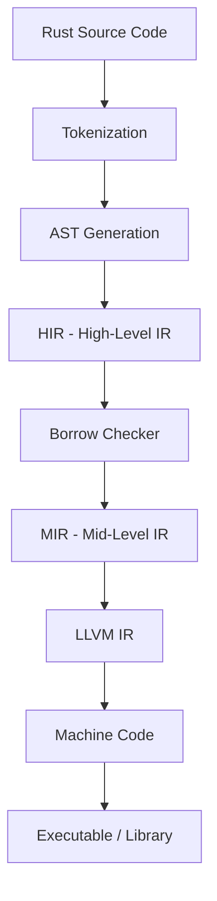

# Rust Programming Language

## Overview

Rust is a systems programming language focused on **safety**, **speed**, and **concurrency**. Developed by Mozilla Research and first released in 2010 (stable 1.0 in 2015), Rust achieves memory safety without a garbage collector through its innovative **ownership system**. It has been consistently voted the "most loved programming language" in Stack Overflow surveys for multiple years.

Rust is used in production at companies like Mozilla (Firefox), Google (Android, Chromium), Microsoft (Windows kernel), Amazon (Firecracker), Meta, Cloudflare, and Dropbox. Its adoption is growing rapidly in systems programming, WebAssembly, embedded systems, and backend services.

## Philosophy

Rust's design is guided by three core principles:

### 1. Safety Without Garbage Collection

Unlike C/C++, Rust guarantees memory safety at compile time. The ownership system eliminates:
- **Use-after-free** errors
- **Double-free** errors
- **Null pointer dereferences** (no null in safe Rust)
- **Data races** in concurrent code
- **Buffer overflows** (bounds checking at runtime)

### 2. Zero-Cost Abstractions

Rust provides high-level abstractions (iterators, closures, pattern matching, traits) that compile down to the same machine code as hand-written low-level code. You don't pay for what you don't use.

### 3. Fearless Concurrency

The ownership and type systems prevent data races at compile time. If your code compiles, it's free from data races (though not all concurrency bugs).

## Why Rust for Interviews?

Rust appears in interviews for:

- **Systems programming roles** (OS, embedded, networking)
- **Backend services** (performance-critical APIs)
- **Blockchain/Web3** (Solana, Polkadot, Ethereum clients)
- **Cloud infrastructure** (AWS, Cloudflare)
- **Any role emphasizing correctness and performance**

Key topics interviewers test:

| Topic | Why It Matters |
|-------|---------------|
| Ownership & Borrowing | Core Rust concept, shows understanding of memory safety |
| Lifetimes | Tests deeper knowledge of the type system |
| Traits vs Generics | Polymorphism and code design |
| Error Handling | `Result`/`Option` vs exceptions |
| Async/Await | Modern Rust concurrency |
| Unsafe Rust | Understanding when and why to escape safety |

## Rust vs Other Languages

| Feature | Rust | C++ | Go | Java |
|---------|------|-----|----|------|
| Memory Safety | Compile-time | Manual | GC | GC |
| Performance | Excellent | Excellent | Good | Good |
| Concurrency | Fearless | Manual | Goroutines | Threads |
| Learning Curve | Steep | Steep | Gentle | Moderate |
| Compile Times | Slow | Slow | Fast | Moderate |
| Null Safety | Yes | No | No | Partial |
| Generics | Monomorphized | Templates | Limited | Type erasure |

## Compilation Model

Rust uses LLVM as its backend compiler:

```
Source Code (.rs) → rustc frontend → MIR → LLVM IR → Machine Code
```



## Key Language Features

- **Pattern matching** with exhaustive `match` expressions
- **Enums with data** (algebraic data types)
- **Traits** for ad-hoc polymorphism (similar to interfaces)
- **Closures** with ownership semantics
- **Iterators** with lazy evaluation and zero-cost abstraction
- **Macros** (declarative and procedural) for metaprogramming
- **No inheritance** — composition via traits and structs
- **Cargo** — an excellent build system and package manager

## Ecosystem

- **Cargo** — Build system and package manager
- **crates.io** — Package registry
- **rustup** — Toolchain manager
- **clippy** — Linter
- **rustfmt** — Code formatter
- **tokio** — Async runtime
- **serde** — Serialization/deserialization
- **actix-web / axum** — Web frameworks

## Common Mistakes

1. **Fighting the borrow checker** — Usually means the design needs rethinking
2. **Overusing `clone()`** — Often a sign of not understanding ownership
3. **Using `unwrap()` everywhere** — Proper error handling with `?` is preferred
4. **Confusing `String` and `&str`** — Owned vs borrowed string types
5. **Ignoring lifetimes** — They're there for a reason; understand them

## Interview Questions Preview

1. Explain Rust's ownership model and how it prevents memory leaks
2. What is the difference between `Box<T>`, `Rc<T>`, and `Arc<T>`?
3. When would you use `unsafe` code in Rust?
4. Explain the orphan rule for trait implementations
5. How does Rust's `async`/`await` differ from Python's?

## See Also

- [Ownership](./ownership.md) — Core ownership rules and move semantics
- [Borrow Checker](./borrow-checker.md) — How the borrow checker enforces safety
- [Lifetimes](./lifetimes.md) — Lifetime annotations and elision rules
- [Traits](./traits.md) — Defining shared behavior
- [Error Handling](./error-handling.md) — `Result`, `Option`, and the `?` operator
- [Async/Await](./async.md) — Asynchronous programming in Rust
- [Unsafe Rust](./unsafe.md) — When safety rules need to be bypassed
- [Interview Questions](./interview-questions.md) — 30+ detailed Q&A
