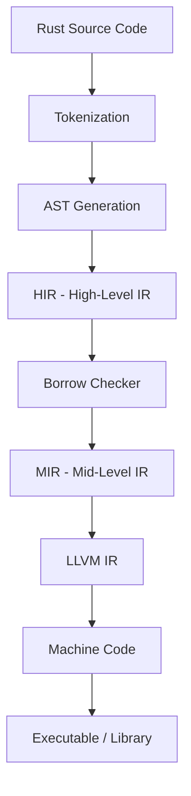

# Rust Programming Language

## Overview

Rust is a systems programming language focused on **safety**, **speed**, and **concurrency**. Developed by Mozilla Research and first released in 2010 (stable 1.0 in 2015), Rust achieves memory safety without a garbage collector through its innovative **ownership system**. It has been consistently voted the "most loved programming language" in Stack Overflow surveys for multiple years.

Rust is used in production at companies like Mozilla (Firefox), Google (Android, Chromium), Microsoft (Windows kernel), Amazon (Firecracker), Meta, Cloudflare, and Dropbox. Its adoption is growing rapidly in systems programming, WebAssembly, embedded systems, and backend services.

## Philosophy

Rust's design is guided by three core principles:

### 1. Safety Without Garbage Collection

Unlike C/C++, Rust guarantees memory safety at compile time. The ownership system eliminates:
- **Use-after-free** errors
- **Double-free** errors
- **Null pointer dereferences** (no null in safe Rust)
- **Data races** in concurrent code
- **Buffer overflows** (bounds checking at runtime)

### 2. Zero-Cost Abstractions

Rust provides high-level abstractions (iterators, closures, pattern matching, traits) that compile down to the same machine code as hand-written low-level code. You don't pay for what you don't use.

### 3. Fearless Concurrency

The ownership and type systems prevent data races at compile time. If your code compiles, it's free from data races (though not all concurrency bugs).

## Why Rust for Interviews?

Rust appears in interviews for:

- **Systems programming roles** (OS, embedded, networking)
- **Backend services** (performance-critical APIs)
- **Blockchain/Web3** (Solana, Polkadot, Ethereum clients)
- **Cloud infrastructure** (AWS, Cloudflare)
- **Any role emphasizing correctness and performance**

Key topics interviewers test:

| Topic | Why It Matters |
|-------|---------------|
| Ownership & Borrowing | Core Rust concept, shows understanding of memory safety |
| Lifetimes | Tests deeper knowledge of the type system |
| Traits vs Generics | Polymorphism and code design |
| Error Handling | `Result`/`Option` vs exceptions |
| Async/Await | Modern Rust concurrency |
| Unsafe Rust | Understanding when and why to escape safety |

## Rust vs Other Languages

| Feature | Rust | C++ | Go | Java |
|---------|------|-----|----|------|
| Memory Safety | Compile-time | Manual | GC | GC |
| Performance | Excellent | Excellent | Good | Good |
| Concurrency | Fearless | Manual | Goroutines | Threads |
| Learning Curve | Steep | Steep | Gentle | Moderate |
| Compile Times | Slow | Slow | Fast | Moderate |
| Null Safety | Yes | No | No | Partial |
| Generics | Monomorphized | Templates | Limited | Type erasure |

## Compilation Model

Rust uses LLVM as its backend compiler:

```
Source Code (.rs) → rustc frontend → MIR → LLVM IR → Machine Code
```



## Syntax Fundamentals

### Variables and Mutability

```rust
let x = 5;           // Immutable by default
// x = 6;            // ERROR: cannot assign twice
let mut y = 5;       // Mutable
y = 6;               // OK

const MAX: u32 = 100_000;  // Compile-time constant
let _unused = 42;          // Prefix _ to suppress unused warning

// Shadowing (rebinding with same name)
let x = 5;
let x = x + 1;      // Shadows previous x
let x = "six";       // Can change type via shadowing
```

### Scalar Types

```rust
// Integers: i8, i16, i32, i64, i128, isize (signed)
//           u8, u16, u32, u64, u128, usize (unsigned)
let a: i32 = 42;
let b = 0xff;        // Hex
let c = 0o77;        // Octal
let d = 0b1010;      // Binary
let e = b'A';        // Byte (u8)

// Floating point
let f: f64 = 3.14;   // f32 or f64 (default)

// Boolean
let t: bool = true;

// Character (4 bytes, Unicode)
let c: char = '😻';
```

### Compound Types

```rust
// Tuples
let tup: (i32, f64, char) = (500, 6.4, 'a');
let (x, y, z) = tup;        // Destructuring
let first = tup.0;           // Index access

// Arrays (fixed size, stack-allocated)
let arr = [1, 2, 3, 4, 5];
let first = arr[0];          // Panics on out-of-bounds
let zeros = [0; 5];          // [0, 0, 0, 0, 0]
```

### Functions

```rust
fn add(a: i32, b: i32) -> i32 {
    a + b   // No semicolon = implicit return
}

// Multiple return values via tuple
divmod(a: i32, b: i32) -> (i32, i32) {
    (a / b, a % b)
}

// Closures
let add_one = |x: i32| x + 1;
let add = |a, b| a + b;  // Type inference
```

### Control Flow

```rust
// if expressions (not statements — can return values)
let max = if a > b { a } else { b };

// Loops
loop { break 42; }           // Infinite loop with break value
while condition { /* ... */ }
for i in 0..10 { /* ... */ } // Range
for item in vec.iter() { /* ... */ }

// Pattern matching (exhaustive)
match value {
    1 => println("one"),
    2 | 3 => println("two or three"),
    4..=9 => println("four to nine"),
    _ => println("something else"),
}

// if let (shorthand for single-arm match)
if let Some(value) = optional {
    println!("Got: {}", value);
}
```

### Structs and Enums

```rust
// Struct
struct Point {
    x: f64,
    y: f64,
}

impl Point {
    fn new(x: f64, y: f64) -> Self { Self { x, y } }
    fn distance(&self) -> f64 { (self.x.powi(2) + self.y.powi(2)).sqrt() }
}

// Enum with data (algebraic data type)
enum Shape {
    Circle(f64),              // radius
    Rectangle(f64, f64),      // width, height
    Triangle { base: f64, height: f64 },
}

impl Shape {
    fn area(&self) -> f64 {
        match self {
            Shape::Circle(r) => std::f64::consts::PI * r * r,
            Shape::Rectangle(w, h) => w * h,
            Shape::Triangle { base, height } => 0.5 * base * height,
        }
    }
}
```

### Option and Result

```rust
// Option — nullable values (no null in Rust)
fn find(id: u32) -> Option<String> {
    if id == 1 { Some("Alice".into()) } else { None }
}

// Result — error handling
fn read_file(path: &str) -> Result<String, std::io::Error> {
    std::fs::read_to_string(path)
}

// ? operator — propagate errors
fn process() -> Result<(), Box<dyn std::error::Error>> {
    let content = read_file("data.txt")?;
    println!("{}", content);
    Ok(())
}
```

### Generics and Traits

```rust
// Generic function
fn largest<T: PartialOrd>(list: &[T]) -> &T {
    let mut largest = &list[0];
    for item in &list[1..] {
        if item > largest { largest = item; }
    }
    largest
}

// Trait definition and implementation
trait Summary {
    fn summarize(&self) -> String;
    fn preview(&self) -> String { format!("{}...", &self.summarize()[..20]) } // Default impl
}

impl Summary for Article {
    fn summarize(&self) -> String { format!("{}: {}", self.title, self.content) }
}
```

### Collections

```rust
use std::collections::{HashMap, HashSet, BTreeMap};

// Vec — dynamic array
let mut v = Vec::new();
v.push(1);
v.pop();
let v = vec![1, 2, 3];

// HashMap
let mut scores = HashMap::new();
scores.insert("Alice", 100);
scores.entry("Bob").or_insert(0);

// Iterator chains (zero-cost)
let sum: i32 = vec![1, 2, 3, 4]
    .iter()
    .filter(|&&x| x % 2 == 0)
    .sum();
```

## Key Language Features

- **Pattern matching** with exhaustive `match` expressions
- **Enums with data** (algebraic data types)
- **Traits** for ad-hoc polymorphism (similar to interfaces)
- **Closures** with ownership semantics
- **Iterators** with lazy evaluation and zero-cost abstraction
- **Macros** (declarative and procedural) for metaprogramming
- **No inheritance** — composition via traits and structs
- **Cargo** — an excellent build system and package manager

## Ecosystem

- **Cargo** — Build system and package manager
- **crates.io** — Package registry
- **rustup** — Toolchain manager
- **clippy** — Linter
- **rustfmt** — Code formatter
- **tokio** — Async runtime
- **serde** — Serialization/deserialization
- **actix-web / axum** — Web frameworks

## Common Mistakes

1. **Fighting the borrow checker** — Usually means the design needs rethinking
2. **Overusing `clone()`** — Often a sign of not understanding ownership
3. **Using `unwrap()` everywhere** — Proper error handling with `?` is preferred
4. **Confusing `String` and `&str`** — Owned vs borrowed string types
5. **Ignoring lifetimes** — They're there for a reason; understand them

## Interview Questions Preview

1. Explain Rust's ownership model and how it prevents memory leaks
2. What is the difference between `Box<T>`, `Rc<T>`, and `Arc<T>`?
3. When would you use `unsafe` code in Rust?
4. Explain the orphan rule for trait implementations
5. How does Rust's `async`/`await` differ from Python's?

## See Also

- [Ownership](./ownership.md) — Core ownership rules and move semantics
- [Borrow Checker](./borrow-checker.md) — How the borrow checker enforces safety
- [Lifetimes](./lifetimes.md) — Lifetime annotations and elision rules
- [Traits](./traits.md) — Defining shared behavior
- [Error Handling](./error-handling.md) — `Result`, `Option`, and the `?` operator
- [Async/Await](./async.md) — Asynchronous programming in Rust
- [Unsafe Rust](./unsafe.md) — When safety rules need to be bypassed
- [Interview Questions](./interview-questions.md) — 30+ detailed Q&A
