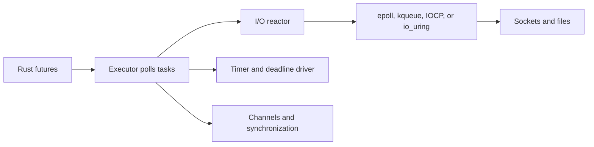

# Rust Async Runtime Choices

Rust's `async` and `await` syntax describe futures, but the language standard
library does not choose one executor, reactor, timer implementation, or socket
stack. An **async runtime** polls futures, waits for I/O readiness, schedules
tasks, manages timers, and provides runtime-specific channels and services.

The right choice depends more on ecosystem compatibility and blocking behavior
than on a single synthetic throughput number.

## What a runtime provides



A runtime normally contains:

- An executor that polls ready futures.
- A reactor or I/O driver that turns OS readiness into waker notifications.
- Timers and cancellation/deadline facilities.
- Task spawning, join handles, and panic/cancellation behavior.
- Async channels, mutexes, semaphores, streams, and synchronization.
- Adapters for files, sockets, TLS, HTTP, database clients, and tracing.

A future is not a thread. It makes progress only when an executor polls it,
and a future that performs blocking work can stall the executor's worker.

## Tokio

**Tokio** is the pragmatic default for general-purpose production Rust network
services. It provides a multi-threaded work-stealing scheduler, a current-thread
runtime, networking, timers, synchronization, tracing integration, and a large
ecosystem of crates that target its traits and runtime context.

```rust
#[tokio::main]
async fn main() -> Result<(), Box<dyn std::error::Error>> {
    let listener = tokio::net::TcpListener::bind("0.0.0.0:8080").await?;

    loop {
        let (mut socket, peer) = listener.accept().await?;
        tokio::spawn(async move {
            if let Err(error) = handle(socket).await {
                eprintln!("{peer}: {error}");
            }
        });
    }
}

async fn handle(_socket: tokio::net::TcpStream) -> Result<(), std::io::Error> {
    Ok(())
}
```

Choose Tokio when:

- HTTP, gRPC, database, messaging, or TLS crates already target Tokio.
- You need multi-threaded scheduling, rich timers, signals, and channels.
- The team values mature operational tooling and broad documentation.

Watch for:

- Blocking CPU or file work on runtime workers; use `spawn_blocking` or a
  dedicated pool.
- Holding an async mutex across an `.await` longer than necessary.
- Unbounded task or channel creation.
- Runtime-specific traits that make library interoperability harder.

## smol and the futures ecosystem

**smol** is a small, composable runtime built from futures-ecosystem components.
It is useful when a library should not force a large application runtime, when
explicit composition matters, or when a small dependency footprint is more
important than ecosystem breadth.

The trade-off is that application developers may need to assemble more pieces:
executor, I/O reactor, timers, compatibility adapters, and service libraries.
Use a tested runtime configuration rather than assuming that “small” means
faster for every workload.

## async-std and ecosystem status

`async-std` historically mirrored synchronous standard-library naming and made
async Rust approachable. Its APIs remain relevant for existing code, but new
projects should check current maintenance and dependency support before
starting a long-lived service. The Rust Async Book describes it as one of the
community-provided runtimes and emphasizes that the standard library does not
officially recommend a runtime.

For migration, identify trait boundaries first: Tokio's `AsyncRead` and
`AsyncWrite` types are not automatically the same as `futures`-based traits.
Compatibility crates can bridge some boundaries, but they do not erase runtime
context requirements.

## Specialized runtimes

### Glommio and thread-per-core designs

Thread-per-core runtimes can reduce cross-core contention by keeping an
executor, queues, and data local to one CPU. They fit workloads that can shard
state and use Linux `io_uring`, but they make load balancing, blocking work,
NUMA placement, and cross-core communication explicit.

### Monoio and io_uring-oriented designs

An io_uring-oriented runtime can reduce system-call transitions and batch I/O
submissions on Linux. It is not automatically portable to platforms without
io_uring and may require libraries designed for that runtime's traits.

### Embassy

**Embassy** targets embedded and `no_std` systems. Interrupt-driven executors,
static allocation patterns, and hardware-specific futures are useful on
microcontrollers but are a different design space from Tokio server software.

## Comparison

| Runtime/family | Best fit | Scheduler/I/O character | Main risk |
|---|---|---|---|
| Tokio | Production services and network applications | Multi-thread or current-thread; broad I/O ecosystem | Runtime coupling and blocking work |
| smol/futures | Small libraries and composable applications | Modular executor/reactor pieces | Smaller integration ecosystem |
| async-std | Existing applications and legacy compatibility | Std-like API and community ecosystem | Verify maintenance and crate support |
| Glommio | Linux thread-per-core systems | Local executors and io_uring-oriented I/O | Sharding and portability constraints |
| Monoio | Linux high-performance I/O | Thread-per-core and io_uring style | Specialized ecosystem |
| Embassy | Embedded/no_std | Interrupt-driven, resource-constrained | Not a server runtime |

Avoid publishing raw requests-per-second comparisons without the workload,
protocol, payload, CPU, kernel, connection count, allocator, and batching
configuration. Runtime overhead is often smaller than application serialization,
TLS, database, and network costs.

## Blocking and cancellation checklist

- Never call a blocking filesystem, DNS, compression, or CPU-heavy function on
  an executor worker without measuring and isolating it.
- Put deadlines around external I/O and propagate cancellation deliberately.
- Decide whether dropping a future cancels the operation or only stops waiting
  for it.
- Make shutdown drain listeners, stop accepting work, cancel tasks, flush
  telemetry, and close resources in an explicit order.
- Bound queues and concurrent requests; backpressure is part of correctness.
- Use tracing spans across `.await` boundaries and include request IDs in
  structured events.

## Interview questions

**Why does Rust not have one official async runtime?**

The language and standard library provide the `Future` abstraction but leave
policy choices—executor, reactor, timers, and platform integration—to crates.
This supports servers, embedded systems, libraries, and specialized runtimes
without forcing one scheduler into every binary.

**Why can an async service still block?**

An async task can call a synchronous function. If that function blocks a runtime
worker, other tasks assigned to that worker stop making progress. Use a blocking
pool, dedicated thread, or truly asynchronous API.

**Tokio or smol for a library?**

Prefer a library-facing abstraction that does not unnecessarily force a
runtime. If runtime-specific features are needed, document the choice and offer
compatibility boundaries where practical. Applications can then choose their
executor.

**What does work stealing solve?**

It balances runnable tasks between workers, but it does not make shared state
free. Cross-thread wakes, contention, cache movement, and blocking tasks still
cost time.

## Cross-references

- [Tokio framework](../../frameworks/tokio/README.md)
- [Async/Await concurrency](../../concurrency/async-await.md)
- [Work-Stealing Scheduler](../../concurrency/work-stealing.md)
- [Rust async overview](./async.md)
- [Rust ownership](./ownership.md)
- [io_uring](../../linux/sysprog/io-uring.md)
- [Linux epoll](../../linux/sysprog/epoll.md)
- [OpenTelemetry](../../backend/observability/opentelemetry.md)

## References

- [Rust Async Book: The async ecosystem](https://rust-lang.github.io/async-book/08_ecosystem/00_chapter.html)
- [Tokio documentation](https://tokio.rs/tokio/tutorial)
- [Tokio API documentation](https://docs.rs/tokio/latest/tokio/)
- [smol API documentation](https://docs.rs/smol/latest/smol/)
- [async-std API documentation](https://docs.rs/async-std/latest/async_std/)
- [Glommio API documentation](https://docs.rs/glommio/latest/glommio/)
- [Embassy documentation](https://embassy.dev/)
- [Rust async foundations](https://rust-lang.github.io/async-book/)
