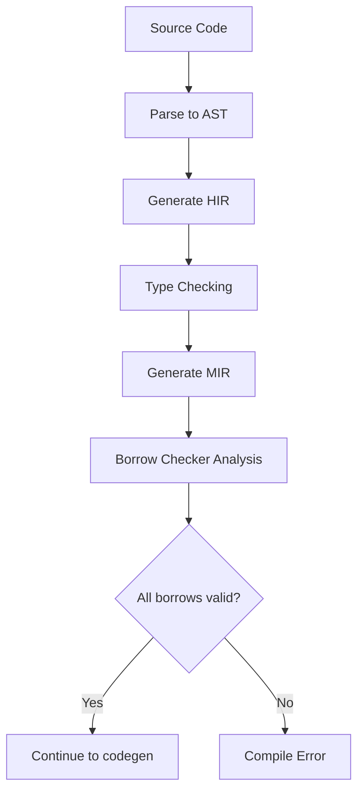

# The Borrow Checker

## Overview

The borrow checker is Rust's compile-time mechanism that enforces the ownership and borrowing rules. It analyzes the control flow of your program to ensure that:

1. Every reference is valid (no dangling references)
2. Mutable references are exclusive (no data races)
3. Immutable references don't coexist with mutable references

The borrow checker is the reason Rust can guarantee memory safety without a garbage collector. It's also the primary source of frustration for newcomers — but understanding it transforms Rust from "difficult" to "elegant."

## How It Works

The borrow checker performs **static analysis** on the program's MIR (Mid-level Intermediate Representation). It tracks:

- **Liveness** of each variable (where it's created, used, and dropped)
- **Borrows** (which references exist and what they point to)
- **Scopes** (how long each borrow is active)



## The Core Rules

### Rule 1: References Must Be Valid

```rust
fn main() {
    let r;
    {
        let x = 5;
        r = &x;        // x doesn't live long enough
    }
    // println!("{}", r); // ERROR: r references dropped value
}
```

### Rule 2: One Mutable XOR Many Immutable

```rust
fn main() {
    let mut s = String::from("hello");

    let r1 = &s;        // OK
    let r2 = &s;        // OK
    // let r3 = &mut s; // ERROR: cannot borrow as mutable while immutably borrowed

    println!("{} {}", r1, r2);
    // r1 and r2 are no longer used after this point (NLL)

    let r3 = &mut s;    // OK: r1 and r2 are "dead" here
    println!("{}", r3);
}
```

## Non-Lexical Lifetimes (NLL)

Before Rust 2018, borrows lasted until the end of the enclosing block (lexical scope). **Non-Lexical Lifetimes (NLL)** changed this: borrows now end at the **last use** of the reference, not at the end of the block.

```rust
fn main() {
    let mut s = String::from("hello");

    let r1 = &s;
    println!("{}", r1);   // r1's last use here
    // NLL: r1 is no longer active after this point

    let r2 = &mut s;      // OK! r1 is dead
    println!("{}", r2);
}
```

### Before NLL vs After NLL

```rust
// Before NLL (Rust 2015): this would NOT compile
fn process() {
    let mut data = vec![1, 2, 3];
    let first = &data[0];
    // first is still "alive" here in lexical scope
    data.push(4);           // ERROR: cannot borrow as mutable
    println!("{}", first);
}

// After NLL (Rust 2018+): this compiles
fn process() {
    let mut data = vec![1, 2, 3];
    let first = &data[0];
    println!("{}", first);  // last use of first
    // first is dead here
    data.push(4);           // OK!
}
```

## Common Patterns to Satisfy the Borrow Checker

### Pattern 1: Restructure to Limit Borrow Scope

```rust
// Problem: borrow extends too far
fn problem() {
    let mut v = vec![1, 2, 3];
    let first = &v[0];
    v.push(4);          // ERROR
    println!("{}", first);
}

// Solution: limit the borrow scope
fn solution() {
    let mut v = vec![1, 2, 3];
    let first = v[0];   // Copy the value (i32 is Copy)
    v.push(4);          // OK: no outstanding borrow
    println!("{}", first);
}
```

### Pattern 2: Use Index Instead of Reference

```rust
fn find_and_insert(v: &mut Vec<String>, target: &str) {
    // Problem: can't borrow v immutably and mutably at once
    // let pos = v.iter().position(|s| s == target);
    // v.insert(pos.unwrap(), "new".to_string());

    // Solution: collect what you need, then modify
    let pos = v.iter().position(|s| s == target);
    if let Some(idx) = pos {
        v.insert(idx, "new".to_string());
    }
}
```

### Pattern 3: Clone When Necessary

```rust
fn process(data: &[String]) -> Vec<String> {
    // If you need to own a copy, clone explicitly
    data.iter()
        .filter(|s| !s.is_empty())
        .cloned()
        .collect()
}
```

### Pattern 4: Use `split_at_mut` for Mutable Slices

```rust
fn split_example() {
    let mut v = vec![1, 2, 3, 4, 5];

    // Can't do this:
    // let left = &mut v[0..2];
    // let right = &mut v[2..4]; // ERROR: second mutable borrow

    // Use split_at_mut:
    let (left, right) = v.split_at_mut(2);
    // left = [1, 2], right = [3, 4, 5]
    left[0] = 10;
    right[0] = 30;
}
```

### Pattern 5: Restructure Data Ownership

```rust
// Problem: self-referential struct
struct Database {
    data: Vec<String>,
    // index: &Vec<String>, // Can't reference data
}

// Solution: use indices or owned data
struct Database {
    data: Vec<String>,
    index: Vec<usize>,  // Indices into data instead of references
}
```

## The Borrow Checker and Control Flow

The borrow checker understands conditional and loop control flow:

```rust
fn example() {
    let mut x = 5;
    let r = &x;

    if true {
        println!("{}", r);
    }

    // r is dead here (NLL)
    x = 10;  // OK
}
```

## Two-Phase Borrows

Rust uses **two-phase borrows** for method calls with `&mut self`:

```rust
let mut v = vec![1, 2, 3];
// v.push(v.len());
// This works because:
// Phase 1: v is borrowed immutably to compute v.len()
// Phase 2: v is borrowed mutably for push()
// The immutable borrow ends before the mutable one begins
v.push(v.len()); // OK!
```

## Common Mistakes

1. **Fighting the borrow checker instead of redesigning** — If the compiler rejects your code, your design may have a logical issue
2. **Overusing `clone()` to satisfy the borrow checker** — Usually indicates a design problem
3. **Not understanding NLL** — Code that was rejected in Rust 2015 may compile in Rust 2018+
4. **Assuming borrows last until end of block** — NLL means borrows end at last use
5. **Trying to mutate a collection while iterating** — Use `retain`, indices, or collect-then-modify patterns

## Interview Questions

1. **What does the borrow checker do?**
   The borrow checker is a compile-time analysis tool that enforces Rust's ownership and borrowing rules. It ensures references are valid, mutable references are exclusive, and no data races exist.

2. **What are Non-Lexical Lifetimes (NLL)?**
   NLL is a borrow checker improvement where borrows end at the last use of the reference rather than at the end of the lexical block. This makes Rust more ergonomic without sacrificing safety.

3. **How do you handle a situation where the borrow checker rejects valid code?**
   Restructure the code: limit borrow scopes, use indices instead of references, clone when necessary, or redesign the data ownership. The borrow checker is usually right.

4. **Can you give an example where NLL makes a difference?**
   ```rust
   let mut v = vec![1, 2, 3];
   let first = &v[0];
   println!("{}", first); // last use of first
   v.push(4); // OK with NLL, would fail without
   ```

5. **What is a two-phase borrow?**
   Two-phase borrows allow `&mut self` method calls to first immutably borrow the receiver for argument evaluation, then mutably borrow it for the method body. Example: `v.push(v.len())`.

## See Also

- [Ownership](./ownership.md) — The ownership rules the borrow checker enforces
- [Lifetimes](./lifetimes.md) — How lifetimes relate to borrowing
- [Unsafe Rust](./unsafe.md) — Bypassing the borrow checker
- [Concurrency](./async.md) — How the borrow checker prevents data races
