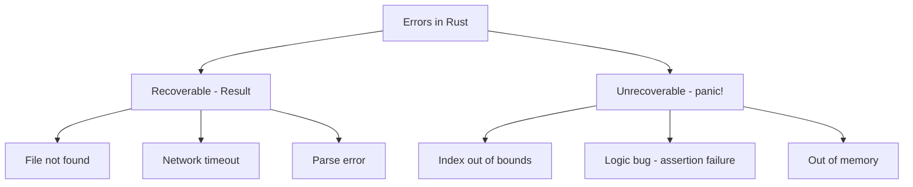

# Error Handling in Rust

## Overview

Rust takes a principled approach to error handling: errors are **values**, not exceptions. There's no `try/catch`, no implicit unwinding. Instead, Rust uses two enums — `Result<T, E>` for recoverable errors and `panic!` for unrecoverable errors. This approach makes error handling explicit, composable, and type-safe.

## The Two Categories of Errors



## `Result<T, E>`

```rust
enum Result<T, E> {
    Ok(T),    // Success with value
    Err(E),   // Error with error value
}
```

### Basic Usage

```rust
use std::fs::File;
use std::io::{self, Read};

fn read_username() -> Result<String, io::Error> {
    let mut file = File::open("username.txt")?;  // ? propagates errors
    let mut username = String::new();
    file.read_to_string(&mut username)?;
    Ok(username)
}
```

### The `?` Operator

The `?` operator is syntactic sugar for error propagation:

```rust
// With ? operator:
fn read_file(path: &str) -> Result<String, io::Error> {
    let mut file = File::open(path)?;
    let mut contents = String::new();
    file.read_to_string(&mut contents)?;
    Ok(contents)
}

// Without ? operator (equivalent):
fn read_file_verbose(path: &str) -> Result<String, io::Error> {
    let mut file = match File::open(path) {
        Ok(f) => f,
        Err(e) => return Err(e),
    };
    let mut contents = String::new();
    match file.read_to_string(&mut contents) {
        Ok(_) => Ok(contents),
        Err(e) => Err(e),
    }
}
```

**Key rule:** `?` can be used in functions that return `Result` or `Option`.

## `Option<T>`

```rust
enum Option<T> {
    Some(T),  // Has a value
    None,     // No value
}
```

### Converting Between Result and Option

```rust
fn find_user(id: u64) -> Option<User> { /* ... */ }

// Option -> Result
let user = find_user(42).ok_or("User not found")?;

// Result -> Option
let value = some_result.ok();  // Converts Err to None
let value = some_result.ok()?; // Propagate None with ?
```

## `panic!`

`panic!` immediately terminates the current thread with an error message. It's for bugs and unrecoverable errors:

```rust
fn divide(a: f64, b: f64) -> f64 {
    if b == 0.0 {
        panic!("Division by zero!");
    }
    a / b
}

// Automatic panics:
let v = vec![1, 2, 3];
// v[10]; // panics: index out of bounds

// Assert macros:
assert!(x > 0, "x must be positive, got {}", x);
assert_eq!(a, b);
assert_ne!(a, b);
debug_assert!(condition); // Only in debug builds
```

### When to Use `panic!`

| Use `panic!` | Use `Result` |
|-------------|-------------|
| Logic bugs / invariants violated | Expected failures |
| Test code | I/O operations |
| Prototyping | User input validation |
| Truly unrecoverable situations | Network/database errors |
| Poisoned mutexes | Parsing |

## Custom Error Types

### Using `thiserror` for Library Errors

```rust
use thiserror::Error;

#[derive(Error, Debug)]
enum AppError {
    #[error("Database error: {0}")]
    Database(#[from] sqlx::Error),

    #[error("Not found: {resource} with id {id}")]
    NotFound { resource: String, id: u64 },

    #[error("Unauthorized")]
    Unauthorized,

    #[error("Internal error: {0}")]
    Internal(String),
}

// Automatic From implementations via #[from]
fn get_user(id: u64) -> Result<User, AppError> {
    let user = sqlx::query_as!(User, "SELECT * FROM users WHERE id = ?", id)
        .fetch_optional(&pool)
        .await?  // sqlx::Error automatically converts to AppError::Database
        .ok_or(AppError::NotFound {
            resource: "user".to_string(),
            id,
        })?;
    Ok(user)
}
```

### Using `anyhow` for Applications

```rust
use anyhow::{Context, Result, bail, ensure};

fn load_config(path: &str) -> Result<Config> {
    let contents = std::fs::read_to_string(path)
        .context("Failed to read config file")?;  // Add context

    let config: Config = toml::from_str(&contents)
        .context("Failed to parse config")?;

    ensure!(config.port > 0, "Port must be positive");

    if config.name.is_empty() {
        bail!("Config name cannot be empty");  // Early return with error
    }

    Ok(config)
}
```

### `thiserror` vs `anyhow`

| Feature | `thiserror` | `anyhow` |
|---------|------------|---------|
| Use for | Libraries | Applications |
| Custom types | Yes (derive Error) | No (uses `anyhow::Error`) |
| Error matching | Yes (`match` on variants) | No (type-erased) |
| Context | Manual | `.context()` method |
| `?` propagation | Yes | Yes |

## The `Error` Trait

```rust
use std::fmt;
use std::error::Error;

#[derive(Debug)]
struct MyError {
    message: String,
}

impl fmt::Display for MyError {
    fn fmt(&self, f: &mut fmt::Formatter) -> fmt::Result {
        write!(f, "{}", self.message)
    }
}

impl Error for MyError {}

// Error trait provides:
// - source() -> Option<&dyn Error>  (for error chaining)
// - Display (for human-readable messages)
// - Debug (for developer messages)
```

## Error Chaining

```rust
use std::error::Error;
use std::fmt;

#[derive(Debug)]
struct DatabaseError {
    source: Box<dyn Error + Send + Sync>,
}

impl fmt::Display for DatabaseError {
    fn fmt(&self, f: &mut fmt::Formatter) -> fmt::Result {
        write!(f, "Database operation failed")
    }
}

impl Error for DatabaseError {
    fn source(&self) -> Option<&(dyn Error + 'static)> {
        Some(self.source.as_ref())
    }
}

// With anyhow, chaining is easy:
fn process() -> anyhow::Result<()> {
    let data = read_file("input.txt")
        .context("Failed to read input")  // Wraps the error with context
        .context("Processing failed")?;   // Adds another layer
    // Error chain: "Processing failed" -> "Failed to read input" -> original error
    Ok(())
}
```

## Working with Multiple Error Types

```rust
use std::num::ParseIntError;

// Approach 1: Map errors to a common type
fn parse_and_double(s: &str) -> Result<i32, String> {
    let n: i32 = s.parse().map_err(|e| format!("Parse error: {}", e))?;
    Ok(n * 2)
}

// Approach 2: Use a custom error enum
#[derive(Debug)]
enum MyError {
    Parse(ParseIntError),
    Io(std::io::Error),
}

impl From<ParseIntError> for MyError {
    fn from(e: ParseIntError) -> Self {
        MyError::Parse(e)
    }
}

impl From<std::io::Error> for MyError {
    fn from(e: std::io::Error) -> Self {
        MyError::Io(e)
    }
}
```

## Common Mistakes

1. **Using `unwrap()` in production code** — Use `?` or proper error handling instead
2. **Using `panic!` for expected errors** — Reserve it for bugs and truly unrecoverable situations
3. **Not adding context to errors** — `.context()` makes debugging much easier
4. **Stringly-typed errors** — Use error enums or `thiserror` for type-safe errors
5. **Swallowing errors with `let _ = something()`** — At least log it

## Interview Questions

1. **How does Rust handle errors differently from languages with exceptions?**
   Rust uses `Result<T, E>` for recoverable errors (explicit handling required) and `panic!` for unrecoverable errors. There's no exception unwinding, making control flow explicit.

2. **What does the `?` operator do?**
   The `?` operator unwraps `Ok` values and propagates `Err` values by early-returning from the function. It's syntactic sugar for `match` with early return.

3. **When should you use `panic!` vs `Result`?**
   Use `panic!` for logic bugs, prototyping, and truly unrecoverable situations. Use `Result` for expected failures like I/O, parsing, and validation.

4. **What's the difference between `thiserror` and `anyhow`?**
   `thiserror` is for libraries — it derives custom error types you can match on. `anyhow` is for applications — it provides type-erased errors with easy context chaining.

5. **How do you chain errors in Rust?**
   Implement the `Error::source()` method to chain errors. With `anyhow`, use `.context("message")` to add layers to the error chain automatically.

## See Also

- [Traits](./traits.md) — The `Error` trait, `From` trait for conversions
- [Ownership](./ownership.md) — `Result` is moved, not copied
- [Async](./async.md) — Error handling in async contexts
