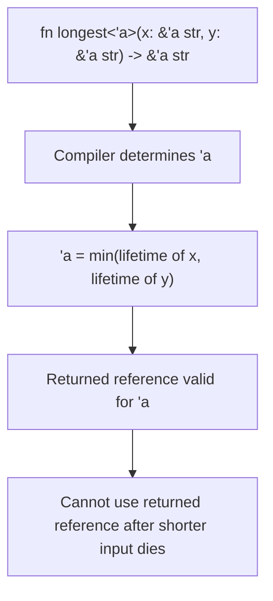

# Lifetimes in Rust

## Overview

Lifetimes are Rust's way of tracking how long references are valid. Every reference in Rust has a lifetime — the scope for which that reference is valid. In most cases, lifetimes are **implicit and inferred** by the compiler. But sometimes the compiler needs your help to understand the relationships between references, and that's when you write **lifetime annotations**.

Lifetime annotations don't change how long references live — they describe the relationships between lifetimes of multiple references so the compiler can verify them.

## Why Lifetimes Exist

The compiler's **borrow checker** needs to ensure that no reference outlives the data it points to. In simple cases, it can figure this out automatically:

```rust
fn main() {
    let x = 5;            // ----------+-- 'a
    let r = &x;           // --+-- 'b  |
    println!("{}", r);     //   |       |
}                          // --+       |
                           // ----------+
```

But when functions take and return references, the compiler can't always determine the relationships:

```rust
// This won't compile — the compiler doesn't know
// whether the returned reference comes from x or y
fn longest(x: &str, y: &str) -> &str {
    if x.len() > y.len() { x } else { y }
}
```

## Lifetime Annotation Syntax

Lifetime annotations use the `'` prefix followed by a lowercase name:

```rust
&i32        // a reference
&'a i32     // a reference with an explicit lifetime 'a
&'a mut i32 // a mutable reference with an explicit lifetime 'a
```

## Fixing the `longest` Function

```rust
// Tell the compiler: the returned reference lives as long as
// both input references (whichever is shorter)
fn longest<'a>(x: &'a str, y: &'a str) -> &'a str {
    if x.len() > y.len() { x } else { y }
}

fn main() {
    let string1 = String::from("long string is long");
    let result;
    {
        let string2 = String::from("xyz");
        result = longest(string1.as_str(), string2.as_str());
        println!("Longest: {}", result); // OK: result used while both strings alive
    }
    // println!("{}", result); // ERROR: string2 dropped, result might reference it
}
```

### How to Read Lifetime Annotations

`fn longest<'a>(x: &'a str, y: &'a str) -> &'a str` means:

> "The returned reference will be valid for the same lifetime `'a`. The compiler will set `'a` to the **shorter** of the lifetimes of `x` and `y`."



## Lifetime Elision Rules

The compiler applies three rules to infer lifetimes without explicit annotations:

### Rule 1: Each Input Reference Gets Its Own Lifetime

```rust
// You write:
fn first_word(s: &str) -> &str { /* ... */ }

// Compiler infers:
fn first_word<'a>(s: &'a str) -> &str { /* ... */ }
```

### Rule 2: If There's Exactly One Input Lifetime, It's Assigned to All Output Lifetimes

```rust
// Compiler further infers:
fn first_word<'a>(s: &'a str) -> &'a str { /* ... */ }
// Now it compiles!
```

### Rule 3: If One of the Input Parameters is `&self` or `&mut self`, the Lifetime of `self` Is Assigned to All Output Lifetimes

```rust
impl MyStruct {
    // You write:
    fn method(&self, s: &str) -> &str { /* ... */ }

    // Compiler infers:
    fn method<'a, 'b>(&'a self, s: &'b str) -> &'a str { /* ... */ }
}
```

When all three rules are applied and the compiler still can't determine output lifetimes, you must annotate explicitly.

## The `'static` Lifetime

The `'static` lifetime denotes that the reference can live for the **entire duration** of the program.

```rust
// String literals have 'static lifetime
let s: &'static str = "I live forever";

// 'static can be used in trait bounds
fn print_it<T: Display + 'static>(value: T) {
    println!("{}", value);
}
```

**Common misconception:** `'static` doesn't mean the data is stored in a global constant. It means the reference is valid for as long as needed. `String::leak()` returns `&'static str` by leaking memory.

### When to Use `'static`

| Use Case | Example |
|----------|---------|
| String literals | `let s: &'static str = "hello";` |
| Thread spawning | `std::thread::spawn(move \|\| { ... })` requires `'static` |
| Trait objects | `Box<dyn Error + 'static>` |
| Lazy statics | `lazy_static!` macro |

## Lifetime Bounds

Just like type bounds, you can constrain lifetimes:

```rust
// T must implement Display and live at least as long as 'a
fn print_ref<'a, T: Display + 'a>(t: &'a T) {
    println!("{}", t);
}

// The struct holds a reference that must live at least as long as 'a
struct Wrapper<'a, T: 'a> {
    data: &'a T,
}
```

## Higher-Ranked Trait Bounds (HRTBs)

Sometimes you need to express that something works for **any** lifetime:

```rust
// The closure accepts a reference with ANY lifetime
fn apply<F>(f: F)
where
    F: for<'a> Fn(&'a str) -> &'a str,
{
    let result = f("hello");
    println!("{}", result);
}
```

The `for<'a>` syntax is called a **higher-ranked trait bound** — it says "for all lifetimes `'a`."

Common in closures and callback patterns:

```rust
// The standard library uses HRTBs:
// Fn(&T) desugars to for<'a> Fn(&'a T)
trait MyTrait {
    fn apply(&self, f: &dyn for<'a> Fn(&'a str) -> bool);
}
```

## Lifetimes in Structs

When a struct holds references, you must annotate their lifetimes:

```rust
struct Excerpt<'a> {
    part: &'a str,
}

impl<'a> Excerpt<'a> {
    // Elision rule 3: output lifetime = self's lifetime
    fn level(&self) -> i32 {
        3
    }

    // The returned reference has the same lifetime as self
    fn announce(&self, announcement: &str) -> &str {
        println!("Attention: {}", announcement);
        self.part
    }
}

fn main() {
    let novel = String::from("Call me Ishmael. Some years ago...");
    let first_sentence;
    {
        let i = novel.find('.').unwrap_or(novel.len());
        first_sentence = Excerpt {
            part: &novel[..i],
        };
    }
    println!("Excerpt: {}", first_sentence.part);
}
```

## Multiple Lifetime Parameters

```rust
// Two independent lifetimes
fn first_or_default<'a, 'b>(first: &'a str, default: &'b str) -> &'a str {
    if !first.is_empty() {
        first
    } else {
        // This won't compile — can't return 'b where 'a is expected
        // default
        first  // Must return something with lifetime 'a
    }
}

// Correct version with single lifetime
fn first_or_default<'a>(first: &'a str, default: &'a str) -> &'a str {
    if !first.is_empty() {
        first
    } else {
        default
    }
}
```

## Common Mistakes

1. **Adding lifetime annotations everywhere** — Let elision rules handle most cases
2. **Confusing `'static` with "lives forever"** — It means the reference *can* live forever, not that it *will*
3. **Thinking lifetimes change how long data lives** — They're annotations, not instructions
4. **Over-specifying lifetimes** — Using the same `'a` for unrelated references makes them unnecessarily coupled
5. **Not understanding that lifetime errors are logic errors** — The compiler is telling you about a real problem

## Interview Questions

1. **What is a lifetime in Rust?**
   A lifetime is a compile-time annotation that describes the scope for which a reference is valid. The borrow checker uses lifetimes to ensure references never outlive the data they point to.

2. **What are the lifetime elision rules?**
   Three rules: (1) each input reference gets its own lifetime, (2) if there's one input lifetime, it's assigned to all outputs, (3) if `&self` or `&mut self` is present, its lifetime is assigned to outputs.

3. **When must you use explicit lifetime annotations?**
   When the compiler can't infer the relationship between input and output lifetimes, typically in functions with multiple reference parameters that return a reference.

4. **What does `'static` mean?**
   `'static` means a reference can be valid for the entire program duration. String literals have `'static` lifetime. It's also required for data passed to `std::thread::spawn`.

5. **What are higher-ranked trait bounds?**
   HRTBs use `for<'a>` syntax to express that a bound holds for all lifetimes. Common in closure types: `for<'a> Fn(&'a str) -> &'a str`.

## See Also

- [Ownership](./ownership.md) — Foundation for understanding lifetimes
- [Borrow Checker](./borrow-checker.md) — How lifetimes are enforced
- [Traits](./traits.md) — Lifetime bounds in trait definitions
- [Unsafe Rust](./unsafe.md) — Working with raw pointers has no lifetime requirements
