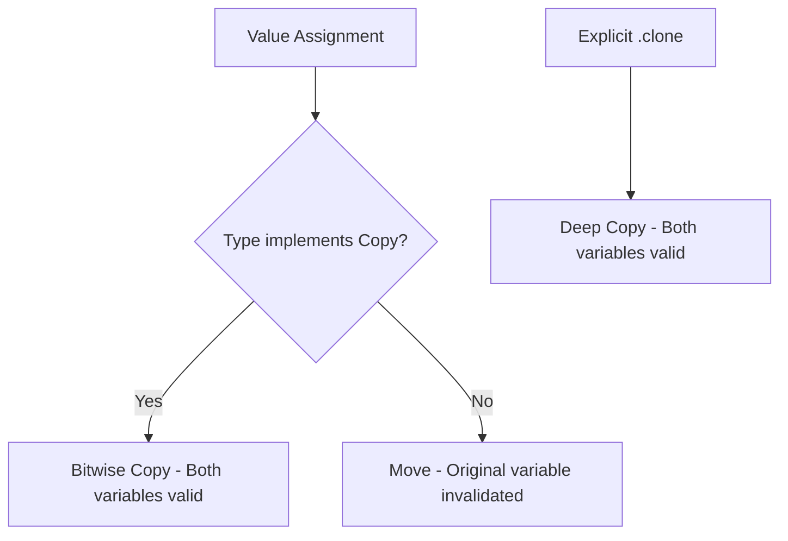

# Ownership in Rust

## Overview

Ownership is Rust's most distinctive feature and the foundation of its memory safety guarantees. Unlike languages with garbage collectors (Java, Python, Go) or manual memory management (C/C++), Rust uses a compile-time ownership system that ensures each value has exactly one owner, and the value is dropped when the owner goes out of scope.

## The Three Rules of Ownership

1. **Each value in Rust has exactly one owner** — no shared ownership by default
2. **There can only be one owner at a time** — when you assign, the previous owner loses access
3. **When the owner goes out of scope, the value is dropped** — memory is freed automatically

```rust
fn main() {
    let s1 = String::from("hello"); // s1 owns the String
    let s2 = s1;                    // ownership moves to s2
    // println!("{}", s1);          // ERROR: s1 no longer valid
    println!("{}", s2);             // OK: s2 is the owner
}   // s2 goes out of scope, memory is freed
```

## Move Semantics

When you assign a value to another variable or pass it to a function, Rust **moves** the value rather than copying it. This is called a **move**.

```rust
fn main() {
    let s = String::from("hello");
    takes_ownership(s);        // s's value moves into the function
    // println!("{}", s);      // ERROR: s no longer valid

    let x = 5;
    makes_copy(x);             // x is copied (i32 implements Copy)
    println!("{}", x);         // OK: x is still valid
}

fn takes_ownership(some_string: String) {
    println!("{}", some_string);
}   // some_string is dropped here

fn makes_copy(some_integer: i32) {
    println!("{}", some_integer);
}   // some_integer goes out of scope, but nothing special happens
```

## Copy vs Clone

### Copy Trait

Types that implement `Copy` are duplicated on assignment instead of moved. `Copy` types are stored entirely on the stack and have no resources to clean up.

**Built-in Copy types:**
- All integer types (`i32`, `u64`, etc.)
- Floating point types (`f32`, `f64`)
- `bool`
- `char`
- Tuples of Copy types (e.g., `(i32, f64)`)
- References (`&T`)

### Clone Trait

`Clone` creates a deep copy of the value, including heap-allocated data. It must be explicitly called.

```rust
fn main() {
    let s1 = String::from("hello");
    let s2 = s1.clone();    // Deep copy: both s1 and s2 are valid
    println!("{} {}", s1, s2); // OK

    let x = 5;
    let y = x;              // Copy (i32 is Copy)
    println!("{} {}", x, y); // OK
}
```

### Copy vs Clone Comparison

| Feature | Copy | Clone |
|---------|------|-------|
| Implicit/Explicit | Implicit on assignment | Explicit (`.clone()`) |
| Performance | Cheap (bitwise copy) | Can be expensive |
| Heap data | Cannot have heap data | Can deep-copy heap data |
| `Drop` trait | Cannot implement `Drop` | Can implement `Drop` |
| Example types | `i32`, `bool`, `&T` | `String`, `Vec<T>`, custom |



## Borrowing

Instead of transferring ownership, you can **borrow** a value by creating a reference.

### Immutable References (`&T`)

You can have **multiple immutable references** simultaneously:

```rust
fn main() {
    let s = String::from("hello");
    let r1 = &s;    // OK: first immutable borrow
    let r2 = &s;    // OK: second immutable borrow
    let r3 = &s;    // OK: third immutable borrow
    println!("{}, {}, {}", r1, r2, r3);
}
```

### Mutable References (`&mut T`)

You can have **only one mutable reference** at a time, and no immutable references while a mutable one exists:

```rust
fn main() {
    let mut s = String::from("hello");
    let r1 = &mut s;    // OK: first mutable borrow
    // let r2 = &mut s; // ERROR: cannot borrow as mutable twice
    // let r3 = &s;     // ERROR: cannot borrow as immutable while mutable borrow exists
    r1.push_str(" world");
    println!("{}", r1);
}
```

### Reference Rules

| Reference Type | Count Allowed | Can Modify? |
|---------------|---------------|-------------|
| `&T` (immutable) | Many simultaneously | No |
| `&mut T` (mutable) | Exactly one | Yes |

**Key rule:** You cannot have mutable and immutable references at the same time. This prevents data races at compile time.

## Dangling References

Rust prevents dangling references at compile time:

```rust
// This will NOT compile
fn dangle() -> &String {
    let s = String::from("hello");
    &s    // ERROR: s is dropped, reference would be dangling
}

// Correct approach: return owned value
fn no_dangle() -> String {
    let s = String::from("hello");
    s     // ownership is moved out
}
```

## The Slice Type

Slices let you reference a contiguous sequence of elements rather than the whole collection:

```rust
fn main() {
    let s = String::from("hello world");
    let hello = &s[0..5];   // &str slice
    let world = &s[6..11];  // &str slice

    // Array slices
    let a = [1, 2, 3, 4, 5];
    let slice = &a[1..3];   // &[i32] slice: [2, 3]
}
```

## Ownership in Function Signatures

Understanding ownership helps design better APIs:

```rust
// Takes ownership - caller loses access
fn consume(s: String) { /* ... */ }

// Borrows immutably - caller retains access
fn peek(s: &String) { /* ... */ }
// Better: fn peek(s: &str) - accepts both &String and &str

// Borrows mutably - caller retains access but can't use simultaneously
fn modify(s: &mut String) { /* ... */ }

// Returns ownership - caller gets a new owned value
fn produce() -> String { String::from("new") }
```

## Common Mistakes

1. **Using a value after moving it** — The most common Rust error for beginners
2. **Overusing `.clone()` to silence the compiler** — This defeats the purpose of ownership
3. **Not understanding that `String` and `&str` are different** — One is owned, one is borrowed
4. **Trying to mutate through an immutable reference** — Use `&mut` instead
5. **Returning references to local variables** — Use `to_owned()` or return owned values

## Interview Questions

1. **What is ownership in Rust and why does it exist?**
   Ownership ensures each value has exactly one owner, preventing double-free, use-after-free, and memory leaks without a garbage collector. The compiler tracks ownership statically.

2. **Explain the difference between move and copy semantics.**
   Move transfers ownership and invalidates the original variable. Copy creates a bitwise duplicate, leaving both valid. Only types implementing the `Copy` trait use copy semantics.

3. **Can you have multiple mutable references?**
   No. Rust allows only one mutable reference (`&mut T`) at a time to prevent data races. You can have multiple immutable references (`&T`) simultaneously.

4. **What happens when a value goes out of scope?**
   Rust calls the `drop` function (from the `Drop` trait) automatically, freeing any resources the value holds.

5. **How does Rust prevent dangling references?**
   The borrow checker ensures that references never outlive the data they point to. If a reference would outlive the data, the code won't compile.

## See Also

- [Borrow Checker](./borrow-checker.md) — How the borrow checker enforces rules
- [Lifetimes](./lifetimes.md) — Annotating reference lifetimes
- [Traits](./traits.md) — `Copy`, `Clone`, `Drop` are traits
- [Unsafe Rust](./unsafe.md) — Bypassing ownership rules when needed
