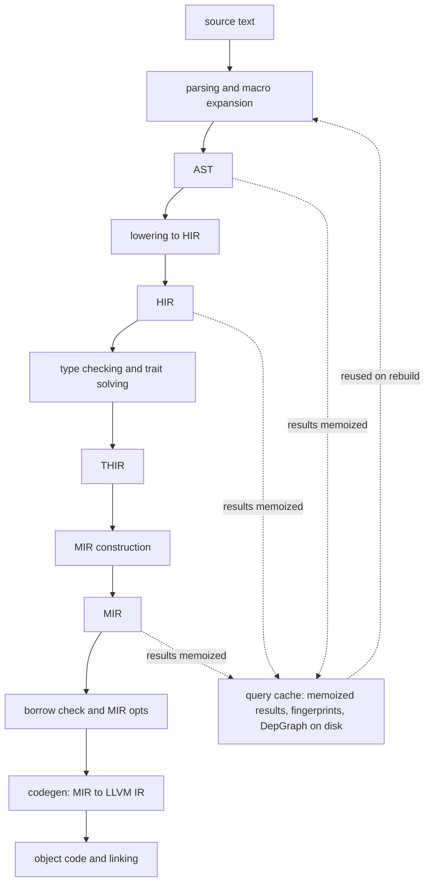
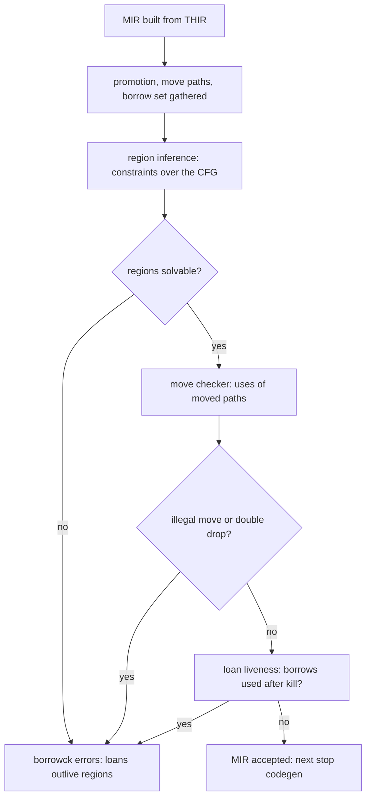

# rustc Internals: Query-Based Compilation

## Overview

rustc, the Rust compiler, is built around an idea interviewers increasingly treat as common ground: the compiler is a **query system** — a demand-driven, memoized computation graph — rather than a linear pass pipeline. The [rustc dev guide](https://rustc-dev-guide.rust-lang.org/) is widely considered the best open documentation of a production compiler's internals, and reading it pays off even for engineers who never touch Rust, because query-based incremental compilation, red-green dependency tracking, and staged IR design are now the architecture of modern compilers and IDE language servers alike. This page walks the query architecture, the IR ladder from AST to MIR, the borrow checker's implementation home, trait solving, and the cargo/rustc split, then closes with a concrete exercise: pushing one tiny function through the IRs with nightly rustc flags. The user-facing semantics of ownership are covered in [Ownership](./ownership.md) and [The Borrow Checker](./borrow-checker.md); this page is about where those semantics are *implemented*.

## The Compiler as a Query System

Classical compilers (the shape taught by [Reading Small Compilers](../../compilers/reading-small-compilers.md) via chibicc and QBE) run stages in sequence: parse everything, analyze everything, generate everything. rustc instead exposes the whole compilation as functions called **queries**: `tcx.type_of(def_id)`, `tcx.optimized_mir(def_id)`, `tcx.hir()` — each returns the result for one item, computed on demand, memoized in memory, and persisted to disk for incremental reuse. Want the MIR for function `foo`? That query recursively demands the HIR for `foo`, which demands expansion output, which demands parsed crates — but only for the items actually needed. This is why rustc can compile a crate with ten thousand methods while type-checking only the ones a caller references, and why trait errors name specific obligation stacks rather than a monolithic "type check failed."

Two mechanisms make the query graph incremental:

- **Memoization:** every query result is cached, keyed by its inputs. A query that has run is never run again within a session; across sessions, results are reloaded from the incremental compilation cache keyed by **fingerprints** (hashes of the query's inputs and dependencies).
- **Red-green dependency tracking:** when an input changes, rustc walks the dependency graph trying to mark dependents *green* (this query's inputs all hashed identically to last time — its old result is provably still valid, even if an upstream query was marked red) or *red* (some input actually differs — recompute). Green marking means editing one function body does not re-run type inference on ten thousand untouched items; the "red" tide stops at the first green wall. The same idea was refined into the standalone Salsa framework that rust-analyzer uses, which is why rustc and rust-analyzer architectures look like siblings.

Why this architecture instead of a pass pipeline? Three reasons an interviewer wants: (1) **incrementality** falls out of the structure rather than being bolted on — the dependency graph *is* the call graph; (2) **on-demand evaluation** matches IDE workloads, where only a few items matter at any instant; (3) **cross-cutting analyses** (lints, borrow check, codegen) can each demand exactly the queries they need instead of hooks threaded through every pass. The cost is complexity: dependency tracking must be complete and sound, and most incremental-compilation ICEs are exactly "the graph missed an edge" bugs.

A few load-bearing queries, with what each one demands transitively — this is the vocabulary the dev guide assumes:

| Query | Returns | Pulls in (transitively) |
|-------|---------|--------------------------|
| `tcx.parse_query` / expansion queries | AST fragments per item | source text, other crates' macro definitions |
| `tcx.hir()` | the HIR map, owner-indexed | expansion output |
| `tcx.type_of(def_id)` | the type of one item | HIR of the item, trait solving for its bounds |
| `tcx.named_bound_var` / resolution queries | resolved paths and lifetimes | resolver state, expansion |
| `tcx.thir_body(def_id)` | the typed-HIR body | type-check results for the item |
| `tcx.mir_built(def_id)` / `mir_borrowck(def_id)` | MIR, then its borrow-check result | THIR, MIR construction |
| `tcx.optimized_mir(def_id)` | post-optimization MIR for codegen | borrow check, MIR pass pipeline |
| codegen queries | LLVM IR, object files, per codegen-unit | `optimized_mir` for every reachable mono-morphization |

Reading a rustc backtrace or an ICE through this table is the fastest diagnostic skill to acquire: nearly every compiler crash names the query that failed, and the fix conversation is about *that query's inputs*, not "the compiler" as a blob.

## The Pipeline Stages and the IR Ladder

Under the query system, data still flows through a recognizable pipeline: parsing → macro expansion and cfg stripping → lowering to HIR → type checking and trait solving → lowering to THIR → MIR construction → borrow checking → codegen. Each stage is an IR with a distinct contract:

| IR | Crate | What it is for | Typical consumer |
|----|-------|----------------|------------------|
| AST | `rustc_ast` | Raw syntax after parsing; macros operate here; nothing type-checked | Expansion, cfg stripping, proc macros (via token streams) |
| HIR | `rustc_hir` | Desugared, "high-level" tree: loops still loops, but scopes and owners normalized; organized per *owner* (item) for query access | Type checking, lints, lifetime resolution |
| THIR | `rustc_mir_build` | Typed HIR: expressions now carry types; control flow still tree-shaped | MIR construction, constant evaluation |
| MIR | `rustc_middle::mir` | Control-flow graph of basic blocks over SSA-like locals; no scopes, just blocks and terminators | Borrow checking, MIR optimizations (inlining, const prop), unsafeck, codegen |

The desugaring choices are worth memorizing because they explain error messages: `for` loops and `?` become explicit `match` in HIR/THIR, closures become anonymous types with `Fn`/`FnMut`/`FnOnce` implementations, and pattern matches become decision trees in MIR. When a borrow error points inside a closure or a `?`, it is because that construct *is* those explicit types and branches by the time the borrow checker runs.

Two intermediate-stage details round out the picture. First, **expansion is iterative**: parsing produces AST, then macro calls are expanded and `#[cfg]` trees stripped, and the resolver runs between expansions because newly expanded items can be referenced by further macros — there is no single "after parsing" moment at which the AST is final. Second, **HIR is owner-indexed**: every node belongs to an owner (a function, static, or item), and queries fetch the HIR subtree per owner rather than holding one giant tree — this is the granularity that makes per-item incremental reuse possible, and it is why certain cross-item analyses (name resolution at the crate level) live outside the per-owner queries.



## The Borrow Checker's Home: MIR, NLL, and Polonius

The borrow checker lives on MIR, not HIR — this is the single most useful implementation fact on the page. The 2018 "NLL" (non-lexical lifetimes) rework moved borrow checking from an AST/HIR-based region analysis to a **MIR-based dataflow analysis**: regions (lifetimes) are inferred over the control-flow graph, so a borrow dies at its last *use*, not at the end of a lexical scope. The modern pipeline has cooperating parts:

- **Region inference:** every borrow gets a region variable; constraints (`'a: 'b`, live-at-point constraints) accumulate from the MIR and are solved by union-find over the CFG. Regions are checked against the point set where each borrow must remain valid.
- **The move checker:** tracks *move paths* (fine-grained paths like `x.field.inner`, not just variables) so partial moves work — you can move one struct field and keep borrowing another. Using a moved path is flagged from MIR dataflow, which is why the error can name the exact field.
- **Loan liveness:** a borrow (loan) is checked against the points where it must be live; two-phase borrows (the reserved-then-activated scheme behind `vec.push(vec.len())`) relax shared/mutable conflicts at call boundaries.
- **Polonius:** the next-generation, Datalog-based reformulation of NLL, designed to fix specific false positives (the classic "borrow of a variable dropped in the other match arm" cases) with rules you can state as logic rather than imperative dataflow. It remains a research solver — rustc still ships the dataflow implementation; the design is documented in the [rustc dev guide](https://rustc-dev-guide.rust-lang.org/) borrow-checking chapters.



For what the *rules* mean to a programmer — borrow vs. move, shared vs. mutable, drop order — read [The Borrow Checker](./borrow-checker.md) and [Ownership](./ownership.md); the implementation detail to retain here is that every rule you know is a dataflow fact over a CFG of MIR blocks, which is why error messages cite MIR-level spans and why `#[rustfmt::skip]` formatting cannot affect the outcome.

A slice of actual MIR (from the exercise function at the end of this page, rendered via `-Zunpretty=mir`) shows the vocabulary the checker consumes:

```text
fn clamp(_1: i64, _2: i64, _3: i64) -> i64 {
    bb0: {
        _4 = Lt(copy _1, copy _2);
        switchInt(move _4) -> [0: bb2, otherwise: bb1];
    }
    bb1: {
        _0 = copy _2;                       // lo
        goto -> bb5;
    }
    bb2: {
        _5 = Gt(copy _1, copy _3);
        switchInt(move _5) -> [0: bb4, otherwise: bb3];
    }
    bb3: {
        _0 = copy _3;                       // hi
        goto -> bb5;
    }
    bb4: { _0 = copy _1; }
    bb5: { return; }
}
```

Locals `_0.._5` (with `_0` the return slot), blocks `bb0..bb5`, `copy`/`move` annotations that the move checker consumes, and `switchInt` terminators replacing `if` — every borrow-check error you have ever read is a statement about annotations on structures exactly like this.

## Trait Solving and Coherence

Type checking in rustc is largely **trait solving**: proving goals such as `Vec<T>: Clone` by decomposing them into obligations (witness selection, where-clause matches, impl candidates) until each is discharged or an error is reported. The solver is demand-driven too — a type query triggers obligations lazily, and results are cached per goal. Key internals:

- **Predicates and obligations:** where-clauses, trait bounds, and projections (`T: Iterator`, `<T as Iterator>::Item = U`) all become goals the solver must prove or the program is rejected; recursion between obligations is detected to catch infinitely recursive bounds.
- **Coherence and the orphan rules:** an impl must be either local to the trait or the type (E0117), and overlapping impls are rejected (E0119) unless the overlap is provably disjoint or specialized behind `default impl`. The checker works on the *unification of impl headers*, not on bodies — which is why adding an impl to one crate can break a downstream crate's coherence and why the compiler is conservative.
- **The next-generation trait solver:** a rewrite (successor to the experimental chalk project, now shared in direction with rust-analyzer) rolling out incrementally; it makes the solver's rules more principled (separating candidate assembly, coinductive cycles for auto traits) and unblocks long-standing extensions. As of current rustc it is used for coherence checking behind nightly flags and is being extended toward full type checking.
- **Specialization status:** `specialization` and `min_specialization` remain **unstable** after years of work because the interaction with coherence and default-impl soundness is genuinely hard — a honest answer to "why can't I specialize traits in stable Rust?" is "soundness with coherence is unsolved to the compiler team's satisfaction," not "it is coming soon."

The type-system-facing view of all this — associated types, trait objects, vtables — is in [Traits and Generics](./traits-generics.md) and the general algorithmic background in [Type Inference](../../compilers/advanced/type-inference.md).

A worked goal shows the shape of solving. For `fn f<T: Clone>(v: Vec<T>) -> Vec<T> { v.clone() }` the solver must prove `Vec<T>: Clone`:

```text
Goal:  Vec<T>: Clone
  Candidate 1: impl<T: Clone> Clone for Vec<T>       (the std impl)
    New obligations: T: Clone                        (the impl's bound, instantiated)
      Candidate: where-clause T: Clone from f's signature
  Result: proven, with no error — and the vtable/method selection
          can now use impl 1's clone, or devirtualize through it
```

Everything about trait errors follows from this loop: "the trait bound is not satisfied" means candidate assembly found no impl and no where-clause for the goal; "conflicting implementations" (E0119) means two impls were assembled for one goal; "overflow evaluating the requirement" means obligation cycles did not reach a fixed point.

## Macros, Hygiene, and Name Resolution

Name resolution and macro expansion are **interleaved**, not sequenced: an attribute or macro can expand into items that themselves need resolution, so the resolver runs repeatedly as expansion proceeds, and expansion is a query (`tcx.resolutions()`, expansion drives AST fragments per invocation). Three details that explain real error messages:

- **Hygiene:** identifiers carry syntax contexts; a `macro_rules!`-generated local variable cannot be referenced from outside the macro's tokens, which is why hygienic captures "just work" while `macro_rules`-generated *lifetimes and labels* sometimes do not — hygiene is applied per identifier kind, and the edge cases are documented in the dev guide.
- **Expansion order:** cfg stripping and macro expansion happen after parsing and before HIR lowering; `#[cfg]`-removed code is gone before type checking, which is why `cfg` errors are "unknown macro" style while type errors never see cfg'd-out code.
- **Odd error spans:** errors in macro-generated code point at the macro's tokens (or the call site) because that is where the span data lives; proc macros hand rustc whatever spans they attach, so a badly spanned `quote!` produces errors that look mislocated. The fix in library code is deliberate span plumbing — which is also why the best proc-macro crates use `syn`'s span forwarding (see [Procedural Macros](./procedural-macros.md)).

## Lifetime and Region Internals

The dev guide's region model has one counterintuitive core idea: regions behave like **universe variables**. Every `for<'a>` higher-ranked bound creates a *placeholder* region in a fresh universe — an anonymous lifetime the caller may not name and the callee may only use through the bound's constraints. Sub-universes are strictly nested (an outer universe's values cannot flow into an inner one), and "placeholder cannot be related to a longer region from a larger universe" is precisely the internal condition behind errors like "implementation of `FnOnce` is not general enough." Universal quantification at function signatures, existential treatment at call sites, and universe ordering during unification are what make higher-ranked trait bounds (HRTBs) checkable.

Working details: region constraints are solved by union-find with a lattice of region classes; outlives relations from the type system (`'a: 'b`) and liveness constraints from MIR both feed the solver; regions that never escape are erased entirely before codegen — lifetimes have zero runtime representation, which is what distinguishes them from GC-based memory models and ties this section back to why the borrow checker (not a runtime) is the enforcement point.

The user-facing side of this machinery — what `'a` means in a signature, variance of `&`/`&mut` across type parameters, and how to read lifetime elision — is in [Lifetimes](./lifetimes.md). The split to remember: elision and variance are *type-system* rules applied before borrow check, regions-and-universes are the *inference* machinery that gives those rules teeth over real control flow, and erasure is the final proof that the entire apparatus is compile-time-only.

## Incremental Compilation Granularity and Failure Modes

The incremental cache lives under `target/<profile>/incremental/<crate-hash>/`: the **DepGraph** (`dep-graph.bin`), per-query result files, and work products. The unit of granularity is the *query per DefId*: type info for one item, MIR for one function, one expansion — so an edit to one function touches only its dependent queries. Fingerprints compare "the hash of everything this query depended on" against the previous session; green results are deserialized instead of recomputed.

When incremental goes wrong, it fails closed. The red-green protocol assumes the dependency graph is complete; if a query read state it did not record (a missed dependency), marking it green would reuse a stale result and produce a **wrong-but-compiling** binary. rustc guards this with internal assertions, and a recognized ICE family exists where the compiler detects the inconsistency and panics rather than emit unsound code — the "cannot prove this green result is still valid" class. Practical hygiene follows from the mechanism: disabling incremental (`CARGO_INCREMENTAL=0`) or touching the whole crate (a full rebuild) is the standard workaround, and build systems that hash-decide rebuilds (cargo fingerprints, see below) sit one layer above this machinery.

One adjacent pipelining detail completes the build-latency picture: rustc emits the crate's `.rmeta` metadata **before** finishing codegen, and cargo schedules dependent crates to start compiling against that metadata while the current crate is still generating object code. Pipelining means wall-clock build time for a crate graph is closer to the critical path than to the sum of the parts — and it works precisely because metadata queries are decoupled from codegen queries, one more dividend of the query architecture.

## Codegen: MIR to LLVM IR

Codegen queries turn MIR into [LLVM IR](../../compilers/advanced/llvm-ir.md) via `rustc_codegen_llvm`: MIR locals become allocas or SSA values, blocks become LLVM basic blocks, calls get Rust's ABI, and debug info (every MIR statement maps to a debug scope) is emitted alongside. Two consequences deserve emphasis:

- **Monomorphization happens here or just before it:** every generic function instantiation with a distinct concrete type becomes a separate non-generic function — this is why generics are zero-cost at run time but cost compile time and binary size, and why codegen units (parallel partitions) exist. Collecting and deduplicating monomorphizations is a whole subsystem.
- **MIR inlining runs before LLVM:** rustc applies its own inliner on MIR (`-Zmir-opt-level`-adjacent passes, enabled by default for small functions in recent releases) so that borrow checking sees post-inline reality and LLVM receives pre-inlined bodies with better-size-cost modeling; LLVM then runs its own pipeline as described in the [LLVM IR page](../../compilers/advanced/llvm-ir.md).

Debuginfo quality is a codegen feature interviewers rarely ask about but teams live with: split DWARF, `-Cdebuginfo=1` vs `2` trade-offs, and the fact that MIR-level optimizations degrade stepping fidelity are all levers a build engineer tunes.

Codegen-units tuning is the practical knob on this stage: `-C codegen-units=N` partitions the crate's monomorphizations into N parallel emission units (16 is the default for incremental/parallel builds, 1 maximizes cross-unit inlining and deduplication at the cost of compile time), and thin-LTO sits one layer above, merging units at link time. A build-engineer interview answer that connects these — "codegen units trade peak binary quality for wall-clock build time, and the query system is why the units can be emitted in parallel at all" — covers the whole section's substance.

## The cargo/rustc Split

cargo does not compile anything — it computes a **build plan** (the unit graph of crates, features, and profiles), then invokes `rustc` once per unit with computed flags: `--crate-name`, `--edition`, `--extern`, `-L`, `--cfg`, plus environment variables for path remapping and metadata. Two parts of the split matter internally:

- **Fingerprints:** cargo hashes each unit's sources, dependency hashes, flags, and compiler version into a fingerprint stored in `target/<profile>/.fingerprint/`; a matching fingerprint skips the rustc invocation entirely, while a mismatch triggers recompilation — cargo's staleness logic and rustc's internal incremental cache are deliberately independent layers.
- **The proc-macro server protocol:** proc-macro crates are dynamic libraries loaded as a *server* that receives token streams and returns expanded ones over a serialization bridge. rustc hosts one implementation in-process; rust-analyzer implements the same protocol so IDE expansion matches compiler expansion. Build scripts (`build.rs`) are the other interposition point: they run before their crate compiles and may emit `cargo:` directives that alter flags and cfgs, which is why their outputs are part of fingerprints.

For the scaling and performance story of this architecture in other systems — rust-analyzer's Salsa, the query databases behind IDE tooling — the transferable insight is that *dependency tracking is the product*: any build or analysis system that must answer "what actually needs recomputing?" converges on this design from whatever starting point it began with.

## How to Read the rustc Dev Guide, and a Concrete Exercise

A reading path sized for interviews (roughly a weekend):

1. **"About this guide" + "High-level overview of the compiler"** — the query-system mental model from this page, in the authors' words.
2. **"Queries: incremental compilation in detail"** — red-green tracking, DepGraph, fingerprints.
3. **"Borrow checking"** — NLL regions, move paths, loan liveness, Polonius.
4. **"Trait solving"** — obligations, coherence, the next-generation solver.
5. **"codegen"** skim — mono-morphization and codegen units only.

Then make it concrete. Put this in `tiny.rs`:

```rust
fn clamp(x: i64, lo: i64, hi: i64) -> i64 {
    if x < lo { lo } else if x > hi { hi } else { x }
}
```

Run, with nightly rustc:

```bash
rustc +nightly -Zunpretty=hir tiny.rs      # HIR: desugared tree, owners and spans
rustc +nightly -Zunpretty=thir-tree tiny.rs # THIR: typed expressions feeding MIR
rustc +nightly -Zunpretty=mir tiny.rs      # MIR: basic blocks, locals, terminators
rustc +nightly --emit=llvm-ir tiny.rs      # LLVM IR: post-codegen, after mono-morphization
```

Reading the four dumps of the same six-line function is the fastest way to internalize the IR ladder: you will see `if` become `switchInt` terminators in MIR, locals numbered `_0.._3`, and the region annotations disappear entirely by LLVM IR — every claim on this page, checkable in under ten minutes. The [rustc dev guide](https://rustc-dev-guide.rust-lang.org/) walks each dump format, and the compiler source itself ([github.com/rust-lang/rust](https://github.com/rust-lang/rust)) is navigable once the crate layout in the guide is familiar; the [Rust Reference](https://doc.rust-lang.org/reference/) stays the arbiter for what the semantics *are*, versus how rustc implements them.

Three extensions of the exercise, each isolating one section of this page:

- **Make it generic.** Change the signature to `fn clamp<T: PartialOrd>(...)` and diff the MIR (now monomorphization-ready but still generic) and the LLVM IR (one function per instantiated type you call it with) — that diff is the monomorphization section made visible.
- **Make it borrow-checked-iffy.** Return a reference into a conditionally-dropped local; the `-Zunpretty=mir` output plus the borrow error will show the loan and the kill point the checker computed.
- **Time the incrementality.** Build a crate with `CARGO_INCREMENTAL=1`, touch one function, rebuild, and inspect `target/debug/incremental/` timestamps — the red-green discussion becomes concrete when you can see which artifacts were rewritten and which were left alone.

For a second weekend, the dev guide's "The parser", "Macro expansion", and "Const evaluation" chapters extend the same pattern to the sections this page compresses; the structure of the guide — one chapter per query family — makes it the rare production-compiler document you can read like a textbook ([github.com/rust-lang/rustc-dev-guide](https://github.com/rust-lang/rustc-dev-guide) accepts fixes the same week you find inaccuracies, which is itself worth knowing).

## Interview Questions

1. **What is a query-based compiler, and how does rustc's red-green tracking make incremental compilation sound?**
Compilation is a graph of memoized functions (queries) keyed by items: type info per DefId, MIR per function. Each query records its dependencies; on rebuild, changed inputs mark queries red, and rustc walks dependents trying to prove them green — a query is green if every input's *hash* is unchanged, meaning its cached result is provably valid even though upstream work was redone. Soundness comes from completeness of the recorded graph; the known failure mode is a missed edge, which would silently reuse stale results, so rustc asserts on inconsistency (the incremental-ICE family) instead of emitting wrong code. The contrast to know: a pass-pipeline compiler needs explicit invalidation logic; the query design makes invalidation equal to graph traversal.

2. **Why does the borrow checker operate on MIR rather than the AST or HIR, and what does that buy?**
MIR is a CFG with SSA-like locals and no syntactic sugar, so borrow checking becomes control-flow-sensitive dataflow: borrows live until last use (non-lexical), moves are tracked per path (`x.field`), and desugared constructs like `?` and closures appear as explicit branches and types. This bought NLL — accepting programs the old AST-based checker rejected — plus a single home for later additions (two-phase borrows, move-path errors, Polonius experiments). The user-facing rules in [The Borrow Checker](./borrow-checker.md) are unchanged by this; what changed is that they are checked over real control flow instead of lexical regions.

3. **Where do monomorphization costs show up in rustc, and what mitigates them?**
Generics are instantiated per concrete type during codegen, so compile time and binary size scale with the number of distinct (function, type) pairs — a heavily used `HashMap<i32, String>` methods set is emitted once per crate graph that reaches it. Mitigations: MIR inlining plus LLVM's pipeline share instantiations where profitable, codegen units parallelize and partition emission, LTO can merge duplicates across crates, and the query design means only *reached* instantiations are generated at all. The honest trade: zero run-time dispatch cost for generics (static monomorphization, unlike trait objects which use vtables — see [Traits and Generics](./traits-generics.md)) is paid for at compile time.

4. **Why do macro-related errors so often point at the wrong place?**
Three stacked reasons: expansion happens after parsing so errors are reported on token spans, not source intent; hygiene means identifiers carry syntax contexts, and diagnostics surface the context of the *generated* token; and proc macros control their own span attachment, so a `quote!`-built tree defaults to the macro definition's span unless the author forwards spans deliberately. The resolver also runs interleaved with expansion, so "cannot find X" may mean "the macro that defines X has not expanded at resolution time." Good proc-macro libraries treat span forwarding as part of their API contract (see [Procedural Macros](./procedural-macros.md)).

5. **What are universes in region inference, and which error class do they explain?**
Universes are the scoping structure for *placeholder* regions: each `for<'a>` bound introduces an anonymous lifetime in a fresh universe that the caller cannot name and the callee may only constrain. Universes are nested, and a placeholder from a smaller universe cannot be unified with a longer region from a larger one — that is the internal condition behind "implementation of `Fn` is not general enough" and similar HRTB errors. The practical read for engineers: those errors mean the compiler proved no single instantiation of the higher-ranked bound can satisfy all call sites, not that lifetimes are "missing" at run time — regions are erased entirely before codegen.

6. **Explain the division of labor between cargo and rustc, including why a build can be stale even when rustc's incremental cache is fresh.**
cargo owns the unit graph and staleness *between* crates: it hashes sources, flags, dependency outputs, and compiler version into fingerprints under `.fingerprint/`, and only invokes rustc for units whose fingerprint changed. rustc owns intra-crate incrementality: its query cache and DepGraph under `incremental/` reuse work *within* a crate when its inputs change slightly. They are independent layers on purpose: cargo fingerprints decide whether to call the compiler at all; rustc's cache decides how much the compiler redoes once called. A stale build almost always lives in the cargo layer (missing rebuild of a proc macro, changed `build.rs` output not fingerprinted), while a slow rebuild almost always lives in the rustc layer (a red query whose dependents are all genuinely red).

## Key Takeaways

- rustc is organized as demand-driven, memoized **queries** per item, not a linear pass pipeline; incrementality, IDE-style on-demand analysis, and cross-cutting checks all fall out of that shape.
- **Red-green dependency tracking** marks unchanged dependents green by hashing inputs, making incremental rebuilds provably sound; incomplete dependency graphs fail closed as ICEs rather than wrong binaries.
- The IR ladder is AST → HIR → THIR → MIR → LLVM IR; borrow checking runs on MIR (NLL), which is why lifetimes are control-flow-sensitive and `for`/`?`/closures appear desugared in borrow errors.
- Trait solving is goal-driven obligation proving; coherence/orphan rules are checked by unifying impl headers; the next-generation solver is replacing the old one incrementally and specialization remains unstable for soundness reasons.
- Regions are **universe-scoped placeholders** for higher-ranked bounds; they are erased before codegen and explain the "not general enough" HRTB error class.
- cargo and rustc split ownership of staleness: cargo fingerprints decide whether to invoke the compiler; rustc's incremental query cache decides how much work the invocation redoes.
- The rustc dev guide is the best open compiler-internals documentation, and `-Zunpretty=hir|thir-tree|mir` plus `--emit=llvm-ir` make every claim on this page verifiable on a six-line function.

## References

- rustc dev guide (query system, IRs, borrow checking, trait solving): https://rustc-dev-guide.rust-lang.org/
- rustc dev guide repository: https://github.com/rust-lang/rustc-dev-guide
- rustc source repository: https://github.com/rust-lang/rust
- The Rust book: https://doc.rust-lang.org/book/
- The Rust reference: https://doc.rust-lang.org/reference/
- Matsakis, *Introducing Polonius* and the Polonius blog series — Rust blog, 2018 (Datalog-based NLL reformulation)
- Matsakis, *Incremental Compilation in rustc* blog series, 2016 (the red-green dependency-tracking design, later generalized in the Salsa framework used by rust-analyzer)
