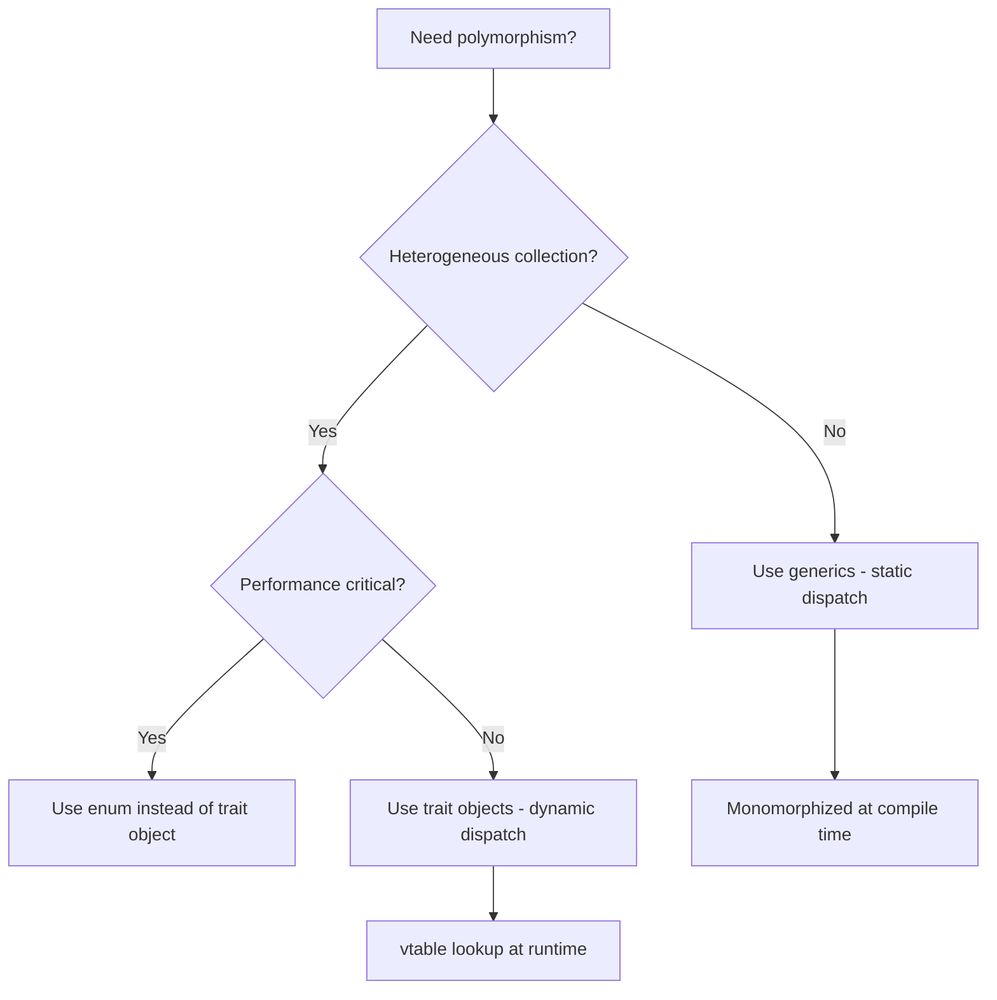
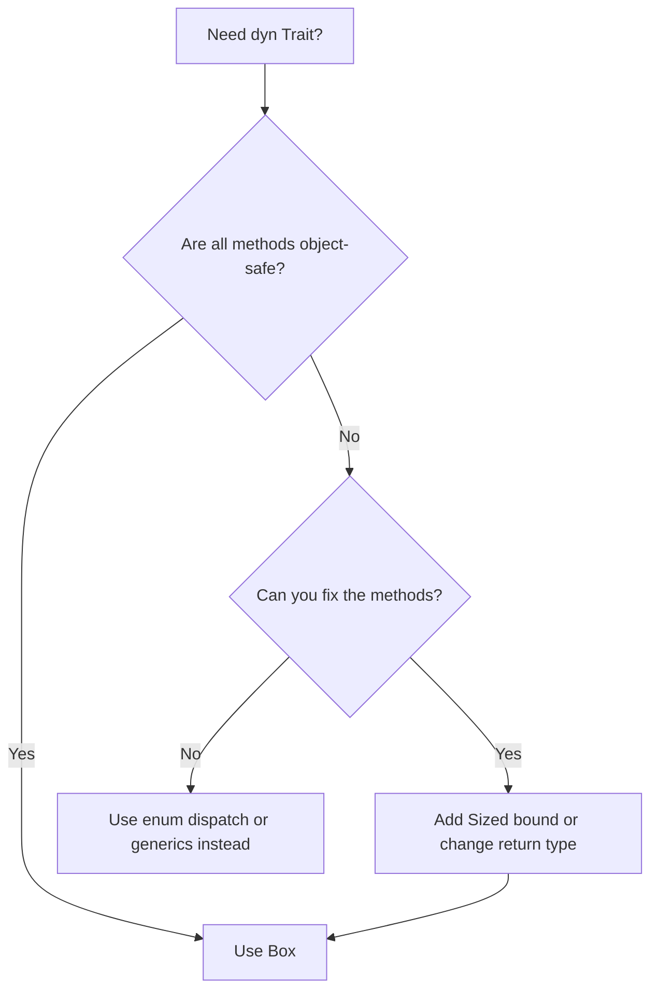

# Traits in Rust

## Overview

Traits are Rust's mechanism for defining shared behavior — similar to interfaces in Java/Go or type classes in Haskell. A trait defines a set of methods that types can implement, enabling polymorphism without inheritance. Traits are central to Rust's design: they power generics, operator overloading, closures, and much more.

## Defining Traits

```rust
// Define a trait with required methods
trait Summary {
    fn summarize(&self) -> String;

    // Default implementation (optional)
    fn preview(&self) -> String {
        format!("{}...", &self.summarize()[..20])
    }
}

// Implement the trait for a type
struct Article {
    title: String,
    content: String,
}

impl Summary for Article {
    fn summarize(&self) -> String {
        format!("{}: {}", self.title, self.content)
    }
    // preview() uses the default implementation
}

struct Tweet {
    username: String,
    content: String,
}

impl Summary for Tweet {
    fn summarize(&self) -> String {
        format!("@{}: {}", self.username, self.content)
    }

    // Override the default implementation
    fn preview(&self) -> String {
        format!("@{} says...", self.username)
    }
}
```

## Traits as Parameters

### `impl Trait` Syntax (Syntactic Sugar)

```rust
// Accepts any type that implements Summary
fn notify(item: &impl Summary) {
    println!("Breaking news! {}", item.summarize());
}
```

### Trait Bound Syntax

```rust
// Equivalent, more explicit form
fn notify<T: Summary>(item: &T) {
    println!("Breaking news! {}", item.summarize());
}

// Multiple trait bounds
fn notify(item: &(impl Summary + Display)) { /* ... */ }
fn notify<T: Summary + Display>(item: &T) { /* ... */ }

// where clause (cleaner for complex bounds)
fn notify<T>(item: &T) -> String
where
    T: Summary + Display + Clone,
{
    item.summarize()
}
```

## Trait Objects vs Generics

### Static Dispatch (Generics)

```rust
fn notify<T: Summary>(item: &T) -> String {
    item.summarize()
}
// The compiler generates a specialized version for each concrete type
// This is called monomorphization
```

### Dynamic Dispatch (Trait Objects)

```rust
fn notify(item: &dyn Summary) -> String {
    item.summarize()
}
// Uses a vtable (virtual method table) to call the right method at runtime
// One function handles all types that implement Summary
```

### Comparison

| Feature | Generics (Static) | Trait Objects (Dynamic) |
|---------|-------------------|------------------------|
| Dispatch | Compile-time (monomorphization) | Runtime (vtable) |
| Performance | Faster (inlined, no indirection) | Slower (indirect call) |
| Binary Size | Larger (one copy per type) | Smaller (one copy) |
| Heterogeneous Collections | Not easily | Yes (`Vec<Box<dyn Trait>>`) |
| Object Safety | Not required | Required |
| Use When | Performance critical | Need heterogeneous types |



## Associated Types

Associated types are type placeholders within a trait definition:

```rust
trait Iterator {
    type Item;  // Associated type

    fn next(&mut self) -> Option<Self::Item>;
}

// Each implementation specifies the concrete type
struct Counter {
    count: u32,
}

impl Iterator for Counter {
    type Item = u32;  // Concrete type

    fn next(&mut self) -> Option<Self::Item> {
        if self.count < 5 {
            self.count += 1;
            Some(self.count)
        } else {
            None
        }
    }
}
```

### Associated Types vs Generic Parameters

```rust
// With associated types (one implementation per type):
trait Iterator {
    type Item;
    fn next(&mut self) -> Option<Self::Item>;
}

// With generics (multiple implementations possible):
trait Converter<T> {
    fn convert(&self) -> T;
}

struct MyType;

impl Converter<String> for MyType {
    fn convert(&self) -> String { "string".to_string() }
}

impl Converter<i32> for MyType {
    fn convert(&self) -> i32 { 42 }
}
```

**Rule of thumb:** Use associated types when there should be exactly one implementation per type. Use generics when multiple implementations are meaningful.

## The Orphan Rule

You can implement a trait for a type only if **either** the trait or the type is defined in your crate:

```rust
// OK: Trait is from this crate
trait MyTrait { /* ... */ }
impl MyTrait for Vec<i32> { /* ... */ }

// OK: Type is from this crate
struct MyType;
impl std::fmt::Display for MyType { /* ... */ }

// NOT OK: Both are from external crates
// impl Display for Vec<i32> { /* ... */ } // ERROR: orphan rule
```

### Newtype Pattern (Bypassing the Orphan Rule)

```rust
// Wrap an external type in a local newtype
struct Wrapper(Vec<String>);

// Now we can implement external traits for our wrapper
impl std::fmt::Display for Wrapper {
    fn fmt(&self, f: &mut std::fmt::Formatter) -> std::fmt::Result {
        write!(f, "[{}]", self.0.join(", "))
    }
}
```

## Blanket Implementations

Implement a trait for all types that satisfy certain bounds:

```rust
// Standard library example:
// impl<T: Display> ToString for T {
//     fn to_string(&self) -> String {
//         format!("{}", self)
//     }
// }

// This means every type that implements Display automatically
// implements ToString — no explicit implementation needed

// Custom blanket implementation
trait Printable {
    fn print(&self);
}

impl<T: std::fmt::Display> Printable for T {
    fn print(&self) {
        println!("{}", self);
    }
}

// Now every Display type automatically implements Printable
fn main() {
    42.print();           // Works: i32 implements Display
    "hello".print();      // Works: &str implements Display
    true.print();         // Works: bool implements Display
}
```

## Supertraits

Require that a type implements one trait before implementing another:

```rust
trait OutlinePrint: std::fmt::Display {
    fn outline_print(&self) {
        let output = self.to_string();
        let len = output.len();
        println!("{}", "*".repeat(len + 4));
        println!("*{}*", " ".repeat(len + 2));
        println!("* {} *", output);
        println!("*{}*", " ".repeat(len + 2));
        println!("{}", "*".repeat(len + 4));
    }
}

struct Point {
    x: i32,
    y: i32,
}

impl std::fmt::Display for Point {
    fn fmt(&self, f: &mut std::fmt::Formatter) -> std::fmt::Result {
        write!(f, "({}, {})", self.x, self.y)
    }
}

impl OutlinePrint for Point {} // Uses default implementation
```

## Derive Macros

Common traits can be automatically implemented:

```rust
#[derive(Debug, Clone, PartialEq, Eq, Hash)]
struct Point {
    x: i32,
    y: i32,
}
```

| Derive | Trait | Purpose |
|--------|-------|---------|
| `Debug` | `std::fmt::Debug` | Debug printing with `{:?}` |
| `Clone` | `Clone` | Deep copy with `.clone()` |
| `Copy` | `Copy` | Bitwise copy (requires Clone) |
| `PartialEq` | `PartialEq` | Equality comparison with `==` |
| `Eq` | `Eq` | Total equality (reflexive) |
| `Hash` | `Hash` | Hashing for HashMap keys |
| `Default` | `Default` | Default value construction |
| `PartialOrd` | `PartialOrd` | Partial ordering with `<`, `>` |
| `Ord` | `Ord` | Total ordering |

## Object Safety in Detail

A trait is **object-safe** if it can be used as a trait object (`dyn Trait`). The rules are:

1. **All methods must have `Self: Sized` bound or use `Self` only in receiver position**
2. **No generic type parameters** on methods
3. **No associated types** (unless they have a default)
4. **Return types must not use `Self`** (except as the receiver)
5. **The trait itself must not require `Self: Sized` as a supertrait; methods may add `where Self: Sized` to opt out of dyn dispatch**

```rust
// Object-safe trait
trait Drawable {
    fn draw(&self);
    fn name(&self) -> String;
}

// NOT object-safe — generic method
trait Serializer {
    fn serialize<T: serde::Serialize>(&self, value: &T) -> String;  // ❌ generic method
}

// NOT object-safe — returns Self
trait Cloner {
    fn clone_self(&self) -> Self;  // ❌ returns Self
}

// Workaround: use Box<dyn Trait>
trait Cloneable {
    fn clone_box(&self) -> Box<dyn Cloneable>;  // ✅ returns Box<dyn Trait>
}

// NOT object-safe — associated type without default
trait Iterator {
    type Item;  // ❌ associated type
    fn next(&mut self) -> Option<Self::Item>;
}

// Fix: use concrete type or make it a generic parameter
fn process(iter: &mut dyn Iterator<Item = i32>) {  // ✅ Specify associated type
    // Now it's object-safe with the type fixed
}
```

### Object Safety Decision Flow



## Derive Macros in Detail

### Common Derive Macros

```rust
use std::collections::HashMap;

// Derive common traits automatically
#[derive(Debug, Clone, PartialEq, Eq, Hash)]
struct Point {
    x: i32,
    y: i32,
}

// Debug: enables {:?} formatting
let p = Point { x: 1, y: 2 };
println!("{:?}", p);  // Point { x: 1, y: 2 }

// Clone: enables .clone()
let p2 = p.clone();

// PartialEq: enables == and !=
assert_eq!(p, p2);

// Eq: total equality (required for HashMap keys)
let mut map = HashMap::new();
map.insert(p, "origin");

// Hash: enables hashing (required for HashMap keys)
```

### Derive Macro Constraints

```rust
// Copy requires Clone
#[derive(Copy, Clone)]
struct Coordinate {
    x: f64,
    y: f64,
}

// Eq requires PartialEq
#[derive(PartialEq, Eq)]
struct Id(u64);

// Ord requires PartialOrd + Eq
#[derive(PartialOrd, Ord, PartialEq, Eq)]
struct Priority(u32);

// Can't derive Copy for types with non-Copy fields
// #[derive(Copy, Clone)]
// struct Bad {
//     name: String,  // ❌ String is not Copy
// }
```

### Custom Derive Macros

```rust
// You can implement traits manually when derive isn't enough
use std::fmt;

struct Color {
    r: u8,
    g: u8,
    b: u8,
}

// Manual Debug implementation
impl fmt::Debug for Color {
    fn fmt(&self, f: &mut fmt::Formatter<'_>) -> fmt::Result {
        write!(f, "#{:02X}{:02X}{:02X}", self.r, self.g, self.b)
    }
}

// Manual Display implementation
impl fmt::Display for Color {
    fn fmt(&self, f: &mut fmt::Formatter<'_>) -> fmt::Result {
        write!(f, "rgb({}, {}, {})", self.r, self.g, self.b)
    }
}

let red = Color { r: 255, g: 0, b: 0 };
println!("{:?}", red);  // #FF0000
println!("{}", red);    // rgb(255, 0, 0)
```

## Trait Aliases (Nightly)

```rust
// Nightly feature: trait aliases for complex bounds
#![feature(trait_alias)]

trait MyTrait = Send + Sync + Clone + 'static;

// Equivalent to:
fn process<T: Send + Sync + Clone + 'static>(item: T) { /* ... */ }

// With alias:
fn process<T: MyTrait>(item: T) { /* ... */ }
```

## Common Mistakes

1. **Confusing `impl Trait` with `dyn Trait`** — `impl Trait` is static dispatch, `dyn Trait` is dynamic dispatch
2. **Not understanding object safety** — Not all traits can be used as trait objects
3. **Forgetting the orphan rule** — Can't implement external traits for external types
4. **Using generics when associated types are appropriate** — If there should be one implementation, use associated types
5. **Overusing trait objects** — Prefer generics for performance; use trait objects only when you need heterogeneous collections

## Interview Questions

1. **What is a trait in Rust?**
   A trait defines a set of methods that types can implement, providing shared behavior without inheritance. It's similar to interfaces in other languages.

2. **Difference between `impl Trait` and `dyn Trait`?**
   `impl Trait` uses static dispatch (monomorphization, faster). `dyn Trait` uses dynamic dispatch (vtable, allows heterogeneous collections).

3. **What is the orphan rule?**
   You can implement a trait for a type only if either the trait or the type is local to your crate. The newtype pattern can work around this.

4. **What are blanket implementations?**
   Implementing a trait for all types that satisfy certain bounds. Example: `impl<T: Display> ToString for T` gives `ToString` to every `Display` type.

5. **What is object safety?**
   A trait is object-safe if it can be used as a trait object (`dyn Trait`). Requirements include: no `Self`-sized return types, no generic methods, and `Self` only in receiver position.

## References

- [The Rust Programming Language — Traits](https://doc.rust-lang.org/book/ch10-02-traits.html)
- [Rust By Example — Traits](https://doc.rust-lang.org/rust-by-example/trait.html)
- [Rustonomicon — Object Safety](https://doc.rust-lang.org/nomicon/object-safety.html)
- [The Rust Reference — Derive Macros](https://doc.rust-lang.org/reference/attributes/derive.html)

## See Also

- [Ownership](./ownership.md) — Traits like `Copy`, `Clone`, `Drop` relate to ownership
- [Error Handling](./error-handling.md) — The `Error` trait
- [Async](./async.md) — The `Future` trait
- [Generics](./ownership.md) — How traits constrain generic types
