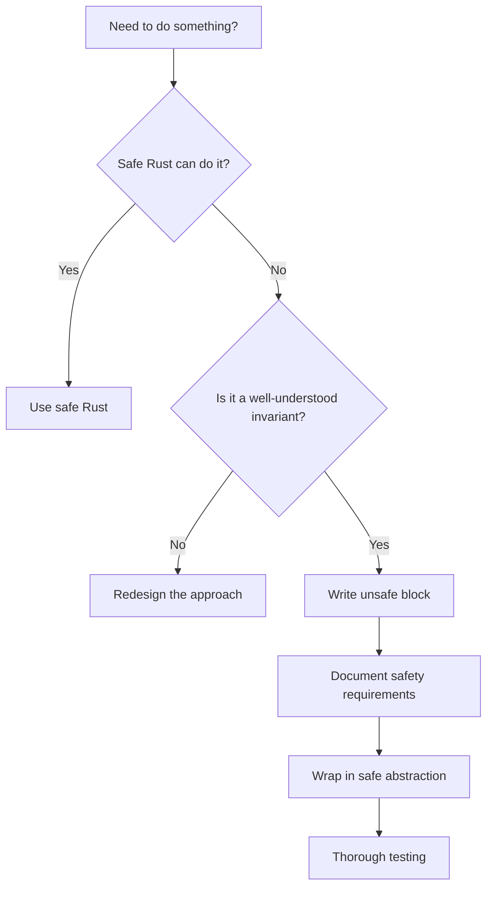

# Unsafe Rust

## Overview

Unsafe Rust lets you bypass some of the compiler's safety guarantees when necessary. It's not "turning off the borrow checker" — rather, it's telling the compiler "I've verified the safety invariants myself." Unsafe code is essential for systems programming tasks like FFI, hardware interaction, and performance-critical code.

**Key principle:** Unsafe doesn't mean "buggy." It means the compiler can't verify safety, so the programmer must.

## What `unsafe` Allows

Inside an `unsafe` block, you can do five things that safe Rust forbids:

| Ability | Description |
|---------|-------------|
| Dereference raw pointers | `*const T` and `*mut T` |
| Call unsafe functions | Functions marked `unsafe fn` |
| Access mutable statics | Global mutable state |
| Implement unsafe traits | Traits with safety invariants |
| Access fields of unions | Untagged unions |

**Everything else** still applies: ownership, borrowing, type checking, and lifetimes all work in unsafe code.

```rust
fn main() {
    let mut num = 5;

    // Create raw pointers (safe)
    let r1 = &num as *const i32;
    let r2 = &mut num as *mut i32;

    // Dereference raw pointers (unsafe)
    unsafe {
        println!("r1: {}", *r1);
        *r2 = 10;
        println!("r2: {}", *r2);
    }
}
```

## Raw Pointers

Raw pointers are like C pointers — they can be null, don't have automatic cleanup, and the compiler doesn't track their validity:

```rust
fn main() {
    // Creating raw pointers (safe - no dereference yet)
    let mut value = 42;
    let ptr: *const i32 = &value;
    let mut_ptr: *mut i32 = &mut value;

    // Can create from address (unsafe territory)
    let address = 0x012345usize;
    let _wild_ptr = address as *const i32;

    // Dereferencing (unsafe)
    unsafe {
        println!("Value: {}", *ptr);
        *mut_ptr = 100;
    }

    // Null check before dereference
    let null_ptr: *const i32 = std::ptr::null();
    if !null_ptr.is_null() {
        unsafe {
            println!("{}", *null_ptr);
        }
    }
}
```

### Raw Pointers vs References

| Feature | References (`&T` / `&mut T`) | Raw Pointers (`*const T` / `*mut T`) |
|---------|------------------------------|--------------------------------------|
| Null | Never | Can be null |
| Dangling | Compile-time prevented | Allowed |
| Auto-deref | Yes | No (unsafe) |
| Lifetime tracked | Yes | No |
| Safety | Safe | Unsafe to dereference |

## Calling Unsafe Functions

```rust
// Declaring an unsafe function
unsafe fn dangerous() {
    println!("This function has safety requirements");
}

fn main() {
    // Must call in an unsafe block
    unsafe {
        dangerous();
    }
}

// Safe wrapper around unsafe code
fn split_at_mut(slice: &mut [i32], mid: usize) -> (&mut [i32], &mut [i32]) {
    let len = slice.len();
    let ptr = slice.as_mut_ptr();

    assert!(mid <= len, "mid out of bounds");

    unsafe {
        (
            std::slice::from_raw_parts_mut(ptr, mid),
            std::slice::from_raw_parts_mut(ptr.add(mid), len - mid),
        )
    }
}
```

## Foreign Function Interface (FFI)

Rust can call C functions and vice versa:

### Calling C from Rust

```rust
// Declare external C functions
extern "C" {
    fn abs(input: i32) -> i32;
    fn sqrt(input: f64) -> f64;
}

fn main() {
    let x = -42;
    let y = unsafe { abs(x) };
    println!("abs({}) = {}", x, y);

    let z = unsafe { sqrt(2.0) };
    println!("sqrt(2.0) = {}", z);
}
```

### Calling Rust from C

```rust
// Export a Rust function callable from C
#[no_mangle]
pub extern "C" fn rust_function(x: i32) -> i32 {
    x * 2
}

// With a C-compatible struct
#[repr(C)]
pub struct Point {
    pub x: f64,
    pub y: f64,
}

#[no_mangle]
pub extern "C" fn distance(p: *const Point) -> f64 {
    let p = unsafe { &*p };
    (p.x * p.x + p.y * p.y).sqrt()
}
```

### `#[repr(C)]` Attribute

Ensures the struct has the same memory layout as C:

```rust
// Without repr(C): Rust may reorder fields
struct RustPoint {
    x: f64,
    y: f64,
}

// With repr(C): C-compatible layout guaranteed
#[repr(C)]
struct CPoint {
    x: f64,
    y: f64,
}
```

## Unsafe Traits

Traits that have safety invariants the compiler can't verify:

```rust
/// # Safety
/// Implementor must ensure that `is_valid` returns true
/// only when the data is in a consistent state.
unsafe trait ValidateData {
    fn is_valid(&self) -> bool;
}

struct MyData {
    value: i32,
}

unsafe impl ValidateData for MyData {
    fn is_valid(&self) -> bool {
        self.value >= 0
    }
}
```

Common unsafe traits in the standard library:
- `Send` — Safe to transfer between threads
- `Sync` — Safe to share references between threads
- `GlobalAlloc` — Custom global allocator

## Mutable Statics

Global mutable state requires `unsafe`:

```rust
static mut COUNTER: u32 = 0;

fn increment() {
    unsafe {
        COUNTER += 1; // Data race possible — programmer must ensure safety
    }
}

// Better: use atomics
use std::sync::atomic::{AtomicU32, Ordering};
static SAFE_COUNTER: AtomicU32 = AtomicU32::new(0);

fn safe_increment() {
    SAFE_COUNTER.fetch_add(1, Ordering::SeqCst);
}
```

## When to Use Unsafe



**Good reasons for unsafe:**
- FFI (calling C libraries)
- Performance-critical code (SIMD, manual memory management)
- Implementing data structures (linked lists, trees)
- Hardware interaction (OS APIs, embedded systems)

**Bad reasons for unsafe:**
- "The borrow checker is annoying"
- Quick workaround for design issues
- Avoiding proper error handling

## The Unsafe Contract

When writing unsafe code, document:

1. **What invariants must hold** — The caller's responsibilities
2. **What guarantees you provide** — What the unsafe code ensures
3. **Why it's actually safe** — Your reasoning

```rust
/// # Safety
///
/// `ptr` must be:
/// - Non-null
/// - Aligned for type T
/// - Point to a valid, initialized T
/// - Not aliased by any other pointer for the duration of this call
///
/// # Returns
///
/// A reference to the value pointed to by `ptr`.
unsafe fn deref_ptr<T>(ptr: *const T) -> &'static T {
    &*ptr
}
```

## Common Mistakes

1. **Using `unsafe` to silence the compiler** — The code is still wrong, just unchecked
2. **Not documenting safety invariants** — Future you will thank you
3. **Wrapping too much in `unsafe`** — Keep unsafe blocks minimal
4. **Forgetting that `unsafe` affects the whole module's reviewability** — Small, well-documented blocks are better
5. **Not using Miri** — `cargo +nightly miri test` catches undefined behavior

## Interview Questions

1. **What can you do in an `unsafe` block that you can't do in safe Rust?**
   Five things: dereference raw pointers, call unsafe functions, access mutable statics, implement unsafe traits, and access union fields.

2. **Is `unsafe` Rust "turning off the borrow checker"?**
   No. The borrow checker and type system still apply. `unsafe` only allows the five specific capabilities listed above.

3. **When should you use `unsafe`?**
   For FFI, performance-critical code, implementing low-level data structures, and hardware interaction. Always document safety invariants and wrap in safe abstractions.

4. **What is `#[repr(C)]` and when do you need it?**
   `repr(C)` ensures a struct has the same memory layout as C. It's required for FFI structs that cross the Rust/C boundary.

5. **How do you test unsafe code for correctness?**
   Use Miri (`cargo +nightly miri test`) to detect undefined behavior, thorough unit tests, fuzzing, and code review focused on safety invariants.

## See Also

- [Ownership](./ownership.md) — Ownership rules still apply in unsafe code
- [Borrow Checker](./borrow-checker.md) — What unsafe lets you bypass (raw pointers)
- [Traits](./traits.md) — Unsafe traits like `Send` and `Sync`
- [Concurrency](./async.md) — Thread safety with `Send` and `Sync`
