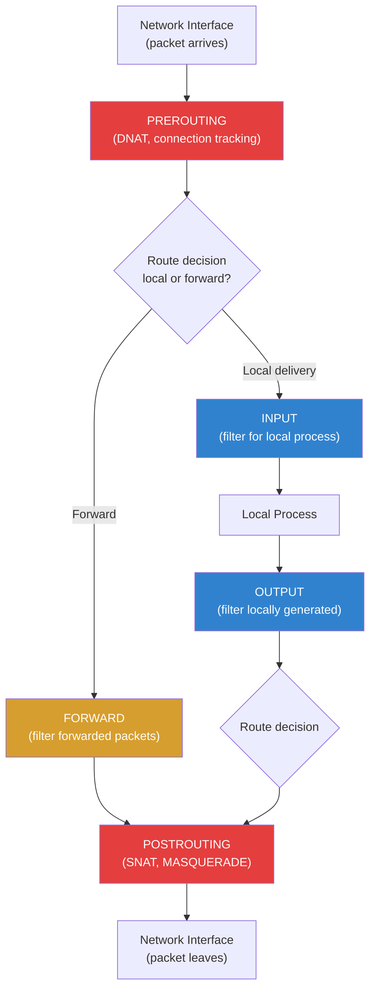

# Firewall Configuration

## Introduction

A firewall is the first line of network defense for any Linux system. It controls incoming and outgoing network traffic based on rules that define what connections are allowed or denied. Linux provides multiple firewall frameworks, from the low-level `iptables`/`nftables` kernel packet filtering to high-level management tools like `firewalld` and `ufw`.

Understanding Linux firewalls is essential because:
- Every internet-facing server needs packet filtering
- Container networking relies heavily on iptables/nftables rules
- Cloud security groups complement but don't replace host firewalls
- Debugging network issues often requires understanding firewall rules

## Netfilter: The Kernel Foundation

All Linux firewalls are built on **Netfilter**, a kernel framework that provides hooks at various points in the network stack. Packet filtering tools (iptables, nftables) insert rules at these hooks.

### Netfilter Hooks



## iptables

`iptables` is the traditional Linux firewall tool. It organizes rules into **tables** and **chains**.

### Tables and Chains

| Table | Purpose | Chains |
|-------|---------|--------|
| `filter` | Packet filtering (default) | INPUT, FORWARD, OUTPUT |
| `nat` | Network address translation | PREROUTING, INPUT, OUTPUT, POSTROUTING |
| `mangle` | Packet modification | All five chains |
| `raw` | Connection tracking bypass | PREROUTING, OUTPUT |
| `security` | Mandatory access control (SELinux) | INPUT, FORWARD, OUTPUT |

### Basic iptables Commands

```bash
# List all rules with line numbers
iptables -L -n -v --line-numbers
# Chain INPUT (policy ACCEPT 0 packets, 0 bytes)
# num   pkts bytes target     prot opt in     out     source               destination
# 1     1234  567K ACCEPT     all  --  lo     *       0.0.0.0/0            0.0.0.0/0
# 2     5678  234K ACCEPT     tcp  --  *      *       0.0.0.0/0            0.0.0.0/0            tcp dpt:22
# 3     9012  456K ACCEPT     tcp  --  *      *       0.0.0.0/0            0.0.0.0/0            tcp dpt:80
# 4     3456  178K ACCEPT     tcp  --  *      *       0.0.0.0/0            0.0.0.0/0            tcp dpt:443
# 5     7890  890K DROP       all  --  *      *       0.0.0.0/0            0.0.0.0/0

# Show rules in iptables-save format
iptables-save

# Show specific table
iptables -t nat -L -n -v
```

### Common iptables Rules

```bash
# === INPUT chain (incoming traffic) ===

# Allow loopback
iptables -A INPUT -i lo -j ACCEPT

# Allow established/related connections (stateful)
iptables -A INPUT -m conntrack --ctstate ESTABLISHED,RELATED -j ACCEPT

# Allow SSH (port 22)
iptables -A INPUT -p tcp --dport 22 -j ACCEPT

# Allow HTTP and HTTPS
iptables -A INPUT -p tcp -m multiport --dports 80,443 -j ACCEPT

# Allow ICMP (ping)
iptables -A INPUT -p icmp --icmp-type echo-request -j ACCEPT

# Rate-limit SSH (prevent brute force)
iptables -A INPUT -p tcp --dport 22 -m conntrack --ctstate NEW \
    -m recent --set --name SSH
iptables -A INPUT -p tcp --dport 22 -m conntrack --ctstate NEW \
    -m recent --update --seconds 60 --hitcount 4 --name SSH -j DROP

# Allow from specific IP/subnet
iptables -A INPUT -s 192.168.1.0/24 -j ACCEPT
iptables -A INPUT -s 10.0.0.5 -p tcp --dport 3306 -j ACCEPT  # DB access

# Log and drop everything else
iptables -A INPUT -j LOG --log-prefix "IPT-DROP: " --log-level 4
iptables -A INPUT -j DROP

# === FORWARD chain (routing) ===

# Allow forwarding from internal to external
iptables -A FORWARD -i eth0 -o eth1 -j ACCEPT
iptables -A FORWARD -i eth1 -o eth0 -m conntrack --ctstate ESTABLISHED,RELATED -j ACCEPT

# === OUTPUT chain (outgoing traffic) ===

# Allow all outgoing by default (restrictive policy)
iptables -A OUTPUT -m conntrack --ctstate ESTABLISHED,RELATED -j ACCEPT
iptables -A OUTPUT -o lo -j ACCEPT
iptables -A OUTPUT -p tcp -m multiport --dports 80,443 -j ACCEPT  # HTTP(S)
iptables -A OUTPUT -p udp --dport 53 -j ACCEPT                    # DNS
iptables -A OUTPUT -p tcp --dport 53 -j ACCEPT                    # DNS over TCP
iptables -A OUTPUT -j DROP
```

### NAT (Network Address Translation)

```bash
# Enable IP forwarding
echo 1 > /proc/sys/net/ipv4/ip_forward
# Persistent: net.ipv4.ip_forward = 1 in /etc/sysctl.conf

# Source NAT (masquerade) — for internet sharing
iptables -t nat -A POSTROUTING -o eth0 -j MASQUERADE

# Destination NAT (port forwarding)
# Forward external port 8080 to internal server 192.168.1.100:80
iptables -t nat -A PREROUTING -i eth0 -p tcp --dport 8080 \
    -j DNAT --to-destination 192.168.1.100:80
iptables -A FORWARD -p tcp -d 192.168.1.100 --dport 80 -j ACCEPT
```

### Saving and Restoring Rules

```bash
# Save rules (Debian/Ubuntu)
iptables-save > /etc/iptables/rules.v4
ip6tables-save > /etc/iptables/rules.v6

# Restore rules
iptables-restore < /etc/iptables/rules.v4

# RHEL/CentOS
service iptables save
# Or:
iptables-save > /etc/sysconfig/iptables

# Automatic restore on boot
apt install iptables-persistent    # Debian/Ubuntu
systemctl enable netfilter-persistent
```

### Deleting and Managing Rules

```bash
# Delete rule by number
iptables -D INPUT 3              # Delete rule 3 from INPUT chain

# Delete specific rule
iptables -D INPUT -p tcp --dport 80 -j ACCEPT

# Flush all rules
iptables -F                      # Flush filter table
iptables -t nat -F               # Flush nat table
iptables -F                      # Flush all tables

# Set default policy
iptables -P INPUT DROP           # Drop all input by default
iptables -P FORWARD DROP         # Drop all forwarding
iptables -P OUTPUT ACCEPT        # Allow all output

# Insert rule at position
iptables -I INPUT 1 -p tcp --dport 443 -j ACCEPT  # Insert at top

# Replace rule
iptables -R INPUT 3 -p tcp --dport 8080 -j ACCEPT  # Replace rule 3
```

## nftables

`nftables` is the successor to iptables, providing a unified framework with a simpler syntax, better performance, and atomic rule replacement.

### nftables Concepts

```bash
# nftables organizes rules into:
# Tables → Chains → Rules
# Tables have an address family (ip, ip6, inet, arp, bridge, netdev)
# Chains have a type (filter, nat, route) and hook (input, forward, etc.)
# Rules contain expressions and statements

# Check if nftables is active
nft list ruleset
```

### Basic nftables Configuration

```bash
# Create a complete firewall ruleset
nft flush ruleset

nft add table inet filter

# Create chains with policies
nft add chain inet filter input { type filter hook input priority 0 \; policy drop \; }
nft add chain inet filter forward { type filter hook forward priority 0 \; policy drop \; }
nft add chain inet filter output { type filter hook output priority 0 \; policy accept \; }

# Add rules
nft add rule inet filter input iif lo accept
nft add rule inet filter input ct state established,related accept
nft add rule inet filter input tcp dport { 22, 80, 443 } accept
nft add rule inet filter input icmp type echo-request accept

# View ruleset
nft list ruleset
# table inet filter {
#     chain input {
#         type filter hook input priority 0; policy drop;
#         iif "lo" accept
#         ct state established,related accept
#         tcp dport { 22, 80, 443 } accept
#         icmp type echo-request accept
#     }
#     chain forward {
#         type filter hook forward priority 0; policy drop;
#     }
#     chain output {
#         type filter hook output priority 0; policy accept;
#     }
# }
```

### nftables Configuration File

```bash
# /etc/nftables.conf
#!/usr/sbin/nft -f

flush ruleset

table inet filter {
    chain input {
        type filter hook input priority 0; policy drop;
        
        # Allow loopback
        iif "lo" accept
        
        # Allow established connections
        ct state established,related accept
        
        # Allow SSH (rate-limited)
        tcp dport 22 ct state new limit rate 4/minute accept
        
        # Allow HTTP/HTTPS
        tcp dport { 80, 443 } accept
        
        # Allow ICMP
        icmp type echo-request limit rate 5/second accept
        icmpv6 type { nd-neighbor-solicit, nd-router-advert, nd-neighbor-advert } accept
        
        # Log and drop
        log prefix "nft-drop: " drop
    }
    
    chain forward {
        type filter hook forward priority 0; policy drop;
    }
    
    chain output {
        type filter hook output priority 0; policy accept;
    }
}

# Apply
nft -f /etc/nftables.conf
systemctl enable nftables
```

### NAT with nftables

```bash
table ip nat {
    chain prerouting {
        type nat hook prerouting priority -100;
        tcp dport 8080 dnat to 192.168.1.100:80
    }
    
    chain postrouting {
        type nat hook postrouting priority 100;
        oif "eth0" masquerade
    }
}
```

## firewalld

`firewalld` is a dynamic firewall manager with zone-based configuration, default on RHEL/CentOS/Fedora.

### Zone Concepts

```bash
# List zones
firewall-cmd --get-zones
# block dmz drop external home internal nm-shared public trusted work

# Active zones
firewall-cmd --get-active-zones
# public
#   interfaces: eth0

# Zone details
firewall-cmd --zone=public --list-all
# public (active)
#   target: default
#   icmp-block-inversion: no
#   interfaces: eth0
#   sources:
#   services: dhcpv6-client ssh
#   ports:
#   protocols:
#   masquerade: no
#   forward-ports:
#   source-ports:
#   rich rules:
```

### firewalld Commands

```bash
# Add service permanently
firewall-cmd --permanent --add-service=http
firewall-cmd --permanent --add-service=https
firewall-cmd --reload

# Add port
firewall-cmd --permanent --add-port=8080/tcp
firewall-cmd --reload

# Remove service
firewall-cmd --permanent --remove-service=dhcpv6-client

# Add rich rule (rate limiting SSH)
firewall-cmd --permanent --add-rich-rule='
    rule family="ipv4"
    service name="ssh"
    accept
    limit value="4/m"'

# Allow from specific source
firewall-cmd --permanent --zone=trusted --add-source=192.168.1.0/24

# Port forwarding
firewall-cmd --permanent --add-forward-port=port=8080:proto=tcp:toport=80:toaddr=192.168.1.100

# Enable masquerade (NAT)
firewall-cmd --permanent --add-masquerade

# Runtime changes (not persistent)
firewall-cmd --add-service=https
# No --permanent = runtime only, lost on reload/restart
```

## ufw (Uncomplicated Firewall)

`ufw` is the default firewall tool on Ubuntu/Debian, providing a user-friendly interface to iptables.

```bash
# Enable/disable
ufw enable
ufw disable
ufw status verbose

# Default policies
ufw default deny incoming
ufw default allow outgoing

# Allow services
ufw allow ssh               # Port 22
ufw allow http              # Port 80
ufw allow https             # Port 443
ufw allow 8080/tcp          # Custom port

# Allow from specific IP
ufw allow from 192.168.1.0/24
ufw allow from 10.0.0.5 to any port 3306  # MySQL from specific IP

# Allow specific interface
ufw allow in on eth0 to any port 80

# Deny rules
ufw deny from 203.0.113.0/24  # Block subnet

# Rate limiting (SSH)
ufw limit ssh

# Delete rules
ufw delete allow 80/tcp
ufw delete 3                  # Delete by number

# Application profiles
ufw app list
ufw allow 'Apache Full'

# Logging
ufw logging on               # Enable logging
ufw logging medium           # Log level

# Status
ufw status numbered
# Status: active
#
# To                         Action      From
# --                         ------      ----
# [ 1] 22/tcp                   LIMIT IN    Anywhere
# [ 2] 80/tcp                   ALLOW IN    Anywhere
# [ 3] 443/tcp                  ALLOW IN    Anywhere
# [ 4] 22/tcp (v6)              LIMIT IN    Anywhere (v6)
# [ 5] 80/tcp (v6)              ALLOW IN    Anywhere (v6)
# [ 6] 443/tcp (v6)             ALLOW IN    Anywhere (v6)
```

## Common Firewall Scenarios

### Web Server

```bash
# Using ufw
ufw default deny incoming
ufw default allow outgoing
ufw allow ssh
ufw allow http
ufw allow https
ufw enable

# Using iptables
iptables -A INPUT -i lo -j ACCEPT
iptables -A INPUT -m conntrack --ctstate ESTABLISHED,RELATED -j ACCEPT
iptables -A INPUT -p tcp --dport 22 -j ACCEPT
iptables -A INPUT -p tcp -m multiport --dports 80,443 -j ACCEPT
iptables -A INPUT -j DROP
iptables -P INPUT DROP
```

### Database Server (Internal Only)

```bash
# Using firewalld
firewall-cmd --permanent --zone=trusted --add-source=192.168.1.0/24
firewall-cmd --permanent --zone=trusted --add-port=5432/tcp
firewall-cmd --permanent --zone=public --set-target=DROP
firewall-cmd --reload
```

### NAT Gateway

```bash
# Enable forwarding
echo 1 > /proc/sys/net/ipv4/ip_forward

# Using nftables
nft add table ip nat
nft add chain ip nat postrouting { type nat hook postrouting priority 100 \; }
nft add rule ip nat postrouting oif "eth0" masquerade

# Using iptables
iptables -t nat -A POSTROUTING -o eth0 -j MASQUERADE
iptables -A FORWARD -i eth1 -o eth0 -j ACCEPT
iptables -A FORWARD -i eth0 -o eth1 -m conntrack --ctstate ESTABLISHED,RELATED -j ACCEPT
```

## Firewall Tool Comparison

| Feature | iptables | nftables | firewalld | ufw |
|---------|----------|----------|-----------|-----|
| Kernel backend | xtables | nf_tables | nftables/iptables | iptables |
| Syntax | Verbose | Concise | Zone-based | Simple |
| Atomic replacement | No | Yes | Yes | No |
| IPv4+IPv6 unified | No (separate) | Yes (inet) | Yes | Yes |
| Default on | Legacy distros | Modern kernels | RHEL/Fedora | Ubuntu/Debian |
| Performance | Good | Better | Good | Good |
| Learning curve | Medium | Medium | Low | Low |

## Connection Tracking (conntrack)

The kernel's **connection tracking** subsystem (`nf_conntrack`) is the foundation of stateful firewalls. It tracks every connection (TCP, UDP, ICMP) flowing through the system, enabling rules that reference connection state rather than individual packets.

### Conntrack Table

```bash
# List all tracked connections
conntrack -L
# tcp  6 431999 ESTABLISHED src=192.168.1.100 dst=93.184.216.34 sport=54321 dport=443 src=93.184.216.34 dst=192.168.1.100 sport=443 dport=54321 [ASSURED] mark=0 use=1
# udp  17 29 src=192.168.1.100 dst=8.8.8.8 sport=12345 dport=53 src=8.8.8.8 dst=192.168.1.100 sport=53 dport=12345 [ASSURED] mark=0 use=1

# Count tracked connections by state
conntrack -C

# Show connection tracking statistics
conntrack -S
# packets=12345678  inserted=98765  dropped=0  early_drop=0  invalid=12

# Show conntrack events in real-time
conntrack -E
```

### Conntrack Table Sizing

```bash
# View current maximum
sysctl net.netfilter.nf_conntrack_max
# net.netfilter.nf_conntrack_max = 65536

# View current usage
cat /proc/sys/net/netfilter/nf_conntrack_count

# Increase for busy servers
sysctl -w net.netfilter.nf_conntrack_max=262144

# Make persistent
echo "net.netfilter.nf_conntrack_max = 262144" >> /etc/sysctl.d/99-conntrack.conf

# Tune hash table size (must be set at boot via module parameter)
# /etc/modprobe.d/conntrack.conf
# options nf_conntrack hashsize=65536
```

### Conntrack Zones

Zones allow overlapping address spaces (useful for NAT and containers):

```bash
# Assign traffic to a zone
nft add rule ip nat prerouting iif "veth0" ct zone set 1
nft add rule ip nat prerouting iif "veth1" ct zone set 2

# iptables equivalent
iptables -t raw -A PREROUTING -i veth0 -j CT --zone 1
iptables -t raw -A PREROUTING -i veth1 -j CT --zone 2
```

### Conntrack Timeouts

```bash
# View default timeouts
sysctl -a | grep nf_conntrack_tcp_timeout
# net.netfilter.nf_conntrack_tcp_timeout_established = 432000 (5 days)
# net.netfilter.nf_conntrack_tcp_timeout_syn_sent = 120
# net.netfilter.nf_conntrack_tcp_timeout_time_wait = 120

# Reduce for high-traffic servers (fewer stale entries)
sysctl -w net.netfilter.nf_conntrack_tcp_timeout_established=3600
sysctl -w net.netfilter.nf_conntrack_tcp_timeout_time_wait=30

# Per-protocol timeouts
sysctl -w net.netfilter.nf_conntrack_udp_timeout=30
sysctl -w net.netfilter.nf_conntrack_udp_timeout_stream=60
sysctl -w net.netfilter.nf_conntrack_icmp_timeout=10
```

### Conntrack Helpers

Some protocols (FTP, SIP, TFTP) embed IP/port information in packet payloads. Conntrack helpers parse these:

```bash
# Enable FTP helper
modprobe nf_conntrack_ftp

# iptables
iptables -A INPUT -p tcp --dport 21 -j ACCEPT
iptables -A INPUT -m conntrack --ctstate RELATED,ESTABLISHED -j ACCEPT

# nftables (explicit helper assignment)
nft add rule ip filter input tcp dport 21 ct helper set "ftp"
nft add rule ip filter input ct state established,related accept
```

## nftables Sets and Maps

Sets and maps are powerful nftables features for grouping addresses, ports, and other values.

### Anonymous Sets

```bash
# Inline set (curly braces)
nft add rule inet filter input tcp dport { 22, 80, 443 } accept
```

### Named Sets

```bash
# Create a named set for allowed IPs
nft add set inet filter allowed_ips { type ipv4_addr \; flags interval \; }

# Add elements
nft add element inet filter allowed_ips { 192.168.1.0/24, 10.0.0.0/8, 172.16.0.0/12 }

# Use in a rule
nft add rule inet filter input ip saddr @allowed_ips accept
```

### Maps

Maps associate keys with values, enabling dynamic lookups:

```bash
nft add map inet filter port_to_action { type inet_service : verdict \; }
nft add element inet filter port_to_action { 22 : accept, 80 : accept, 443 : accept, 8080 : drop }
nft add rule inet filter input tcp dport vmap @port_to_action
```

### Managing Sets in Configuration Files

```bash
# /etc/nftables.conf
#!/usr/sbin/nft -f
flush ruleset

table inet filter {
    set blacklist {
        type ipv4_addr
        flags interval, timeout
        auto-merge
    }

    set rate_limited {
        type ipv4_addr
        flags dynamic, timeout
        timeout 1m
    }

    chain input {
        type filter hook input priority 0; policy drop;

        # Drop blacklisted IPs
        ip saddr @blacklist drop

        # Rate-limit new connections per source
        ct state new limit rate over 10/second add @rate_limited { ip saddr timeout 1m }
        ip saddr @rate_limited drop

        ct state established,related accept
        tcp dport { 22, 80, 443 } accept
    }
}
```

## Firewall Rules for Containers

Containers (Docker, Podman, Kubernetes) rely heavily on iptables/nftables for networking.

### Docker and iptables

Docker manipulates iptables directly. Key chains:

```bash
# Docker creates these chains:
# - DOCKER (filter and nat tables)
# - DOCKER-ISOLATION-STAGE-1 and STAGE-2
# - DOCKER-USER (for user-defined rules)

# Show Docker's rules
iptables -L DOCKER-USER -n -v
iptables -t nat -L DOCKER -n -v

# Block traffic to a container from external
iptables -I DOCKER-USER -i eth0 -d 172.17.0.2 -j DROP

# Allow specific external access
iptables -I DOCKER-USER -i eth0 -d 172.17.0.2 -p tcp --dport 80 -j ACCEPT
```

### Kubernetes Network Policies

Kubernetes uses its own network policy engine (Calico, Cilium, etc.) which programs nftables or eBPF:

```yaml
# Example: deny all ingress, allow from specific namespace
apiVersion: networking.k8s.io/v1
kind: NetworkPolicy
metadata:
  name: allow-from-frontend
spec:
  podSelector:
    matchLabels:
      app: backend
  ingress:
  - from:
    - namespaceSelector:
        matchLabels:
          name: frontend
```

### Preventing Docker from Bypassing Host Firewall

```bash
# /etc/docker/daemon.json
{
  "iptables": false
}
# WARNING: This disables Docker's iptables management entirely.
# You'll need to manually configure NAT and forwarding rules.

# Alternative: Use DOCKER-USER chain for your rules
iptables -I DOCKER-USER -i eth0 -j DROP  # Block all external to containers
iptables -I DOCKER-USER -i eth0 -p tcp --dport 443 -j ACCEPT  # Allow HTTPS
```

## IPv6 Firewalling

IPv6 requires separate consideration. Many administrators forget to configure IPv6 rules, leaving hosts exposed.

```bash
# iptables (separate tool)
ip6tables -A INPUT -i lo -j ACCEPT
ip6tables -A INPUT -m conntrack --ctstate ESTABLISHED,RELATED -j ACCEPT
ip6tables -A INPUT -p ipv6-icmp -j ACCEPT  # ICMPv6 is essential for IPv6
ip6tables -A INPUT -p tcp --dport 22 -j ACCEPT
ip6tables -P INPUT DROP
ip6tables-save > /etc/iptables/rules.v6

# nftables (unified — inet handles both)
table inet filter {
    chain input {
        type filter hook input priority 0; policy drop;
        iif "lo" accept
        ct state established,related accept
        # ICMPv6 required for IPv6 to function
        icmpv6 type { nd-neighbor-solicit, nd-router-advert, nd-neighbor-advert,
                      echo-request } accept
        tcp dport 22 accept
    }
}

# firewalld (handles both by default)
firewall-cmd --permanent --add-service=ssh
firewall-cmd --reload
# IPv6 rules are applied automatically for the same zone
```

**Critical ICMPv6 types** that must be allowed for IPv6 to function:

| ICMPv6 Type | Purpose |
|---|---|
| `nd-neighbor-solicit` | Neighbor Discovery (ARP equivalent) |
| `nd-neighbor-advert` | Neighbor Discovery reply |
| `nd-router-advert` | Router Advertisement (SLAAC) |
| `echo-request` | Ping |

## Firewall Performance Tuning

### conntrack Optimization

```bash
# For high-traffic servers, disable conntrack on trusted traffic
# Use the 'raw' table to skip connection tracking
iptables -t raw -A PREROUTING -i lo -j NOTRACK
iptables -t raw -A OUTPUT -o lo -j NOTRACK

# Skip conntrack for internal traffic
iptables -t raw -A PREROUTING -s 10.0.0.0/8 -d 10.0.0.0/8 -j NOTRACK
iptables -t raw -A OUTPUT -s 10.0.0.0/8 -d 10.0.0.0/8 -j NOTRACK

# nftables equivalent
nft add rule ip raw prerouting iif "lo" notrack
nft add rule ip raw output oif "lo" notrack
```

### Rule Ordering

Place frequently matched rules first. Use `iptables -L -n -v` to check packet counters:

```bash
# Rules with high packet counts should be near the top
iptables -L INPUT -n -v --line-numbers
# num   pkts bytes target  prot opt in  out  source       destination
# 1   999999  500M ACCEPT  all  --  *   *    0.0.0.0/0    0.0.0.0/0  ctstate ESTABLISHED
# 2    12345  600K ACCEPT  tcp  --  *   *    0.0.0.0/0    0.0.0.0/0  tcp dpt:22
# 3      100   50K ACCEPT  tcp  --  *   *    0.0.0.0/0    0.0.0.0/0  tcp dpt:80
```

### Using Sets for Large IP Lists

```bash
# Instead of 1000 individual rules, use an nftables set
nft add set inet filter blocked_ips { type ipv4_addr \; flags interval \; }

# Load from file
while read ip; do
    nft add element inet filter blocked_ips { $ip }
done < /path/to/blocklist.txt

# Single rule handles all IPs
nft add rule inet filter input ip saddr @blocked_ips drop
```

## Troubleshooting

```bash
# Check if firewall is blocking
iptables -L INPUT -n -v --line-numbers
nft list ruleset
ufw status

# Watch dropped packets in real-time
dmesg | grep -i "drop\|reject\|iptables\|nf_"
journalctl -f | grep -i firewall

# Test connectivity
nc -zv host port          # Test TCP connection
nmap -p 22,80,443 host   # Scan ports

# Debug iptables rules
iptables -L INPUT -n -v   # Show packet counters
# Rule with 0 packets = never matched (not the blocking rule)

# Check conntrack (connection tracking)
conntrack -L              # List all tracked connections
conntrack -S              # Connection tracking statistics
cat /proc/sys/net/netfilter/nf_conntrack_max  # Max tracked connections

# Trace packet through nftables rules
nft monitor trace
nft add rule inet filter input meta nftrace set 1
# Then watch: nft monitor

# Check for rule conflicts
iptables-save | grep -c '\-A'  # Count total rules
nft list ruleset | wc -l        # Count nftables rule lines

# Verify firewall is actually active
nft list ruleset 2>/dev/null | head -5  # nftables
iptables -L -n 2>/dev/null | head -5   # iptables
ufw status 2>/dev/null | head -3        # ufw
firewall-cmd --state 2>/dev/null        # firewalld
```

## References

- [iptables(8) man page](https://man7.org/linux/man-pages/man8/iptables.8.html)
- [nft(8) man page](https://man7.org/linux/man-pages/man8/nft.8.html)
- [firewalld documentation](https://firewalld.org/documentation)
- [ufw wiki](https://wiki.ubuntu.com/UncomplicatedFirewall)
- [Netfilter documentation](https://www.netfilter.org/documentation.html)
- [nftables wiki](https://wiki.nftables.org/wiki-nftables/index.php/Main_Page)
- [ArchWiki: iptables](https://wiki.archlinux.org/title/Iptables)
- [conntrack-tools documentation](https://conntrack-tools.netfilter.org/)
- [nftables sets and maps](https://wiki.nftables.org/wiki-nftables/index.php/Sets)

## Related Topics

- [Networking Configuration](./networking-config.md) — IP and routing setup
- [Logging](./logging.md) — Firewall log analysis
- [System Administration Overview](./overview.md) — Security hardening practices
