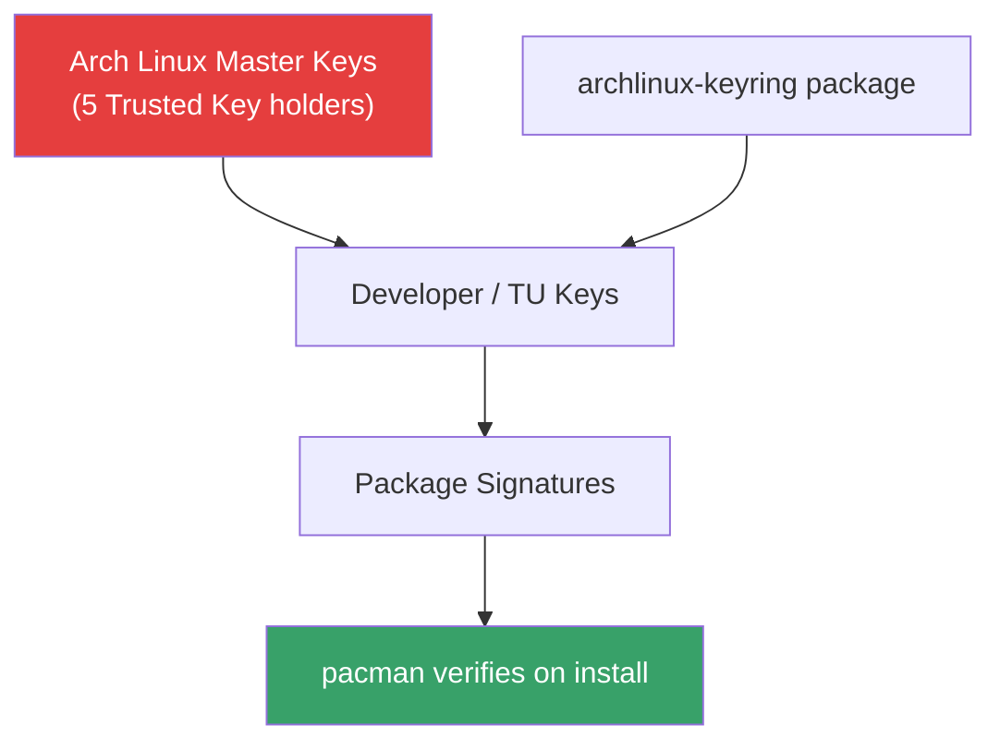
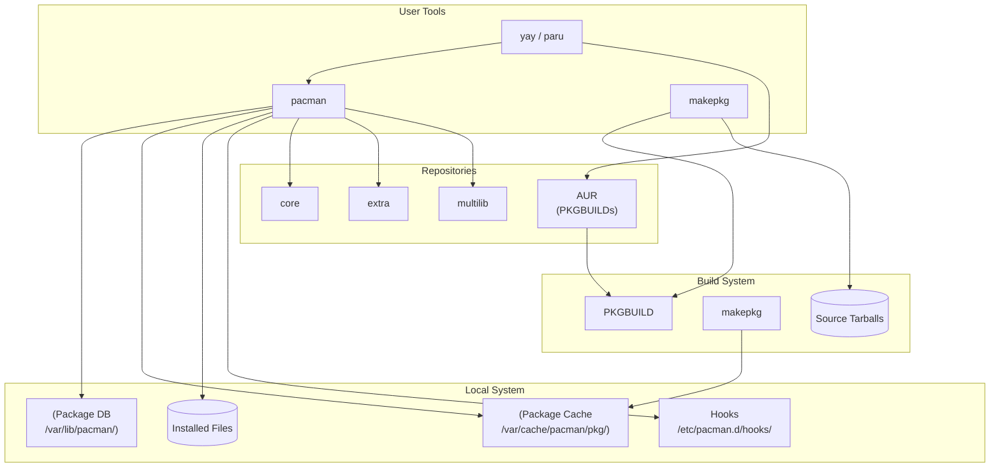

# Pacman

## Introduction

Pacman is the package manager for Arch Linux and its derivatives (Manjaro, EndeavourOS, ArcoLinux). Designed with simplicity in mind, pacman combines a straightforward command syntax with a powerful dependency resolution engine. Unlike the dpkg/APT or RPM/DNF split, pacman handles both low-level package operations and high-level dependency management in a single tool.

Arch Linux follows a **rolling release** model — there are no version numbers or point releases. Packages are updated continuously, and `pacman -Syu` is the canonical way to keep the system current. This philosophy of "keep it simple" extends to package management: pacman does one thing (manage packages) and does it well.

## Package Format

Arch Linux packages are `.pkg.tar.zst` files (previously `.pkg.tar.xz`). The naming convention is:

```
<name>-<version>-<arch>.pkg.tar.zst
```

Example: `nginx-1.26.1-1-x86_64.pkg.tar.zst`

Each package is a zstd-compressed tar archive containing:

1. **File tree**: The actual files to install
2. **.PKGINFO**: Package metadata (name, version, dependencies, description)
3. **.INSTALL**: Optional install script (pre_install, post_install, pre_remove, post_remove, pre_upgrade, post_upgrade)
4. **.MTREE**: File metadata tree (permissions, checksums, timestamps)
5. **.CHANGELOG**: Optional changelog

```bash
# Inspect a package file
tar -tf nginx-1.26.1-1-x86_64.pkg.tar.zst | head -20

# Read .PKGINFO
tar -xf nginx-1.26.1-1-x86_64.pkg.tar.zst -O .PKGINFO
```

## Core Pacman Commands

Pacman uses a flag-based syntax where the first character determines the operation mode:

### Sync (-S): Repository Operations

```bash
# Sync package database
sudo pacman -Sy

# Update the system (sync database + upgrade all packages)
sudo pacman -Syu

# Install a package
sudo pacman -S nginx

# Install multiple packages
sudo pacman -S nginx php-fpm mariadb

# Install a specific version (if available)
sudo pacman -S "nginx=1.26.1-1"

# Search for a package in repositories
pacman -Ss nginx
# output:
# extra/nginx 1.26.1-1
#     Lightweight HTTP server and IMAP/POP3 proxy server

# Show package info (remote/available)
pacman -Si nginx

# Install a group
sudo pacman -S gnome
# :: There are 15 members in group gnome
# :: Repository extra
#    1) baobab  2) cheese  3) eog  4) epiphany  ... 
# Enter a selection (default=all):

# Force reinstall
sudo pacman -S nginx

# Download without installing
sudo pacman -Sw nginx

# List available packages
pacman -Sl

# Search with regex
pacman -Ss "^nginx"
```

### Remove (-R): Package Removal

```bash
# Remove a package (keep dependencies and config files)
sudo pacman -R nginx

# Remove a package and its unneeded dependencies
sudo pacman -Rs nginx

# Remove package, dependencies, and configuration files
sudo pacman -Rns nginx

# Remove a package that others depend on (force)
sudo pacman -Rdd nginx   # Skip dependency checks

# Recursive cascade: remove package and everything that depends on it
sudo pacman -Rsc nginx
```

### Query (-Q): Installed Package Queries

```bash
# Is a package installed?
pacman -Q nginx
# nginx 1.26.1-1

# Show info about installed package
pacman -Qi nginx

# List files owned by a package
pacman -Ql nginx

# Which package owns a file?
pacman -Qo /etc/nginx/nginx.conf
# /etc/nginx/nginx.conf is owned by nginx 1.26.1-1

# List all installed packages
pacman -Q

# List explicitly installed packages (not as dependencies)
pacman -Qe

# List packages installed as dependencies
pacman -Qd

# List orphan packages (installed as deps but no longer required)
pacman -Qdt

# List foreign packages (not in any repository)
pacman -Qm

# Search installed packages by name
pacman -Qs nginx

# Show package changelog
pacman -Qc nginx

# Check for files not owned by any package
pacman -Qk nginx       # Check package file integrity
pacman -Qkk nginx      # More thorough check (includes size/md5)

# List packages with available updates
pacman -Qu
```

### Database (-D): Package Database Manipulation

```bash
# Mark a package as explicitly installed
sudo pacman -D --asexplicit nginx

# Mark a package as a dependency
sudo pacman -D --asdeps leafdep

# Check package integrity
sudo pacman -Dk
```

### File (-F): File Database Queries

```bash
# Sync the file database
sudo pacman -Fy

# Which package provides a file?
pacman -F nginx.conf
# extra/nginx 1.26.1-1
#     etc/nginx/nginx.conf

# Search for a file by name
pacman -Fx "libssl.so"

# List all files in a package
pacman -Fl nginx
```

## Repository Configuration

Pacman's configuration is in `/etc/pacman.conf`:

```ini
# /etc/pacman.conf
[options]
RootDir     = /
DBPath      = /var/lib/pacman/
CacheDir    = /var/cache/pacman/pkg/
LogFile     = /var/log/pacman.log
GPGDir      = /etc/pacman.d/gnupg/
HookDir     = /etc/pacman.d/hooks/
HoldPkg     = pacman glibc
Architecture = auto
Color
CheckSpace
VerbosePkgLists
ParallelDownloads = 5
SigLevel    = Required DatabaseOptional
LocalFileSigLevel = Optional
RemoteFileSigLevel = Required

[core]
Include = /etc/pacman.d/mirrorlist

[extra]
Include = /etc/pacman.d/mirrorlist

[multilib]
Include = /etc/pacman.d/mirrorlist

# Custom repository example
#[customrepo]
#Server = https://repo.example.com/$repo/$arch
```

### Mirror List

```bash
# View current mirrors
cat /etc/pacman.d/mirrorlist

# Rank mirrors by speed (install reflector)
sudo pacman -S reflector
sudo reflector --country "United States" --age 12 --protocol https \
    --sort rate --save /etc/pacman.d/mirrorlist
```

### Repository Structure

Each repository contains:
- `<repo>.db` or `<repo>.db.tar.gz`: Package database
- `<repo>.files`: File database (optional, enables `-F` queries)

Arch Linux official repositories:
- **core**: Essential packages (kernel, systemd, coreutils)
- **extra**: Non-essential packages (desktop environments, applications)
- **multilib**: 32-bit libraries for 64-bit systems (Wine, Steam)

## Pacman Hooks

Hooks allow running actions before/after package operations. They live in `/etc/pacman.d/hooks/` (user hooks) and `/usr/share/libalpm/hooks/` (package-provided hooks). User hooks override package hooks with the same filename.

### Hook Syntax

```ini
# /etc/pacman.d/hooks/90-mkinitcpio-install.hook
[Trigger]
Type = File                    # Match type: File or Package
Operation = Install            # Install, Upgrade, Remove (can list multiple)
Operation = Upgrade
Target = usr/lib/modules/*/vmlinuz  # Glob pattern for files
Target = usr/lib/initcpio/*         # Multiple targets = OR logic

[Action]
Description = Updating linux initcpios...
When = PostTransaction         # PreTransaction or PostTransaction
Exec = /usr/bin/mkinitcpio -P  # Command to run
AbortOnFail                    # Abort transaction if hook fails (PreTransaction only)
Depends = mkinitcpio           # Skip hook if package not installed
NeedsTargets                   # Pass matched files as arguments to Exec
```

### Practical Hook Examples

```ini
# /etc/pacman.d/hooks/95-ssl-cert-update.hook
# Rebuild SSL certificate bundle after ca-certificates updates
[Trigger]
Type = Package
Operation = Install
Operation = Upgrade
Target = ca-certificates

[Action]
Description = Updating CA certificate bundle...
When = PostTransaction
Exec = /usr/bin/update-ca-trust

# /etc/pacman.d/hooks/99-cleanup-paccache.hook
# Auto-clean package cache, keeping last 3 versions
[Trigger]
Type = Package
Operation = Install
Operation = Upgrade
Operation = Remove
Target = *

[Action]
Description = Cleaning package cache...
When = PostTransaction
Exec = /usr/bin/paccache -rk3

# /etc/pacman.d/hooks/60-fonts-rebuild.hook
# Rebuild font cache when fonts are installed or updated
[Trigger]
Type = File
Operation = Install
Operation = Upgrade
Operation = Remove
Target = usr/share/fonts/**/*.ttf
Target = usr/share/fonts/**/*.otf

[Action]
Description = Rebuilding font cache...
When = PostTransaction
Exec = /usr/bin/fc-cache -f
NeedsTargets
```

### Hook Debugging

```bash
# List all hooks (including package-provided)
pacman -Ql | grep '\.hook$'

# Run pacman with verbose hook output
sudo pacman -Syuv

# Test hook matching without executing
sudo pacman -Syuv --debug 2>&1 | grep -i hook
```

## Package Signing and Trust Model

Pacman uses GPG signatures to verify package authenticity. Every package is signed by a Trusted User (TU) or developer, and the keyring is maintained by the `archlinux-keyring` package.

### Trust Chain



### Key Management Commands

```bash
# Initialize the keyring
sudo pacman-key --init

# Populate with Arch Linux keys
sudo pacman-key --populate archlinux

# Refresh keys from keyservers
sudo pacman-key --refresh-keys

# List trusted keys
pacman-key --list-keys

# Manually trust a key (rare, for custom repos)
sudo pacman-key --lsign-key <KEY_ID>

# Add a key from a file
sudo pacman-key --add /path/to/keyfile.asc

# Verify a package signature manually
pacman -Qip /var/cache/pacman/pkg/nginx-1.26.1-1-x86_64.pkg.tar.zst
# Look for: "Signatures" : "Yes"
```

### SigLevel Configuration

```ini
# /etc/pacman.conf
[options]
# Default: require signatures for remote packages, optional for local
SigLevel = Required DatabaseOptional

# Per-repository override
[core]
SigLevel = Required  # All core packages must be signed
Include = /etc/pacman.d/mirrorlist

[customrepo]
SigLevel = Optional TrustAll  # Trust all keys (use with caution)
Server = https://repo.example.com/$repo/$arch
```

| SigLevel | Meaning |
|----------|--------|
| `Required` | Signature must be present and valid |
| `Optional` | Signature checked if present, but not required |
| `Never` | Never check signatures |
| `TrustAll` | Accept any trusted key (skip marginal trust check) |
| `DatabaseOptional` | Database signature is optional |

### Fixing Keyring Issues

```bash
# Common error: "signature from "X" is unknown trust"
# This means the keyring is outdated

# Step 1: Update keyring first
sudo pacman -Sy archlinux-keyring

# Step 2: Then full upgrade
sudo pacman -Syu

# Nuclear option: reset keyring completely
sudo rm -r /etc/pacman.d/gnupg
sudo pacman-key --init
sudo pacman-key --populate archlinux

# If keyservers are blocked (corporate firewalls)
sudo pacman-key --keyserver hkps://keyserver.ubuntu.com --refresh-keys
```

## AUR (Arch User Repository)

The AUR is a community-driven repository of package build scripts (PKGBUILDs). It is not an official repository — packages are built locally from source.

### AUR Helpers

```bash
# Install yay (most popular AUR helper)
cd /tmp
git clone https://aur.archlinux.org/yay.git
cd yay
makepkg -si

# Using yay
yay -S google-chrome        # Install from AUR
yay -Ss nginx               # Search AUR and official repos
yay -Qu                     # Show available updates (incl. AUR)
yay -Syu                    # Full system update (official + AUR)

# Using paru (alternative AUR helper)
paru -S google-chrome
paru -Ss nginx
```

### Manual AUR Build

```bash
# Clone the AUR repository
git clone https://aur.archlinux.org/package-name.git
cd package-name

# Review the PKGBUILD
less PKGBUILD

# Review .install script if present
less package-name.install

# Build and install
makepkg -si
# -s: sync dependencies (install missing deps via pacman)
# -i: install the built package

# Build without installing
makepkg -s

# Clean up source files
makepkg -c
```

## makepkg and PKGBUILD

### PKGBUILD Structure

A PKGBUILD is a bash script that describes how to build a package:

```bash
# Maintainer: Your Name <email@example.com>
pkgname=myapp
pkgver=1.0.0
pkgrel=1
pkgdesc="A sample application"
arch=('x86_64')
url="https://example.com/myapp"
license=('MIT')
depends=('glibc' 'openssl')
makedepends=('gcc' 'cmake')
optdepends=('postgresql: for database support')
backup=('etc/myapp/config.ini')
source=("https://example.com/myapp-${pkgver}.tar.gz"
        "myapp.service")
sha256sums=('abc123...'
            'def456...')
install=myapp.install

build() {
    cd "${srcdir}/${pkgname}-${pkgver}"
    cmake -DCMAKE_INSTALL_PREFIX=/usr .
    make
}

package() {
    cd "${srcdir}/${pkgname}-${pkgver}"
    make DESTDIR="${pkgdir}" install
    install -Dm644 "${srcdir}/myapp.service" \
        "${pkgdir}/usr/lib/systemd/system/myapp.service"
}
```

### makepkg Configuration

```bash
# /etc/makepkg.conf (or ~/.makepkg.conf for user overrides)

# Compilation flags
CFLAGS="-march=x86-64-v3 -O2 -pipe -fno-plt"
CXXFLAGS="$CFLAGS"
RUSTFLAGS="-C opt-level=2"

# Parallel compilation
MAKEFLAGS="-j$(nproc)"

# Package compression
PKGEXT='.pkg.tar.zst'
SRCEXT='.src.tar.gz'

# Packager identity
PACKAGER="Your Name <email@example.com>"
```

## Package Caching and Cleanup

```bash
# Cache location
ls /var/cache/pacman/pkg/ | head -20

# View cache size
du -sh /var/cache/pacman/pkg/

# Remove all cached versions except currently installed
sudo pacman -Sc

# Remove all cached packages (nuclear option)
sudo pacman -Scc

# Better: use paccache (from pacman-contrib)
sudo pacman -S pacman-contrib
paccache -r          # Keep only the 3 most recent versions
paccache -rk1        # Keep only 1 most recent version
paccache -ruk0       # Remove all cached versions of uninstalled packages

# List cached packages
paccache -d
```

## Pacman Tips and Tricks

### Useful Aliases

```bash
# Add to ~/.bashrc or ~/.zshrc
alias pacup='sudo pacman -Syu'           # Full system upgrade
alias pacin='sudo pacman -S'             # Install package
alias pacre='sudo pacman -Rns'           # Remove with deps and config
alias pacss='pacman -Ss'                 # Search repos
alias pacqs='pacman -Qs'                 # Search installed
alias pacorph='pacman -Qdt'              # List orphans
alias paclean='sudo paccache -rk3 && sudo paccache -ruk0'  # Clean cache
alias paclist='pacman -Qe'               # Explicitly installed
alias pacinfo='pacman -Qi'               # Package info
```

### Finding What Provides a Command

```bash
# "Which package provides /usr/bin/nginx?"
pacman -F /usr/bin/nginx

# Must sync file database first
sudo pacman -Fy

# Search for a binary
pacman -Fx nginx
# extra/nginx 1.26.1-1
#     usr/bin/nginx

# Alternative: use pkgfile
sudo pacman -S pkgfile
sudo pkgfile --update
pkgfile nginx
```

### Managing Orphaned Packages

```bash
# List orphans (installed as deps, no longer needed)
pacman -Qdt

# Remove all orphans
sudo pacman -Rns $(pacman -Qdtq)

# List explicitly installed packages not in any group
pacman -Qe

# Compare installed vs explicitly installed
# (shows packages installed as dependencies)
comm -23 <(pacman -Qq | sort) <(pacman -Qeq | sort)
```

### Downgrading Packages

```bash
# Install from cache
sudo pacman -U /var/cache/pacman/pkg/nginx-1.24.0-1-x86_64.pkg.tar.zst

# Downgrade multiple packages
sudo pacman -U \
    /var/cache/pacman/pkg/nginx-1.24.0-1-x86_64.pkg.tar.zst \
    /var/cache/pacman/pkg/openssl-3.1.0-1-x86_64.pkg.tar.zst

# Use downgrade tool (AUR)
yay -S downgrade
downgrade nginx
# Presents a menu of cached versions to choose from

# Pin a package to prevent upgrades
# Add to /etc/pacman.conf:
# IgnorePkg = nginx openssl
```

### List All Files Not Owned by Any Package

```bash
# Find files in standard directories not owned by any package
pacman -Ql | awk '{print $2}' | sort > /tmp/pacman-files.txt
find /usr/bin /usr/lib /usr/share -type f | sort | comm -23 - /tmp/pacman-files.txt
```

## Troubleshooting

### Common Issues

```bash
# Keyring issues (signature verification failures)
sudo pacman-key --init
sudo pacman-key --populate archlinux
sudo pacman-key --refresh-keys

# Force refresh sync databases
sudo pacman -Syy

# Fix dependency issues
sudo pacman -Syu

# File conflicts during upgrade
# error: failed to commit transaction (conflicting files)
# nginx: /etc/nginx/nginx.conf exists in filesystem
sudo pacman -Syu --overwrite '/etc/nginx/*'

# Database lock error
# error: failed to init transaction (unable to lock database)
sudo rm /var/lib/pacman/db.lck

# Corrupted package
sudo pacman -Syyu

# Partial upgrade unsupported
# Arch Linux does NOT support partial upgrades
# Always run pacman -Syu, never pacman -Sy followed by pacman -S
# Mixing old and new packages causes breakage
```

### Resolving Broken Dependencies

```bash
# Check for broken dependencies
pacman -Dk

# Force-install a package to fix broken state
sudo pacman -S --force nginx

# Check file integrity of all packages
pacman -Qkk 2>&1 | grep -v ' 0 altered'

# Reinstall all packages (nuclear option)
pacman -Qqn | sudo pacman -S --overwrite '*' -
# Note: this is extreme and rarely needed
```

### Log File

```bash
# View pacman log
tail -50 /var/log/pacman.log

# Search log for specific operations
grep -i "install\|upgrade\|remove" /var/log/pacman.log | tail -20

# Search for a specific package
grep "nginx" /var/log/pacman.log

# Show all upgrades with dates
grep '\[ALPM\] upgraded' /var/log/pacman.log | tail -20

# Show packages installed from AUR (via makepkg)
grep 'installed.*from' /var/log/pacman.log | grep -v '\[ALPM\]'

# Log rotation: pacman logs are not rotated by default
# Add to /etc/logrotate.d/pacman:
# /var/log/pacman.log {
#     monthly
#     rotate 12
#     compress
#     missingok
#     notifempty
# }
```

## Architecture Diagram



## References and Further Reading

- [pacman(8) man page](https://man.archlinux.org/man/pacman.8.en)
- [pacman.conf(5) man page](https://man.archlinux.org/man/pacman.conf.5.en)
- [Arch Wiki: pacman](https://wiki.archlinux.org/title/Pacman)
- [Arch Wiki: AUR](https://wiki.archlinux.org/title/Arch_User_Repository)
- [Arch Wiki: makepkg](https://wiki.archlinux.org/title/Makepkg)
- [Arch Wiki: PKGBUILD](https://wiki.archlinux.org/title/PKGBUILD)
- [pacman source code](https://gitlab.archlinux.org/pacman/pacman)

## Related Topics

- [dpkg and APT](./dpkg-apt.md) — Debian/Ubuntu package management
- [RPM and DNF](./rpm-dnf.md) — Red Hat family package management
- [Portage](./portage.md) — Gentoo's source-based approach
- [Performance Monitoring](../performance.md) — Monitoring system performance
