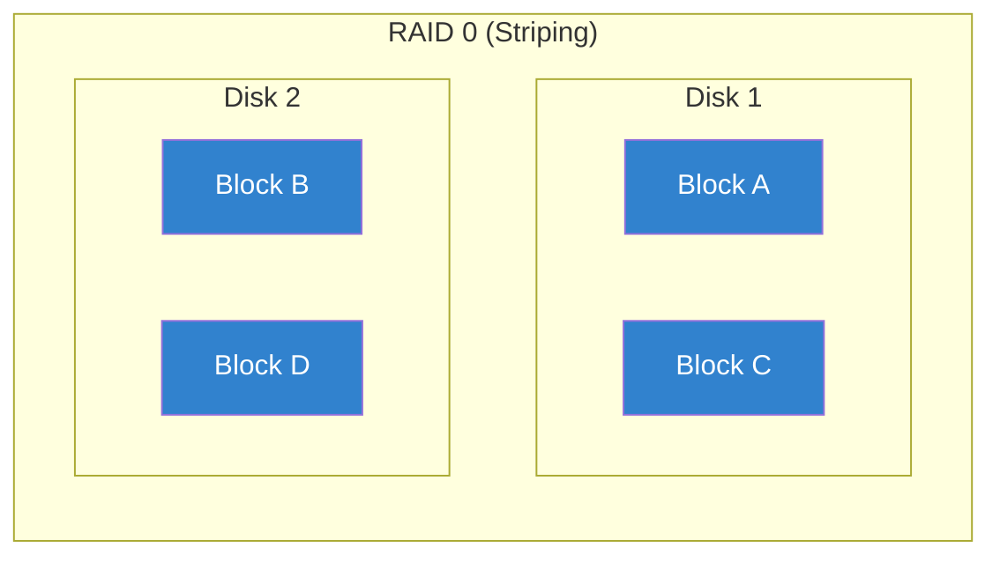
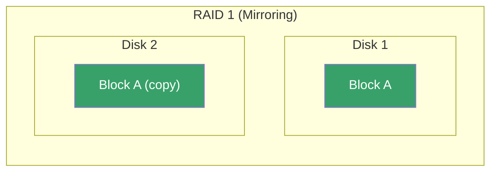
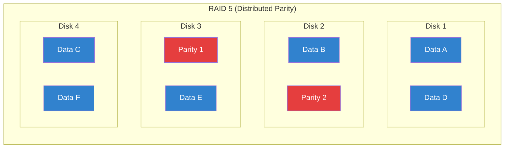
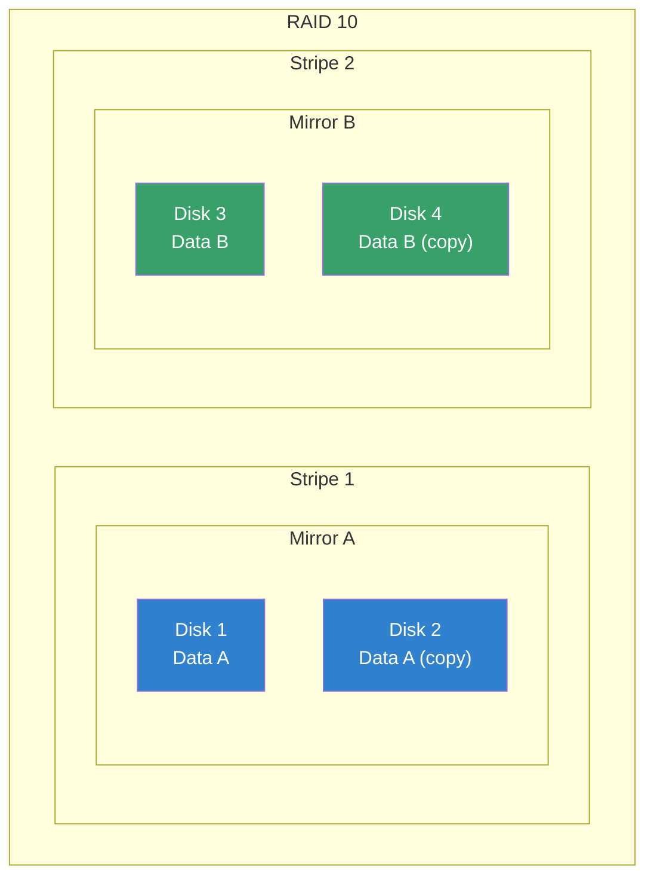
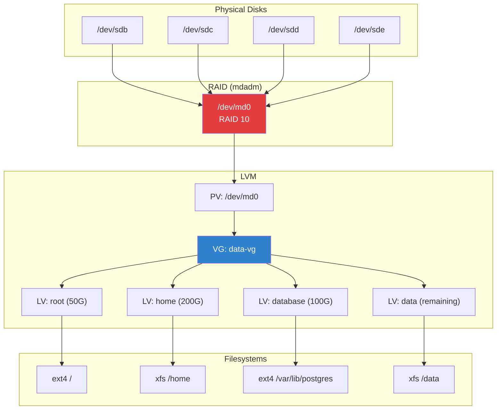

# RAID Configuration

## Introduction

RAID (Redundant Array of Independent Disks) is a technology that combines multiple physical disks into a single logical unit for redundancy, performance, or both. Linux provides software RAID through the `md` (Multiple Devices) subsystem, managed by the `mdadm` tool. Software RAID is free, flexible, and performs comparably to hardware RAID on modern systems with fast CPUs.

Understanding RAID is essential for system administrators because storage reliability directly impacts service availability. A single disk failure without RAID means data loss and downtime. With RAID, the system continues operating transparently while you replace the failed disk.

## RAID Levels

### RAID 0 — Striping

Data is split evenly across two or more disks with no redundancy.



| Property | Value |
|----------|-------|
| Min disks | 2 |
| Usable capacity | 100% (N × smallest disk) |
| Fault tolerance | None (1 disk failure = total loss) |
| Read performance | Excellent (parallel) |
| Write performance | Excellent (parallel) |
| Use case | Scratch space, temporary data, swap |

### RAID 1 — Mirroring

Data is written identically to two or more disks.



| Property | Value |
|----------|-------|
| Min disks | 2 |
| Usable capacity | 50% (N/2 × smallest disk) |
| Fault tolerance | N-1 disk failures |
| Read performance | Good (can read from either) |
| Write performance | Moderate (write to all) |
| Use case | OS boot, databases, critical data |

### RAID 5 — Striping with Parity

Data and parity are distributed across all disks. Can survive one disk failure.



| Property | Value |
|----------|-------|
| Min disks | 3 |
| Usable capacity | (N-1) × smallest disk |
| Fault tolerance | 1 disk failure |
| Read performance | Excellent |
| Write performance | Moderate (parity calculation) |
| Use case | File servers, general storage |

### RAID 6 — Double Parity

Like RAID 5 but with two parity blocks, surviving two simultaneous failures.

| Property | Value |
|----------|-------|
| Min disks | 4 |
| Usable capacity | (N-2) × smallest disk |
| Fault tolerance | 2 disk failures |
| Read performance | Excellent |
| Write performance | Lower (two parity calculations) |
| Use case | Large arrays, high-reliability storage |

### RAID 10 — Mirrored Stripes

Combines RAID 1 (mirror) and RAID 0 (stripe). Requires even number of disks.



| Property | Value |
|----------|-------|
| Min disks | 4 |
| Usable capacity | 50% (N/2 × smallest disk) |
| Fault tolerance | 1 per mirror pair |
| Read performance | Excellent |
| Write performance | Good |
| Use case | Databases, high-performance workloads |

### RAID Level Comparison

| Level | Min Disks | Capacity | Fault Tolerance | Read | Write |
|-------|-----------|----------|-----------------|------|-------|
| RAID 0 | 2 | 100% | None | ★★★★★ | ★★★★★ |
| RAID 1 | 2 | 50% | N-1 | ★★★★ | ★★★ |
| RAID 5 | 3 | (N-1)/N | 1 disk | ★★★★ | ★★★ |
| RAID 6 | 4 | (N-2)/N | 2 disks | ★★★★ | ★★ |
| RAID 10 | 4 | 50% | 1 per pair | ★★★★★ | ★★★★ |

## Creating RAID Arrays with mdadm

### Installation

```bash
# Debian/Ubuntu
apt install mdadm

# RHEL/Fedora
dnf install mdadm

# Verify
mdadm --version
# mdadm - v4.2 - 2021-12-30
```

### Creating RAID 1 (Mirror)

```bash
# Create RAID 1 array
mdadm --create /dev/md0 --level=1 --raid-devices=2 /dev/sdb /dev/sdc
# mdadm: Note: this array has metadata at the start and
#     may not be suitable as a boot device.
# mdadm: array /dev/md0 started.

# Check status
cat /proc/mdstat
# Personalities : [raid1] [linear] [multipath] [raid0] [raid6] [raid5] [raid4] [raid10]
# md0 : active raid1 sdb[0] sdc[1]
#       1048576 blocks super 1.2 [2/2] [UU]
#
# unused devices: <none>

# [UU] means both disks are Up
# [U_] means one disk is missing/degraded
```

### Creating RAID 5

```bash
# Create RAID 5 with 3 disks
mdadm --create /dev/md0 --level=5 --raid-devices=3 \
    /dev/sdb /dev/sdc /dev/sdd

# With spare disk
mdadm --create /dev/md0 --level=5 --raid-devices=3 \
    --spare-devices=1 /dev/sdb /dev/sdc /dev/sdd /dev/sde

# With chunk size (stripe size)
mdadm --create /dev/md0 --level=5 --raid-devices=3 \
    --chunk=512K /dev/sdb /dev/sdc /dev/sdd

# Check creation progress
cat /proc/mdstat
# md0 : active raid5 sdd[3] sdc[1] sdb[0]
#       2097152 blocks super 1.2 level 5, 512k chunk, algorithm 2 [3/3] [UU]
#       [====>................]  resync = 23.4% finish=0.5min speed=12345K/sec
```

### Creating RAID 10

```bash
# RAID 10 (mirrored stripes)
mdadm --create /dev/md0 --level=10 --raid-devices=4 \
    /dev/sdb /dev/sdc /dev/sdd /dev/sde

# With layout option
mdadm --create /dev/md0 --level=10 --raid-devices=4 \
    --layout=n2 /dev/sdb /dev/sdc /dev/sdd /dev/sde
# n2 = near copies (2 copies), default
# f2 = far copies
```

### After Creation: Filesystem and Mount

```bash
# Create filesystem
mkfs.ext4 /dev/md0
# Or: mkfs.xfs /dev/md0

# Mount
mkdir /mnt/raid
mount /dev/md0 /mnt/raid

# Add to /etc/fstab (use UUID)
blkid /dev/md0
# /dev/md0: UUID="12345678-abcd-..." TYPE="ext4"

# /etc/fstab entry
# UUID=12345678-abcd-...  /mnt/raid  ext4  defaults  0  2

# Save RAID configuration
mdadm --detail --scan >> /etc/mdadm/mdadm.conf
# Or:
mdadm --examine --scan >> /etc/mdadm/mdadm.conf

# Update initramfs
update-initramfs -u
```

## Monitoring RAID

### Checking RAID Status

```bash
# Quick status
cat /proc/mdstat

# Detailed array info
mdadm --detail /dev/md0
# /dev/md0:
#         Version : 1.2
#   Creation Time : Mon Jul 21 10:00:00 2025
#      Raid Level : raid5
#      Array Size : 2097152 (2048.00 MiB 2147.48 MB)
#   Used Dev Size : 1048576 (1024.00 MiB 1073.74 MB)
#    Raid Devices : 3
#   Total Devices : 3
#     Persistence : Superblock is persistent
#
#     Update Time : Mon Jul 21 14:32:00 2025
#           State : clean
#  Active Devices : 3
# Working Devices : 3
#  Failed Devices : 0
#   Spare Devices : 0
#
#          Layout : left-symmetric
#      Chunk Size : 512K
#
# Consistency Policy : resync
#
#     Number   Major   Minor   RaidDevice State
#        0       8       16        0      active sync   /dev/sdb
#        1       8       32        1      active sync   /dev/sdc
#        2       8       48        2      active sync   /dev/sdd

# Examine individual disk
mdadm --examine /dev/sdb
```

### Setting Up Monitoring

```bash
# Configure mdadm monitoring
# /etc/mdadm/mdadm.conf
MAILADDR admin@example.com
MAILFROM mdadm@server.example.com
PROGRAM /usr/local/bin/md-event-handler

# Start monitoring daemon
systemctl enable --now mdmonitor

# Test email notification
mdadm --monitor --test /dev/md0

# Set up a cron job for periodic checks
# /etc/cron.d/raid-check
0 1 * * * root /usr/share/mdadm/checkarray --cron --all --quiet
```

## Disk Failure and Rebuilding

### Handling a Disk Failure

```bash
# 1. Check which disk failed
mdadm --detail /dev/md0
# Look for "State: active, FAILED" or "removed"

# Mark failed disk as removed
mdadm --manage /dev/md0 --fail /dev/sdc
mdadm --manage /dev/md0 --remove /dev/sdc

# 2. Replace the physical disk

# 3. Add the new disk to the array
mdadm --manage /dev/md0 --add /dev/sde

# 4. Monitor rebuild progress
cat /proc/mdstat
# md0 : active raid5 sde[3] sdd[2] sdb[0]
#       2097152 blocks super 1.2 level 5, 512k chunk, algorithm 2 [3/2] [U_U]
#       [====>................]  recovery = 20.0% finish=10.0min speed=123456K/sec

# [U_U] = degraded (one disk missing)
# [UUU] = clean (all disks OK)
# Recovery will auto-start when new disk is added
```

### Hot Spare Configuration

```bash
# Create array with hot spare
mdadm --create /dev/md0 --level=5 --raid-devices=3 \
    --spare-devices=1 /dev/sdb /dev/sdc /dev/sdd /dev/sde

# Add spare to existing array
mdadm --manage /dev/md0 --add /dev/sde

# When a disk fails, the spare automatically takes over
# Check for auto-rebuild in mdadm.conf
# AUTO +1.1 +1.2 -all  # Auto-assemble and rebuild
```

## Growing and Reshaping Arrays

```bash
# Add disk to RAID 5 (grow from 3 to 4 disks)
mdadm --grow /dev/md0 --raid-devices=4 --add /dev/sde

# Monitor reshape progress
cat /proc/mdstat
# md0 : active raid5 sde[4] sdd[2] sdc[1] sdb[0]
#       2097152 blocks super 1.2 level 5, 512k chunk, algorithm 2 [4/4] [UUUU]
#       [====>................]  reshape = 20.0% ...

# Change chunk size
mdadm --grow /dev/md0 --chunk=1024K

# Convert RAID levels (limited)
# RAID 1 → RAID 5 (add disk)
mdadm --grow /dev/md0 --level=5 --raid-devices=3 --add /dev/sdd

# After reshape, grow the filesystem
resize2fs /dev/md0           # ext4
xfs_growfs /mnt/raid         # XFS
```

## RAID vs LVM

| Feature | RAID (mdadm) | LVM |
|---------|-------------|-----|
| Primary purpose | Redundancy/performance | Flexible volume management |
| Disk failure tolerance | Yes (RAID 1/5/6/10) | No (unless on RAID) |
| Snapshots | No | Yes |
| Resize volumes | Difficult | Easy |
| Thin provisioning | No | Yes |
| Striped performance | Yes (RAID 0/5/10) | Yes (lvcreate -i) |
| Move data between disks | No | Yes (pvmove) |

### Combining RAID + LVM (Recommended)

```bash
# Best practice: RAID for redundancy, LVM for flexibility

# 1. Create RAID array
mdadm --create /dev/md0 --level=10 --raid-devices=4 \
    /dev/sdb /dev/sdc /dev/sdd /dev/sde

# 2. Create LVM physical volume on RAID
pvcreate /dev/md0

# 3. Create volume group
vgcreate data-vg /dev/md0

# 4. Create logical volumes
lvcreate -L 50G -n root data-vg
lvcreate -L 200G -n home data-vg
lvcreate -L 100G -n database data-vg
lvcreate -l 100%FREE -n data data-vg

# 5. Create filesystems
mkfs.ext4 /dev/data-vg/root
mkfs.xfs /dev/data-vg/home
mkfs.ext4 /dev/data-vg/database
mkfs.xfs /dev/data-vg/data

# Benefits:
# - RAID handles disk failures transparently
# - LVM allows easy resizing, snapshots, and migration
# - Can add more disks to RAID later, then extend VG
```



## RAID Maintenance

```bash
# Periodic consistency check (RAID 5/6)
echo check > /sys/block/md0/md/sync_action
cat /proc/mdstat  # Monitor progress

# Repair if errors found
echo repair > /sys/block/md0/md/sync_action

# Schedule regular checks
# /etc/cron.d/raid-check
0 1 * * 0 root echo check > /sys/block/md0/md/sync_action

# Stop an array
mdadm --stop /dev/md0

# Assemble (restart) an array
mdadm --assemble /dev/md0 /dev/sdb /dev/sdc

# Assemble all arrays
mdadm --assemble --scan

# Remove an array completely
mdadm --stop /dev/md0
mdadm --zero-superblock /dev/sdb /dev/sdc
# Remove from mdadm.conf
```

## Advanced mdadm Operations

### Examining Disk Superblocks

```bash
# Examine a disk's RAID superblock
mdadm --examine /dev/sdb
# /dev/sdb:
#           Magic : a92b4efc
#         Version : 1.2
#     Feature Map : 0x0
#      Array UUID : 12345678:90abcdef:12345678:90abcdef
#            Name : server:0
#   Creation Time : Mon Jul 21 10:00:00 2025
#      Raid Level : raid5
#    Raid Devices : 3
#   Total Devices : 3
#     Persistence : Superblock is persistent

# Examine all disks
mdadm --examine /dev/sd[b-d]

# Scan for RAID arrays on all devices
mdadm --examine --scan
```

### Assembling Arrays

```bash
# Assemble a specific array
mdadm --assemble /dev/md0 /dev/sdb /dev/sdc /dev/sdd

# Assemble by UUID
mdadm --assemble /dev/md0 --uuid=12345678:90abcdef:12345678:90abcdef

# Assemble all known arrays
mdadm --assemble --scan

# Force assemble (after unclean shutdown)
mdadm --assemble --force /dev/md0 /dev/sdb /dev/sdc /dev/sdd

# Assemble in degraded mode (missing disk)
mdadm --assemble --force --run /dev/md0 /dev/sdb /dev/sdc
```

### Stopping and Removing Arrays

```bash
# Stop an array
mdadm --stop /dev/md0

# Remove array completely
mdadm --stop /dev/md0
mdadm --zero-superblock /dev/sdb /dev/sdc /dev/sdd

# Remove from mdadm.conf
sed -i '/ARRAY.*md0/d' /etc/mdadm/mdadm.conf
```

## RAID Performance Tuning

### Stripe Cache Size

The stripe cache improves RAID 5/6 read performance by caching stripe
segments in memory:

```bash
# Check current stripe cache size
cat /sys/block/md0/md/stripe_cache_size
# 256 (default)

# Increase for better read performance (uses more memory)
# Each entry = sizeof(struct stripe_head) ≈ 4KB
echo 8192 > /sys/block/md0/md/stripe_cache_size
# 8192 entries × 4KB = 32MB per array

# Make persistent via udev rule
# /etc/udev/rules.d/99-raid-stripe-cache.rules
# ACTION=="add", KERNEL=="md*", ATTR{md/stripe_cache_size}="8192"
```

### Read-Ahead

```bash
# Check current read-ahead
blockdev --getra /dev/md0
# 256 (default = 128KB)

# Increase read-ahead for sequential workloads
blockdev --setra 16384 /dev/md0
# 16384 × 512 = 8MB read-ahead

# Make persistent in /etc/rc.local or udev
```

### I/O Scheduler

```bash
# Check current scheduler
cat /sys/block/md0/queue/scheduler
# none (md devices typically use none)

# For underlying disks, use mq-deadline or none
for disk in /sys/block/sd[b-d]/queue/scheduler; do
    echo mq-deadline > "$disk"
done
```

### Chunk Size Selection

```bash
# Small chunks (4K-64K): Better for random I/O
# Large chunks (256K-1M): Better for sequential I/O

# Create with optimal chunk for database
mdadm --create /dev/md0 --level=10 --raid-devices=4 \
    --chunk=64K /dev/sd[b-e]1

# Create with optimal chunk for file server
mdadm --create /dev/md0 --level=5 --raid-devices=5 \
    --chunk=512K /dev/sd[b-f]1
```

## RAID Troubleshooting

### Common Problems and Solutions

#### Array Won't Assemble

```bash
# Error: mdadm: /dev/md0 not identified in config file.
# Solution: Scan and add to config
mdadm --examine --scan >> /etc/mdadm/mdadm.conf
mdadm --assemble /dev/md0

# Error: mdadm: /dev/md0 has been started with 2 drives (out of 3)
# Solution: Force assemble in degraded mode
mdadm --assemble --force --run /dev/md0 /dev/sdb /dev/sdc
```

#### Stale RAID Superblock

```bash
# Error: mdadm: /dev/sdb1 appears to be part of a raid array
# Solution: Zero superblock before reusing disk
mdadm --zero-superblock /dev/sdb1

# Or force creation
mdadm --create /dev/md0 --level=5 --raid-devices=3 \
    --assume-clean /dev/sdb1 /dev/sdc1 /dev/sdd1
```

#### Array Stuck in Read-Only

```bash
# Check array state
mdadm --detail /dev/md0 | grep State
# State : clean, read-only

# Solution: Remount read-write
mount -o remount,rw /mnt/raid

# Or reassemble
mdadm --stop /dev/md0
mdadm --assemble /dev/md0 /dev/sdb /dev/sdc /dev/sdd
```

#### Slow Rebuild Performance

```bash
# Check rebuild speed limits
cat /proc/sys/dev/raid/speed_limit_min
cat /proc/sys/dev/raid/speed_limit_max

# Increase rebuild speed (at cost of production I/O)
echo 200000 > /proc/sys/dev/raid/speed_limit_min
echo 400000 > /proc/sys/dev/raid/speed_limit_max

# Or decrease to reduce production impact
echo 10000 > /proc/sys/dev/raid/speed_limit_min
echo 50000 > /proc/sys/dev/raid/speed_limit_max
```

### Recovery Scenarios

#### Scenario 1: Single Disk Failure (RAID 5)

```bash
# 1. Identify failed disk
mdadm --detail /dev/md0
# Look for "State: active, FAILED" or "removed"

# 2. Remove failed disk from array
mdadm --manage /dev/md0 --fail /dev/sdc
mdadm --manage /dev/md0 --remove /dev/sdc

# 3. Replace physical disk
# (hot swap or shutdown and replace)

# 4. Add new disk to array
mdadm --manage /dev/md0 --add /dev/sde

# 5. Monitor rebuild
cat /proc/mdstat
# md0 : active raid5 sde[3] sdd[2] sdb[0]
#       [3/2] [U_U]
#       [====>................] recovery = 20.0%
```

#### Scenario 2: Multiple Disk Failure (RAID 6)

```bash
# RAID 6 survives 2 disk failures
# Process is same as RAID 5 but up to 2 disks

# Check degraded status
mdadm --detail /dev/md0 | grep -E "State|Failed"
# State : active, degraded
# Failed Devices : 1

# Replace first failed disk
mdadm --manage /dev/md0 --fail /dev/sdc
mdadm --manage /dev/md0 --remove /dev/sdc
mdadm --manage /dev/md0 --add /dev/sde
# Wait for rebuild to complete

# Then replace second failed disk
mdadm --manage /dev/md0 --fail /dev/sdd
mdadm --manage /dev/md0 --remove /dev/sdd
mdadm --manage /dev/md0 --add /dev/sdf
```

#### Scenario 3: Unclean Shutdown Recovery

```bash
# After power failure, array may need resync
mdadm --assemble --scan
cat /proc/mdstat
# md0 : active raid5 sdd[2] sdc[1] sdb[0]
#       [====>................] resync = 23.4%

# If bitmap exists, only dirty blocks are resynced
# If no bitmap, full resync required (slow)
```

## RAID with Different Filesystems

### ext4 on RAID

```bash
# Create ext4 with optimal RAID settings
mkfs.ext4 -b 4096 -E stride=128,stripe-width=256 /dev/md0
# stride = chunk_size / block_size = 512K / 4K = 128
# stripe-width = stride × (data_disks) = 128 × 2 = 256 (RAID 5, 3 disks)

# Mount with RAID-optimized options
mount -o noatime,nodiratime,data=writeback /dev/md0 /mnt/raid
```

### XFS on RAID

```bash
# Create XFS with optimal RAID settings
mkfs.xfs -b size=4096 -d sunit=1024,swidth=2048 /dev/md0
# sunit = chunk_size / 512 = 512K / 512 = 1024
# swidth = sunit × data_disks = 1024 × 2 = 2048

# Mount with RAID-optimized options
mount -o noatime,logbufs=8,logbsize=256k /dev/md0 /mnt/raid
```

## Monitoring Script

```bash
#!/bin/bash
# raid-monitor.sh — Comprehensive RAID monitoring

ALERT_EMAIL="admin@example.com"

for md in /dev/md*; do
    [ -b "$md" ] || continue
    
    # Check array state
    STATE=$(mdadm --detail "$md" | grep "State :" | awk '{print $3}')
    if [ "$STATE" != "clean" ] && [ "$STATE" != "active" ]; then
        echo "ALERT: $md state is $STATE" | mail -s "RAID Alert" $ALERT_EMAIL
    fi
    
    # Check for failed devices
    FAILED=$(mdadm --detail "$md" | grep "Failed Devices")
    if [ "$FAILED" != "Failed Devices : 0" ]; then
        echo "ALERT: $md has failed devices" | mail -s "RAID Alert" $ALERT_EMAIL
    fi
    
    # Check rebuild progress
    REBUILD=$(cat /proc/mdstat | grep -A1 "$(basename $md)" | grep -oP '\[=*.*?\]')
    if [ -n "$REBUILD" ]; then
        echo "INFO: $md rebuild progress: $REBUILD"
    fi
done
```

## References

- [mdadm(8) man page](https://man7.org/linux/man-pages/man8/mdadm.8.html)
- [md(4) man page](https://man7.org/linux/man-pages/man4/md.4.html) — MD driver
- [RAID Wiki](https://raid.wiki.kernel.org/) — Linux RAID wiki
- [ArchWiki: RAID](https://wiki.archlinux.org/title/RAID)
- [Software RAID HOWTO](https://tldp.org/HOWTO/Software-RAID-HOWTO.html)

## Related Topics

- [Disk Management](./disk-management.md) — Partitioning, filesystems, mounting
- [System Rescue](./rescue.md) — RAID recovery procedures
- [Cgroups](../kernel/processes/cgroups.md) — I/O controller for RAID workloads
