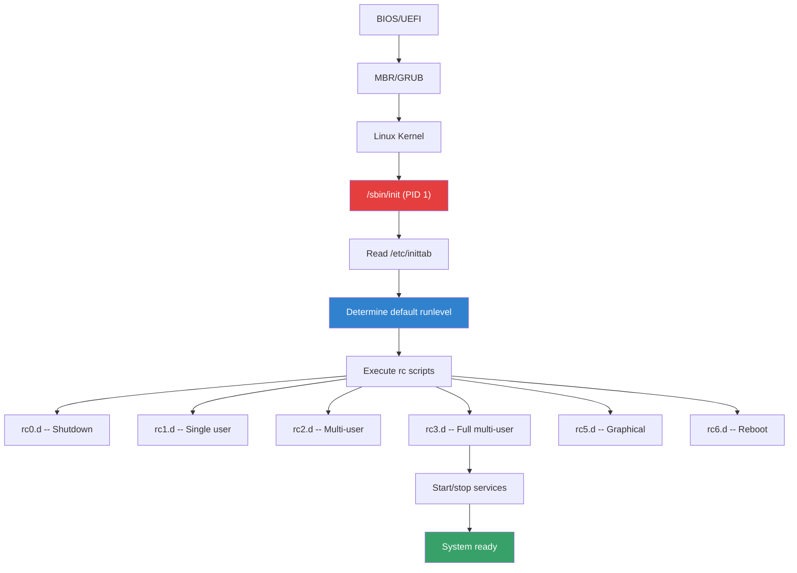

# SysV Init

## Introduction

SysV init (System V initialization) is the traditional init system for Unix and Linux, derived from AT&T UNIX System V released in 1983. While most modern Linux distributions have migrated to systemd, understanding SysV init remains important because:

- Many older systems still run SysV init
- You may encounter it during system rescue or legacy migrations
- Some concepts (runlevels, init scripts) influenced systemd's design
- Embedded systems and minimal distributions still use it
- Understanding SysV helps appreciate what systemd replaced

The SysV init process starts with PID 1 (`/sbin/init`), reads `/etc/inittab` to determine the default runlevel, and then executes the scripts in the corresponding `/etc/rc.d/` or `/etc/init.d/` directories.

## How SysV Init Works

### Boot Sequence



### The `/etc/inittab` File

```bash
# /etc/inittab — SysV init configuration
# Format: id:runlevels:action:process

# Default runlevel (3 = multi-user text mode)
id:3:initdefault:

# System initialization (runs once)
si::sysinit:/etc/init.d/rcS

# Runlevel scripts
l0:0:wait:/etc/init.d/rc 0
l1:1:wait:/etc/init.d/rc 1
l2:2:wait:/etc/init.d/rc 2
l3:3:wait:/etc/init.d/rc 3
l4:4:wait:/etc/init.d/rc 4
l5:5:wait:/etc/init.d/rc 5
l6:6:wait:/etc/init.d/rc 6

# Getty (login prompts)
1:2345:respawn:/sbin/getty 38400 tty1
2:2345:respawn:/sbin/getty 38400 tty2
3:2345:respawn:/sbin/getty 38400 tty3

# Ctrl+Alt+Del handler
ca:12345:ctrlaltdel:/sbin/shutdown -t1 -a -r now

# UPS power failure handling
pf:12345:powerfail:/sbin/shutdown -f +2 "Power Failure; System Shutting Down"
```

### inittab Actions

| Action | Description |
|--------|-------------|
| `respawn` | Restart process when it terminates |
| `wait` | Start process once, wait for completion |
| `once` | Start process once, don't wait |
| `boot` | Run during boot, don't wait |
| `bootwait` | Run during boot, wait for completion |
| `initdefault` | Set default runlevel |
| `sysinit` | Run before any boot/wait entries |
| `ctrlaltdel` | Run when Ctrl+Alt+Del is pressed |
| `powerfail` | Run on power failure notification |
| `powerwait` | Run on power failure, wait for completion |

## Runlevels

Runlevels define the system state. Each runlevel has a corresponding directory of init scripts:

| Runlevel | Description | Debian/Ubuntu | RHEL/CentOS |
|----------|-------------|---------------|-------------|
| 0 | Halt/Shutdown | Shutdown | Shutdown |
| 1 | Single user | Single user | Single user |
| 2 | Multi-user (no NFS) | Full multi-user | Multi-user |
| 3 | Full multi-user | Full multi-user | Full multi-user |
| 4 | User-defined | Full multi-user | User-defined |
| 5 | Graphical | Graphical | Graphical |
| 6 | Reboot | Reboot | Reboot |

### Runlevel Directories

```bash
# Scripts are organized in /etc/init.d/ (the source)
# and symlinked into runlevel directories

ls /etc/rc3.d/
# S10network    -> ../init.d/network
# S12syslog     -> ../init.d/syslog
# S20sshd       -> ../init.d/sshd
# S30postgresql -> ../init.d/postgresql
# S80nginx      -> ../init.d/nginx
# K20nginx      -> ../init.d/nginx
# K30postgresql -> ../init.d/postgresql

# Naming convention:
# S##name — Start script (## = order, lower = first)
# K##name — Kill script (## = order, lower = first)
# Numbers range from 00 to 99

# S scripts run when ENTERING a runlevel
# K scripts run when LEAVING a runlevel
```

### Switching Runlevels

```bash
# Change runlevel
init 3          # Switch to runlevel 3
telinit 3       # Same thing

# View current runlevel
runlevel
# N 3           # N = no previous runlevel, current = 3

# Shutdown
init 0          # Halt
shutdown -h now # Halt (preferred)

# Reboot
init 6          # Reboot
shutdown -r now # Reboot (preferred)
```

## Init Scripts (`/etc/init.d/`)

### Init Script Structure

A standard SysV init script follows the LSB (Linux Standard Base) template:

```bash
#!/bin/bash
### BEGIN INIT INFO
# Provides:          myservice
# Required-Start:    $network $syslog
# Required-Stop:     $network $syslog
# Default-Start:     2 3 4 5
# Default-Stop:      0 1 6
# Short-Description: My Service
# Description:       A detailed description of my service
### END INIT INFO

NAME="myservice"
DAEMON="/usr/bin/myservice"
PIDFILE="/var/run/myservice.pid"
LOGFILE="/var/log/myservice.log"

# Read configuration variable file if it is present
[ -r /etc/default/$NAME ] && . /etc/default/$NAME

# Load the VERBOSE setting and other rcS variables
. /lib/init/vars.sh

# Define LSB log_* functions
. /lib/lsb/init-functions

do_start() {
    # Return:
    #   0 if daemon has been started
    #   1 if daemon was already running
    #   2 if daemon could not be started
    
    start-stop-daemon --start --quiet --background \
        --make-pidfile --pidfile $PIDFILE \
        --exec $DAEMON --test || return 1
    
    start-stop-daemon --start --quiet --background \
        --make-pidfile --pidfile $PIDFILE \
        --exec $DAEMON -- $DAEMON_ARGS || return 2
    
    # Verify it started
    sleep 1
    if [ -f $PIDFILE ] && kill -0 $(cat $PIDFILE) 2>/dev/null; then
        log_daemon_msg "Started $NAME"
        return 0
    else
        log_failure_msg "Failed to start $NAME"
        return 2
    fi
}

do_stop() {
    # Return:
    #   0 if daemon has been stopped
    #   1 if daemon was already stopped
    #   2 if daemon could not be stopped
    
    start-stop-daemon --stop --quiet --retry=TERM/30/KILL/5 \
        --pidfile $PIDFILE --name $NAME
    
    RETVAL="$?"
    rm -f $PIDFILE
    return "$RETVAL"
}

do_status() {
    if [ -f $PIDFILE ] && kill -0 $(cat $PIDFILE) 2>/dev/null; then
        log_success_msg "$NAME is running (PID: $(cat $PIDFILE))"
        return 0
    else
        log_failure_msg "$NAME is not running"
        return 3
    fi
}

case "$1" in
    start)
        do_start
        ;;
    stop)
        do_stop
        ;;
    restart|force-reload)
        do_stop
        do_start
        ;;
    status)
        do_status
        ;;
    *)
        echo "Usage: $0 {start|stop|restart|force-reload|status}" >&2
        exit 3
        ;;
esac

exit $?
```

### Common Init Script Commands

```bash
# Start a service
/etc/init.d/myservice start

# Stop a service
/etc/init.d/myservice stop

# Restart
/etc/init.d/myservice restart

# Reload config (without restart)
/etc/init.d/myservice reload

# Check status
/etc/init.d/myservice status

# Make executable
chmod +x /etc/init.d/myservice
```

## Managing Service Links

### `update-rc.d` (Debian/Ubuntu)

```bash
# Enable a service (create links in rc*.d directories)
update-rc.d myservice defaults
# Creates S links in runlevels 2,3,4,5 and K links in 0,1,6

# Enable with specific runlevels and priority
update-rc.d myservice start 80 2 3 4 5 . stop 20 0 1 6 .
# S80myservice in rc2-5, K20myservice in rc0,1,6

# Disable a service (remove links)
update-rc.d myservice disable

# Re-enable
update-rc.d myservice enable

# Remove completely
update-rc.d -f myservice remove
# -f = force removal even if script exists
```

### `chkconfig` (RHEL/CentOS 6 and older)

```bash
# List all services and their runlevel settings
chkconfig --list
# myservice      0:off   1:off   2:on    3:on    4:on    5:on    6:off
# network        0:off   1:off   2:on    3:on    4:on    5:on    6:off
# sshd           0:off   1:off   2:on    3:on    4:on    5:on    6:off

# Enable for specific runlevels
chkconfig --level 345 myservice on

# Disable
chkconfig myservice off

# Add a new service
chkconfig --add myservice

# Remove a service
chkconfig --del myservice

# Check specific service
chkconfig --list myservice
```

### `service` Command

```bash
# Run init script (works on both Debian and RHEL)
service myservice start
service myservice stop
service myservice restart
service myservice status
service myservice reload

# List all services
service --status-all
# [ + ]  apache2
# [ + ]  ssh
# [ - ]  mysql
# [ ? ]  hwclock

# + = running, - = stopped, ? = unknown
```

## Migration to systemd

### Why systemd Replaced SysV Init

| Aspect | SysV init | systemd |
|--------|-----------|---------|
| Boot speed | Sequential | Parallel |
| Dependency management | Manual (LSB headers) | Automatic |
| Service supervision | None (daemonizes itself) | Built-in (cgroups) |
| Logging | Syslog only | Journald (structured) |
| Resource limits | Manual (ulimit) | cgroup integration |
| Socket activation | No | Yes |
| D-Bus activation | No | Yes |
| Timer management | cron | systemd timers |
| Snapshots/rollback | No | Yes |

### Init Script Internals

### How `service` Works

The `service` command is a wrapper that locates and executes init scripts:

```bash
# What service actually does (simplified)
#!/bin/bash
SERVICE=$1
ACTION=$2

# Search order:
# 1. /etc/init.d/$SERVICE
# 2. Upstart job (if applicable)
# 3. systemd unit (if applicable)

if [ -x /etc/init.d/$SERVICE ]; then
    /etc/init.d/$SERVICE $ACTION
fi
```

```bash
# Trace what service does
bash -x service nginx start 2>&1 | head -30

# service also sets environment variables:
# LANG, TERM, PATH, CONSOLETYPE
# It redirects output to the console if available
```

### Init Script Execution Order

Scripts execute in numerical order (S00 first, S99 last). The ordering matters for dependencies:

| Priority | Typical Services | Reason |
|----------|-----------------|--------|
| S01-S09 | udev, sysfs, modules | Hardware must be ready first |
| S10-S19 | networking, syslog | Network and logging infrastructure |
| S20-S29 | sshd, cron | Core services |
| S30-S39 | databases (mysql, postgresql) | Data stores |
| S40-S49 | web servers (nginx, apache) | Application servers |
| S80-S99 | custom application services |

```bash
# View actual boot order
ls -la /etc/rc3.d/S* | awk '{print $NF}'

# Change priority (Debian)
update-rc.d nginx defaults 90 10
# S90nginx in start runlevels, K10nginx in stop runlevels

# Change priority (RHEL)
chkconfig --level 3 nginx on
# Modify the header: # chkconfig: 2345 90 10
```

### Custom Runlevel Example

Create a custom runlevel for maintenance mode:

```bash
# Create custom runlevel 4 (unused by default on RHEL)
mkdir -p /etc/rc.d/rc4.d

# Copy only essential services
cd /etc/rc.d/rc4.d
ln -s ../init.d/network S10network
ln -s ../init.d/sshd S20sshd
ln -s ../init.d/syslog S05syslog

# Switch to maintenance runlevel
init 4

# Or set as default in /etc/inittab:
# id:4:initdefault:
```

## Boot Profiling (SysV Init)

Measuring boot time with SysV init requires manual tools:

```bash
# 1. Print timestamps during boot
# Add to /etc/init.d/rcS:
# echo "$(date +%s.%N) rcS start" >> /tmp/boot-profile.log

# 2. Use bootchart (if available)
apt install bootchartd
# Add bootchartd to kernel boot args or init.d
# Generates SVG/PNG timeline of boot process

# 3. Measure individual script time
time /etc/init.d/nginx start
# real    0m0.234s
# user    0m0.012s
# sys     0m0.020s

# 4. Use `initctl` timing (if available)
# Some SysV implementations log execution time

# 5. Compare with systemd (if migrating)
systemd-analyze
# Startup finished in 1.234s (kernel) + 3.456s (userspace) = 4.690s
systemd-analyze blame
# Shows per-service startup time
```

## SysV Init Security Considerations

| Concern | Risk | Mitigation |
|---------|------|------------|
| Init scripts run as root | Any script bug = root exploit | Review all scripts, use `set -e` |
| No sandboxing | Services share full system access | Use chroot, ulimit, SELinux |
| PID file races | PID files can be forged | Use `start-stop-daemon --background` |
| No capability dropping | Services retain all root capabilities | Use `capsh` or `setpriv` in scripts |
| Log tampering | Logs in plain text files | Forward to remote syslog, use log signing |
| World-writable scripts | Script modification = root exploit | `chmod 755` on all init scripts |

```bash
# Secure init script best practices
# 1. Use start-stop-daemon (prevents PID races)
start-stop-daemon --start --background --make-pidfile \
    --pidfile /var/run/myservice.pid \
    --exec /usr/bin/myservice

# 2. Drop privileges
start-stop-daemon --start --background --make-pidfile \
    --pidfile /var/run/myservice.pid \
    --chuid myservice:myservice \
    --exec /usr/bin/myservice

# 3. Set resource limits
ulimit -n 65536    # Open files
ulimit -s 8192     # Stack size

# 4. Set umask
umask 022
```

## Other Init Systems Compared

| Init System | Distribution | Supervision | Parallel Boot | Dependencies |
|-------------|-------------|-------------|---------------|-------------|
| SysV init | Debian, RHEL (legacy) | None | No | Manual (LSB headers) |
| systemd | Most modern distros | cgroup-based | Yes | Automatic |
| OpenRC | Gentoo, Alpine | Optional (s6) | Yes | Explicit |
| runit | Void Linux | Built-in (runit) | Yes | Minimal |
| s6 | Artix (optional) | Built-in (s6) | Yes | Declarative |
| Shepherd | GNU Guix | Built-in | Yes | Guile-based |

```bash
# OpenRC comparison (Gentoo/Alpine)
rc-service nginx start        # Like service nginx start
rc-update add nginx default   # Like chkconfig nginx on
rc-status                     # Like service --status-all

# runit comparison (Void Linux)
ln -s /etc/sv/nginx /var/service/  # Enable service
sv status nginx                    # Check status
sv start nginx                     # Start service
sv restart nginx                   # Restart service
```

## Migrating Init Scripts to systemd Units

```bash
# Old SysV script: /etc/init.d/myservice
# New systemd unit: /etc/systemd/system/myservice.service
```

```ini
# /etc/systemd/system/myservice.service
[Unit]
Description=My Service
Documentation=https://example.com/docs
After=network.target
Requires=postgresql.service
Wants=redis.service

[Service]
Type=forking
User=myservice
Group=myservice
Environment=CONFIG_FILE=/etc/myservice/config.yaml
EnvironmentFile=-/etc/default/myservice
ExecStartPre=/usr/bin/myservice --check-config
ExecStart=/usr/bin/myservice --daemon
ExecReload=/bin/kill -HUP $MAINPID
ExecStop=/usr/bin/myservice --shutdown
PIDFile=/var/run/myservice.pid
Restart=on-failure
RestartSec=5
TimeoutStartSec=30
TimeoutStopSec=30

# Security hardening
NoNewPrivileges=yes
ProtectSystem=strict
ProtectHome=yes
ReadWritePaths=/var/lib/myservice /var/log/myservice
PrivateTmp=yes

# Resource limits
LimitNOFILE=65536
MemoryMax=512M
CPUQuota=80%

[Install]
WantedBy=multi-user.target
```

### SysV Compatibility in systemd

systemd provides backward compatibility for SysV init scripts:

```bash
# systemd can still run SysV init scripts
systemctl start myservice  # Runs /etc/init.d/myservice start

# systemd automatically generates service units from init scripts
systemctl cat myservice    # Shows the generated unit

# The systemd-sysv-generator converts init scripts on the fly
# Located at: /usr/lib/systemd/system-generators/systemd-sysv-generator

# Priority: native systemd units take precedence over SysV scripts
# If both exist, the systemd unit is used
```

### Migration Steps

```bash
# Step 1: Check if a native systemd unit exists
systemctl cat myservice 2>/dev/null

# Step 2: If not, the init script still works
systemctl start myservice  # Uses /etc/init.d/myservice

# Step 3: Create native unit
# Copy template from /usr/lib/systemd/system/ or write from scratch

# Step 4: Enable and test
systemctl daemon-reload
systemctl enable myservice
systemctl start myservice
systemctl status myservice

# Step 5: Verify
journalctl -u myservice --since "5 min ago"

# Step 6: Remove old init script (optional)
rm /etc/init.d/myservice
update-rc.d -f myservice remove
```

### Handling Dependencies

```bash
# SysV: LSB headers
# Required-Start: $network $syslog
# Required-Stop: $network $syslog

# systemd: unit directives
# After=network.target syslog.target
# Requires=network.target
# Wants=redis.service

# Common dependency targets:
# network.target        — Network interfaces configured
# network-online.target — Network is actually up (has connectivity)
# local-fs.target       — Local filesystems mounted
# remote-fs.target      — Remote filesystems mounted
# syslog.target         — Syslog available
# nss-lookup.target     — DNS resolution available
```

## SysV Init vs systemd Quick Reference

```bash
# SysV                              # systemd
service myservice start             systemctl start myservice
service myservice stop              systemctl stop myservice
service myservice restart           systemctl restart myservice
service myservice reload            systemctl reload myservice
service myservice status            systemctl status myservice
service --status-all                systemctl list-units --type=service
chkconfig myservice on              systemctl enable myservice
chkconfig myservice off             systemctl disable myservice
chkconfig --list                    systemctl list-unit-files
runlevel                            systemctl get-default
init 3                              systemctl isolate multi-user.target
init 0                              systemctl poweroff
init 6                              systemctl reboot
tail -f /var/log/messages           journalctl -f -u myservice
```

## Distributions Still Using SysV Init

| Distribution | Init System | Notes |
|-------------|-------------|-------|
| Debian (without systemd) | SysV init or OpenRC | `sysvinit-core` package |
| Devuan | SysV init (default) | Debian fork without systemd |
| Alpine Linux | OpenRC | SysV-compatible |
| Slackware | BSD-style init | Similar to SysV |
| Gentoo | OpenRC (default) | SysV-compatible |
| Void Linux | runit | Different but simple |

## SysV Init Quick Reference

```bash
# SysV                              # systemd
service myservice start             systemctl start myservice
service myservice stop              systemctl stop myservice
service myservice restart           systemctl restart myservice
service myservice reload            systemctl reload myservice
service myservice status            systemctl status myservice
service --status-all                systemctl list-units --type=service
chkconfig myservice on              systemctl enable myservice
chkconfig myservice off             systemctl disable myservice
chkconfig --list                    systemctl list-unit-files
runlevel                            systemctl get-default
init 3                              systemctl isolate multi-user.target
init 0                              systemctl poweroff
init 6                              systemctl reboot
tail -f /var/log/messages           journalctl -f -u myservice
```

## Rescue and Recovery with SysV Init

SysV init's simplicity makes it useful for recovery scenarios:

### Booting into Single-User Mode

```bash
# At GRUB prompt, edit kernel line:
# Add "single" or "1" to kernel parameters
# kernel /vmlinuz root=/dev/sda1 ro single

# This boots to runlevel 1 (single user)
# Root shell without password (physical console only)
# Only essential services running

# From single user, you can:
# 1. Fix /etc/fstab errors
mount -o remount,rw /
vi /etc/fstab

# 2. Reset root password
passwd root

# 3. Fix broken init scripts
ls /etc/rc3.d/S*
# Remove or rename broken symlinks
mv /etc/rc3.d/S99broken /etc/rc3.d/K01broken

# 4. Fix filesystem errors
fsck /dev/sda1
```

### Emergency Init Script

```bash
# If /sbin/init is broken, boot with:
# init=/bin/bash
# At GRUB: kernel /vmlinuz root=/dev/sda1 ro init=/bin/bash

# You get a raw shell. To fix:
mount -o remount,rw /
mount -a
# Fix the issue, then:
exec /sbin/init
```

## Further Reading

- [init(8) man page](https://man7.org/linux/man-pages/man8/init.8.html)
- [inittab(5) man page](https://man7.org/linux/man-pages/man5/inittab.5.html)
- [update-rc.d(8) man page](https://man7.org/linux/man-pages/man8/update-rc.d.8.html)
- [chkconfig(8) man page](https://man7.org/linux/man-pages/man8/chkconfig.8.html)
- [LSB init script specification](https://refspecs.linuxbase.org/LSB_3.1.1/LSB-Core-generic/LSB-Core-generic/iniscrptact.html)
- [Debian Wiki: Systemd](https://wiki.debian.org/systemd)
- [systemd for SysV Init Users](https://wiki.archlinux.org/title/Systemd/Services)

## Related Topics

- [System Administration Overview](./overview.md) — Service management practices
- [Process Management](./process-management.md) — systemd process control
- [System Rescue](./rescue.md) — Boot process and recovery
- [Logging](./logging.md) — journald vs syslog
