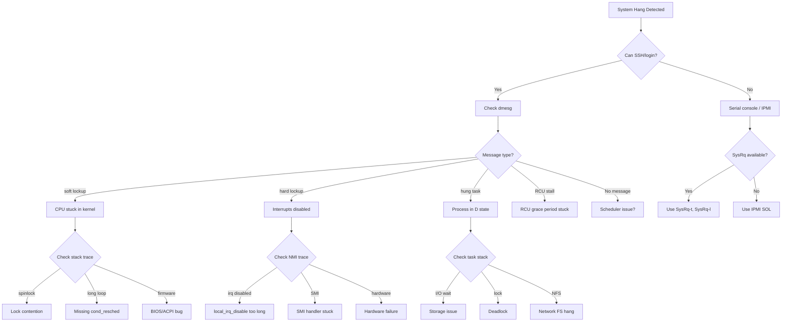

# Lockup Detectors

## Overview

Lockup detectors are kernel subsystems that identify situations where the CPU or a kernel task is stuck in a non-interruptible state for an abnormal duration. Lockups can cause system hangs, unresponsive applications, and data loss. The Linux kernel provides several lockup detection mechanisms:

- **Soft lockup detector**: Detects when a CPU spends too long in kernel mode without scheduling
- **Hard lockup detector**: Detects when a CPU cannot service interrupts (using the NMI watchdog)
- **Hung task detector**: Detects tasks stuck in `TASK_UNINTERRUPTIBLE` (D state) for too long

These detectors are configured via `CONFIG_*` kernel options and controlled at runtime through sysctl and sysfs interfaces.

## Soft Lockup Detector

### What Is a Soft Lockup?

A soft lockup occurs when a kernel thread monopolizes a CPU for too long without yielding. The kernel's watchdog mechanism detects this by using a per-CPU high-priority watchdog thread that periodically updates a timestamp. If the timestamp is not updated within a threshold, the kernel concludes a soft lockup has occurred.

### How It Works

1. Each CPU has a `khungtaskd`-like watchdog thread (`watchdog/N`) with the highest real-time priority (`SCHED_FIFO`, priority 99)
2. The watchdog thread runs periodically and updates a per-CPU timestamp
3. A separate timer interrupt checks whether the timestamp is stale
4. If the timestamp hasn't been updated within `softlockup_thresh` seconds, a soft lockup is reported

### Kernel Code

```c
/* kernel/watchdog.c */
static void watchdog_timer_fn(struct timer_list *t)
{
    struct cpu_watchdog *wd = from_timer(wd, t, watchdog_timer);
    int duration;

    /* Check if watchdog thread has updated recently */
    duration = is_softlockup(wd);
    if (duration) {
        /* Soft lockup detected */
        pr_emerg("BUG: soft lockup - CPU#%d stuck for %us!\n",
                 smp_processor_id(), duration);
        print_modules();
        dump_stack();
        /* Optionally panic or print more info */
    }
}

static int is_softlockup(struct cpu_watchdog *wd)
{
    unsigned long touch_ts = READ_ONCE(wd->touch_ts);
    unsigned long now = get_timestamp();

    if (time_after(now, touch_ts + softlockup_thresh))
        return now - touch_ts;
    return 0;
}
```

### Detection Threshold

The soft lockup threshold is controlled by:

```bash
# Default: 20 seconds
cat /proc/sys/kernel/softlockup_panic
# 0 = report only, 1 = panic on soft lockup

# Adjusting the watchdog sample period
cat /proc/sys/kernel/watchdog_thresh
# Default: 10 seconds (soft lockup detected at 2x this = 20s)
```

### Soft Lockup Output

```
watchdog: BUG: soft lockup - CPU#3 stuck for 22s! [myapp:1234]
Modules linked in: ...
CPU: 3 PID: 1234 Comm: myapp Tainted: G        W
Hardware name: ...
RIP: 0010:my_function+0x10/0x50
Call Trace:
 <TASK>
 my_long_loop+0x42/0x100
 process_data+0x100/0x200
 ...
 </TASK>
```

## Hard Lockup Detector (NMI Watchdog)

### What Is a Hard Lockup?

A hard lockup occurs when a CPU is unable to service interrupts, including the timer interrupt. This is more severe than a soft lockup — it typically indicates that interrupts are disabled for an extended period or the CPU is stuck in a non-interruptible state at the hardware level.

### How It Works

The hard lockup detector uses Non-Maskable Interrupts (NMI), which cannot be blocked by disabling interrupts:

1. An NMI-based watchdog timer fires periodically
2. The NMI handler checks whether the regular timer interrupt has been serviced recently
3. If the timer interrupt hasn't fired within the threshold, a hard lockup is detected

```c
/* kernel/watchdog.c - NMI handler */
static void watchdog_overflow_callback(struct perf_event *event,
                                       struct perf_sample_data *data,
                                       struct pt_regs *regs)
{
    /* Check if timer interrupt has been serviced */
    if (is_hardlockup()) {
        int this_cpu = smp_processor_id();

        if (hardlockup_panic)
            panic("Hard LOCKUP");

        pr_emerg("Watchdog detected hard LOCKUP on cpu %d\n", this_cpu);
        print_modules();
        dump_stack();
    }
}

static int is_hardlockup(void)
{
    /* If the timer interrupt count hasn't changed, we have a hard lockup */
    return __this_cpu_read(hrtimer_interrupts) ==
           __this_cpu_read(hrtimer_interrupts_saved);
}
```

### NMI Watchdog Implementations

The kernel supports multiple NMI watchdog backends:

#### perf-based (Default)

Uses the CPU's performance monitoring unit (PMU) to generate NMIs:

```bash
# Enable via boot parameter
nmi_watchdog=1

# Or runtime
echo 1 > /proc/sys/kernel/nmi_watchdog
```

The perf-based watchdog creates a hardware performance counter overflow event that generates an NMI at regular intervals.

#### Legacy I/O APIC

On older x86 systems, the I/O APIC timer can be used:

```bash
nmi_watchdog=2  # I/O APIC based
```

This is less reliable and not recommended on modern hardware.

### Hard Lockup Output

```
Watchdog detected hard LOCKUP on cpu 2
Modules linked in: ...
CPU: 2 PID: 0 Comm: swapper/2 Tainted: G        W
NMI backtrace for cpu 2
Call Trace:
 <NMI>
 dump_stack+0x67/0x92
 watchdog_overflow_callback+0x120/0x150
 __perf_event_overflow+0x50/0x1e0
 perf_event_overflow+0x14/0x20
 ...
 </NMI>
```

## Hung Task Detector

### What Is a Hung Task?

A hung task is a process stuck in `TASK_UNINTERRUPTIBLE` (D state) for an extended period. Unlike soft lockups (which are CPU-centric), hung tasks are process-centric. A task in D state cannot be killed with `SIGKILL` because it's waiting on a kernel resource (typically I/O) that is not completing.

### How It Works

The `khungtaskd` kernel thread periodically scans all tasks:

```c
/* kernel/hung_task.c */
static int watchdog(void *dummy)
{
    unsigned long hung_last_checked = jiffies;

    set_user_nice(current, 0);

    while (!kthread_should_stop()) {
        /* Sleep for the check interval */
        schedule_timeout_interruptible(hung_timeout);

        /* Check for hung tasks */
        check_hung_uninterruptible_tasks(hung_last_checked);
        hung_last_checked = jiffies;
    }
    return 0;
}

static void check_hung_uninterruptible_tasks(unsigned long timeout)
{
    int max_count = sysctl_hung_task_check_count;
    struct task_struct *g, *t;

    for_each_process_thread(g, t) {
        if (t->state == TASK_UNINTERRUPTIBLE &&
            !(t->flags & PF_FROZEN)) {
            if (time_after_eq(jiffies, t->last_switch_time + timeout)) {
                /* Hung task detected */
                sched_show_task(t);
                check_hung_task(t, timeout);
            }
        }
    }
}
```

### Configuration

```bash
# Enable/disable hung task detection
echo 1 > /proc/sys/kernel/hung_task_timeout_secs   # Timeout in seconds (default: 120)
echo 0 > /proc/sys/kernel/hung_task_timeout_secs   # Disable

# Maximum number of tasks to check per scan
echo 1024 > /proc/sys/kernel/hung_task_check_count

# Panic on hung task
echo 1 > /proc/sys/kernel/hung_task_panic  # 0 = report only, 1 = panic

# Check interval (usually derived from timeout)
# khungtaskd sleeps for timeout/2 between checks
```

### Hung Task Output

```
INFO: task myapp:1234 blocked for more than 120 seconds.
      Tainted: G        W         5.15.0-generic
"echo 0 > /proc/sys/kernel/hung_task_timeout_secs" disables this message.
task:myapp           state:D stack:    0 pid: 1234 ppid:     1
Call Trace:
 <TASK>
 __schedule+0x2e0/0x740
 schedule+0x4b/0xb0
 schedule_timeout+0x1e0/0x300
 io_schedule_timeout+0xa0/0x120
 wait_for_completion+0x98/0x120
 ...
 </TASK>
```

## Runtime Configuration

### Sysctl Parameters

```bash
# /proc/sys/kernel/ parameters:

# Watchdog base sample period (seconds)
# Soft lockup threshold = 2 * watchdog_thresh
# Default: 10
echo 10 > /proc/sys/kernel/watchdog_thresh

# Enable/disable soft lockup detector
echo 1 > /proc/sys/kernel/softlockup_panic  # Panic on soft lockup
echo 0 > /proc/sys/kernel/softlockup_panic  # Report only

# Enable/disable hard lockup detector
echo 1 > /proc/sys/kernel/nmi_watchdog
echo 0 > /proc/sys/kernel/nmi_watchdog

# Hung task timeout (0 = disabled)
echo 120 > /proc/sys/kernel/hung_task_timeout_secs

# Panic on hung task
echo 1 > /proc/sys/kernel/hung_task_panic

# Hung task check count
echo 1024 > /proc/sys/kernel/hung_task_check_count

# All lockup detectors panic
echo 1 > /proc/sys/kernel/panic_on_warn  # Panic on any warning
```

### Sysfs Watchdog Control

```bash
# Per-CPU watchdog control
ls /sys/devices/system/cpu/cpu0/cpufreq/
# Not directly related, but:

# Watchdog can be toggled per CPU via:
echo 0 > /proc/sys/kernel/watchdog  # Disable all watchdogs on all CPUs
echo 1 > /proc/sys/kernel/watchdog  # Re-enable

# Per-CPU: use the perf interface
# The NMI watchdog creates perf events that can be seen:
cat /proc/sys/kernel/watchdog_cpumask
# Bitmask of CPUs with watchdog enabled
```

### Boot Parameters

```bash
# Kernel command line options:

# Disable all lockup detectors
nowatchdog

# Disable NMI watchdog
nmi_watchdog=0

# Set NMI watchdog to perf-based
nmi_watchdog=1

# Set NMI watchdog to I/O APIC based
nmi_watchdog=2

# Set watchdog threshold (seconds)
lockup_detector_watchdog_thresh=10

# Panic on soft lockup
softlockup_panic=1

# Panic on hard lockup
hardlockup_panic=1

# Disable hung task detector
hung_task_panic=0

# Full example:
# nmi_watchdog=1 softlockup_panic=1 lockup_detector_watchdog_thresh=15
```

## Boot-Time Detection

```bash
# Check if watchdog is running
dmesg | grep -i watchdog
# [    0.000000] watchdog: watchdog threads started for all CPUs
# [    0.000000] NMI watchdog: Enabled. Permanently consumes one hw-PMU counter.

# Check if lockup detection is enabled
cat /sys/kernel/debug/lockup_detector
# Shows current configuration
```

## Interaction with Other Subsystems

### RCU Stall Detector

The RCU (Read-Copy-Update) subsystem has its own stall detector:

```bash
# RCU stall timeout (seconds)
echo 21 > /sys/kernel/debug/rcu/rcu_sched/rcu_kick_kthreads_delay

# RCU stall panic
echo 1 > /proc/sys/kernel/panic_on_rcu_stall
```

RCU stalls often accompany lockups — a CPU stuck in a critical section can stall RCU grace period advancement.

### Kernel Panic Behavior

When a lockup is detected and panic is enabled:

```bash
# What to do on panic
echo 1 > /proc/sys/kernel/panic    # Reboot after 1 second
echo 0 > /proc/sys/kernel/panic    # No auto-reboot (hang)
echo 30 > /proc/sys/kernel/panic   # Reboot after 30 seconds

# Dump panic info to pstore
echo 1 > /sys/module/kernel/parameters/panic_on_warn
```

### SysRq Integration

When a lockup is detected, the kernel can trigger SysRq:

```bash
# Enable SysRq
echo 1 > /proc/sys/kernel/sysrq

# The lockup detector automatically calls SysRq-L (show all backtraces)
# on soft lockup detection
```

## Common Causes of Lockups

### Soft Lockup Causes

1. **Long loops in kernel code**: A kernel path iterating over a large data set without calling `cond_resched()`
2. **Disabled preemption**: Code running with `preempt_disable()` for too long
3. **Large critical sections**: Holding a spinlock while doing extensive work
4. **Firmware bugs**: ACPI or firmware calls that take unexpectedly long

### Hard Lockup Causes

1. **Interrupts disabled for too long**: `local_irq_disable()` without timely `local_irq_enable()`
2. **Hardware issues**: Faulty hardware preventing interrupt delivery
3. **Firmware/BIOS bugs**: SMI (System Management Interrupt) handlers running too long
4. **Infinite loops in interrupt handlers**: NMI-safe code stuck in a loop

### Hung Task Causes

1. **Deadlocked I/O**: Storage device not responding
2. **Network filesystem hangs**: NFS/CIFS server unreachable
3. **Kernel bugs**: Deadlock in a subsystem
4. **Hardware failures**: Disk controller failure, network cable disconnected
5. **Memory pressure**: System thrashing, unable to allocate pages for I/O completion

## Debugging Lockups

### Collecting Information

```bash
# Enable all debugging
echo 1 > /proc/sys/kernel/softlockup_panic
echo 1 > /proc/sys/kernel/hung_task_panic
echo 21 > /proc/sys/kernel/panic  # Auto-reboot after 21s

# Enable kdump for crash dumps
# (Requires kexec-tools and crashkernel= boot parameter)

# Check dmesg after reboot
dmesg | grep -E "(lockup|hung|watchdog|BUG|NMI)"
```

### Using perf for Lockup Analysis

```bash
# Record all CPUs during a lockup
perf record -a -g -e cycles -- sleep 10

# Or use perf lock for lock contention
perf lock record -- sleep 10
perf lock report
```

### SysRq During Lockup

```bash
# Trigger SysRq remotely or via serial console
echo t > /proc/sysrq-trigger   # Show all task states
echo l > /proc/sysrq-trigger   # Show all CPU backtraces
echo d > /proc/sysrq-trigger   # Show all held locks
echo w > /proc/sysrq-trigger   # Show blocked tasks
```

## Lockup Triage Decision Tree



## Real-World Debugging Scenarios

### Scenario 1: Soft Lockup in Driver

**Symptom**: System becomes unresponsive, dmesg shows:
```
watchdog: BUG: soft lockup - CPU#2 stuck for 22s! [mydriver:1234]
```

**Diagnosis**:
```bash
# Check the stack trace in dmesg
 dmesg | grep -A 20 "soft lockup"

# Look for the function mentioned
# Common patterns:
# - while loop without cond_resched()
# - spinlock held too long
# - DMA wait without timeout

# If reproducible, trace the function
 echo "func mydriver_long_function +p" > /sys/kernel/debug/dynamic_debug/control
# Or use ftrace
sudo trace-cmd record -p function_graph -g mydriver_long_function sleep 5
sudo trace-cmd report
```

**Fix**: Add `cond_resched()` in long loops, reduce spinlock hold time, add timeouts to DMA waits.

### Scenario 2: Hard Lockup with IRQs Disabled

**Symptom**: Complete hang, NMI backtrace in dmesg:
```
Watchdog detected hard LOCKUP on cpu 3
NMI backtrace for cpu 3
```

**Diagnosis**:
```bash
# Check if related to specific hardware
# Often caused by:
# - Interrupt handler running too long
# - Firmware/SMI blocking CPU
# - Hardware interrupt storm

# Check interrupt stats
watch -n 1 'cat /proc/interrupts | head -20'

# Check for SMI issues
dmesg | grep -i smi

# Check CPU frequency (may indicate thermal throttling)
cat /sys/devices/system/cpu/cpu*/cpufreq/scaling_cur_freq
```

### Scenario 3: Hung Task with Storage

**Symptom**: Processes stuck in D state:
```
INFO: task myapp:5678 blocked for more than 120 seconds.
```

**Diagnosis**:
```bash
# Check what the task is waiting on
cat /proc/5678/stack

# Check I/O statistics
iostat -x 1 5

# Check for disk errors
dmesg | grep -i "error\|reset\|timeout" | grep -i "sd\|nvme\|ata"

# Check block device health
smartctl -a /dev/sda

# Check if NFS is involved
mount | grep nfs
cat /proc/mounts | grep nfs
```

### Scenario 4: RCU Stall

**Symptom**: RCU stall messages:
```
rcu: INFO: rcu_sched self-detected stall on CPU
```

**Diagnosis**:
```bash
# RCU stalls often accompany lockups
# Check if a CPU is stuck in a critical section
# Common causes:
# - Preemption disabled for too long
# - CPU stuck in interrupt handler
# - Real-time task starving RCU

# Check RCU configuration
cat /sys/kernel/debug/rcu/*/gp_preempt_sleep

# Check for RT tasks
chrt -p $(pgrep myapp)
```

## Lockup Prevention Best Practices

### Kernel Code

```c
/* Good: Yield in long loops */
while (work_remaining) {
    do_some_work();
    cond_resched();  /* Allow other tasks to run */
}

/* Good: Use timeouts for hardware waits */
unsigned long timeout = jiffies + msecs_to_jiffies(5000);
while (!hw_ready()) {
    if (time_after(jiffies, timeout)) {
        pr_err("hardware timeout\n");
        return -ETIMEDOUT;
    }
    cpu_relax();
}

/* Good: Minimize spinlock hold time */
spin_lock(&my_lock);
/* Do minimal work under lock */
data = shared_data;
spin_unlock(&my_lock);
/* Process data outside lock */
process(data);

/* Bad: Long operations under spinlock */
spin_lock(&my_lock);
for (i = 0; i < 1000000; i++) {  /* Don't do this! */
    process_item(items[i]);
}
spin_unlock(&my_lock);
```

### System Configuration

```bash
# Enable lockup detection in production
softlockup_panic=1
hung_task_timeout_secs=120
hung_task_panic=0  # Log but don't panic (set to 1 for critical systems)
nmi_watchdog=1

# Configure kdump for crash analysis
# Add to kernel command line:
crashkernel=256M

# Enable SysRq for remote debugging
 echo 1 > /proc/sys/kernel/sysrq

# Set panic timeout for automatic reboot
echo 30 > /proc/sys/kernel/panic
```

## Lockup Detector Overhead

The watchdog mechanisms have minimal overhead:

| Detector | Mechanism | Overhead |
|---|---|---|
| Soft lockup | Per-CPU timer + watchdog thread | ~0.01% CPU |
| Hard lockup | NMI perf counter | ~0.001% CPU (one PMU counter) |
| Hung task | Periodic task scan | ~0.01% CPU |

## Disabling Watchdogs

For performance-critical workloads where false positives are acceptable:

```bash
# Disable all watchdogs
echo 0 > /proc/sys/kernel/watchdog
echo 0 > /proc/sys/kernel/hung_task_timeout_secs

# Or via boot parameter
nowatchdog nmi_watchdog=0
```

**Warning**: Disabling watchdogs makes lockups undetectable. Only do this if you have alternative monitoring.

## Further Reading

- **Kernel documentation**: `Documentation/lockup-watchdogs.rst`
- **Kernel documentation**: `Documentation/admin-guide/sysctl/kernel.rst`
- **LWN article**: ["Detecting soft lockups"](https://lwn.net/Articles/396745/)
- **LWN article**: ["The NMI watchdog"](https://lwn.net/Articles/300565/)
- **Source**: `kernel/watchdog.c` — soft and hard lockup detector implementation
- **Source**: `kernel/hung_task.c` — hung task detector
- **Source**: `kernel/softirq.c` — softirq processing (related to soft lockups)
- **Related**: [RCU Stalls](../kernel/sync/rcu.md) — RCU stall detection
- **Related**: [Kernel Tracing](./ftrace.md) — tracing lockup-related events
- **Related**: Crash Dumps — capturing state during lockup
- **Related**: SysRq — emergency keyboard commands
