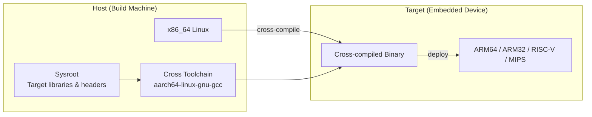

# Cross-Compilation

## Introduction

Cross-compilation is the process of building software on one computing platform (the **host**) to run on a different platform (the **target**). In Embedded Linux development, this is essential because embedded targets (ARM, MIPS, RISC-V) typically lack the resources to compile their own software, and development workstations (x86_64) are far more powerful for building.

Cross-compilation touches every layer of an embedded system: the bootloader, kernel, libraries, and applications. Understanding toolchains, sysroots, and the various configure/cmake integration patterns is critical for efficient embedded development.

## Host vs Target



## Toolchain Components

A cross-compilation toolchain consists of:

| Component | Purpose | Example |
|-----------|---------|---------|
| **Binutils** | Assembler, linker, object tools | `aarch64-linux-gnu-ld`, `aarch64-linux-gnu-as` |
| **Compiler** | C/C++ compiler | `aarch64-linux-gnu-gcc`, `aarch64-linux-gnu-g++` |
| **C Library** | Standard library | glibc, musl, uClibc-ng |
| **Debugger** | Remote debugging | `aarch64-linux-gnu-gdb` |
| **Sysroot** | Target headers and libraries | `/opt/sysroot/usr/include/`, `/opt/sysroot/usr/lib/` |

### Toolchain Naming Convention

```
<arch>-<vendor>-<os>-<libc>-<abi>

Examples:
aarch64-linux-gnu-gcc          # ARM64, Linux, glibc, standard ABI
arm-linux-gnueabihf-gcc        # ARM32, Linux, glibc, hard-float
arm-none-eabi-gcc              # ARM32, bare-metal, no OS (for firmware)
riscv64-linux-gnu-gcc          # RISC-V 64, Linux, glibc
mipsel-linux-gnu-gcc           # MIPS little-endian, Linux, glibc
aarch64-buildroot-linux-gnu-gcc # ARM64, Buildroot-built toolchain
```

## Obtaining Toolchains

### Pre-built Toolchains

```bash
# Linaro toolchains (ARM, well-maintained)
# https://developer.arm.com/tools-and-software/open-source-software/developer-tools/gnu-toolchain/downloads
wget https://developer.arm.com/-/media/Files/downloads/gnu/13.2.rel1/binrel/arm-gnu-toolchain-13.2.rel1-x86_64-aarch64-none-linux-gnu.tar.xz
tar xf arm-gnu-toolchain-*.tar.xz
export PATH=$PWD/arm-gnu-toolchain-*/bin:$PATH

# Verify
aarch64-none-linux-gnu-gcc --version
# aarch64-none-linux-gnu-gcc (Arm GNU Toolchain 13.2.rel1) 13.2.1

# Debian/Ubuntu packages
apt install gcc-aarch64-linux-gnu g++-aarch64-linux-gnu
apt install gcc-arm-linux-gnueabihf g++-arm-linux-gnueabihf
apt install gcc-riscv64-linux-gnu g++-riscv64-linux-gnu

# Verify installation
dpkg -L gcc-aarch64-linux-gnu
# /usr/bin/aarch64-linux-gnu-gcc
# /usr/bin/aarch64-linux-gnu-g++
# /usr/bin/aarch64-linux-gnu-ld
# ...
```

### Building a Toolchain with crosstool-NG

```bash
# crosstool-NG builds custom toolchains
# https://crosstool-ng.github.io/

git clone https://github.com/crosstool-ng/crosstool-ng.git
cd crosstool-ng
./bootstrap && ./configure --prefix=$HOME/ct-ng && make && make install

# Configure toolchain
mkdir ~/ct-build && cd ~/ct-build
ct-ng aarch64-unknown-linux-gnu  # Start with a sample
ct-ng menuconfig
# Options:
#   Operating System → Linux kernel version
#   C library → glibc / musl / uClibc-ng
#   C compiler → GCC version
#   Debug facilities → gdb, strace, ltrace
#   Companion libraries → zlib, expat, etc.

# Build (takes 15-60 minutes)
ct-ng build

# Output in ~/x-tools/aarch64-unknown-linux-gnu/
ls ~/x-tools/aarch64-unknown-linux-gnu/bin/
# aarch64-unknown-linux-gnu-gcc
# aarch64-unknown-linux-gnu-g++
# aarch64-unknown-linux-gnu-ld
# ...
```

### Building with Buildroot

```bash
# Buildroot can build a complete toolchain
make menuconfig
# Toolchain →
#   Toolchain type → Buildroot toolchain
#   C library → musl / glibc / uClibc-ng
#   GCC compiler version → 13.x
#   Enable C++ support
#   Enable Fortran support (if needed)

make toolchain
# Output: output/host/bin/aarch64-linux-gnu-gcc
```

## Sysroot

The sysroot is a directory containing the target system's headers and libraries. It provides the environment that the cross-compiler needs to find target libraries and headers.

```bash
# Typical sysroot structure
/opt/sysroot/
├── etc/
│   └── ld.so.conf
├── lib/
│   ├── libc.so.6
│   ├── libm.so.6
│   ├── libpthread.so.0
│   └── ld-linux-aarch64.so.1
├── usr/
│   ├── include/
│   │   ├── stdio.h
│   │   ├── linux/
│   │   │   ├── kernel.h
│   │   │   └── ...
│   │   └── openssl/
│   │       └── ssl.h
│   ├── lib/
│   │   ├── libssl.so
│   │   ├── libcrypto.so
│   │   └── pkgconfig/
│   └── share/
│       └── pkgconfig/
└── opt/
    └── vendor/
        └── lib/
```

### Using Sysroot with GCC

```bash
# Specify sysroot
aarch64-linux-gnu-gcc --sysroot=/opt/sysroot -o hello hello.c

# The compiler will look for:
# Headers: /opt/sysroot/usr/include/
# Libraries: /opt/sysroot/usr/lib/
# Dynamic linker: /opt/sysroot/lib/ld-linux-aarch64.so.1

# Check default sysroot of toolchain
aarch64-linux-gnu-gcc -print-sysroot
# (empty if no default sysroot configured)

# Set default sysroot when building toolchain
# In crosstool-NG: Paths and misc options → Prefix directory
# In Buildroot: output/host/aarch64-buildroot-linux-gnu/sysroot/
```

### Creating a Sysroot from a Target System

```bash
# Copy libraries and headers from a running target
rsync -avz --include='*.so*' --include='*.h' \
  --exclude='*' \
  target:/usr/lib/ /opt/sysroot/usr/lib/
rsync -avz target:/usr/include/ /opt/sysroot/usr/include/

# Or use the target's root filesystem as sysroot
# (common with Buildroot/Yocto)
export SYSROOT=/path/to/buildroot/output/host/aarch64-buildroot-linux-gnu/sysroot
aarch64-linux-gnu-gcc --sysroot=$SYSROOT -o app app.c
```

## Cross-Compiling Applications

### Simple C Program

```bash
# hello.c
#include <stdio.h>
int main() {
    printf("Hello from ARM64!\n");
    return 0;
}

# Cross-compile
aarch64-linux-gnu-gcc -o hello hello.c -static
# -static links all libraries into the binary (no runtime dependencies)

file hello
# hello: ELF 64-bit LSB executable, ARM aarch64, version 1 (GNU/Linux),
#         statically linked, for GNU/Linux 3.7.0, not stripped

# Dynamic linking (needs sysroot with shared libraries)
aarch64-linux-gnu-gcc -o hello hello.c
# Needs ld-linux-aarch64.so.1 and libc.so.6 at runtime

# Verify dependencies
aarch64-linux-gnu-readelf -d hello | grep NEEDED
# 0x00000001 (NEEDED) Shared library: [libc.so.6]
```

### Autotools Projects

```bash
# Many open-source projects use autotools (./configure && make)

# Create a cross-compilation config file
cat > aarch64-linux-gnu.txt << 'EOF'
[host_machine]
system = 'linux'
cpu_family = 'aarch64'
cpu = 'aarch64'
endian = 'little'

[binaries]
c = 'aarch64-linux-gnu-gcc'
cpp = 'aarch64-linux-gnu-g++'
ar = 'aarch64-linux-gnu-ar'
strip = 'aarch64-linux-gnu-strip'
pkgconfig = 'pkg-config'

[built-in options]
c_args = ['--sysroot=/opt/sysroot']
c_link_args = ['--sysroot=/opt/sysroot']
EOF

# Autotools cross-compilation
./configure \
  --host=aarch64-linux-gnu \
  --build=x86_64-linux-gnu \
  --prefix=/usr \
  --with-sysroot=/opt/sysroot \
  CC=aarch64-linux-gnu-gcc \
  CXX=aarch64-linux-gnu-g++ \
  CFLAGS="--sysroot=/opt/sysroot" \
  LDFLAGS="--sysroot=/opt/sysroot"

make -j$(nproc)
make install DESTDIR=/opt/output
```

### CMake Projects

```bash
# CMake toolchain file
cat > aarch64-toolchain.cmake << 'EOF'
set(CMAKE_SYSTEM_NAME Linux)
set(CMAKE_SYSTEM_PROCESSOR aarch64)

set(CMAKE_SYSROOT /opt/sysroot)
set(CMAKE_STAGING_PREFIX /opt/output/usr)

set(CMAKE_C_COMPILER aarch64-linux-gnu-gcc)
set(CMAKE_CXX_COMPILER aarch64-linux-gnu-g++)

set(CMAKE_FIND_ROOT_PATH /opt/sysroot)
set(CMAKE_FIND_ROOT_PATH_MODE_PROGRAM NEVER)
set(CMAKE_FIND_ROOT_PATH_MODE_LIBRARY ONLY)
set(CMAKE_FIND_ROOT_PATH_MODE_INCLUDE ONLY)
set(CMAKE_FIND_ROOT_PATH_MODE_PACKAGE ONLY)
EOF

# Build with CMake
mkdir build && cd build
cmake -DCMAKE_TOOLCHAIN_FILE=../aarch64-toolchain.cmake ..
make -j$(nproc)
make install DESTDIR=/opt/output
```

### Meson Projects

```bash
# Meson cross file
cat > aarch64-cross.ini << 'EOF'
[host_machine]
system = 'linux'
cpu_family = 'aarch64'
cpu = 'aarch64'
endian = 'little'

[binaries]
c = 'aarch64-linux-gnu-gcc'
cpp = 'aarch64-linux-gnu-g++'
ar = 'aarch64-linux-gnu-ar'
strip = 'aarch64-linux-gnu-strip'
pkgconfig = 'pkg-config'

[built-in options]
c_args = ['--sysroot=/opt/sysroot']
c_link_args = ['--sysroot=/opt/sysroot']

[properties]
sys_root = '/opt/sysroot'
pkg_config_libdir = '/opt/sysroot/usr/lib/pkgconfig'
EOF

# Build with Meson
meson setup --cross-file aarch64-cross.ini builddir/
meson compile -C builddir/
meson install -C builddir/ --destdir=/opt/output
```

### pkg-config Integration

```bash
# pkg-config needs to find target .pc files, not host ones
export PKG_CONFIG_PATH=/opt/sysroot/usr/lib/pkgconfig:/opt/sysroot/usr/share/pkgconfig
export PKG_CONFIG_SYSROOT_DIR=/opt/sysroot
export PKG_CONFIG_LIBDIR=/opt/sysroot/usr/lib/pkgconfig

# Or use a wrapper script
cat > /usr/local/bin/aarch64-pkg-config << 'EOF'
#!/bin/bash
export PKG_CONFIG_PATH=/opt/sysroot/usr/lib/pkgconfig
export PKG_CONFIG_SYSROOT_DIR=/opt/sysroot
exec pkg-config "$@"
EOF
chmod +x /usr/local/bin/aarch64-pkg-config
```

## Cross-Compiling the Linux Kernel

```bash
# Download kernel source
git clone --depth=1 https://git.kernel.org/pub/scm/linux/kernel/git/stable/linux.git
cd linux

# Configure for target
# Use a defconfig as starting point
make ARCH=arm64 CROSS_COMPILE=aarch64-linux-gnu- defconfig

# Customize
make ARCH=arm64 CROSS_COMPILE=aarch64-linux-gnu- menuconfig

# Build kernel image
make ARCH=arm64 CROSS_COMPILE=aarch64-linux-gnu- Image -j$(nproc)
# Output: arch/arm64/boot/Image

# Build compressed image (ARM)
make ARCH=arm64 CROSS_COMPILE=aarch64-linux-gnu- Image.gz -j$(nproc)

# Build device tree blobs
make ARCH=arm64 CROSS_COMPILE=aarch64-linux-gnu- dtbs -j$(nproc)

# Build kernel modules
make ARCH=arm64 CROSS_COMPILE=aarch64-linux-gnu- modules -j$(nproc)

# Install modules to sysroot
make ARCH=arm64 CROSS_COMPILE=aarch64-linux-gnu- \
  INSTALL_MOD_PATH=/opt/output modules_install
```

See [U-Boot](./uboot.md) for kernel booting and [Device Tree](./device-tree.md) for hardware description.

## Cross-Compiling U-Boot

```bash
# Download U-Boot source
git clone https://source.denx.de/u-boot/u-boot.git
cd u-boot

# Configure for target board
make CROSS_COMPILE=aarch64-linux-gnu- rpi_4_defconfig

# Customize
make CROSS_COMPILE=aarch64-linux-gnu- menuconfig

# Build
make CROSS_COMPILE=aarch64-linux-gnu- -j$(nproc)
# Output: u-boot.bin, u-boot.img, u-boot.srec
```

## Cross-Compiling with Docker

Container-based cross-compilation provides reproducible build environments:

```dockerfile
# Dockerfile for ARM64 cross-compilation
FROM ubuntu:22.04

RUN apt-get update && apt-get install -y \
    gcc-aarch64-linux-gnu \
    g++-aarch64-linux-gnu \
    cmake \
    make \
    pkg-config \
    git \
    && rm -rf /var/lib/apt/lists/*

ENV CROSS_COMPILE=aarch64-linux-gnu-
ENV CC=aarch64-linux-gnu-gcc
ENV CXX=aarch64-linux-gnu-g++
ENV SYSROOT=/opt/sysroot

# Mount sysroot at runtime
cmd ["bash"]
```

```bash
# Build the Docker image
docker build -t cross-arm64 .

# Run cross-compilation in container
docker run --rm -v $(pwd):/src -v /opt/sysroot:/opt/sysroot \
    cross-arm64 \
    bash -c "cd /src && cmake -DCMAKE_TOOLCHAIN_FILE=aarch64-toolchain.cmake . && make -j$(nproc)"

# Or use buildx for multi-arch builds (Go, Rust)
docker buildx build --platform linux/arm64 -t myapp:arm64 .
```

## Cross-Compilation for Other Languages

### Go Cross-Compilation

Go has built-in cross-compilation support — no toolchain setup needed:

```bash
# Set target architecture
export GOARCH=arm64
export GOOS=linux

# Build
go build -o myapp-arm64 ./cmd/myapp

# For ARM32
export GOARCH=arm
export GOARM=7  # ARMv7

# For RISC-V
export GOARCH=riscv64

# For MIPS
export GOARCH=mips
export GOMIPS=softfloat  # or hardfloat

# Build all architectures at once
gox -os="linux" -arch="amd64 arm64 arm mips64le riscv64" ./cmd/myapp
```

### Rust Cross-Compilation

```bash
# Add target
rustup target add aarch64-unknown-linux-gnu
rustup target add armv7-unknown-linux-gnueabihf
rustup target add riscv64gc-unknown-linux-gnu

# Build
cargo build --target aarch64-unknown-linux-gnu --release

# With custom linker (in .cargo/config.toml)
# [target.aarch64-unknown-linux-gnu]
# linker = "aarch64-linux-gnu-gcc"

# Cross-compile with cargo-cross (easier)
cargo install cross
cross build --target aarch64-unknown-linux-gnu --release
```

### Python Cross-Compilation

Python itself is usually compiled for the target, not cross-compiled:

```bash
# Cross-compile C extensions only
python3 setup.py build_ext --inplace \
    --include-dirs=/opt/sysroot/usr/include \
    --library-dirs=/opt/sysroot/usr/lib

# Or use QEMU for full builds
qemu-aarch64 -L /opt/sysroot /opt/sysroot/usr/bin/python3 setup.py build
```

## Common Cross-Compilation Issues

### Library Not Found

```bash
# Error: /usr/bin/ld: cannot find -lssl
# Solution: Ensure library is in sysroot
ls /opt/sysroot/usr/lib/libssl*
# If missing, cross-compile the library first

# Cross-compile OpenSSL
cd openssl
./Configure linux-aarch64 \
  --prefix=/opt/sysroot/usr \
  --openssldir=/opt/sysroot/usr/ssl \
  --cross-compile-prefix=aarch64-linux-gnu-
make -j$(nproc)
make install DESTDIR=/opt/sysroot
```

### Wrong Headers

```bash
# Error: fatal error: linux/spi/spidev.h: No such file or directory
# Solution: Install kernel headers in sysroot

cd linux
make ARCH=arm64 CROSS_COMPILE=aarch64-linux-gnu- \
  INSTALL_HDR_PATH=/opt/sysroot/usr headers_install
```

### Endianness Issues

```bash
# Cross-compiling for big-endian ARM
aarch64_be-linux-gnu-gcc -o hello hello.c
# Verify
file hello
# hello: ELF 64-bit MSB executable, ARM aarch64...

# QEMU testing
qemu-aarch64_be ./hello
```

### Linker Script Issues

```bash
# Some projects have hardcoded paths
# Solution: Use sed to fix paths or set environment variables
export CC="aarch64-linux-gnu-gcc --sysroot=/opt/sysroot"
export LD="aarch64-linux-gnu-ld --sysroot=/opt/sysroot"
```

## Distributed Cross-Compilation

```bash
# distcc — distributed compilation
# Install distcc on build nodes
apt install distcc

# Set up distcc
export DISTCC_HOSTS="localhost/4 buildserver1/8 buildserver2/8"
export CC="distcc aarch64-linux-gnu-gcc"

# Use with make
make -j32 CC="distcc aarch64-linux-gnu-gcc"

# IceCream (openSUSE build system)
# Similar concept with automatic load balancing
```

## Sysroot Management Strategies

### Creating a Sysroot with debootstrap

```bash
# Create minimal Debian sysroot for ARM64
debootstrap --arch=arm64 --foreign \
    --include=build-essential,libssl-dev,libcurl4-openssl-dev \
    sid /opt/sysroot-arm64 https://deb.debian.org/debian

# Complete second stage (requires QEMU)
qemu-aarch64-static -L /opt/sysroot-arm64 \
    /opt/sysroot-arm64/debootstrap/debootstrap --second-stage

# Or use schroot for chroot-based builds
apt install schroot debootstrap
# Create schroot config
# /etc/schroot/chroot.d/arm64.conf:
# [arm64]
# description=ARM64 sysroot
# type=directory
# directory=/opt/sysroot-arm64
# personality=linux
# arch=arm64
```

### Sysroot with Multilib Support

```bash
# Some projects need both 32-bit and 64-bit libraries
# Create multilib sysroot
mkdir -p /opt/sysroot/{lib,lib64,usr/lib,usr/lib64}

# Copy 64-bit libraries
rsync -av target:/lib/aarch64-linux-gnu/ /opt/sysroot/lib/
rsync -av target:/usr/lib/aarch64-linux-gnu/ /opt/sysroot/usr/lib/

# Copy 32-bit libraries (if needed)
rsync -av target:/lib/arm-linux-gnueabihf/ /opt/sysroot/lib/
rsync -av target:/usr/lib/arm-linux-gnueabihf/ /opt/sysroot/usr/lib/
```

## Common Cross-Compilation Pitfalls

### Autotools Host vs Build Confusion

```bash
# WRONG: --host specifies the BUILD machine
./configure --host=x86_64-linux-gnu  # This builds for x86_64!

# RIGHT: --host specifies the TARGET machine
./configure --host=aarch64-linux-gnu  # Cross-compiles for ARM64

# The triplet convention:
# --build=<machine doing the building>  (auto-detected)
# --host=<machine the binary runs on>   (set for cross-compilation)
# --target=<machine the compiler targets> (only for Canadian crosses)
```

### CMake FindPackage Failures

```bash
# Problem: CMake finds host libraries instead of target
# Solution: Set CMAKE_FIND_ROOT_PATH and mode variables

# In toolchain file:
set(CMAKE_FIND_ROOT_PATH /opt/sysroot)
set(CMAKE_FIND_ROOT_PATH_MODE_PROGRAM NEVER)  # Find programs on host
set(CMAKE_FIND_ROOT_PATH_MODE_LIBRARY ONLY)    # Find libs in sysroot
set(CMAKE_FIND_ROOT_PATH_MODE_INCLUDE ONLY)    # Find headers in sysroot
set(CMAKE_FIND_ROOT_PATH_MODE_PACKAGE ONLY)    # Find packages in sysroot
```

### pkg-config Finding Host Libraries

```bash
# Problem: pkg-config uses host /usr/lib/pkgconfig
# Solution: Override PKG_CONFIG_LIBDIR (not PKG_CONFIG_PATH!)

export PKG_CONFIG_LIBDIR=/opt/sysroot/usr/lib/pkgconfig
export PKG_CONFIG_SYSROOT_DIR=/opt/sysroot

# Difference:
# PKG_CONFIG_PATH: prepends to default search path (still finds host)
# PKG_CONFIG_LIBDIR: replaces default search path (only finds sysroot)
```

### Hardcoded Paths in Build Scripts

```bash
# Problem: Scripts use /usr/lib, /usr/include directly
# Solution: Use sed to fix, or set environment variables

export CFLAGS="--sysroot=/opt/sysroot -I/opt/sysroot/usr/include"
export LDFLAGS="--sysroot=/opt/sysroot -L/opt/sysroot/usr/lib"
export CPPFLAGS="-I/opt/sysroot/usr/include"

# Or patch the build system:
sed -i 's|/usr/lib|/opt/sysroot/usr/lib|g' Makefile
```

## Testing Cross-Compiled Binaries

```bash
# 1. QEMU user-mode emulation
qemu-aarch64 -L /opt/sysroot ./hello
# Or register binfmt_misc for transparent execution

# 2. QEMU system emulation
qemu-system-aarch64 -machine virt -cpu cortex-a72 -m 1024 \
  -kernel Image -dtb virt.dtb \
  -drive file=rootfs.ext4,if=virtio \
  -append "root=/dev/vda console=ttyAMA0" \
  -nographic

# 3. Deploy to target hardware
scp hello target:/tmp/
ssh target /tmp/hello

# 4. Run with strace (on target)
strace ./hello
```

## References

1. GCC Cross-Compiler Documentation. [https://gcc.gnu.org/onlinedocs/gccint/Cross_002dCompilation.html](https://gcc.gnu.org/onlinedocs/gccint/Cross_002dCompilation.html)
2. crosstool-NG Documentation. [https://crosstool-ng.github.io/docs/](https://crosstool-ng.github.io/docs/)
3. Bootlin Toolchains. [https://toolchains.bootlin.com/](https://toolchains.bootlin.com/)
4. Yocto Project SDK Manual. [https://docs.yoctoproject.org/sdk-manual/](https://docs.yoctoproject.org/sdk-manual/)

## Further Reading

- [The Linux Kernel Documentation](https://docs.kernel.org/)
- [LWN.net - Linux and free software news](https://lwn.net/)
- [GNU Project Documentation](https://www.gnu.org/doc/doc.html)
- [GNU Manuals](https://www.gnu.org/manual/manual.html)
- [Free Software Directory](https://directory.fsf.org/wiki/Main_Page)
- [Planet GNU](https://planet.gnu.org/)
- [Free Software Books](https://www.gnu.org/doc/other-free-books.html)

- [crosstool-NG](https://crosstool-ng.github.io/)
- [Bootlin Pre-built Toolchains](https://toolchains.bootlin.com/)
- [ARM GNU Toolchain Downloads](https://developer.arm.com/tools-and-software/open-source-software/developer-tools/gnu-toolchain/downloads)
- [Buildroot Cross-Compilation](https://buildroot.org/downloads/manual/manual.html#_cross_compilation_toolchain)
- [Meson Cross Compilation](https://mesonbuild.com/Cross-compilation.html)

## Related Topics

- [Embedded Linux Overview](./overview.md) — Embedded Linux fundamentals
- [U-Boot](./uboot.md) — Bootloader cross-compilation
- [Device Tree](./device-tree.md) — Hardware description
- [ARM Architecture](./arm.md) — ARM-specific details
