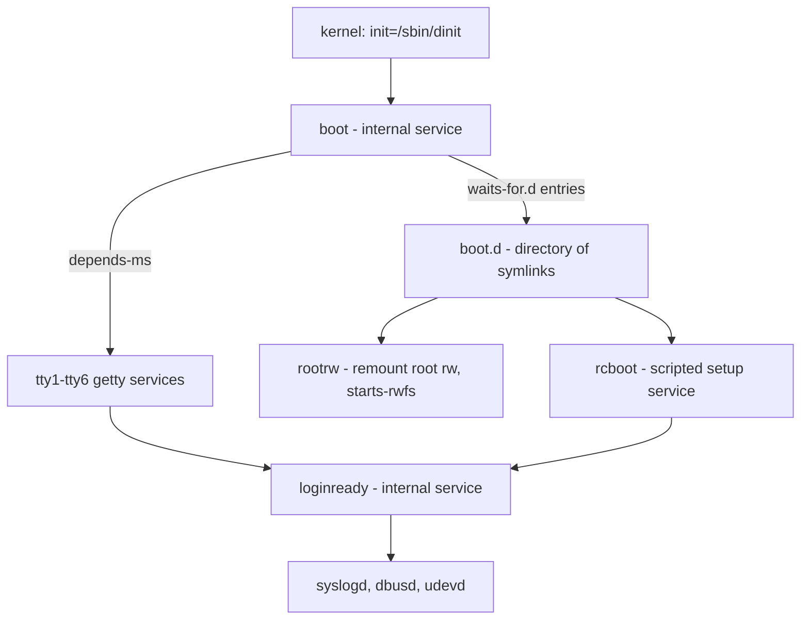

# dinit Configuration — Environment, Directories, and Enablement

## Overview

Configuring dinit means configuring a remarkably small surface: one binary (`dinit`), a set of plain-text service description files, and one environment file. There is no separate daemon configuration file — behavior is fixed entirely by command-line options — no generated unit cache, and no compiled-in distribution policy. The option table and FILES section of [dinit(8)](https://github.com/davmac314/dinit/blob/master/doc/manpages/dinit.8.m4) are, to a first approximation, the whole configuration contract; everything beyond them is convention layered on top by distributions built around dinit, such as [Chimera Linux](https://chimera-linux.org/).

Those artifacts form four configuration layers, each answering a different question. The **invocation** — the kernel command line, or whatever script `exec`s dinit — decides the daemon's role and where it finds things: service description directories (`-d`), the environment file (`-e`), the control socket (`-p`), and the initial service to start. The **environment file** (default `/etc/dinit/environment` for the system instance) seeds the process environment inherited by everything dinit starts. The **service description directories** define which services exist and what each one does. The **`waits-for.d` symlink directories** record persistent enablement — which of those services the boot chain pulls up, session after session. A per-service refinement of the environment layer, the `env-file` description property, completes the map.

This page is the operator handbook for those layers: running dinit as PID 1, the environment-file grammar, directory layout and override semantics, persistent enablement with `dinitctl enable`/`disable`, the `boot` service and the boot chain, user instances, and worked recipes. It deliberately does not re-teach its companions: the description-file grammar — including `env-file`, the `waits-for.d`/`depends-on.d`/`depends-ms.d` directory forms, and variable substitution — lives in [dinit Service Descriptions](./service-descriptions.md), while the `dinitctl` verb reference, boot walk-through, shutdown mechanics, and debugging loops live in [dinit in Operation](./operations.md).

## The Configuration Map

| Layer | Where | What it controls |
|---|---|---|
| Daemon invocation | kernel command line (`init=`), a `/sbin/init` link, or a direct `exec` | Role (`-m`/`-s`/`-u`/`-o`), search paths (`-d`, `-e`, `-p`, `-l`), initial service(s), recovery behavior (`-r`) |
| Environment file | `/etc/dinit/environment` (system default; `-e` overrides; no default for user instances) | The "original environment" — the base process environment inherited by everything dinit starts |
| Service description directories | `/etc/dinit.d`, `/run/dinit.d`, `/usr/local/lib/dinit.d`, `/lib/dinit.d` (system instance; user list below) | Which services exist and their full definitions (grammar in [dinit Service Descriptions](./service-descriptions.md)) |
| `waits-for.d` symlink directories | the directory named by the `waits-for.d` directive in the dependent's description — `boot.d` beside the `boot` description | Persistent enablement: which services the boot chain (or another anchor) pulls up at every start |
| Per-service env file | the `env-file` property of one description | Environment additions scoped to a single service (pointer in the grammar page) |

Only the first four layers are dinit-native infrastructure; the roles sketched in the third column are conventions the paths invite, not mandates. The rest of this page takes each layer in turn.

## Running dinit as PID 1

The kernel starts whatever `init=` names (default `/sbin/init`). The [Dinit-as-init guide](https://github.com/davmac314/dinit/blob/master/doc/linux/DINIT-AS-INIT.md) prescribes a deliberately reversible path: test first by appending `init=/sbin/dinit` to the kernel command line, then, once the service descriptions are proven, replace `/sbin/init` with a link to the `dinit` executable. It warns that on an initrd/initramfs-based system support for `init=...` depends on the ramdisk's own setup — it may or may not honor the option, and it may or may not pass options such as `single` through to dinit.

When dinit *is* process 1, its role is fixed by the man page's own wording: "When run as PID 1, the first process, Dinit by default acts as a system manager and shuts down or reboots the system on request (including on receipt of certain signals). This is currently fully supported only on Linux." The role options, following [dinit(8)](https://github.com/davmac314/dinit/blob/master/doc/manpages/dinit.8.m4) closely:

| Option | Man-page semantics |
|---|---|
| `-s`, `--system` | Run as the system service manager; the default if invoked as the root user. Affects the default description directory and control socket path. |
| `-m`, `--system-mgr` | Run as the system manager; the default when running as process ID 1. Invokes the shutdown program when a shutdown is requested (and after all services have stopped), and provides basic recovery support if the `boot` service (or other specified service) cannot be started. |
| `-u`, `--user` | Run as a user service manager; the default if not invoked as the root user. |
| `-o`, `--container` | Run in "container mode": do not perform system management functions (such as shutdown/reboot). The daemon simply exits rather than executing the shutdown program. |

The boot-relevant `dinit` options:

| Option | Effect at boot |
|---|---|
| `-d dir`, `--services-dir dir` | Service description directory (repeatable). Specifying it means the default directories are **not** searched at all. |
| `-e file`, `--env-file file` | Read the initial environment from `file`; for the system init the default is `/etc/dinit/environment`. |
| `-p path`, `--socket-path path` | Control socket path. System service manager default: `/dev/dinitctl` (build-time configurable); user default: `$XDG_RUNTIME_DIR/dinitctl`, or `$HOME/.dinitctl` when `$XDG_RUNTIME_DIR` is unset. |
| `-F fd`, `--ready-fd fd` | Write the control socket path to the given fd once the manager is ready to accept commands — services may not yet have finished starting when readiness is signalled. |
| `-l path`, `--log-file path` | Log to a file instead of syslog. As system init, dinit continues (and retries later) if the file cannot be opened while root is still read-only; otherwise it exits with an error. |
| `-r`, `--auto-recovery` | Run the `recovery` service automatically on apparent boot failure, without prompting — for headless machines. |
| `-q`, `--quiet`; `--console-level`, `--log-level` | Console and log-facility noise control. |
| `-t name`, `--service name` | The initial service(s) to start; default `boot`. |

The kernel command line itself needs care. Per the COMMAND LINE FROM KERNEL section: unrecognized "word like" options reach dinit from the kernel, so dinit **ignores all word-like options except `single`**, which it treats as the name of the service to start (single-user mode, assuming a suitable description exists); options beginning with `--` are not recognized by the kernel and are passed to and processed by dinit (for example `--quiet`); options containing `=` that the kernel does not recognize are passed via the environment rather than the command line. Two workarounds matter in practice: service names following `-o` or `-m` are not ignored, and `-t`/`--service` forces a service name to be recognized regardless of mode — relevant because a PID 1, UID 0 dinit may ignore "naked" service names on its command line.

The initramfs handoff, per the guide: the initial RAM filesystem runs a small custom init (not dinit) that loads modules, mounts the essential pseudo-filesystems — `/proc`, `/sys`, `/dev` (devtmpfs or populated tmpfs), and `/run` (tmpfs) — finds and mounts the root filesystem read-only, switches root, and execs `/sbin/init` (dinit). The writable `/run` is singled out: it lets the control socket be created the moment dinit starts, "which is useful especially for boot recovery in case the system becomes otherwise unbootable". A from-scratch distribution such as [Chimera Linux](https://chimera-linux.org/) owns that whole handoff chain end to end; on a distribution-derived system the guide's warning stands — you may need to adjust the ramdisk image, or boot without one, for `init=` and option pass-through to behave.

## The Environment File

For the system instance, dinit reads `/etc/dinit/environment` at startup (`-e` overrides the location; a user instance has **no default** environment file, but accepts `-e` the same way). The grammar, from the FILES section of dinit(8):

- Values are `NAME=VALUE`, one per line; they "add to and replace variables present in the environment when dinit started" — that starting environment is what the man page calls the **original environment**.
- Lines beginning with `#` are ignored.
- Three special directives, each on a single line:

| Directive | Exact semantics |
|---|---|
| `!clear` | Clears the environment completely — prevents inheritance of any variable from the original environment. |
| `!unset NAME...` | Unsets the named variables; any previously specified value is forgotten, and they will not inherit from the original environment. |
| `!import NAME...` | Imports the named variables' values *from the original environment*, overriding any value set previously and the effect of any earlier `!unset` or `!clear`. |

Worked example:

```text
# /etc/dinit/environment
PATH=/usr/local/sbin:/usr/local/bin:/usr/sbin:/usr/bin:/sbin:/bin
LC_ALL=C.UTF-8

# Bootloaders leak variables to init through the kernel's environment
# pass-through (see COMMAND LINE FROM KERNEL); drop them:
!unset BOOT_IMAGE

# ...but take time zone and home from whatever the boot environment had:
!import TZ HOME

# To inherit nothing at all and build up from blank, uncomment:
# !clear
```

Why a daemon-level file at all, versus the per-service `env-file` property (grammar in [dinit Service Descriptions](./service-descriptions.md))? Scope and inheritance: `/etc/dinit/environment` becomes dinit's *own* process environment, so (a) every service dinit starts inherits it, and (b) it is the fallback source for `$VAR` substitution inside description files — the substitution precedence is service `env-file`, then load-option exports (`export-passwd-vars`, `export-service-name`), then dinit's process environment, with substitution applied at load time (rules in [dinit Service Descriptions](./service-descriptions.md)). A per-service `env-file` touches one service only.

Timing is load time in both cases: the environment file seeds the *initial* environment when the daemon starts, and there is no documented runtime re-read. For runtime changes use `dinitctl setenv`/`unsetenv`, which modify the activation environment seen by subsequently started or restarted services — see [dinit in Operation](./operations.md).

## Organizing Service Descriptions

The FILES section fixes the search order — "The directories are searched in the order listed":

| # | System instance | User instance |
|---|---|---|
| 1 | `/etc/dinit.d` | `$XDG_CONFIG_HOME/dinit.d` |
| 2 | `/run/dinit.d` | `$HOME/.config/dinit.d` |
| 3 | `/usr/local/lib/dinit.d` | `/etc/dinit.d/user` |
| 4 | `/lib/dinit.d` | `/usr/lib/dinit.d/user` |
| 5 | — | `/usr/local/lib/dinit.d/user` |

Reading the layout as layering (convention, not man-page mandate):

- **`/etc/dinit.d` — the administrator's.** First in the system search order; the place for locally written descriptions and for overriding packaged ones.
- **`/run/dinit.d` — runtime-generated.** Second in order; `/run` is RAM-backed (the DINIT-AS-INIT guide lists it among the tmpfs mounts), so contents vanish at reboot. Anything there must be recreated each boot by your own tooling — dinit ships no generator mechanism.
- **`/usr/local/lib/dinit.d` and `/lib/dinit.d` — software.** Locally built software and packaged system services, respectively. Note the asymmetry implied by the man page's list: there is no `/usr/lib/dinit.d` for the system instance — packaged *user* services go to `/usr/lib/dinit.d/user`, where `/etc/dinit.d/user` (admin-provided user services) precedes them in the user search order.
- **User-side:** both `$XDG_CONFIG_HOME/dinit.d` and `$HOME/.config/dinit.d` are in the list, so a user's descriptions are found whether or not `XDG_CONFIG_HOME` is set.

Override pattern: the man page commits only to the order above; the consequence the layout is built for is that a service name resolves against the earlier directories first, so a description in `/etc/dinit.d` shadows a same-named one in the packaged directories. Keep one definition per name per layer unless you are deliberately overriding.

Two operational footnotes. First, `-d`/`--services-dir` *replaces* rather than extends: "the default directories will not be searched when the `-d`/`--services-dir` option is specified" — list every directory you want. Second, loading is lazy: descriptions are read as needed and never automatically unloaded; `dinitctl unload`/`reload` handle the explicit cases, with documented limits (see [dinit in Operation](./operations.md)).

## Persistent Enablement: waits-for.d, enable and disable

The mechanism, per [dinitctl(8)](https://github.com/davmac314/dinit/blob/master/doc/manpages/dinitctl.8.m4). `dinitctl enable to-service` "persistently enable[s] a waits-for dependency between two services": like `add-dep waits-for`, it wires the dependency into the running graph — and, if the dependent is started, starts the dependency immediately *without* explicit activation — but it also **creates a symbolic link in the directory named by the `waits-for.d` directive of the dependent's description** (the description must contain exactly one such directive) "so that the dependency will survive between sessions". The symlink points at the enabled service's description file; on the next start, the entry names in that directory become the waits-for dependencies (directory-form grammar: [dinit Service Descriptions](./service-descriptions.md)).

Anchor selection: without `--from from-service`, the dependency is created from the service named by a `@meta enable-via` directive in the description, or from the `boot` service by default. On the standard layout that means `dinitctl enable foo` gives `boot` a waits-for dependency on `foo` and drops a symlink to foo's description into the `boot.d` directory beside the `boot` description — exactly the packaging story the DINIT-AS-INIT guide tells for its example set: the `boot.d` directory "simplifies enabling services for the package manager, and enables the use of `dinitctl enable` and `dinitctl disable`".

```sh
$ dinitctl enable mydaemon
Service 'mydaemon' has been enabled.
$ dinitctl list
[[+]     ] boot
[{+}     ] mydaemon (pid: 49921)
```

Note the `[{+}]`: curly brackets mean the service is running *only as a dependency*, not explicitly activated — if `boot` stops, `mydaemon` stops with it (list-output anatomy: [dinit in Operation](./operations.md)).

`disable` is the complement — it removes that symlink and the dependency. The man page's caution is the interview-grade gotcha: "the disable command affects only the dependency specified (or implied). It has no other effect, and a service that is 'disabled' may still be started if it is a dependency of another started service." Disable is also not a stop command: a running instance keeps running until you `dinitctl stop` it.

Flags for scripts and non-live use:

| Flag | Behavior |
|---|---|
| `--offline`, `-o` | Work without communicating with the daemon; applicable **only** to `enable`/`disable` — the mode for package scripts in chroots or images where no dinit is running. |
| `-d dir`, `--services-dir dir` | Where to find descriptions in offline mode; ignored unless `--offline` is given (live mode queries the daemon for its directories). |
| `--no-wait` | Do not wait for the command to complete; return immediately. |
| `--quiet` | Suppress status output except errors. |

Side by side:

| System | Command | Persisted artifact | Relationship created |
|---|---|---|---|
| systemd | `systemctl enable foo` | symlink in a target unit's `.wants/`-style directory | `Wants=` from the target (ordering only with `After=`) — [Unit Files](../systemd/unit-files.md) |
| SysVinit | `update-rc.d foo defaults` | `S`/`K` symlinks in `/etc/rcN.d/` | runlevel start/stop membership — [rc symlinks](../sysvinit/rc-symlinks.md) |
| OpenRC | `rc-update add foo default` | symlink in `/etc/runlevels/<runlevel>/` | runlevel membership — [Runlevels and Services](../openrc/runlevels-services.md) |
| dinit | `dinitctl enable foo` | symlink in the anchor's `waits-for.d` directory (`boot.d`) | `waits-for` from `boot` (or a `--from`/`enable-via` anchor) |

The dinit row is the odd one out in a useful way: because the persisted relationship is a first-class waits-for dependency of a real service, enablement participates in the same graph semantics as any other dependency — ordered, parallel start, and (waits-for being soft) no failure coupling.

## The boot Service and the Boot Chain

`boot` is one of two special service names in dinit(8): "the service that dinit starts by default, if no other service names are provided" (the other is `recovery`, offered when boot appears to fail). The DINIT-AS-INIT example set shows the canonical shape:

- `boot` is `type = internal` — pure graph state, no process.
- "Its dependencies are mostly listed in the `boot.d` directory. However, the ttyX services are directly listed as *depends-ms* type dependencies in the service description file."
- Why both forms: `boot.d` is the enable/disable surface — symlinks managed by `dinitctl enable`/`disable` and by package installation — while the essential console path is hard-wired as milestone dependencies so it cannot be unlinked by accident.

The guide's doctrine for what hangs off `boot`: essential services should be hard (`depends-on:`/`depends-ms:`) dependencies — "when this is the case, failure of an essential service will be properly observed as a boot failure by dinit (and will invoke recovery handling, providing the operator with several options including to launch the `recovery` service)". For everything else, wrap the common prerequisites (writable filesystem, pseudo-filesystems, system time, syslog) in one `type = internal` service and depend on that; prefer `depends-on:` over `waits-for:`/`after:` for real requirements, because soft ordering lets dinit attempt a start whose prerequisite failed — error noise instead of a clean boot failure.

The work the chain encodes (the guide's "basic procedure for boot"): mount early virtual filesystems if the initramfs did not; start the device node manager; set system time from the hardware clock; run the root filesystem check; remount root read-write; miscellaneous setup (seed the random number generator, configure the loopback interface, clean `/tmp`, `/var/run`, `/var/lock`); start syslog; start other daemons; start getty instances. Mapped onto the example descriptions:



(The service-by-service walk, with each description explained, is in [dinit in Operation](./operations.md).)

**Getty services.** Each `ttyX` service starts a login prompt on its virtual terminal and depends on `loginready` — the internal consolidation point that depends on `rcboot`, `dbusd`, `udevd`, and `syslogd`, and holds `runs-on-console` so dinit stops writing status messages to the console once logins are possible. The tty services deliberately do *not* set `runs-on-console`: only one service may hold the console, and the conflict would prevent them from running at all. The guide's debugging variant turns a tty into an always-available shell:

```text
command = /sbin/agetty tty6 linux-c -n -l /bin/bash
term-signal = none
stop-timeout = 0
```

with most dependencies removed so it starts early; the signal and timeout settings keep it alive through shutdown until you exit it manually — a boot-debugging tool, not a permanent configuration.

**rc scripts.** Dinit defines no rc-script convention of its own — the documentation expresses classic rc work as ordinary `scripted` services. In the example set that is `rcboot`, running `rcboot.sh`: clean `/tmp`, `/var/lock`, and `/var/run`; create directories needed under `/var/run`; invoke `seedrng` to seed the random devices; configure the loopback interface; set the hostname — with the stop action saving entropy for the next boot.

**Shutdown path.** `dinitctl shutdown` against the system instance stops all services (without restarts) and terminates dinit — shutting the machine down; as system manager, dinit then executes the external shutdown program (the `-m`/`--system-mgr` behavior). Scripted shutdown tasks are ordinary services carrying `kill-all-on-stop` (semantics in [dinit Service Descriptions](./service-descriptions.md)); the full sequence, signals included, is in [dinit in Operation](./operations.md).

## User Instances

Run `dinit` as a regular user (or pass `-u`/`--user` explicitly — user mode is the default when not invoked as root) and the same binary becomes a per-user service manager with user paths everywhere:

| Aspect | User instance |
|---|---|
| Description directories | `$XDG_CONFIG_HOME/dinit.d`, `$HOME/.config/dinit.d`, then `/etc/dinit.d/user`, `/usr/lib/dinit.d/user`, `/usr/local/lib/dinit.d/user` (searched in that order) |
| Control socket | `$XDG_RUNTIME_DIR/dinitctl`, or `$HOME/.dinitctl` when `$XDG_RUNTIME_DIR` is unset (per the `-p` documentation) |
| Environment file | **No default** — "for user instances there is no default" — but `-e file` works exactly as for the system instance |
| Initial service | `boot`, by default — the same convention as the system instance |

Starting one is the [getting-started walkthrough](https://github.com/davmac314/dinit/blob/master/doc/getting_started.md) in miniature:

```sh
mkdir -p ~/.config/dinit.d/boot.d
cat > ~/.config/dinit.d/boot <<'EOF'
type = internal
waits-for.d: boot.d
EOF
dinit -q &                 # background user instance
dinitctl enable mpd        # start now AND persist across manager restarts
```

The persistence mechanism is the same one the system instance uses: `enable` writes the symlink into `boot.d`, and a restart of the user manager starts `mpd` again through it. Typical user services are personal daemons — the guide's example is `mpd` (`type = process`, `command = /usr/local/sbin/mpd --no-daemon`, `restart = true`), with SSH tunnels named as the ad-hoc counterpart. Session data reaches services through the activation environment: `dinitctl setenv`, which dinitctl(8) flags as "particularly useful for user services that need access to session information". The documentation stops at that mechanism; it does not prescribe a full desktop-session service stack. The operational walkthrough — lifecycle, environment handling, the `[STOPPD]`/`[ OK ]` supervision demo — is in [dinit in Operation](./operations.md), User-Mode Manager.

## Configuration Recipes

### 1. Make a service boot-enabled, end to end

```text
# /etc/dinit.d/mydaemon
type = process
command = /usr/sbin/mydaemon --foreground
restart = on-failure
depends-on: rcboot      # standard prerequisites arrive transitively
```

```sh
dinitctl enable mydaemon     # symlink appears in boot.d; starts now, un-activated
dinitctl list                # [{+}     ] mydaemon (pid: ...)
dinitctl status mydaemon     # state, PID, and the stop reason if it ever fails
```

Validate the description statically with dinit-check(8) before rebooting into it, and confirm the symlink with a directory listing of `boot.d`.

### 2. Give one service extra environment

```text
# /etc/dinit.d/conf/mydaemon.env
MYDAEMON_THREADS=8
MYDAEMON_LOGLEVEL=info
```

```text
# add to /etc/dinit.d/mydaemon:
env-file = /etc/dinit.d/conf/mydaemon.env
```

```sh
dinitctl reload mydaemon     # re-reads the description (limits apply)
dinitctl restart mydaemon    # the dependable way to apply new env-file values
```

The file's values are also usable in `$VAR` substitution inside that description. For a temporary, runtime-only change without editing files: `dinitctl setenv MYDAEMON_LOGLEVEL=debug` — it affects subsequently started or restarted services ([dinit in Operation](./operations.md)).

### 3. Run dinit in a container

```sh
dinit -o -d /etc/dinit.d sshd
```

`-o`/`--container` matters because a container runtime typically starts dinit as PID 1, and PID 1 defaults to system-manager duties (`-m`) — a shutdown request would end in invoking the external shutdown program. Container mode instead performs no system management: on shutdown request the daemon "will simply exit rather than executing the shutdown program". The explicit service name after `-o` doubles as the workaround for the PID 1 naked-name filtering described above.

### 4. Add an extra service directory at boot

```text
# kernel command line:
root=UUID=... ro init=/sbin/dinit --services-dir /etc/dinit.d --services-dir /srv/local.d
```

Remember the replacement rule: the defaults are not searched once `--services-dir` appears — hence both directories are listed. For arbitrary arguments the guide's endorsed tool is a wrapper script: "You can pass arbitrary arguments to dinit by using a shell script in the place of /sbin/init, which should exec dinit (so as to give it the same PID)" — keep the shebang and the executable bit.

```sh
#!/bin/sh
exec /sbin/dinit --services-dir /etc/dinit.d --services-dir /srv/local.d "$@"
```

### 5. Disable a boot-chain member — and see what still starts

```sh
dinitctl disable sshd     # removes boot -> waits-for -> sshd and the boot.d symlink
dinitctl list             # a running instance is NOT stopped by disable
dinitctl stop sshd        # bring it down now (refuses if non-soft dependents would stop)
```

What can still start a "disabled" service: a hard `depends-on:` from another description, a second enablement anchored elsewhere (`--from`), or an explicit `dinitctl start`. Diagnose with `dinitctl status sshd` and `dinitctl list` — the `[{+}]` marker shows dependency-driven running — and remove a live dependency without editing files with `dinitctl rm-dep waits-for boot sshd`.

### 6. Per-service logging to a file

One property plus one dependency caveat: set `logfile = /var/log/mydaemon.log` (specifying `logfile` alone flips the type to `file`), and remember the guide's rule that a service whose log path lies on a not-yet-writable filesystem fails to start — so it must depend on the service that makes the filesystem writable. The full option set (`log-type`, `logfile-permissions`, buffer and pipe variants) is in [dinit Service Descriptions](./service-descriptions.md).

## Interview Questions

### Q: How does dinit's `waits-for.d` enablement differ from systemd's `.wants` symlink directories?

Both are "presence of a symlink in a directory = relationship", and both are written by the system's enable command. Three differences matter. First, the `.d` directory form is part of dinit's description grammar — any service can declare `waits-for.d`, `depends-on.d`, or `depends-ms.d` — whereas the `.wants`/`.requires` directory convention is tied to specific unit types. Second, the relationship semantics: dinit's `waits-for` always orders (the dependent waits for the dependency to start or fail); systemd's `Wants=` orders only when paired with `After=`. Third, `dinitctl enable` also adds the dependency to the *running* graph immediately (starting the dependency without explicit activation), while the symlink alone is the whole story on the persistent side.

### Q: What exactly is the "original environment", and how do `!unset` and `!import` interact with it?

The original environment is the environment dinit itself was started with — whatever the kernel/bootloader/initramfs handed PID 1 (including `=`-form kernel options, which reach init via the environment). Plain `NAME=VALUE` lines in `/etc/dinit/environment` add to or replace it. `!unset NAME` both forgets any value given earlier in the file *and* blocks inheritance from the original environment for that variable. `!import NAME` reaches back into the original environment and overrides everything done earlier in the file, including `!unset` and even `!clear` — which is what enables the minimal-environment pattern: `!clear` to drop all inheritance, then `!import` to restore exactly the variables you name.

### Q: What is `/run/dinit.d` for, and what constraint does it impose?

It is second in the system instance's search order — after the administrator's `/etc/dinit.d`, before the packaged directories — and it lives on `/run`, which the DINIT-AS-INIT guide lists as a tmpfs mount. So it is the layer for descriptions that exist only for the current session: runtime-generated or ephemeral service definitions. The constraint: contents vanish at reboot, and dinit ships no generator mechanism, so whatever populates `/run/dinit.d` is your own tooling and must run (and re-run) early in every boot.

### Q: What does `dinitctl enable --from` change, and when would you use it?

`enable` persists a waits-for dependency *from a dependent to your service*. The dependent defaults to the `@meta enable-via` service named in the description, or `boot`. `--from from-service` overrides that anchor: `dinitctl enable --from myprofile mydaemon` attaches `mydaemon` under the `myprofile` aggregator instead of the boot chain — writing the symlink into *myprofile's* `waits-for.d` directory. Use it when a service should be pulled up by a custom profile or secondary aggregation point rather than at boot, or when re-anchoring an enablement without editing descriptions.

### Q: What does container mode (`-o`) actually change, and why is it needed if dinit is PID 1 in the container?

It removes the system-manager duties. `-m`/`--system-mgr` is the default when running as process ID 1, and its user-visible effects are executing the external shutdown program when a shutdown is requested (after all services stop) and boot-failure recovery support. `-o`/`--container` disables those: no system management functions such as shutdown/reboot — the daemon "will simply exit rather than executing the shutdown program". Without `-o`, a PID 1 dinit in a container would try to run machine-shutdown machinery that has no business in a container namespace; with it, container lifetime is just "services running, then exit".

### Q: `dinitctl disable sshd` succeeded, yet sshd started again at the next boot. Why?

Because `disable` "affects only the dependency specified (or implied). It has no other effect" — it severs the one waits-for dependency (and removes one symlink), but a service that is a dependency of another started service may still be started regardless. sshd may be hard-wired with `depends-on:` from some aggregator, anchored a second time via `--from`, or explicitly activated. Diagnosis: `dinitctl status sshd` for why it is running, `dinitctl list` for the `[{+}]` dependency-driven marker, and a grep of the description directories for its name in `depends-on:`/`waits-for:` lines. Remedies: remove the other dependency (edit the description, or `dinitctl rm-dep waits-for from to` at runtime), and only then does disable stick.

## References

- [dinit(8) man source](https://github.com/davmac314/dinit/blob/master/doc/manpages/dinit.8.m4) — PRIMARY: option table, FILES (environment file, service directories), COMMAND LINE FROM KERNEL
- [dinitctl(8) man source](https://github.com/davmac314/dinit/blob/master/doc/manpages/dinitctl.8.m4) — PRIMARY: enable/disable semantics, `--from`, `--offline`, `setenv`
- [Dinit as init (Linux)](https://github.com/davmac314/dinit/blob/master/doc/linux/DINIT-AS-INIT.md) — PRIMARY: PID-1 setup, boot chain, getty and rcboot examples, caveats
- [Getting started with dinit](https://github.com/davmac314/dinit/blob/master/doc/getting_started.md) — user-instance walkthrough and the enable-persistence example
- [dinit-service(5) man source](https://github.com/davmac314/dinit/blob/master/doc/manpages/dinit-service.5.m4) — `env-file`, `waits-for.d`, substitution (via the grammar page)
- [dinit README](https://github.com/davmac314/dinit/blob/master/README.md) — version, license, introductory material
- [dinit wiki](https://github.com/davmac314/dinit/wiki) — community documentation
- [dinit GitHub repository](https://github.com/davmac314/dinit) — source and [doc tree](https://github.com/davmac314/dinit/tree/master/doc)
- [Chimera Linux](https://chimera-linux.org/) — production distribution built around dinit

## Cross-References

- [dinit — A Modern Dependency-Aware Init](./overview.md) — architecture, feature inventory, and the system/user instance split.
- [dinit Service Descriptions (dinit-service(5))](./service-descriptions.md) — the description grammar referenced throughout, including `env-file` and the dependency directory forms.
- [dinit in Operation — dinitctl, Boot, and Real Systems](./operations.md) — the runtime counterpart: verb reference, boot walk-through, shutdown, user mode, debugging.
- [systemd — Configuration](../systemd/configuration.md) — the counterpart operator's handbook for the systemd family.
- [sysvinit — Configuration](../sysvinit/configuration.md) — inittab and rc scaffolding: the config surface dinit replaces with descriptions.
- [runit — Configuration](../runit/configuration.md) — the directory-plus-run-script configuration model dinit generalizes.
- [OpenRC — Runlevels and Services](../openrc/runlevels-services.md) — `rc-update` and runlevel symlinks, the OpenRC analog of enablement.
- [init-systems README](../README.md) — section hub and reading order.
- [Init systems — comparison](../comparison.md) — feature matrix across the families.
