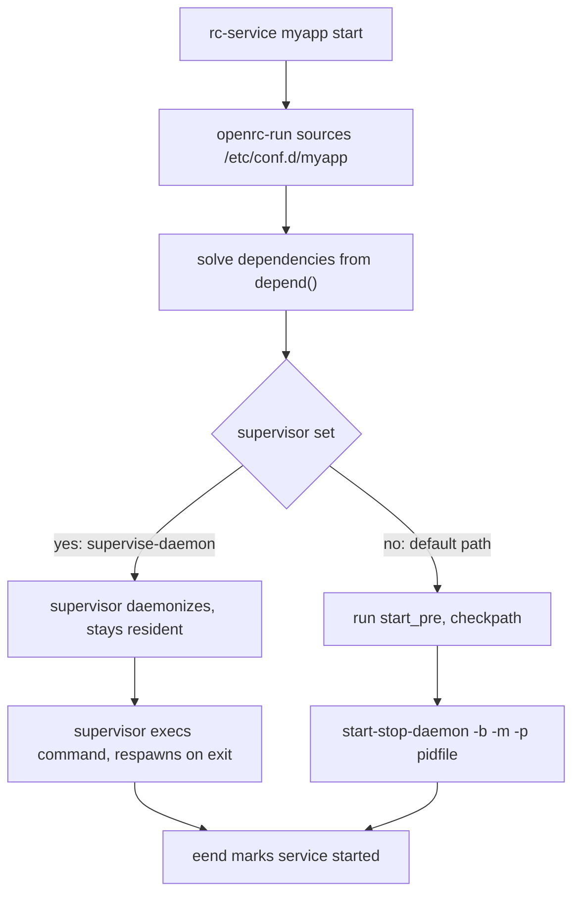

# OpenRC Service Scripts — depend(), start(), supervise-daemon

## Overview

Everything OpenRC does is driven by service scripts: POSIX shell files, conventionally in `/etc/init.d/`, interpreted by `openrc-run` rather than `sh`. A script declares what it runs (`command=`, `command_args=`), what it needs (`depend()`), and optional hooks (`start_pre()`, `start_post()`); OpenRC supplies the machinery — dependency solving, state tracking, start/stop defaults, output helpers — so a well-formed daemon script is often under twenty lines. This page dissects the script layer end to end: anatomy, the `depend()` verb vocabulary, the built-in helper set, the two daemon-starting strategies (background + pidfile, or a resident `supervise-daemon`), and the sysvinit-to-OpenRC translation table. The runtime side — who invokes these scripts, in which runlevels, in what order — is [OpenRC Runlevels and Service Management](./runlevels-services.md).

Two design facts frame everything below. First, the unit of configuration is a *shell script*, not a declarative file: anything the shell can express, a service can do — which is why OpenRC needs no per-service plugin system, and why `rc-service <svc> describe` and reading the file are equally good documentation. Second, supervision is *opt-in*. The default start path launches a daemon and trusts its exit code and pidfile; only when the script sets `supervisor="supervise-daemon"` does OpenRC keep a resident process watching the child. That split — scripts plus optional supervision — is the middle ground between sysvinit's trust-the-script world and systemd's supervise-everything model, and it is developed in [OpenRC — Overview and Architecture](./overview-architecture.md).

Authoritative references for this page are [openrc-run(8)](https://manpages.debian.org/bookworm/openrc/openrc-run.8.en.html) (the interpreter and its variable/function contract), [supervise-daemon(8)](https://manpages.debian.org/bookworm/openrc/supervise-daemon.8.en.html), and the two distribution walkthroughs: the [Gentoo handbook's initscripts chapter](https://wiki.gentoo.org/wiki/Handbook:AMD64/Working/Initscripts) and the [Alpine wiki's Writing Init Scripts](https://wiki.alpinelinux.org/wiki/Writing_Init_Scripts).

## Anatomy of a Service Script

A minimal-but-realistic daemon script shows the load-bearing pieces:

```text
#!/sbin/openrc-run

description="MyApp application server"
command="/usr/bin/myapp"
command_args="--config /etc/myapp.conf --listen :8080"
command_background="yes"
pidfile="/run/myapp.pid"

depend() {
    need localmount
    use logger dns
}
```

Reading it line by line:

- `#!/sbin/openrc-run` — the interpreter. Historically this was `runscript`; the name survives as a compatibility alias, and scripts are *not* plain `#!/bin/sh` files because openrc-run injects the helper functions and state handling.
- `description=` — one-liner shown by `rc-service <svc> describe`; each extra custom command gets its own `description_<cmd>=`.
- `command=` / `command_args=` — the executable and its arguments. Always an absolute path (PATH at boot is minimal — see debugging below). Related display/match variables: `name=` (friendly name for output) and `procname=` (process-name matcher when the binary path is a wrapper).
- `command_background="yes"` + `pidfile=` — the "daemonize me" contract: start-stop-daemon is asked to background the process and write its PID, which later drives stop and status.
- `directory=` — working directory for the daemon; `output_log=` / `error_log=` capture the daemon's stdout/stderr to files when it does not manage its own logging.

Configuration is split from code automatically: before the script body runs, openrc-run sources `/etc/conf.d/<service>` (falling back to `/etc/rc.conf`), so every variable above can be *overridden per host* without editing the script — the reason package upgrades rarely clobber local settings. Per-service dependency overrides (`rc_<svc>_need=...` and friends) and cgroup settings also arrive through this same file, as detailed in [rc.conf, cgroups, Containers and Advanced OpenRC](./config-advanced.md).

Beyond `depend()`, the framework recognizes a family of hook functions, each optional: `start_pre()` (runs before the start action — the natural place for `checkpath`), `start_post()`, `stop_pre()`/`stop_post()`, and `reload()`-style extra commands declared with `extra_commands="reload"` or `extra_started_commands="reload"` (the latter only offered while the service is running). If you define no `start()`/`stop()`, the defaults kick in — next section — and that is the recommended shape.

## The depend() Function — Dependency Verbs

`depend()` is the declarative core of every script. openrc-run executes it (nothing in it should start anything) and reads the verb calls to build the service graph. The verbs, per [openrc-run(8)](https://manpages.debian.org/bookworm/openrc/openrc-run.8.en.html):

| Verb | Start semantics | Stop/reverse semantics |
|---|---|---|
| `need X` | X must be started successfully first; if X cannot start, this service fails | Hard: when X stops, dependents are stopped too |
| `use X` | If X happens to be scheduled to start anyway, start after it; X is not required and its failure does not block | None — purely opportunistic ordering |
| `want X` | X is started even if it is not in any relevant runlevel; success is not required | None |
| `before X` / `after X` | Pure ordering when both services are in play; no dependency implied | None |
| `provide X` | Declares this service as an implementation of the virtual token X | — |
| `config F` | Re-resolve dependents whenever file F's timestamp changes (cache invalidation) | — |
| `keyword ...` | Masks the service (or operation) on listed platforms — see below | — |

### need — the hard edge

```text
depend() {
    need localmount
}
```

Use `need` only when the dependency is genuinely required for the service to function, because it is expensive in both directions: a failure to start `localmount` fails everything that needs it, and stopping `localmount` drags its dependents down with it. Virtual tokens are allowed (`need net` means "whatever provides networking"), resolved against `provide` declarations; how strictly multiple providers are required is the `rc_depend_strict` switch explained in [OpenRC — Overview and Architecture](./overview-architecture.md).

### use — the soft edge

```text
depend() {
    use logger dns
}
```

`use` says "if the logger is starting anyway, start me after it" — ordering without obligation. This is how an application benefits from syslog without failing on a syslog-free box, and how services order against the virtual `net` token only when a network service is in the runlevel. It is the right default for anything the service can *degrade* without.

### want — pull in, don't require

```text
depend() {
    want mariadb
}
```

`want` extends `use` in one specific way: the wanted service is started even when it appears in no runlevel — OpenRC pulls it in — but if it fails, the dependent still starts. Think of a cache or metrics sidecar: worth launching on every boot, not worth making the main service conditional on.

### before / after — pure ordering

```text
depend() {
    after firewall
}
```

No dependency is created; the constraint only applies when both services are in the runlevel being started. Classic uses: firewalls declaring `before net` (rules up before interfaces), services declaring `after firewall` from the other side, and cosmetic ordering like `after clock` for services whose logs would confuse timestamps otherwise.

### provide — virtual services

```text
# in /etc/init.d/syslog-ng:
depend() {
    provide logger
}
# in /etc/init.d/rsyslog (competing implementation):
depend() {
    provide logger
}
```

Consumers then `use logger` or `need logger` without caring which implementation is installed. The same mechanism underpins `net` (provided by netifrc's `net.*`, Alpine's `networking`, or even `!`-marked exceptions like `rc_net_tap0_provide="!net"` in `/etc/rc.conf`). This indirection is why distribution service scripts survive cross-distro networking differences untouched.

### keyword — platform masks

```text
depend() {
    keyword -docker -lxc -prefix
}
```

The tokens are negated platform names matched against `rc_sys` (`docker`, `lxc`, `openvz`, `jail`, `vserver`, `uml`, `xen0`, `xenU`, `systemd-nspawn`, `prefix`, ...) plus OS/architecture tokens such as `-userland-BSD` and `-arm`; a few special tokens mask single operations (e.g. `-stop` marks a service that must not be stopped). A service whose function is meaningless inside a container — gettys, module loading, filesystem fsck — declares the mask instead of failing at boot; this is exactly how stock scripts no-op gracefully when OpenRC runs in containers, as described in [rc.conf, cgroups, Containers and Advanced OpenRC](./config-advanced.md).

## A Complete Script, Dissected

```text
#!/sbin/openrc-run

description="Example application server"
command="/usr/bin/myapp"
command_args="--config /etc/myapp.conf"
command_background="yes"
pidfile="/run/myapp.pid"
directory="/var/lib/myapp"
output_log="/var/log/myapp/openrc.out"
error_log="/var/log/myapp/openrc.err"

extra_started_commands="reload"
description_reload="Reload configuration without restarting"

depend() {
    need localmount
    use logger dns
    after firewall
}

start_pre() {
    checkpath --directory --owner myapp:myapp --mode 0755 /run/myapp
    checkpath --directory --owner myapp:myapp --mode 0750 /var/log/myapp
}

reload() {
    ebegin "Reloading ${SVCNAME}"
    start-stop-daemon --signal HUP --pidfile "$pidfile"
    eend $?
}
```

What happens on `rc-service myapp start`, in order: the script is sourced with `/etc/conf.d/myapp` already applied; `depend()` is consulted and the solver confirms `localmount` (started, or added to the plan), optionally slots `myapp` after any `logger`/`dns` provider and the firewall; `start_pre()` runs, with `checkpath` idempotently creating runtime and log directories — vital because `/run` is a tmpfs emptied at every boot; the default start path launches the daemon via start-stop-daemon, backgrounds it, records the pidfile, and verifies liveness; output goes through the `ebegin`/`eend` protocol (the framework wraps the default path itself; custom actions like `reload()` must call them explicitly), and the service is marked `started` under `/run/openrc`. `${SVCNAME}` is one of the variables openrc-run exports (alongside `${RC_SERVICE}` and friends) so one script can serve several instances via symlinks — the same trick netifrc uses for `net.eth0` and `net.wlan0`.

## Default Start/Stop Paths vs Fully Custom Scripts

The default start implementation is already quite capable, which is why most scripts never define `start()`:



Two branches matter. The default path (no `supervisor=`) asks start-stop-daemon to launch and detach the daemon; bookkeeping rests on the pidfile and the exit code, and `rc_start_wait` in `/etc/rc.conf` can add a post-start liveness check for daemons that fork and then die on config errors. The supervised path makes `supervise-daemon` the parent — developed below. When the default does not fit (processes with no sensible pidfile, multi-step startups, inetd-style activation), write a full custom pair:

```text
start() {
    ebegin "Starting ${SVCNAME}"
    checkpath --directory --owner myapp:myapp /run/myapp
    start-stop-daemon --start --exec /usr/bin/myapp \
        --user myapp --background --make-pidfile --pidfile "$pidfile"
    eend $? "Failed to start ${SVCNAME}"
}

stop() {
    ebegin "Stopping ${SVCNAME}"
    start-stop-daemon --stop --exec /usr/bin/myapp \
        --pidfile "$pidfile" --retry TERM/10/KILL/5
    eend $? "Failed to stop ${SVCNAME}"
}
```

Conventions that keep custom scripts debuggable: begin with `ebegin`, terminate with `eend $?` (the argument decides success/failure coloring and state recording), and prefer start-stop-daemon over hand-rolled `kill` loops so signal scheduling and pidfile hygiene stay consistent.

## Output and Filesystem Helpers

openrc-run injects a small, stable helper vocabulary into every script:

- `ebegin "msg"` / `eend <rc> [failmsg]` — print a bracketed progress line and close it OK or `!!`; the success argument also feeds state recording. `einfon`, `ewarn`, `eerror` are the plain message variants; `einfo`-family output is what makes `rc.log` readable.
- `checkpath` — idempotent path creation with ownership and mode, the standard first act of `start_pre()`. Common forms:
  - `checkpath --directory --owner myapp:myapp --mode 0755 /run/myapp`
  - `checkpath --file --owner myapp:myapp --mode 0640 /var/log/myapp/app.log`
  - `checkpath --touch /var/lock/myapp.lock`

Its purpose is sharper than it looks: `/run` (and `/var/run` on older systems) is tmpfs, so every runtime directory the daemon expects evaporates at reboot, and the daemon itself usually will not create its own dirs. `checkpath` makes the script self-healing and idempotent across restarts and containers — the OpenRC answer to systemd's `RuntimeDirectory=` (see [systemd — Service Units](../systemd/service-units.md) for the counterpart).

## start-stop-daemon — the OpenRC Variant

The default start/stop paths delegate to OpenRC's own `start-stop-daemon` ([start-stop-daemon.8](https://github.com/OpenRC/openrc/blob/master/man/start-stop-daemon.8)). The flags you will meet in scripts:

| Flag | Effect |
|---|---|
| `-S` / `--start` | Start the daemon (rest are start-side unless noted) |
| `-K` / `--stop` | Stop: send `--signal`, honoring `--retry` |
| `-x` / `--exec` | Executable to start or match |
| `-p` / `--pidfile` | PID file to write/read/match |
| `-m` / `--make-pidfile` | Create the pidfile (for daemons that refuse to) |
| `-u` / `--user` | Drop privileges to user[:group] |
| `-d` / `--chdir` | Working directory |
| `-b` / `--background` | Detach after start |
| `-1` / `--stdout`, `-2` / `--stderr` | Redirect the daemon's output to files |
| `--signal` | Signal to send on stop (default TERM) |
| `--retry` | Signal/timeout schedule on stop, e.g. `TERM/10/KILL/5` |

One portability trap deserves its own paragraph: **Debian and its descendants ship a different binary of the same name** with dpkg. Flag sets overlap heavily but are not identical, and on a Debian-family system a bare `start-stop-daemon` on PATH may resolve to the dpkg one, not OpenRC's. Inside service scripts the framework resolves its own binary; in your own shell tooling, prefer the absolute path or `rc-service` wrappers. The same caveat applies when reading sysvinit scripts — the `daemon()` shell function in Debian's `/lib/lsb/init-functions` is yet another starter (see [SysVinit — Init Scripts](../sysvinit/init-scripts.md)), so "start-stop-daemon flags" are a per-toolchain question, not a universal one.

## supervise-daemon — Built-in Supervision

Setting one variable changes the whole runtime contract:

```text
supervisor="supervise-daemon"
command="/usr/bin/myapp"
command_args="--foreground"
```

With `supervisor="supervise-daemon"`, the start path launches a resident supervisor process which execs the command as its child and watches it. The consequences:

- **Foreground daemons, finally.** Many modern daemons either refuse to daemonize or prefer not to; supervision requires exactly that, so the usual `command_background="yes"` + pidfile dance disappears. `command_args_foreground` is the conventional slot for the daemon's own foreground flag.
- **Crash detection becomes measurement.** When the child exits, the supervisor notices immediately (it is the parent) and respawns it after `--respawn-delay` seconds, giving up after `--respawn-max` attempts — bookkeeping by direct observation instead of pidfile inference. Stale-pidfile and double-fork desync bugs largely cease to exist.
- **pidfile becomes optional.** The supervisor knows its child; `--make-pidfile`/`--pidfile` are available for the daemon's own consumers, but OpenRC itself no longer depends on them for stop — `rc-service stop` stops the supervisor, which takes the child with it.
- **Visibility.** `rc-status` reports supervised services distinctly, and the supervisor honors the usual execution knobs (`--user`, `--chdir`, `--env`, `--interpreter` for interpreted daemons).

The trade is one more resident process per supervised service (memory is trivial; the design cost is that this supervision is per-service and not a tree-wide manager like runit's — compare [runit — Stages and Services](../runit/stages-services.md)). For services where restart speed matters more than socket-activation-grade ergonomics, it is the pragmatic sweet spot; the full flag set, including respawn tuning, is in [supervise-daemon(8)](https://manpages.debian.org/bookworm/openrc/supervise-daemon.8.en.html).

## Migrating from sysvinit LSB Scripts

The concepts translate almost one-to-one; the syntax changes:

| sysvinit / LSB concept | OpenRC equivalent |
|---|---|
| `# Required-Start: $local_fs` | `need localmount` |
| `# Required-Start: X` (hard) | `need X` |
| `# Should-Start: X` (soft) | `use X` |
| `# Provides: X` | `provide X` |
| `# Default-Start: 2 3 4 5` / `update-rc.d` | `rc-update add <svc> default` |
| `/etc/default/<svc>` environment file | `/etc/conf.d/<svc>` (sourced automatically) |
| `daemon()` / hand-rolled `start-stop-daemon` call | `command=` + `command_args=` (+ `command_background`/`pidfile`) |
| hand-rolled `killproc()` loops | `pidfile=` + default `stop()` with `--retry` scheduling |
| LSB headers as the only documentation | `description=` + `rc-service <svc> describe` |

A condensed nginx example, side by side. First the sysvinit idiom (LSB header plus functions):

```text
#!/bin/sh
### BEGIN INIT INFO
# Provides:          nginx
# Required-Start:    $local_fs $network
# Should-Start:      $remote_fs
# Default-Start:     2 3 4 5
# Short-Description: nginx web server
### END INIT INFO
. /lib/lsb/init-functions
case "$1" in
  start) log_daemon_msg "Starting nginx"; /usr/sbin/nginx; log_end_msg $? ;;
  stop)  nginx -s quit ;;
esac
```

Then the OpenRC script — the header becomes a function, the paths become variables:

```text
#!/sbin/openrc-run
description="nginx web server"
command="/usr/sbin/nginx"
command_args="-c /etc/nginx/nginx.conf"
command_background="yes"
pidfile="/run/nginx.pid"

depend() {
    need localmount
    use dns
}

stop_pre() {
    ebegin "Graceful stop requested"
    /usr/sbin/nginx -s quit
    eend $?
}
```

Notes for reviewers: `$network` in an LSB header maps to OpenRC's virtual `net` provider (so `use net` or `need net`); `$remote_fs` maps conceptually to `localmount` plus a remote-filesystem service on distros that ship one; and `Default-Start` becomes an `rc-update` invocation done by the package or admin, not by the script. Debian-specific packaging hooks (`update-rc.d`, `invoke-rc.d`) are covered in [SysVinit — LSB Headers](../sysvinit/lsb-headers.md); OpenRC has no policy-layer equivalent — membership is the symlink.

## Debugging Service Scripts

- **"command not found" at boot.** Scripts run with a minimal environment and filtered variables (`rc_env_allow` opens the filter). Use absolute paths for `command=` and every binary called from hooks; never rely on PATH or on interactive-shell exports.
- **Daemon double-forks and state desyncs.** A daemon that backgrounds itself *and* gets `command_background="yes"` leaves the tracked process gone — `crashed` states follow. Pick one contract: background+pidfile, `procname=` matching, or `supervisor="supervise-daemon"` with a foreground flag.
- **Dependency cycles.** The solver reports the cycle it found (A needs B needs A). Break it by demoting one edge to `use`/`after`, or by providing a shared virtual token. After editing, `rc-update -u` rebuilds the cache; `rc-depend -t` shows the solved order.
- **Crashed after OOM.** `rc-status -c` lists them; confirm with `pidof`; then `rc-service <svc> zap` (reset bookkeeping without stop logic) and `start` again — the semantics are explained in [OpenRC Runlevels and Service Management](./runlevels-services.md).
- **State directories under `/run/openrc`.** This tmpfs holds per-service state markers (`started/`, `starting/`, `inactive/`, ...) and the dependency cache; it is recreated every boot. Never edit it by hand — `zap` is the sanctioned reset — but do check it when debugging whether OpenRC *thinks* a service is running.
- **Reading rc-status output.** Right-aligned bracketed states, color-coded: green started, red stopped/crashed, yellow inactive/scheduled. A service listed under a `Dynamic Runlevel:` heading is running because it was pulled in, not because it is enabled.
- **Verbose runs.** `rc-service -d <svc> start` turns on shell tracing for the script (`set -x` semantics), and `rc_verbose=yes` (globally or in the service's conf.d file) unmutes informational output — the first two things to try before adding debug lines yourself.

## Interview Questions

### Q: Explain the difference between `need`, `use`, and `want` in depend().

`need X` is a hard requirement: X starts first and must succeed, and when X is later stopped, everything that needs it is stopped too — reserve it for genuine functional requirements (`need localmount`). `use X` is soft ordering: if X is starting anyway in the same transition, order after it, but X is neither required nor pulled in, and its failure is ignored (`use logger dns`). `want X` pulls X in even when it appears in no runlevel, while still not requiring success (`want mariadb` for a sidecar). The interview-grade summary: need = dependency with reverse-stop teeth; use = opportunistic ordering; want = best-effort pull-in.

### Q: What problem does provide() solve, and how does rc_depend_strict interact with it?

`provide` declares a virtual service token (e.g. several daemons `provide logger`, netifrc/networking `provide net`), letting consumers depend on the role rather than the implementation — which is why OpenRC service scripts are portable across distros with different network stacks. When multiple providers are enabled, `rc_depend_strict="YES"` requires all of them (or all in the runlevel) to satisfy the token; `NO` accepts any started provider. The same switch governs whether services merely present in a runlevel must all come up before dependents proceed.

### Q: command_background="yes" with a pidfile, or supervisor="supervise-daemon" — how do you choose?

They implement different contracts. Background+pidfile: start-stop-daemon detaches the daemon and OpenRC trusts the pidfile afterward — no resident process, but state is *recorded, not measured*, so double-forking daemons and OOM kills leave desynced bookkeeping (fixed via `zap`). supervise-daemon: a resident supervisor keeps the command as its child, detects exit by observation, respawns per `--respawn-delay`/`--respawn-max`, and makes the pidfile optional. Choose supervision for anything where silent death matters (daemons without their own watchdog, lab services, edge boxes); choose background+pidfile when a daemon has its own reliable supervisor semantics or an external watchdog already exists.

### Q: Why do OpenRC scripts source /etc/conf.d/<service>, and what belongs there?

The conf.d file separates *site configuration* from *packaged code*: it is sourced before the script body, so every script variable (`command_args`, `pidfile`, `output_log`), plus per-service dependency overrides (`rc_<svc>_need`, `rc_<svc>_after`, ...) and cgroup settings, can be changed per host without touching the script — which package upgrades may replace at any time. Operational settings belong there (flags, limits, addresses); logic belongs in the script. It is the direct analogue of Debian's `/etc/default/<svc>` files, but wired into the interpreter rather than conventionally dot-sourced.

### Q: What is checkpath for, and what breaks if you omit it?

`checkpath` idempotently creates files and directories with specified owner and mode (`--directory`, `--file`, `--touch`, `--owner`, `--mode`). It exists because runtime paths live on tmpfs: `/run` is emptied at every boot and the daemon usually refuses to start without its runtime or log directory, or worse, starts as root and creates it with wrong permissions. Omit it and you get "works after manual mkdir, fails at reboot" — the classic OpenRC oneshot bug — plus non-idempotent restarts. It is the minimal equivalent of systemd's `RuntimeDirectory=`/`StateDirectory=` declarations.

## References

- [openrc-run(8) — Debian](https://manpages.debian.org/bookworm/openrc/openrc-run.8.en.html) — the interpreter: variables, hooks, depend() verbs
- [openrc-run.8 blob — OpenRC GitHub](https://github.com/OpenRC/openrc/blob/master/man/openrc-run.8) — man page source
- [supervise-daemon(8) — Debian](https://manpages.debian.org/bookworm/openrc/supervise-daemon.8.en.html) — supervision behavior and flags
- [supervise-daemon.8 blob — OpenRC GitHub](https://github.com/OpenRC/openrc/blob/master/man/supervise-daemon.8) — man page source
- [start-stop-daemon.8 blob — OpenRC GitHub](https://github.com/OpenRC/openrc/blob/master/man/start-stop-daemon.8) — the OpenRC variant's flags
- [rc-service(8) — Debian](https://manpages.debian.org/bookworm/openrc/rc-service.8.en.html) — invoking scripts and custom commands
- [rc-status(8) — Debian](https://manpages.debian.org/bookworm/openrc/rc-status.8.en.html) — states shown while debugging
- [Gentoo handbook — Working with Initscripts](https://wiki.gentoo.org/wiki/Handbook:AMD64/Working/Initscripts) — canonical walkthrough of script anatomy
- [Alpine wiki — Writing Init Scripts](https://wiki.alpinelinux.org/wiki/Writing_Init_Scripts) — Alpine conventions and helper usage

## Cross-References

- [OpenRC Runlevels and Service Management](./runlevels-services.md) — how these scripts are enabled, ordered, and reported.
- [rc.conf, cgroups, Containers and Advanced OpenRC](./config-advanced.md) — conf.d overrides, rc_<svc>_* dependency knobs, cgroup cleanup.
- [OpenRC — Overview and Architecture](./overview-architecture.md) — where the script interpreter sits in the component model.
- [SysVinit — Init Scripts](../sysvinit/init-scripts.md) — the shell-script tradition OpenRC modernizes.
- [SysVinit — LSB Headers](../sysvinit/lsb-headers.md) — the header vocabulary mapped in the migration table.
- [systemd — Service Units](../systemd/service-units.md) — the declarative counterpart: Type=, RuntimeDirectory=, Restart=.
- [runit — Stages and Services](../runit/stages-services.md) — always-on supervision as the alternative contract.
- [init-systems README](../README.md) — section hub.
- [Init systems — comparison](../comparison.md) — script format and supervision models side by side.
