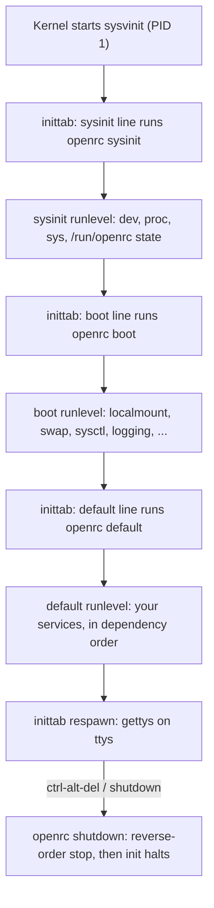

# OpenRC — Overview and Architecture

## Overview

OpenRC is a dependency-based rc system: it manages services as POSIX shell scripts, resolves their dependency graph, and starts and stops them in the computed order — with runlevels as the top-level grouping. It was born in Gentoo, developed by Roy Marples (extracted from Gentoo's baselayout package around 2007), and has since become the default init framework of several distributions well beyond Gentoo. The authoritative sources are the [OpenRC GitHub repository](https://github.com/OpenRC/openrc), its [man page tree](https://github.com/OpenRC/openrc/tree/master/man), and the [Gentoo wiki's OpenRC page](https://wiki.gentoo.org/wiki/OpenRC).

It is critical to frame what OpenRC is *not*: it is not, in its classic deployment, the init system. Traditional setups run sysvinit (or busybox init) as PID 1; sysvinit's `/etc/inittab` invokes `openrc sysinit`, then `openrc boot`, then `openrc default`, and later `openrc shutdown` on ctrl-alt-del or shutdown requests. OpenRC is the *rc layer* — the service dependency engine — sitting underneath a conventional init. Since OpenRC 0.25, an optional native `openrc-init` exists that can occupy PID 1 itself, paired with `openrc-shutdown`; that pairing is real and supported (the man pages document both), but `openrc-init` deliberately does not supervise gettys — terminal respawn is delegated to service scripts (an agetty service) or left to another init. This "init optional, rc mandatory" split is the single most useful fact for interviews, because it separates two questions that get conflated: *who is PID 1* and *who manages service dependencies*.

The model contrasts cleanly with its neighbors. Against sysvinit it adds a real dependency graph and parallelism (sysvinit's runlevels + rc scripts have no dependency solver; see [SysVinit — Overview and History](../sysvinit/overview-history.md)). Against systemd it keeps the unit of work as a shell script — auditable with standard tools — and leaves supervision, journaling, socket activation, and timers to other components. Against runit it adds dependency resolution and oneshots but makes supervision opt-in (via `supervise-daemon`). Where dinit merges "dependencies + supervision" into one daemon, OpenRC deliberately stays a framework that *integrates* with whatever init booted the machine.

## Where It Is Used

| Distribution | Role |
|---|---|
| Gentoo | Native home; default rc system, deepest integration (netifrc, baselayout conventions) |
| Alpine Linux | Default rc system on a musl userland — see the [Alpine wiki's OpenRC page](https://wiki.alpinelinux.org/wiki/OpenRC) |
| Artix Linux | Default rc system for one of its editions ([artixlinux.org](https://artixlinux.org/)) |
| Devuan | Available option in this systemd-free Debian descendant ([docs.devuan.org](https://docs.devuan.org/)) |
| KISS-style/embedded | Common where a dependency-aware rc is wanted without systemd; pairs naturally with busybox init (see [BusyBox](../../binaries/busybox.md)) |

The two flagships style themselves differently: Gentoo uses the full glibc/systemd-adjacent toolchain and netifrc for networking; Alpine wraps the same rc engine in a minimal musl/busybox world with ifupdown-ng. The service *scripts* are portable; the *ecosystem around them* is distribution-specific, which is why [rc.conf, cgroups, Containers and Advanced OpenRC](./config-advanced.md) devotes a section to per-distro networking and session stacks.

## Components

| Component | Role |
|---|---|
| `openrc` | The runlevel switcher front end ([openrc(8)](https://manpages.debian.org/bookworm/openrc/openrc.8.en.html)): stops services not in the target runlevel, starts the rest in dependency order |
| `openrc-run` | The service executor and script interpreter ([openrc-run(8)](https://manpages.debian.org/bookworm/openrc/openrc-run.8.en.html)) — runs `depend`/`start`/`stop`/`status`/`zap` and custom commands against a service script |
| `openrc-init` | Optional PID 1 ([openrc-init(8)](https://manpages.debian.org/bookworm/openrc/openrc-init.8.en.html)); reads the default runlevel from its command line, `rc_default_runlevel`, the kernel command line, or assumes `default`; does not manage gettys |
| `openrc-shutdown` | Pairs with openrc-init ([openrc-shutdown(8)](https://manpages.debian.org/bookworm/openrc/openrc-shutdown.8.en.html)): `-H` halt, `-p` poweroff, `-r` reboot, `-s` single-user, `-K` kexec, `-c` cancel pending, `-R` re-exec after upgrades |
| `rc-update` | Enable/disable: adds and removes service symlinks in runlevel directories ([rc-update(8)](https://manpages.debian.org/bookworm/openrc/rc-update.8.en.html)) |
| `rc-status` | Reports service states per runlevel, crashed services, supervised services ([rc-status(8)](https://manpages.debian.org/bookworm/openrc/rc-status.8.en.html)) |
| `rc-service` | Locates a service script (wherever it lives) and runs a command against it — the distro-agnostic entry point |
| `rc-depend` | Computes and caches the dependency tree (see rc-depend(8)) |
| `supervise-daemon` | Optional native supervisor ([supervise-daemon(8)](https://manpages.debian.org/bookworm/openrc/supervise-daemon.8.en.html)): starts a non-forking daemon and respawns it if it crashes |
| `start-stop-daemon` | The classic starter/stopper used by default-start when no supervisor is configured (an OpenRC implementation; Debian's dpkg ships a different binary of the same name) |
| `/etc/rc.conf` | Global configuration (parallelism, logging, cgroups, rc_sys, ...); detailed in [rc.conf, cgroups, Containers and Advanced OpenRC](./config-advanced.md) |
| `/lib/rc/sh` helpers | Shell function library beneath the service scripts (einfo/eend family, checkpath and friends are built into openrc-run) |

## Execution Model

### Runlevels are directories of symlinks

A runlevel is a directory under `/etc/runlevels/` containing symlinks to service scripts. The special runlevels, per openrc(8):

- `sysinit` — brings up system-specific plumbing: `/dev`, `/proc`, optionally `/sys`; also mounts `/run/openrc` as a tmpfs (where available) to hold state, unless root is already mounted rw. Sysinit runs once at host start and should not be run again.
- `boot` — services that mount filesystems, set initial peripheral state, and start logging; hotplugged services are added here automatically. **All services in `sysinit` and `boot` are automatically included in every other runlevel.**
- `single` — stops everything except sysinit services.
- `reboot` / `shutdown` — switch to the shutdown runlevel and then reboot/halt; you are told not to invoke these yourself — let init(8) and shutdown(8) drive them.

Distributions add their own ordinary runlevels (Gentoo's historical `nonetwork`, custom ones you create). The enable model is [rc-update](./runlevels-services.md): `rc-update add foo default` drops a symlink into `/etc/runlevels/default/foo`.

### Services have a state machine

OpenRC tracks per-service state under `/run/openrc`: stopped, starting, started, stopping, inactive, hotplugged, failed, scheduled, and crashed (the list is exactly what `rc-status -i` accepts). `inactive` matters for services that start and then release (inetd-style); `scheduled` marks services waiting for another to become inactive; `crashed` is detectable via `rc-status -c`. The `zap` command (an openrc-run builtin) resets a service's recorded state to stopped without running any stop logic — the recovery tool when reality and bookkeeping disagree.

### The dependency solver and its cache

Each service script declares its relations in a `depend()` function; `openrc-run` shells the scripts, reads `depend()`, and computes a start/stop ordering for the set of services in play. The computed tree is cached under `/run/openrc` (with `rc-update -u` or `rc-depend -u` forcing a rebuild — documented as the remedy for clock skew). Two global knobs shape the solve: `rc_parallel` (start services concurrently where the graph allows; output interleaves and is prefixed per service) and `rc_depend_strict` (whether *any* service providing a virtual dependency satisfies it, or all of them must be present). The `config` dependency verb additionally makes the cache sensitive to named configuration files — change one, and dependents re-resolve.

### Parallelism, cgroups, logging

`rc_parallel="YES"` is the performance switch, with a documented caveat in `/etc/rc.conf` that parallel boot can still lock the boot process — OpenRC's own comments ask for patches, not bug reports. Cgroup support is versioned: `rc_cgroup_mode` selects unified (v2 on `/sys/fs/cgroup`), legacy (v1), or hybrid; per-service cgroup directories and `rc_cgroup_settings` (v2 knobs like `memory.max`) are configured globally or per service in `/etc/conf.d/<svc>`. `rc_logger`/`rc_log_path` capture the whole rc process into `/var/log/rc.log` — the boot-debugging artifact, with timestamps when services start and fail. All of this is developed in [config-advanced](./config-advanced.md).

## Boot Sequence

The full boot story spans firmware through init; the firmware and bootloader stages are covered in [the OS boot pages](../../../os/boot/init-systems.md). OpenRC's part, in the classic sysvinit-as-PID-1 arrangement:

Reading it: sysvinit remains in charge of the *sequence* (its inittab lines are the choreographer — see [SysVinit — inittab](../sysvinit/inittab.md)); each `openrc <runlevel>` invocation is a self-contained graph solve and transition. With `openrc-init` as PID 1, the same three runlevels are driven internally (its default-runlevel selection order is documented in openrc-init(8)), and `openrc-shutdown` replaces `shutdown(8)` as the request path. Either way, the service-level work — mounting filesystems, activating swap, starting the network — is performed by the same set of scripts resolved through the same dependency engine; the boot runlevel's membership (localmount, sysctl, swap, hostname, and similar base services) is what makes a system bootable, and the default runlevel's membership is what makes it useful.

## Positioning

| Capability | OpenRC | sysvinit | systemd | runit | dinit |
|---|---|---|---|---|---|
| Dependency resolution | Yes (declarative in depend()) | No (fixed runlevel + seq ordering) | Yes (richest) | No | Yes |
| Process supervision | Optional (supervise-daemon / s6) | No (respawn only via inittab) | Yes | Yes (always) | Yes |
| Oneshot services | Native (scripts) | Native | Native (Type=oneshot) | Emulated | Native (scripted) |
| Parallel boot | Yes (rc_parallel) | Limited (startpar) | Yes | Yes (all at once) | Yes |
| Runlevels | Yes (named dirs) | Yes (numeric + inittab) | No (targets) | No (stages/dirs) | No (profiles) |
| PID 1 | Optional (openrc-init) | Yes | Yes | Yes | Yes |
| Unit/script format | POSIX shell | LSB shell | INI units | dirs + run scripts | key-value files |

The recurring interview framing: OpenRC is the dependency engine of the traditional world — it modernized ordering and parallelism without changing the unit of configuration (a shell script) or the supervision model (none by default). Every family comparison row above is expanded in [Init systems — comparison](../comparison.md).

## Interview Questions

### Q: Is OpenRC an init system? Answer precisely.

It is an rc system, and usually *not* PID 1. Classically, sysvinit (or busybox init) is PID 1; its inittab lines invoke `openrc sysinit`, `openrc boot`, and `openrc default` in sequence, and OpenRC only manages services within each stage. Since OpenRC 0.25 there is an optional `openrc-init` that can be PID 1, paired with `openrc-shutdown` — but it does not supervise gettys (agetty runs as a service script instead). So: OpenRC is the dependency-aware service manager; whether it is also the init depends on which PID 1 the deployment chose. The distinction surfaces operationally in shutdown (openrc-shutdown vs shutdown(8)) and in who respawns gettys.

### Q: What does `openrc boot` actually do when the system is already in the default runlevel?

Per openrc(8): it stops any services not in the specified runlevel (unless `--no-stop`), then starts services that should be running but are not — including everything in `sysinit` and `boot`, which are automatically included in all other runlevels. Services in a stacked runlevel start before those in the target one. With no runlevel argument, it operates on the *current* runlevel. That last combination is the "fix my boot" idiom: after a failed service you repair it and re-run `openrc` (or `openrc default`) to bring the runlevel to its defined state without rebooting.

### Q: Where does OpenRC keep its runtime state, and what breaks if you delete it?

Per-service state directories under `/run/openrc` (a tmpfs mounted by the sysinit runlevel), holding each service's recorded state (started/inactive/crashed/...) plus the cached dependency tree. Deleting it mid-run desynchronizes bookkeeping from reality: rc-status stops trusting recorded states, dependency resolution re-computes (slower but correct), and services marked started but not running show as `crashed` or need `zap` to reset. At boot the state is recreated fresh — which is why stale state never survives a reboot, and why `zap` exists for the not-rebooted case.

### Q: Explain `rc_depend_strict` with a concrete example.

Virtual dependencies (via `provide`, e.g., several services providing `net`) can be satisfied loosely or strictly. The rc.conf example: if `net.eth0` and `net.eth1` are both in the default runlevel and a service depends on `net`, then with `rc_depend_strict="NO"` that service starts when *either* interface comes up; with `YES`, both must come up. The same switch gates whether services that are merely present in a runlevel must all start for dependents to proceed. It is the global answer to "must all providers be up, or is one enough".

### Q: Why would Alpine choose OpenRC over runit or systemd for a musl minimal distro?

Three defensible reasons: dependency resolution without a supervision mandate (Alpine's daemons are started by scripts, with `supervise-daemon` available when wanted — matching a distro that ships many small daemons with different needs); shell scripts as the unit of configuration, which are trivially inspectable and editable in a busybox world; and glibc-free portability (OpenRC builds fine on musl and does not require D-Bus, cgroups, or udev to function). systemd fails the footprint and dependency constraints; runit fails the dependency-resolution requirement that a general-purpose distro needs for package-managed services.

### Q: A service shows `crashed` in rc-status but the daemon is actually running fine. What happened and what do you do?

The recorded state says crashed because the last start left bookkeeping inconsistent — typically the daemon forked itself into the background (so the started process OpenRC was tracking exited) without `command_background`/pidfile arrangement, or it was OOM-killed at some earlier point and the state was never refreshed. Verify the process is genuinely healthy, then `rc-service <svc> zap` to reset recorded state to stopped, and `rc-service <svc> start` to re-establish consistent bookkeeping (or fix the script so supervision tracks the right process — see [OpenRC Service Scripts](./init-scripts.md)). The lesson: OpenRC's state is recorded, not measured, except under `supervise-daemon`.

## References

- [OpenRC GitHub repository](https://github.com/OpenRC/openrc) — source, README, release history
- [OpenRC man page tree](https://github.com/OpenRC/openrc/tree/master/man) — authoritative man sources
- [openrc.8 blob](https://github.com/OpenRC/openrc/blob/master/man/openrc.8) — runlevel semantics and special runlevels
- [openrc-run.8 blob](https://github.com/OpenRC/openrc/blob/master/man/openrc-run.8) — service script interpreter
- [openrc(8) — Debian](https://manpages.debian.org/bookworm/openrc/openrc.8.en.html)
- [openrc-init(8) — Debian](https://manpages.debian.org/bookworm/openrc/openrc-init.8.en.html) — optional PID 1 behavior
- [openrc-shutdown(8) — Debian](https://manpages.debian.org/bookworm/openrc/openrc-shutdown.8.en.html) — shutdown/reboot/kexec options
- [rc-update(8) — Debian](https://manpages.debian.org/bookworm/openrc/rc-update.8.en.html) — enable/disable and stacked runlevels
- [rc-status(8) — Debian](https://manpages.debian.org/bookworm/openrc/rc-status.8.en.html) — states list and reporting options
- [Gentoo wiki — OpenRC](https://wiki.gentoo.org/wiki/OpenRC) — usage overview
- [Alpine wiki — OpenRC](https://wiki.alpinelinux.org/wiki/OpenRC) — Alpine conventions
- [Devuan docs](https://docs.devuan.org/) — Devuan's init options including OpenRC
- [Artix Linux](https://artixlinux.org/) — OpenRC edition home

## Cross-References

- [OpenRC Runlevels and Service Management](./runlevels-services.md) — rc-update, rc-status, rc-service in depth.
- [OpenRC Service Scripts](./init-scripts.md) — depend(), start(), supervise-daemon: the script layer.
- [rc.conf, cgroups, Containers and Advanced OpenRC](./config-advanced.md) — rc.conf, cgroups, containers, elogind.
- [SysVinit — Overview and History](../sysvinit/overview-history.md) — the init that classically drives OpenRC.
- [SysVinit — Boot Sequence](../sysvinit/boot-sequence.md) — the inittab choreography around rc calls.
- [systemd — Overview and Architecture](../systemd/overview-architecture.md) — the counter-model.
- [dinit — A Modern Dependency-Aware Init](../dinit/overview.md) — dependencies plus native supervision in one daemon.
- [init-systems README](../README.md) — section hub.
