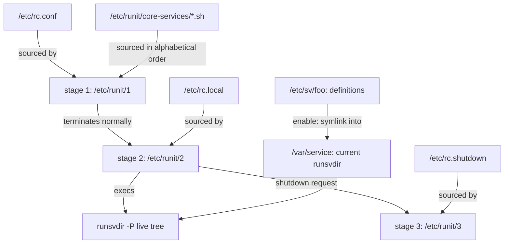

# runit — Configuration: Stages, Services, and Environment

## Overview

runit has no global configuration file — no `inittab` grammar to master, no unit-file parser, no central `rc.conf` that describes the system. Configuration *is* the filesystem: the boot is a handful of shell scripts under `/etc/runit/`, a service is a directory containing an executable `run` script, and enabling, disabling, and tuning are all filesystem operations. If you can read `ls` output and a shell script, you can read a runit system's entire configuration.

That configuration space has two layers, and the division is strict. The **stage scripts** (`/etc/runit/1`, `/etc/runit/2`, `/etc/runit/3`) are the machine-level layer: runit as process 1 executes them in sequence, and they own one-time boot tasks, the supervision loop, and shutdown. The **service directories** are the daemon-level layer: on Void, definitions live in `/etc/sv/` and are activated by symlinking into the live runsvdir, one supervised directory per long-running process. Everything else — `rc.conf` variables, per-service `conf` files, envdirs, log `config` files — plugs into one of those two layers.

This page is the hands-on handbook for both layers, using Void Linux (the reference runit distribution) for paths and conventions. It complements rather than repeats the theory pages: the stage machine, `runsvdir` mechanics, and the full service-directory anatomy are documented in [runit — Boot Stages and Service Directories](./stages-services.md), and day-two operation in [sv, svlogd, chpst — Operating Services and Logs](./sv-logging.md). Here the focus is what you actually type to make the system yours.

## Configuration Is the Filesystem

Compare the configuration surfaces of the init families in this section:

- **systemd** describes each service declaratively in an INI-style unit file with a large keyword grammar (`Restart=`, `EnvironmentFile=`, `Type=`), layered through drop-in directories — see [systemd — Configuration](../systemd/configuration.md).
- **OpenRC** keeps `/etc/rc.conf` plus per-service files in `/etc/conf.d/`, consumed by init scripts that are themselves shell — see [OpenRC — Advanced Configuration](../openrc/config-advanced.md).
- **dinit** uses declarative service descriptions with a real dependency graph — see [dinit — Configuration](../dinit/configuration.md).
- **runit** uses ordinary directories and ordinary POSIX shell: a service definition is `run`; a boot task is a sourced `.sh` file; the enabled set is a directory of symlinks.

What this buys: every change is plain `sh` that you can version, grep, diff, and audit without learning a grammar; the parser is the shell you already know; configuration state is fully inspectable with `ls`, `cat`, and `readlink`; and each intent has exactly one mechanism — symlink means enabled, `down` file means stopped-but-managed, `conf` file means parameters.

What it costs: no dependency engine (ordering is your problem — the workarounds live in [Boot Stages and Service Directories](./stages-services.md)), no reload protocol (changes take effect on service restart, or on runsvdir's next five-second rescan), and no declarative validation (a typo in a `run` script is discovered when the service crash-loops, not by a config checker). The model also has no per-service metadata beyond what convention places in the directory — which is precisely why conventions like `conf` matter.

## The Stage Scripts

Per [runit(8)](http://smarden.org/runit/runit.8.html), runit must run as process 1 and performs boot, run, and shutdown in three stages, each an ordinary executable script:

| Script | Contract (per runit(8)) |
|---|---|
| `/etc/runit/1` | The system's one-time tasks. runit runs it and **waits for it to terminate**. It has full control of `/dev/console`, so it can start an emergency shell if initialization fails. If it crashes or exits 100, runit **skips stage 2 and enters stage 3** — a failed bootstrap goes straight to shutdown. |
| `/etc/runit/2` | The run of the system: it **should not return until shutdown**. If it crashes or exits 111, runit restarts it. Normally it starts `runsvdir(8)`. runit handles the ctrl-alt-del keyboard request only while in stage 2. |
| `/etc/runit/3` | Shutdown tasks. If runit is told to shut down, or stage 2 returns, it terminates stage 2 and runs `/etc/runit/3`. When stage 3 returns, runit reboots if `/etc/runit/reboot` exists with the execute-by-owner permission set, and halts otherwise. If `/etc/runit/nosync` exists, runit skips its final `sync()` (useful in vservers). |
| `/etc/runit/ctrlaltdel` | On a ctrl-alt-del keyboard request: if this file exists and is executable by owner, runit runs it, waits for it to terminate, then sends itself a CONT signal. |

Two consequences are worth internalizing before customizing:

- **Stage 1 must terminate.** The handoff to stage 2 is simply stage 1 exiting normally — there is no marker file or IPC. Anything you add must run and finish: a blocking command stalls the boot, and a crash or `exit 100` diverts the boot into stage 3.
- **Stage 2 must not return.** The stock script is a one-liner (`exec runsvdir ...`) precisely so the shell is replaced and cannot fall through — if stage 2 returns, runit proceeds to stage 3 and shuts the machine down. Keep the `exec`.

Customization strategies, in increasing order of intrusiveness:

1. **Append** — add your blocks near the end of `/etc/runit/1`, before the script exits. Guard them: a failing command that aborts the script can tip the boot into the exit-100 path.
2. **Wrap** — source your own fragment (for example `/etc/runit/1.local`) from the stock script, keeping the distribution script as the skeleton. Same idea applies to stage 3.
3. **Fork** — maintain your own variant of the whole `/etc/runit` tree. Maximum control, maximum maintenance burden; the stock scripts are short enough that this is feasible, which is itself the design point.

On Void, stage 1 sources `/etc/rc.conf` (the Handbook notes it is sourced in stages 1 *and* 3) and processes the bootlets in `/etc/runit/core-services` — next section. Stage 2 sources `/etc/rc.local` (Void documents it as "configuration to be done prior to login"), and stage 3 sources `/etc/rc.shutdown`. The stage 2 script itself is normally the one-line `exec runsvdir` shown in [stages-services](./stages-services.md).

## Void's core-services Layout

The [Void Handbook](https://docs.voidlinux.org/config/rc-files.html) documents `/etc/runit/core-services` as: "Sourced in runit stage 1. A directory containing shell scripts that are run in alphabetical order when the machine boots up, before services are started. Useful for startup oneshots."

Properties that matter for configuring it:

- **Alphabetical order is the ordering mechanism.** There is no dependency declaration and no runlevel — name scripts so the lexicographic sort equals the order you need (a numeric prefix is the common convention).
- **The scripts are sourced, not executed** ("Sourced in runit stage 1"). This is also runit's honest answer to the missing oneshot service type: boot-time work is unsupervised shell, run once, before any service starts.
- **Stage 1 is serial.** Boot waits for each bootlet in turn, so keep them short and safe to run on every boot.

Adding your own bootlet is dropping a script into the directory, named so it sorts at the right point:

```sh
# /etc/runit/core-services/90-mylast.sh — runs late in stage 1
# stage 1 already sourced /etc/rc.conf, so its variables are in scope here
ip link set eth0 mtu 9000
```

Disabling a bootlet means **moving it out of the directory** (or renaming it out of its sort position). Do not rely on the execute bit: the scripts are sourced by stage 1, so permission bits are not the on/off switch. This directory is also where ordering-sensitive setup belongs precisely because stage 2 starts services in parallel — see [Dependency Handling — or the Lack of It](./stages-services.md) for why the ordering problem was relocated here.

## /etc/rc.conf on Void

`/etc/rc.conf` is "sourced in runit stages 1 and 3" and "is often configured by void-installer" ([Void Handbook](https://docs.voidlinux.org/config/rc-files.html)). The Handbook documents exactly three variables for it:

| Variable | Meaning (per the Handbook) | Details in |
|---|---|---|
| `KEYMAP` | Which keymap to use for the Linux console; available keymaps are listed in `/usr/share/kbd/keymaps`. Example: `KEYMAP=fr` | loadkeys(1) |
| `HARDWARECLOCK` | Whether the hardware clock is set to UTC or local time; default `utc`. Dual-booting with Windows (which sets the hardware clock to local time) requires either configuring Windows for UTC or setting this to `localtime` | hwclock(8) |
| `FONT` | Which font to use for the Linux console; available fonts are listed in `/usr/share/kbd/consolefonts`. Example: `FONT=eurlatgr` | setfont(8) |

The Handbook does not pin each variable to a specific core-services bootlet — it states what each variable means (console keymap, hardware clock, console font) and refers to loadkeys(1), hwclock(8), and setfont(8) for details. Since stage 1 sources `rc.conf` before processing the bootlets, the variables are in scope for every bootlet.

A warning about the name: Void's `/etc/rc.conf` has **nothing to do** with Gentoo/OpenRC's `/etc/rc.conf`, which configures the OpenRC engine itself (parallelism, `rc_sys`, cgroup modes, per-service overrides — see [OpenRC — Advanced Configuration](../openrc/config-advanced.md)). Same filename, different consumer, different grammar.

## The Service Tree and SVDIR

Void separates definitions from activation:

- **Definitions** live in `/etc/sv/<service>/` — one directory per service, shipped by packages. The only required file is an executable `run` that execs the daemon in the foreground; optional `check`, `finish`, `conf`, and `log/run` complete the anatomy (full tree in [stages-services](./stages-services.md)).
- **Activation** is a symlink into the live runsvdir. Per the [Void Handbook](https://docs.voidlinux.org/config/services/index.html): "A runsvdir is a directory in `/etc/runit/runsvdir` containing enabled services in the form of symlinks to service directories. On a running system, the current runsvdir is accessible via the `/var/service` symlink." The pointer chain runs through the `/run/runit` runtime tree, and `/run` being a tmpfs is what makes the split work: the *indirection* ("which tree is current" — the link `runsvchdir(8)` flips, or that boot selection changes) lives in runtime state, while the persistent service sets live in `/etc/runit/runsvdir/`. That is also why the Handbook documents enabling while the system is offline by linking directly into the persistent tree: `ln -s /etc/sv/<service> /etc/runit/runsvdir/default/`.

The three lifecycle operations ([Handbook](https://docs.voidlinux.org/config/services/index.html)):

```sh
ln -s /etc/sv/sshd /var/service/   # enable: starts within ~5 s, and on every boot
rm /var/service/sshd               # disable: runsvdir stops it and forgets it
touch /etc/sv/sshd/down            # installed-but-stopped: supervised, starts disabled
```

The `down` file is the third state, with semantics from [runsv(8)](http://smarden.org/runit/runsv.8.html): "If the file service/down exists, runsv does not start ./run immediately. The control interface can be used to start the service." While runsv lives, `sv up` starts the service normally; the file takes effect again the next time runsv itself starts — that is, at boot. It is persistent configuration: the Handbook uses it both to ship opt-in services and to disable the agetty(8) services for ttys 1 to 6 in a way that "package updates ... won't re-enable". Removing the symlink, by contrast, takes the service out of management entirely: runsvdir sends the corresponding runsv a TERM during its rescan, stops monitoring it, and nothing runs it at the next boot.

Tree selection at boot is documented too: "adding `single` to the kernel command line will boot the single runsvdir" — the runit-void package ships exactly two runsvdirs, `single` ("just runs sulogin(8)" plus rescue steps) and `default`.

Pointing tools at a tree: `sv(8)` resolves bare service names against a default services directory — `/service/` upstream — and the `SVDIR` environment variable overrides it ([sv(8)](http://smarden.org/runit/sv.8.html): "The environment variable $SVDIR overrides the default services directory /service/"). Paths work anywhere (the Handbook's fleet view is `sv status /var/service/*`), and `SVDIR=~/service sv restart gpg-agent` is the documented pattern for any non-default tree. `runsvdir -P` is how a second tree gets scanned — see recipe 3 below.

## Per-Service conf Files and Environment

The `conf` file is the sanctioned parameter seam of a service directory. From the [Handbook](https://docs.voidlinux.org/config/services/index.html): a service directory may contain "a conf file; this can contain environment variables to be sourced and referenced in run", and "Most services can take configuration options set by a conf file in the service directory. This allows service customization without modifying the service directory provided by the relevant package. ... A few services have a field like `OPTS="--value ..."` in their conf file."

The pattern: a `run` script that sources `./conf` if present, with defaults for every variable it consumes.

```sh
# /etc/sv/myapp/conf — admin-editable, survives package updates
ARGS="-l 0.0.0.0:8443"
MYAPP_USER=myapp
```

```sh
#!/bin/sh
# /etc/sv/myapp/run
exec 2>&1
[ -r ./conf ] && . ./conf
: "${MYAPP_USER:=myapp}"
: "${ARGS:=}"
exec chpst -u "$MYAPP_USER" myapp $ARGS    # ARGS unquoted on purpose: word splitting
```

Why source `conf` instead of editing `run` directly? Because of the Handbook's editing rule: "To edit a service, first copy its service directory to a different directory name. Otherwise, xbps-install(1) can overwrite the service directory." A `conf` file is the one place you can tune without that copy dance — the packaged `run` survives updates and reads your file.

The second channel is the **envdir**, inherited from daemontools and provided by [chpst(8)](http://smarden.org/runit/chpst.8.html) via `-e dir`: for each file named `k` in the directory whose first line is `v`, chpst sets environment variable `k` to `v` (an empty file unsets `k`, trailing spaces and tabs are stripped, and the name must not contain `=`). This suits one-variable-per-file deployment configuration:

```sh
# /etc/sv/myapp/env/PORT    <- file named PORT; its first line is the value
9418
# /etc/sv/myapp/env/LOGLEVEL
debug
```

```sh
exec chpst -u "$MYAPP_USER" -e ./env myapp $ARGS
```

Rule of thumb: `conf` for switches the run script itself interprets (`ARGS`, the user, paths); an envdir for variables the daemon reads directly. The contrast with other inits is instructive: systemd's `EnvironmentFile=` (see [systemd — Configuration](../systemd/configuration.md)) and SysVinit's `/etc/default/<service>` files (see [SysVinit — Configuration](../sysvinit/configuration.md)) solve the same "do not edit the packaged file" problem with key=value text parsed by the manager; runit has no manager to do the parsing, so the `run` script sources the file itself — three lines of shell instead of a parser feature.

## Configuring Logging per Service

Per-service logging configuration lives in two places: the `log/run` script (which log daemon, as whom, writing where) and the log directory's `config` file (rotation and filtering policy). A concrete pair:

```sh
#!/bin/sh
# /etc/sv/myapp/log/run — human-readable UTC timestamps
exec svlogd -tt /var/log/myapp
```

```text
# /var/log/myapp/config — svlogd(8) directives
s2097152
n5
```

Per [svlogd(8)](http://smarden.org/runit/svlogd.8.html), `s` sets the maximum size of `current` before rotation (default 1000000 bytes) and `n` the number of old log files maintained (default 10); `t` adds age-based rotation, `+`/`-` lines select or deselect messages, and `!` names a processor run on each rotated file. svlogd re-reads `config` on SIGHUP, so policy changes apply live. The full directive table, processor mechanics, and the pattern-matching grammar are in [sv, svlogd, chpst](./sv-logging.md); note only that the log service is supervised by the same runsv, so the Void Handbook's "reliable logging facility" claim rests on the supervision loop, not on svlogd alone.

## User Services

Void's [per-user services guide](https://docs.voidlinux.org/config/services/user-services.html) builds user trees from the same primitives — a `runsvdir`, run as the user. The basic mechanism is a **system-level service** that starts `runsvdir(8)` as the user to monitor a personal services directory. The documented example is a service directory `/etc/sv/runsvdir-<username>` with this executable `run` script:

```sh
#!/bin/sh
export USER="<username>"
export HOME="/home/<username>"
groups="$(id -Gn "$USER" | tr ' ' ':')"
svdir="$HOME/service"
exec chpst -u "$USER:$groups" runsvdir "$svdir"
```

The details the Handbook calls out: chpst "does not read groups on its own, but expects the user to list all required groups separated by a `:`" — hence the `id -Gn | tr ' ' ':'` pipe — and `USER`/`HOME` are exported "because some user services may not work without them".

- **Enabling user services:** the user creates service directories — or symlinks to them — in `/home/<username>/service`. No root involvement.
- **Permission model:** services run as the user (via `chpst -u`), and the user controls them with `sv` either by path or by name once `SVDIR` names their tree (`SVDIR=~/service sv restart gpg-agent`); the Handbook suggests exporting `SVDIR=~/service` in the shell profile. Isolation is structural: two runsvdirs, two scanners — the system tree stays root-only, and a crash loop in the user tree cannot take down system supervision.
- **Documented limitations:** these services start at boot "and do not have access to things like the user's graphical session or D-Bus session bus".

For session-integrated services, the same page documents **turnstile**, a session supervisor that runs per-user services with either a runit or dinit(8) backend. With the runit backend, services live in `~/.config/service/`; services listed in `~/.config/service/turnstile-ready/conf` (created on first login; for example `core_services="dbus foo"`) must start before login proceeds; and the session environment is exposed through an envdir referenced by the convenience variable `TURNSTILE_ENV_DIR` — wrap the exec line with `chpst -e "$TURNSTILE_ENV_DIR"` and populate it with `turnstile-update-runit-env DISPLAY XAUTHORITY FOO=bar BAZ=`.

## Configuration Recipes

### 1. Add a new service end-to-end

```sh
# definition: run script + log service
mkdir -p /etc/sv/myapp/log
cat > /etc/sv/myapp/run <<'EOF'
#!/bin/sh
exec 2>&1
[ -r ./conf ] && . ./conf
exec chpst -u myapp myapp $ARGS
EOF
chmod +x /etc/sv/myapp/run
cat > /etc/sv/myapp/log/run <<'EOF'
#!/bin/sh
exec svlogd -tt /var/log/myapp
EOF
chmod +x /etc/sv/myapp/log/run

# test before enabling autostart (the Handbook's testing pattern)
touch /etc/sv/myapp/down
ln -s /etc/sv/myapp /var/service/
sv once myapp
sv status myapp
tail /var/log/myapp/current

# promote to always-on
rm /etc/sv/myapp/down
sv up myapp
```

### 2. Keep a service installed but stopped

`touch /etc/sv/foo/down`: the service stays linked and supervised, starts disabled, and — crucially — is still down after the next boot, because a fresh runsv honors the file again. `rm /var/service/foo`: the service is unmanaged; nothing runs it at boot and re-enabling means re-linking. Choose by intent: "temporarily out of service, keep supervision and my decision recorded" is the down file; "this machine must never run it" is symlink removal. The Handbook adds the packaging nuance: downing a default-enabled service (the agetty ttys) survives package updates, since the update "won't re-enable them".

### 3. Run a second service tree

```sh
mkdir -p /etc/sv-batch
ln -s /etc/sv/worker-a /etc/sv-batch/
ln -s /etc/sv/worker-b /etc/sv-batch/
runsvdir -P /etc/sv-batch 'batch-log: ' &    # second arg = readproctitle slot
SVDIR=/etc/sv-batch sv status worker-a
```

Per [runsvdir(8)](http://smarden.org/runit/runsvdir.8.html), `-P` uses setsid(2) to run each runsv in a new session and separate process group, and the optional second argument parks runsvdir's stderr in its process title — recent error messages are readable with `ps`, and the argument must be at least seven characters. To make the tree permanent, supervise the scanner itself: `/etc/sv/sv-batch/run` containing `exec runsvdir -P /etc/sv-batch 'batch-log: '`, linked into `/var/service/` — a runit service whose job is running another runit tree.

### 4. Serial console getty

The fetched Handbook pages document agetty services for ttys 1 to 6 only, so treat the serial variant as the generic pattern: a supervised agetty(8) on the serial device — getty respawn, the classic init job, is ordinary supervision here. Following the Handbook's copy-then-edit rule, clone an existing getty service and repoint it:

```sh
cp -a /etc/sv/agetty-tty1 /etc/sv/agetty-ttyS0
# edit /etc/sv/agetty-ttyS0/run to name the serial device, baud rate, and terminal
# type — e.g.:  exec agetty -L ttyS0 115200 vt100   (options per agetty(8))
ln -s /etc/sv/agetty-ttyS0 /var/service/
```

Test with the `down` + `sv once` pattern from recipe 1, and consider downing an unused `agetty-tty<N>` while you are at it — the Handbook documents exactly this use of the down file.

### 5. Make a service depend on another

runit has no dependency engine, so dependencies are a `run`-script concern: loop on `sv check` until the dependency is genuinely available (its `./check` script defines "available"), and let unconditional supervision supply the retries:

```sh
#!/bin/sh
exec 2>&1
while ! sv check postgres >/dev/null; do sleep 1; done
exec myapp
```

The full pattern set — `sv check` loops, wait-for-socket loops, and Void's push-it-into-stage-1 approach — is in [Dependency Handling — or the Lack of It](./stages-services.md).

### 6. Point stage 2 at a custom tree

Editing `/etc/runit/2` is legitimate — it is a shell script — but respect its contract: it must never return, so end with `exec runsvdir -P <dir>`, and keep a copy of the stock script, because a mistake here is a boot failure (a returning stage 2 sends the machine into stage 3 and shutdown; an exiting-111 stage 2 becomes a restart loop). Verify afterwards that `ps` shows runsvdir watching your tree. Lower-risk alternatives, in order: boot a different runsvdir via the kernel command line (`single` is the documented example), add a second supervised tree (recipe 3), or use `runsvchdir(8)` to switch between prepared sets under `/etc/runit/runsvdir/`.

## What runit Does Not Configure

| Gap | runit's answer | Covered in |
|---|---|---|
| Timers / scheduled jobs | "If you don't need a program to be running constantly, but would like it to run at regular intervals, you might like to consider using a cron daemon" ([Void Handbook](https://docs.voidlinux.org/config/services/index.html)) | [Cron](../../admin/cron.md) |
| Socket activation | None — a stopped service holds no sockets | [comparison](../comparison.md) |
| Network stack configuration | Out of scope: boot-time setup goes in core-services bootlets, the daemon in a service directory | this page, recipes 1 and 6 |
| Global journal | No system log store — per-service svlogd text logs | [sv-logging](./sv-logging.md) |
| Dependency graph | No engine — `sv check` loops, stage-1 ordering, or a different init | [stages-services](./stages-services.md) |

For the full feature matrix across systemd, SysVinit, OpenRC, runit, and dinit, see [Init systems — comparison](../comparison.md); the design rationale behind these gaps is in [overview-philosophy](./overview-philosophy.md) ("Tradeoffs").

The whole configuration map in one picture:



## Interview Questions

### Q: What is the difference between a `down` file and removing the service symlink?

The `down` file (runsv(8): "If the file service/down exists, runsv does not start ./run immediately") keeps the service *managed*: a runsv exists, `sv status` reports it, `sv up` starts it, and the log plumbing stays live. It is also persistent — the file lives in the definition under `/etc/sv/`, so every future boot and every runsvdir linking the service starts it disabled, and package updates will not undo it. Removing the symlink takes the service out of management: runsvdir stops the current instance within its five-second rescan and never restarts it, and at boot nothing runs it at all. Rule of thumb: down file = installed but administratively stopped; `rm` = not on this system.

### Q: Why is `/var/service` a symlink through `/run` instead of a plain directory?

Because the path must always name exactly one thing — the currently active runsvdir — while the active set is switchable and rebuilt. The service *sets* persist in `/etc/runit/runsvdir/` (`default`, `single`, your own); the pointer that says which is current runs through the `/run/runit` runtime tree, and that indirection is exactly what `runsvchdir(8)` and kernel-command-line boot selection manipulate. The split also gives clean boot semantics: runtime state starts fresh on tmpfs while persistent enable choices in `/etc/runit/runsvdir/default/` survive — which is why offline enabling links into that directory directly.

### Q: `conf` file or edit the `run` script — how do you decide?

Default to `conf`: the Void Handbook defines it as variables "to be sourced and referenced in run", enabling customization "without modifying the service directory provided by the relevant package", and warns that editing in place risks xbps-install(1) overwriting the directory. Editing `run` is for changes a variable cannot express (different daemon, different wiring) — and then the Handbook's rule applies: copy the service directory to a new name, edit the copy, stop and disable the old service, start the new one. A well-shaped packaged `run` sources `conf` with defaults so both paths work.

### Q: What isolates a user's services from the system's — and from other users'?

Structural isolation, not a security framework: each user tree is its own runsvdir, started by a system service (`/etc/sv/runsvdir-<username>`) that execs `runsvdir` as the user via `chpst -u "$USER:$groups"`, with the group list built from `id -Gn` because chpst does not read groups itself. The user controls their tree with `sv` by path or via `SVDIR=~/service` — no root — while the system runsvdir stays root-only. The Handbook's documented limits: user services start at boot and lack the graphical/D-Bus session environment; the session-integrated answer is turnstile, with `~/.config/service/` and the `TURNSTILE_ENV_DIR` envdir.

### Q: What does `SVDIR` actually change, and when do you reach for it?

Per sv(8), `$SVDIR` overrides the default services directory (`/service/` upstream) used to resolve *bare* service names; arguments starting with a dot or slash are treated as paths and used as-is. Reach for it whenever you operate a non-default tree — the Handbook's user-services example is `SVDIR=~/service sv restart gpg-agent`, and the same mechanism addresses any second tree (`SVDIR=/etc/sv-batch sv status worker-a`). Note the scope: it changes name resolution for `sv` only; it does not start a scanner, so the tree must already have a `runsvdir` watching it.

### Q: How does Void order its one-shot boot work, and why is that ordering trustworthy?

In stage 1, via `/etc/runit/core-services/`: the Handbook says the directory is "sourced in runit stage 1" and its scripts "are run in alphabetical order ... before services are started". The ordering is trustworthy exactly because it is lexical and serial — no parallelism to race, no dependency solver to second-guess; you read the names and know the sequence, and a numeric prefix pins position. Adding a bootlet is dropping in a file; disabling one is moving it out (permission bits are irrelevant because the scripts are sourced). The cost: all ordering-sensitive work is boot-serial, while stage 2 services start in parallel with no guarantees — which is why Void concentrates ordering here instead of in a dependency engine.

## References

- [runit(8) — upstream](http://smarden.org/runit/runit.8.html) — the three-stage contract, ctrlaltdel, reboot/nosync, signal behavior
- [runsvdir(8) — upstream](http://smarden.org/runit/runsvdir.8.html) — scanning interval, `-P`, entry limit, readproctitle log argument
- [runsv(8) — upstream](http://smarden.org/runit/runsv.8.html) — the `down` file wording, finish arguments, control pipe
- [sv(8) — upstream](http://smarden.org/runit/sv.8.html) — `SVDIR`/`SVWAIT` semantics, command set
- [svlogd(8) — upstream](http://smarden.org/runit/svlogd.8.html) — `config` directives, rotation mechanics, timestamps
- [chpst(8) — upstream](http://smarden.org/runit/chpst.8.html) — envdir semantics, uid/gid handling
- [utmpset(8) — upstream](http://smarden.org/runit/utmpset.8.html) — utmp/wtmp logout records for getty finish scripts
- [runit — how to install](http://smarden.org/runit/install.html) — upstream layout and current release
- [Void Linux Handbook — rc.conf, rc.local and rc.shutdown](https://docs.voidlinux.org/config/rc-files.html) — KEYMAP/HARDWARECLOCK/FONT, stage sourcing, core-services
- [Void Linux Handbook — Services and Daemons (runit)](https://docs.voidlinux.org/config/services/index.html) — enabling/disabling, runsvdirs, conf files, testing pattern
- [Void Linux Handbook — Logging](https://docs.voidlinux.org/config/services/logging.html) — svlogd conventions
- [Void Linux Handbook — Per-User Services](https://docs.voidlinux.org/config/services/user-services.html) — runsvdir-username services, `SVDIR` usage, turnstile
- [runit(8) — Debian](https://manpages.debian.org/bookworm/runit/runit.8.en.html), [runit-init(8) — Debian](https://manpages.debian.org/bookworm/runit/runit-init.8.en.html) — stage contract and the `init 0`/`init 6` front end
- [runsvdir(8) — Debian](https://manpages.debian.org/bookworm/runit/runsvdir.8.en.html), [runsv(8) — Debian](https://manpages.debian.org/bookworm/runit/runsv.8.en.html), [sv(8) — Debian](https://manpages.debian.org/bookworm/runit/sv.8.en.html), [svlogd(8) — Debian](https://manpages.debian.org/bookworm/runit/svlogd.8.en.html), [chpst(8) — Debian](https://manpages.debian.org/bookworm/runit/chpst.8.en.html) — Debian bookworm mirrors of the suite's man pages

## Cross-References

- [runit — Overview and Design Philosophy](./overview-philosophy.md) — why the configuration surface is this small: components, lineage, tradeoffs.
- [runit — Boot Stages and Service Directories](./stages-services.md) — the stage machine and directory anatomy that this page configures.
- [sv, svlogd, chpst — Operating Services and Logs](./sv-logging.md) — operating the configuration written here; full svlogd and chpst references.
- [systemd — Configuration](../systemd/configuration.md) — the unit-file, drop-in, and `EnvironmentFile=` counterpart.
- [SysVinit — Configuration](../sysvinit/configuration.md) — the inittab and `/etc/default/` counterpart.
- [dinit — Configuration](../dinit/configuration.md) — the dependency-aware, declarative service-description counterpart.
- [OpenRC — Advanced Configuration](../openrc/config-advanced.md) — the other `rc.conf`: OpenRC engine configuration and per-service overrides.
- [init-systems README](../README.md) — section hub and reading order.
- [Init systems — comparison](../comparison.md) — feature matrix and command-porting map across all init families.
